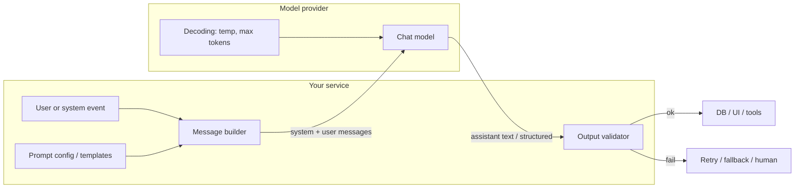

# Module 01 — Prompt Engineering Fundamentals

**Time:** 2–3 days · **Depends on:** [Setup](../getting-started/setup.md) · **Next:** [Security & privacy](02-security-privacy.md)

<span data-module-id="01" hidden></span>

---

## Learning objectives

- Structure prompts with role, task, context, constraints, and output format so a colleague can maintain them
- Prefer specificity and measurable success criteria over clever wording
- Choose temperature and message roles intentionally for extractive vs. generative work
- Treat prompts as **versioned config**, not one-off chat experiments
- Spot beginner failure modes before they become production incidents

---

## Why this matters (CS engineer view)

<div class="aieng-story" markdown>

Friday 4:47pm: a support bot ships after a “quick prompt polish.” By Monday, finance is chasing three refunds the bot invented—no policy snippet in context, no “don’t invent money rules” constraint, no output check. The model wasn’t “evil”; the interface was soft and nobody validated the response before it hit the customer.

</div>

*This is the running app the [course index](index.md#the-running-app) tracks across all five gates — here it's a support-ticket triager with no contract on its own output. Gate 1 closes exactly this failure.*

As a software engineer, you already ship APIs with schemas, retries, and contracts. An LLM call is another dependency with a **soft contract**: same input does not guarantee bit-identical output. Prompt engineering is how you tighten that contract enough that the rest of your system can stay boring.

Production failures rarely look like “the model is dumb.” They look like: a classifier emits free text instead of a label; a nightly job burns 10× tokens because the prompt pasted entire ticket histories; two engineers rewrite the same system message in two services and drift apart. Those are systems problems: unclear interfaces, missing validation, no ownership of config.

You will use this module whenever you build a single-turn or lightly multi-turn feature—email drafts, ticket triage, extraction, routing, summarization. Later modules add security boundaries, structured decoding, and evals. Start here: make one prompt **specific, role-separated, and testable**.

---

## Mental model

Think of a chat completion as a **request lifecycle**, not a magic box. Your code assembles messages, the provider samples tokens under a decoding policy, and your code must validate what comes back before it becomes a side effect.



**Roles are privilege levels.** `system` (or provider equivalent) carries policy and product rules. `user` carries untrusted task data. `assistant` is model output—never treat it as ground truth without checks. Mixing user text into the system slot is how injection and policy bypasses start (Module 02).

<div class="aieng-intuition" markdown>
<p class="label">Intuition lock</p>

**Sticky picture:** A prompt is a soft API contract—like a REST endpoint that returns prose instead of JSON. Message roles are privilege levels on a shared wire: `system` is the root policy plane; `user` is an untrusted request body; `assistant` is a draft response you must still validate before it becomes a side effect. Temperature is a **randomness dial** on the decoder, not a “creativity magic” slider—turn it down when you need stable labels, not vibes.

<div class="kill" markdown>

**Kill this idea:** “A good prompt is clever wording that makes the model smart.” → **Replace with:** A good prompt is a maintainable contract—role, task, context, constraints, format—tight enough that two engineers can grade pass/fail the same way.

</div>
</div>

---

## Core tutorial

### 1. Anatomy of a good prompt

| Part | Purpose | Example |
|------|---------|---------|
| **Role** | Stance, expertise, refusal boundaries | “You are a senior support engineer for Acme Billing.” |
| **Task** | Single clear verb + artifact | “Summarize the ticket and propose next steps.” |
| **Context** | Facts the model cannot invent | Ticket text, product tier, SLA, today’s date |
| **Constraints** | Safety, length, what *not* to do | “No legal claims. Max 120 words.” |
| **Format** | Machine- or human-parseable shape | Markdown sections / JSON keys |
| **Examples** (optional) | Few-shot anchors | 1–3 input→output pairs (Module 03) |

If you cannot name the **artifact** (JSON object, email body, label enum), the prompt is not ready for production.

### Minimal pattern

```text
System: You are {role}. Follow policies: {policies}.

User:
Task: {task}
Context:
{context}

Constraints:
- {c1}
- {c2}

Output format:
{format}
```

<div class="aieng-explainer" markdown>
<p class="label">Explainer</p>

**Why separate system and user?** System content is your product’s constitution: tone, allowed actions, “never invent policy.” User content is this turn’s payload. Keeping them separate lets you log, redact, and unit-test the user path without rewriting policy. Most providers also apply different trust treatment to system vs. user content—do not fight that model by stuffing everything into one blob.
</div>

### 2. Specific beats generic

```text
# Weak — no artifact, no success criteria
Analyze this.

# Strong — role, structure, anti-speculation
You are a data analyst. Given the CSV summary below, return:
1) three quantitative findings
2) one data-quality risk
3) two follow-up questions
Use plain language. No speculation beyond the data.
```

Ask yourself: *Could two engineers independently grade whether the output is correct?* If not, add criteria.

<div class="aieng-think" markdown>
<p class="label">Think about it</p>

**Question:** Friday, a VP screenshots one “cold” reply and slacks “make the bot friendlier” before a board demo Monday. Is that a prompt change, a product rule, or both? Where do you put it so you’re not rewriting tone in three services under a deadline—and how do you prove it worked without another screenshot war?

<details data-think-id="01-t1"><summary>Reveal a strong answer</summary>

“Friendlier” is an underspecified product rule, not a vibe you chase in one chat. Encode it as **observable constraints** in versioned system policy (e.g. greet by name when present, avoid sarcasm, offer one clear next step, under 120 words). Measure with a small rubric on fixed tickets (tone checklist + length + “has next step”), not a single demo. One config path beats three hardcoded strings so product can change tone without a scavenger hunt.
</details>
</div>

### 3. Context is a scarce budget

Include facts the model cannot know: internal IDs, policy snippets, current date, plan tier. Exclude noise: entire ticket history when one paragraph suffices; full HTML when plain text will do.

Every extra token has two costs: you wait and pay for it, **and** you dilute the model’s attention — it has a finite ability to track what matters in a long prompt. Over-stuffed prompts often fail *more* than tight ones. You are not billed twice; you spend quality as well as money.

Later: packing and memory tiers (Module 05), retrieval (Module 07). For now, **curate** context by hand.

### 4. Control the output shape

Downstream systems need contracts:

- **Humans:** Markdown with fixed headings (`## Summary`, `## Response`, `## Risks`)
- **Machines:** JSON with named fields, or provider structured-output modes (Module 03)

Do not parse “whatever the model felt like saying” with fragile regex in production without a fallback path.

### 5. Temperature matches the task

#### What a token is (30 seconds)

The model does not read characters or words. It reads **tokens** — chunks of text from a fixed vocabulary (a whole common word, a subword like `ing`, a punctuation mark). “Hello” is usually one token; a UUID or a CJK character may be several. Providers bill and cap **tokens**, not words.

On each step the model outputs a probability distribution over the next token. **Sampling** picks from that distribution. That is the whole generation loop: tokens in → next-token distribution → sample → append → repeat until a stop token or `max_tokens`.

<div class="aieng-explainer" markdown>
<p class="label">Explainer</p>

**Temperature sits on that distribution.** At 0 the model (almost) always takes the highest-probability next token — good for labels and JSON. At 0.8 it samples farther into the tail — more variety, more chance of a weird key name. Temperature cannot invent a task you did not specify. Some “reasoning” models ignore temperature; treat the table below as a starting point for ordinary chat models, then read your provider’s decoding docs.

Temperature 0 reduces sampling variability, but it does **not** guarantee exact, bit-for-bit reproducibility. Batching effects, mixture-of-experts routing, floating-point non-associativity across hardware, and silent provider-side model/serving updates can all still change the output for the same prompt. Treat temperature 0 as "much more consistent," not "deterministic" — pin the model/prompt version (Module 13) and use evals, not string equality, to catch drift.
</div>

Temperature (and related sampling knobs) trade **determinism for diversity**. Lower temperature concentrates probability mass; higher temperature samples more creative tails.

| Task | Temperature (starting point) |
|------|------------------------------|
| Extraction, classification, routing | 0–0.2 |
| Support replies, summaries | 0.2–0.5 |
| Brainstorming, marketing variants | 0.7–1.0 |

<div class="aieng-explainer" markdown>
<p class="label">Explainer</p>

**Picture the dial, not the muse.** You already know the next-token distribution from the token note above. At low temperature the sampler stays near the peak — good when you need the same invoice total twice. Crank it up and you sample longer tails: more variety, more chance of a weird label or invented fact. Turning the dial does not repair a vague task; it only changes how loudly the model explores once the contract is set.
</div>

Rules of thumb:

- If you will **unit-test field equality**, stay low and prefer structured outputs.
- If product wants **three draft options**, raise temperature *or* ask for N variants in one call with clear separators—measure cost either way.
- Temperature does not fix a vague prompt. Specificity first.

### 6. Message roles across providers

The **chat messages** abstraction is portable even when SDKs differ:

| Role | Typical use |
|------|-------------|
| `system` | Product policy, role, global constraints |
| `user` | Task + context for this turn |
| `assistant` | Prior model turns (multi-turn) or few-shot demonstrations |
| `tool` / tool results | Structured tool returns (later modules) |

OpenAI-style APIs, Anthropic messages, Gemini, and local Ollama chat endpoints all map onto this idea. Learn the **roles**, not a single vendor’s method names.

### Runnable sketch (OpenAI-style)

Preserve this as a pattern: system policy separate from user payload; temperature set deliberately; empty content handled.

```python
from openai import OpenAI

client = OpenAI()  # OPENAI_API_KEY in env

def smart_email_responder(email_content: str) -> str:
    response = client.chat.completions.create(
        model="gpt-4o-mini",  # swap for Claude / Gemini / Ollama via your stack
        messages=[
            {
                "role": "system",
                "content": (
                    "You are a professional email assistant. "
                    "Be concise, polite, and action-oriented. "
                    "Do not invent company policies or prices."
                ),
            },
            {
                "role": "user",
                "content": (
                    f"Write a reply to this email.\n\n"
                    f"Email:\n{email_content}\n\n"
                    f"Requirements:\n"
                    f"- Acknowledge the request\n"
                    f"- Answer questions if possible\n"
                    f"- Propose a clear next step\n"
                    f"- Under 150 words"
                ),
            },
        ],
        temperature=0.3,
    )
    return response.choices[0].message.content or ""

if __name__ == "__main__":
    print(
        smart_email_responder(
            "Hi, interested in a product demo next week. Any slots Tuesday?"
        )
    )
```

Use Anthropic / Gemini / Ollama with the same **message roles** idea; only the SDK and model id differ.

### 7. Prompts as config (production mindset)

Ad-hoc f-strings in business logic do not scale. Prefer named templates, versioned files, and a single render path.

This course ships `src.prompts`:

```python
from src.prompts import list_templates, render

print(list_templates())
# ['classify', 'email_reply', 'rag_answer', 'summarize']

user_msg = render(
    "email_reply",
    max_words=150,
    content="Hi, interested in a product demo next week. Any slots Tuesday?",
)
print(user_msg)
```

```python
# src/prompts.py pattern (simplified)
from string import Template

TEMPLATES = {
    "email_reply": Template(
        "You are a professional email assistant.\n"
        "Write a polite reply under $max_words words.\n\n"
        "Email:\n$content\n\n"
        "Requirements:\n"
        "- Acknowledge the request\n"
        "- Answer questions if possible\n"
        "- Propose a clear next step"
    ),
}

def render(name: str, **kwargs) -> str:
    return TEMPLATES[name].safe_substitute({k: str(v) for k, v in kwargs.items()})
```

**Operational habits:**

1. **Version** prompts (`prompts/v1/email_reply.md` → `v2/...`) when behavior changes.
2. **Code review** prompt diffs like API contract changes.
3. **Log** `prompt_version` with each request for debugging.
4. **Never** embed API keys, other users’ data, or secrets in templates.
5. Hand off to evals (Module 04) before promoting a prompt version.

<div class="aieng-explainer" markdown>
<p class="label">Explainer</p>

**Prompt vs. weights.** Changing a prompt is a config deploy: fast, reversible, cheap to A/B. Fine-tuning (Module 06) changes model behavior more deeply but costs data pipelines and eval rigor. Default path for product features: **prompt + retrieval + tools**, then consider fine-tuning only when those saturate.
</div>

### 8. One prompt per job

A single “do everything” prompt is the LLM equivalent of a 2,000-line god function. Prefer pipelines:

1. **Classify** intent → label enum  
2. **Extract** fields if needed → JSON  
3. **Generate** user-facing text with a dedicated template  

Each stage can have its own temperature, model size, and tests. Fail closed on stage 1 when confidence is low.

<div class="aieng-think" markdown>
<p class="label">Think about it</p>

**Question:** You have one model call that both extracts invoice fields *and* writes a customer email. Parse rate is 70%. What do you change first—temperature, model, or architecture—and why?

<details data-think-id="01-t2"><summary>Reveal a strong answer</summary>

**Architecture first:** split extraction from generation. Extraction wants low temperature (or structured outputs) and a schema validator; generation wants tone and length constraints. A coupled prompt forces one decoding policy to serve two jobs, which usually hurts parse reliability. After the split, use a small/cheap model for extraction if quality holds, and only then tune temperature or upgrade the generator.
</details>
</div>

---

## Common failure modes

| Failure mode | Root cause | Fix |
|--------------|------------|-----|
| Vague verbs (“handle this”) | No named artifact or success criteria | State output sections or schema |
| Free-text where JSON was needed | No format + no validator | Schema / structured output + retry |
| Wild variance across runs | High temperature + vague task | Lower temp; tighten constraints |
| Hallucinated policy / prices | Missing context; no “don’t invent” rule | Inject policy snippets; forbid invention |
| Overlong context | Paste-driven prompting | Summarize; retrieve; drop noise |
| One mega-prompt for all tasks | Convenience over modularity | Classify → extract → write |
| Prompt only lives in Slack | No ownership | Versioned templates + `prompt_version` logs |
| Secrets in prompts | Convenience | Tools / server-side fetch; secret manager |

---

## Lab

**Artifact:** a small script (or notebook cell) that produces a **stable** Markdown reply for a real email or GitHub issue *you* wrote.

**Steps**

1. Capture one real input (redact secrets/PII).
2. Write system + user messages using the six anatomy parts.
3. Require Markdown sections: `## Summary`, `## Response`, `## Risks`.
4. Run **5 times** at `temperature=0.2` and **5 times** at `0.8`. Note variance (length, section presence, invented facts).
5. Add one **negative constraint** that removes a failure mode you observed (e.g. “Do not invent meeting times; ask if unknown”).
6. Optional: move the user body into `src.prompts` via `render("email_reply", ...)` or a new template name in a local fork of the pattern.
7. Log notes in your progress tracker.

**Acceptance criteria**

- [ ] System policy is separate from user payload  
- [ ] Output always includes the three headings at temp 0.2  
- [ ] You recorded at least one qualitative difference between 0.2 and 0.8  
- [ ] One negative constraint is present and motivated by an observed failure  

```bash
# If you wire into the course package templates:
poetry run python -c "from src.prompts import render; print(render('email_reply', max_words=120, content='Hello'))"
poetry run pytest tests/test_prompts.py -v
```

---

## Knowledge check (quiz)

<div class="aieng-quiz" data-quiz-id="01-q1" data-xp="25" data-success="Yes — roles encode trust and policy; user content is the untrusted payload." data-fail="Re-read the mental model: system holds policy; user holds task data." markdown>
<p class="label">Quiz · +25 XP</p>
<p class="quiz-prompt">Why keep system policy in a separate message role from the user’s email text?</p>
<div class="quiz-options">
<button type="button" class="quiz-opt" data-correct="false">So the model bills fewer tokens</button>
<button type="button" class="quiz-opt" data-correct="true">So product rules stay privileged and untrusted task data is not elevated to policy</button>
<button type="button" class="quiz-opt" data-correct="false">Because providers reject single-message requests</button>
<button type="button" class="quiz-opt" data-correct="false">So temperature only applies to the system message</button>
</div>
<p class="quiz-feedback"></p>
</div>

<div class="aieng-quiz" data-quiz-id="01-q2" data-xp="25" data-success="Correct — extraction and routing want concentrated, low-variance decoding." data-fail="Temperature maps to task type: extraction likes low; brainstorming likes high." markdown>
<p class="label">Quiz · +25 XP</p>
<p class="quiz-prompt">You are building a router that must return one of: billing, tech, sales. Best starting temperature?</p>
<div class="quiz-options">
<button type="button" class="quiz-opt" data-correct="false">1.0 for creative routing ideas</button>
<button type="button" class="quiz-opt" data-correct="true">0–0.2 for stable labels</button>
<button type="button" class="quiz-opt" data-correct="false">Temperature does not affect classification</button>
<button type="button" class="quiz-opt" data-correct="false">Always 0.7 as a universal default</button>
</div>
<p class="quiz-feedback"></p>
</div>

---

## Open source materials

Read with purpose—skim for patterns you will copy into *your* templates:

- **[dair-ai/Prompt-Engineering-Guide](https://github.com/dair-ai/Prompt-Engineering-Guide)** / [promptingguide.ai](https://www.promptingguide.ai/) — anatomy, tactics, and pitfalls; use as a catalog, not a checklist to apply all at once.
- **[mlabonne/llm-course](https://github.com/mlabonne/llm-course)** — broader LLM engineering map; situate prompting among fine-tuning and tooling.
- **Provider docs** (OpenAI / Anthropic / Google / Ollama) — message roles, temperature, and structured outputs for the API you actually call.
- **Course `src.prompts`** — minimal template registry; study how named templates beat ad-hoc strings.

Keep 3–4 sources open while you do the lab; do not try to memorize every technique yet (Module 03).

---

## Checkpoint

- [ ] You can name the six prompt parts from memory  
- [ ] You can explain system vs. user roles as a trust boundary  
- [ ] You have one runnable script that returns structured Markdown or uses `src.prompts`  
- [ ] You know when to lower temperature and why  

**Conceptual self-test**

1. Rewrite “Improve this ticket” into a prompt with task, constraints, and format.  
2. Where would you store prompt text so a PM can request a tone change without a mystery deploy?  
3. What breaks if user content is concatenated into the system message?

<div class="aieng-complete" data-module-id="01" data-xp="100" markdown>
<p>Mark this module complete when you can teach the mental model and ship the lab artifact.</p>
<button type="button">Complete module · +100 XP</button>
</div>

**Next:** [Module 02 — Security & privacy](02-security-privacy.md)
