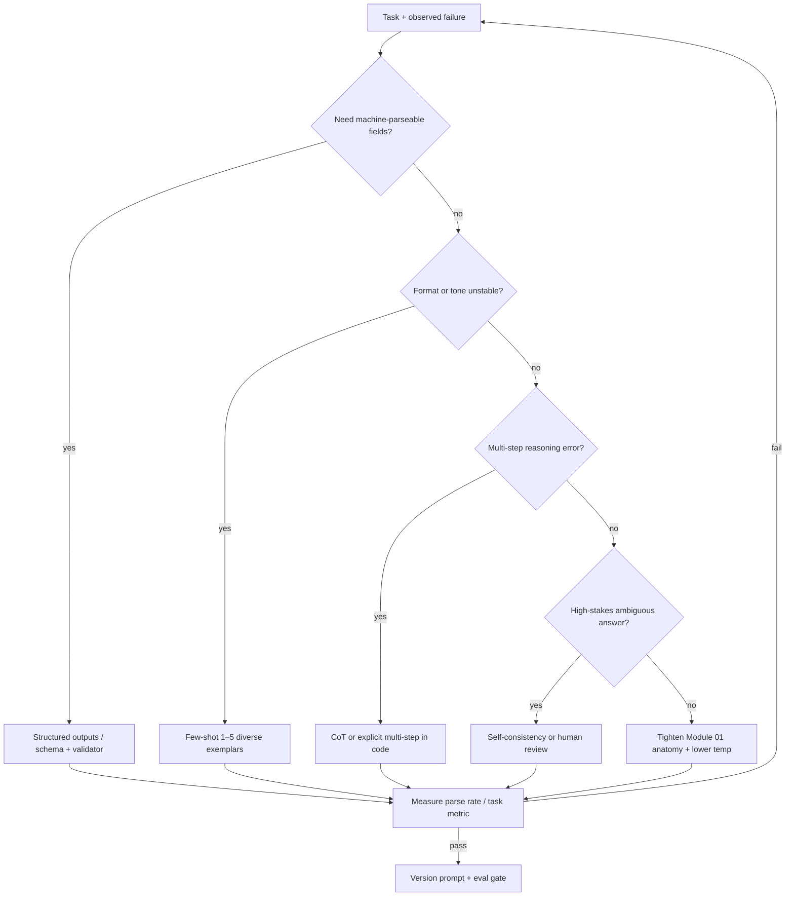

# Module 03 — Advanced Prompting Techniques

**Time:** 3–5 days · **Depends on:** [01](01-prompt-engineering.md)–[02](02-security-privacy.md) · **Next:** [Testing & evals](04-testing-evals.md)

<span data-module-id="03" hidden></span>

---

## Learning objectives

- Apply Chain-of-Thought (CoT), few-shot, role, and self-consistency **deliberately**—and know when to skip them
- Ship structured outputs with Pydantic (or provider JSON schema) so parsers stop being hope-driven
- Build reusable prompt templates without adopting a mega-framework on day one
- Choose techniques from a decision map based on failure mode, not blog hype
- Measure parse-success and quality impact before promoting a “smarter” prompt

---

## Why this matters (CS engineer view)

<div class="aieng-story" markdown>

2:14am: on-call gets paged because the invoice pipeline can’t `json.loads` again. Yesterday’s “quality” PR stacked CoT + eight few-shots + self-consistency on every ticket “to be safe.” Latency 3×, bill spike, parse rate still broken—because nobody measured which lever fixed the real failure. Techniques without a decision map are load-bearing cargo cult.

</div>

Module 01 got you a clear contract. Advanced prompting is about **reliability under complexity**: multi-step policy decisions, messy extraction, and outputs that must plug into typed code. The trap is collecting techniques like trading cards until latency and cost explode and quality barely moves.

Think in terms of **optimization under constraints**. Each technique is a lever with a cost:

| Lever | Pays you | Costs you |
|-------|----------|-----------|
| CoT | Better multi-step reasoning | Tokens, latency; can add noise on extractive tasks |
| Few-shot | Format + edge-case anchoring | Context budget; bad exemplars poison behavior |
| Structured out | Parse reliability | Schema design; rare model refusals / truncations |
| Self-consistency | Robustness on hard questions | N× cost |
| Role text | Style and priorities | Little help if task is underspecified |

You will use this module when building extractors, routers with justification, multi-step assistants, and any path where a failed `json.loads` pages you at 2 a.m. Module 04 then freezes quality with golden sets so technique changes do not silently regress.

---

## Mental model

Start from the **failure mode**, not the technique name. Select the cheapest lever that addresses the failure; escalate only when measured quality plateaus.



**Important:** Prefer **explicit steps in your code** (classify → extract → decide) over a single omniscient prompt when you need logs, retries, and unit tests per stage.

<div class="aieng-intuition" markdown>
<p class="label">Intuition lock</p>

**Sticky picture:** Chain-of-Thought is **scratch paper**—extra desk space for multi-step work, not a IQ upgrade. Few-shots are **unit-test examples** the model can pattern-match: great when they match production, poisonous when stale. Structured output is your **type system**: schema in, validated object out. Self-consistency is re-running the exam and taking majority vote—powerful, expensive, rarely the first dial to turn.

<div class="kill" markdown>

**Kill this idea:** “More advanced techniques stacked together always mean higher quality.” → **Replace with:** Start from the failure mode; apply the cheapest lever that moves a measured metric; escalate only when quality plateaus.

</div>
</div>

---

## Core tutorial

### 1. Chain-of-Thought (CoT)

CoT asks the model to **reason before finalizing** an answer. Variants:

- **Visible CoT:** model writes steps, then the answer (good for debugging; may expose chain to users—filter if needed)  
- **Answer-tagged:** free reasoning, then a hard delimiter for parsers  
- **Hidden / provider “reasoning” modes:** vendor-specific; still validate the final artifact  

```text
Solve the problem carefully.
Put the final answer after a line that says FINAL:
If uncertain, say UNCERTAIN and list what is missing.
```

**Use CoT when:** math-ish multi-step work, multi-hop questions, policy trees (“if enterprise and overdue, then…”), debugging why a decision failed.

**Do NOT use CoT when:** pure extraction of fields already explicit in text; simple classification with clear labels; tight latency budgets; you already decomposed the task in code. CoT can **increase** hallucination on extractive tasks by “reasoning” beyond the document.

<div class="aieng-explainer" markdown>
<p class="label">Explainer</p>

**CoT is not magic intelligence—it reallocates tokens.** You spend completion budget on intermediate text that often helps the model stay consistent with constraints. If the task is “copy the invoice total into JSON,” those tokens are waste and can invent structure that was not there. Measure: run the same golden set with and without CoT (Module 04). Keep CoT only if the metric moves more than the cost allows.
</div>

<div class="aieng-think" markdown>
<p class="label">Think about it</p>

**Question:** Finance just got the monthly LLM invoice. Field accuracy is 94% without CoT and 93% with CoT, but token use is 2.4×. Product still wants “more reasoning for quality” on *every* extract so the deck looks smart. What do you do before the next PR merges?

<details data-think-id="03-t1"><summary>Reveal a strong answer</summary>

Refuse the free CoT add-on for this path. Show the numbers: quality flat/down, cost up. Offer levers that match *real* failures—e.g. two few-shot edge cases for multi-currency invoices, structured outputs, or a second-pass only on low-confidence parses. Scratch paper helps multi-hop policy; it is expensive wallpaper on pure field copy.
</details>
</div>

### 2. Few-shot learning

Show 1–5 **exemplars** closest to the live task. Prefer **diverse edge cases** over many near-duplicates.

```text
Extract company and amount as JSON.

Example 1:
Input: Acme Corp invoiced us $12,400 on March 3.
Output: {"company":"Acme Corp","amount":12400,"currency":"USD"}

Example 2:
Input: Payment of EUR 900 to Globex pending.
Output: {"company":"Globex","amount":900,"currency":"EUR"}

Input: {user_text}
Output:
```

**Guidelines:**

- Exemplars are **specifications**. Wrong exemplars teach wrong behavior.  
- Match label space and JSON keys exactly to production schema.  
- Order can matter; keep a stable order for evals.  
- **Dynamic few-shot:** embed a library of exemplars; retrieve top-k by similarity to the query (bridge to RAG in Module 07).  

Security note (Module 02): exemplars are trusted content you wrote—do not pull “examples” from untrusted user traffic without review.

<div class="aieng-explainer" markdown>
<p class="label">Explainer</p>

**Picture few-shots as fixtures.** If your test suite’s expected JSON still uses `amt` after the schema renamed the field to `amount`, CI teaches the wrong contract forever. Same here: every exemplar is a live fixture the model will imitate. Review them when the schema moves—or you will “pass” demos that fail production parsers.
</div>

### 3. Role-based prompting

Roles work when they constrain **style, priorities, and refusal boundaries**—not as magic credentials (“you are a certified lawyer” does not create legal authority, and you must not present outputs as professional legal/medical advice).

```text
You are a staff SRE. Prefer blast-radius reduction over cleverness.
Never invent metrics you do not have. Ask for missing graphs.
If the user requests irreversible production changes, require a change ticket id.
```

Combine role with concrete constraints. Role without task and format is cosplay.

### 4. Self-consistency (high-stakes answers)

1. Sample **N** solutions at moderate temperature  
2. Parse final answers into a canonical form  
3. Majority vote or cluster  

```python
from collections import Counter

def self_consistent(call_model, prompt: str, n: int = 5) -> str:
    answers = [parse_final(call_model(prompt, temperature=0.7)) for _ in range(n)]
    return Counter(answers).most_common(1)[0][0]
```

**Costly.** Use after a cheap first pass fails uncertainty checks, or for rare high-impact decisions. For classification, sometimes a better label set + few-shot beats N samples.

### 5. Structured outputs and Pydantic

Prefer provider **JSON schema / structured output** modes when available (OpenAI structured outputs, Anthropic tool/json modes, Gemini schema, etc.). Fallback: strict instructions + validator + retry.

Do not confuse three different “make it structured” levers:

| Lever | What it is | Use when |
|-------|------------|----------|
| JSON in the prompt | You *ask* for `{...}` in prose | Fine for labs; still validate |
| Provider structured output | The API constrains tokens to a schema | Default for extractors |
| Tools / function calling (Module 07) | The model fills *arguments* to a named function | Actions and typed intents, not only data extract |

All three still need a parser on your side. Schema-on-the-wire is not a substitute for Pydantic (or equivalent) in your process.

```python
from pydantic import BaseModel, ValidationError
import json

class Invoice(BaseModel):
    company: str | None
    amount: float | None
    currency: str | None = "USD"

def parse_invoice(raw: str) -> Invoice:
    # Prefer provider structured output; this is the fallback path
    data = json.loads(raw)
    return Invoice.model_validate(data)

def safe_parse(raw: str) -> Invoice | None:
    try:
        return parse_invoice(raw)
    except (json.JSONDecodeError, ValidationError):
        return None
```

**Production pattern:**

1. Request schema-constrained generation when the API supports it  
2. Validate with Pydantic anyway (defense in depth)  
3. On failure: one repair pass (“return valid JSON only matching schema”) or route to human  
4. Track `parse_success_rate` as a first-class metric (Module 04 / `src.evals.parse_success_rate`)

<div class="aieng-explainer" markdown>
<p class="label">Explainer</p>

**Why validate even with provider structured mode?** Schemas evolve; models still truncate on `max_tokens`; optional fields and enums can be wrong even when JSON is valid. Pydantic turns “shape OK” into “types and invariants OK” (`amount >= 0`, currency in allowlist). Treat the provider as a smart serializer, not as your only type checker.
</div>

### 6. Lightweight template system

Avoid a framework until the pain is real. Named templates + tests are enough for many teams.

Course package:

```python
from src.prompts import list_templates, render

print(list_templates())
body = render(
    "classify",
    labels="billing, tech, sales",
    content="My invoice is wrong and I was double charged.",
)
```

```python
from string import Template

TEMPLATES = {
    "summarize": Template(
        "Summarize for a busy $audience in $bullets bullets.\n\nText:\n$content"
    ),
    "classify": Template(
        "Classify the text into one of: $labels.\n"
        'Return JSON: {"label": string, "confidence": number}\n\n'
        "Text:\n$content"
    ),
}

def render(name: str, **kwargs) -> str:
    return TEMPLATES[name].safe_substitute({k: str(v) for k, v in kwargs.items()})
```

Promote templates to versioned files (`prompts/v1/summarize.md`) when non-engineers edit them. Test renderers with `tests/test_prompts.py`; test *behavior* with golden evals (Module 04).

### 7. Tree-of-Thought / multi-path (when useful)

For planning problems: generate multiple candidate plans → score → expand best. Implement as **explicit steps in code**, not a single magical prompt, so you can log and test each stage.

```text
# Pseudocode control flow
candidates = [plan(task, i) for i in range(k)]
best = max(candidates, key=score_fn)  # heuristic or cheaper model
return refine(best)
```

If you cannot define `score_fn`, you are not ready for ToT—you need a better success metric first.

### 8. Technique selection table

| Problem | Technique | Avoid |
|---------|-----------|--------|
| Format reliability | Schema / structured out + Pydantic | Hoping free text “usually” parses |
| Domain tone | Role + 2–3 shots | 20 redundant shots |
| Hard multi-step reasoning | CoT or multi-step tools/code | CoT on pure copy/extract |
| Ambiguous high-stakes label | Self-consistency or human review | Single sample at temp 1.0 |
| Long document | Context engineering / RAG (05, 07) | Stuffing entire corpus into few-shot |
| Tool use | Explicit schemas + authz (02, 11) | “You can call tools freely” prose only |

<div class="aieng-think" markdown>
<p class="label">Think about it</p>

**Question:** You need both a JSON extraction for a database row and a friendly email to the customer. One model call or two? Which techniques apply to each?

<details data-think-id="03-t2"><summary>Reveal a strong answer</summary>

**Two calls (or two stages).** Stage A: structured extraction with schema, low temperature, few-shot edge cases, Pydantic validation—metric is field exact match. Stage B: generation with role + constraints + length, moderate temperature—metric is rubric/human or LLM-judge later. Coupling them forces one decoding policy and one failure domain to ruin both the DB write and the customer experience.
</details>
</div>

---

## Common failure modes

| Failure | Root cause | Fix |
|---------|------------|-----|
| CoT on extraction hurts accuracy | Unnecessary reasoning invents fields | Direct extract + schema |
| Few-shots drift from schema | Exemplars outdated after field rename | Generate exemplars from schema tests |
| Self-consistency always on | Fear of being wrong | Gate on uncertainty; budget N |
| `json.loads` in prod without fallback | Happy-path demos | `safe_parse` + retry + metric |
| Mega-template with 12 techniques | Hype-driven design | Decision map; measure each add |
| Role claims professional advice | Product overreach | Clear non-advice disclaimers; escalate to humans |

---

## Lab

**Artifact:** an invoice (or similar) extractor that returns **Pydantic-validated** data, with few-shot edge cases and a measured parse-success rate.

**Steps**

1. Define a Pydantic model (`company`, `amount`, `currency` or your domain).  
2. Write a base prompt; add **two** few-shot edge cases (e.g. missing currency; multiple companies—define expected behavior).  
3. Generate or collect ≥20 raw model outputs (or hand-craft realistic model-like strings for offline practice).  
4. Compute parse success with a loop—or `parse_success_rate` from `src.evals`:

```python
from src.evals import parse_success_rate

rate = parse_success_rate(raw_outputs, parser=parse_invoice)
print(rate)
```

5. Optional: compare CoT vs. no-CoT on the same 20 for field accuracy—record cost/latency notes.  
6. Store the prompt under a version label (`invoice_extract_v1`).

**Acceptance criteria**

- [ ] Happy path parses under Pydantic  
- [ ] Invalid JSON returns `None` (or error type) without crashing  
- [ ] Two edge-case exemplars documented  
- [ ] Parse-success rate computed and recorded  
- [ ] You can justify CoT yes/no for this task in one paragraph  

```bash
poetry run pytest tests/test_prompts.py -v
poetry run python -c "from src.prompts import render; print(render('classify', labels='a,b', content='hi'))"
```

---

## Knowledge check (quiz)

<div class="aieng-quiz" data-quiz-id="03-q1" data-xp="25" data-success="Yes — CoT is for multi-step reasoning, not field copy." data-fail="Revisit when NOT to use CoT." markdown>
<p class="label">Quiz · +25 XP</p>
<p class="quiz-prompt">Which task is the best fit for Chain-of-Thought?</p>
<div class="quiz-options">
<button type="button" class="quiz-opt" data-correct="false">Copy the explicit total from a one-line invoice into JSON</button>
<button type="button" class="quiz-opt" data-correct="true">Apply a multi-step refund policy using tier, age of account, and prior credits</button>
<button type="button" class="quiz-opt" data-correct="false">Lower API latency as much as possible</button>
<button type="button" class="quiz-opt" data-correct="false">Avoid writing unit tests for parsers</button>
</div>
<p class="quiz-feedback"></p>
</div>

<div class="aieng-quiz" data-quiz-id="03-q2" data-xp="25" data-success="Correct — schema + validator is the reliability lever." data-fail="Format reliability starts with structured outputs and validation." markdown>
<p class="label">Quiz · +25 XP</p>
<p class="quiz-prompt">Your pipeline crashes on `json.loads` twice a day. First technique to apply?</p>
<div class="quiz-options">
<button type="button" class="quiz-opt" data-correct="false">Self-consistency with N=9</button>
<button type="button" class="quiz-opt" data-correct="false">Add a longer persona role only</button>
<button type="button" class="quiz-opt" data-correct="true">Provider structured outputs and/or schema instructions plus Pydantic validation and a repair path</button>
<button type="button" class="quiz-opt" data-correct="false">Remove all few-shot examples permanently</button>
</div>
<p class="quiz-feedback"></p>
</div>

---

## Open source materials

- **[dair-ai/Prompt-Engineering-Guide](https://www.promptingguide.ai/)** — CoT, few-shot, and related tactics with examples; pair each tactic with a metric.  
- **[mlabonne/llm-course](https://github.com/mlabonne/llm-course)** — places prompting next to fine-tuning and tooling trade-offs.  
- **Pydantic docs** — models, validators, and JSON schema export for structured outputs.  
- **Provider structured-output docs** (OpenAI / Anthropic / Gemini / Ollama) — prefer native schema modes when mature for your stack.  
- **Course `src.prompts`** — template registry pattern to copy into services.

---

## Checkpoint

- [ ] You can justify CoT vs. direct answer for a real task  
- [ ] At least one output path is schema-validated  
- [ ] Templates live outside ad-hoc string soup  
- [ ] You know when self-consistency is worth N× cost  

**Conceptual self-test**

1. Draw the decision map from memory for a “support bot” feature.  
2. What makes a few-shot exemplar harmful?  
3. Why still use Pydantic if the provider enforces JSON schema?

<div class="aieng-complete" data-module-id="03" data-xp="100" markdown>
<p>Mark this module complete when you can teach the mental model and ship the lab artifact.</p>
<button type="button">Complete module · +100 XP</button>
</div>

**Next:** [Module 04 — Testing & evals](04-testing-evals.md)
