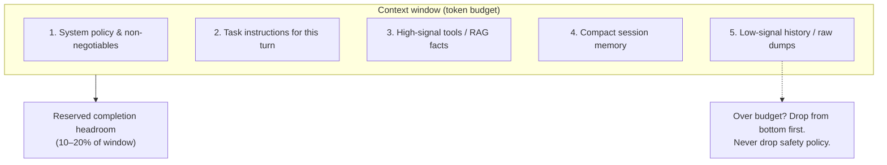

# Module 05 — Context Engineering & Memory

**Time:** 5–7 days · **Depends on:** [01](01-prompt-engineering.md)–[04](04-testing-evals.md) · **Next:** [Fine-tuning](06-fine-tuning.md)

<span data-module-id="05" hidden></span>

## Learning objectives

- Treat the **context window as a scarce, ordered resource** with hard token budgets
- Design a **packing hierarchy** (system → task → tools/RAG → memory → dumps)
- Implement **memory tiers** (working, session, user, world/RAG) instead of “stuff the transcript”
- Use `SessionMemory` / `src.context_memory` to budget and assemble messages in code
- Distinguish **context engineering** from **prompt engineering** and know when each fails

## Why this matters (CS engineer view)

You already budget CPU, memory, and bandwidth. The LLM context window is the same class of resource: finite, ordered, and expensive.

In production, models rarely fail only because the *instruction* was poorly worded. They fail because:

- Safety policy is buried under a 40-turn chat log
- Tool dumps (JSON, HTML, stack traces) crowd out the user question
- Yesterday’s retrieved docs are stale, but still in the window
- “Memory” is an unbounded array of messages with no summary or write path

**Prompt engineering** shapes *how* the model is instructed.  
**Context engineering** decides *what enters the window, in what order, at what fidelity, under what budget*.

If you ship multi-turn chat, agents, or RAG without a packing policy, you will eventually hit: ignored instructions, rising cost per turn, and silent constraint loss.

## Mental model

Think of each model call as filling a fixed-size buffer. Priority order is not chronological order — it is **product order**.



| Layer | Analogy | Drop priority |
|-------|---------|---------------|
| System policy | Kernel / capabilities | Last (never) |
| Task instructions | Current syscall args | Keep for this turn |
| Tools / RAG | Hot cache of facts | Cap size; refresh |
| Session memory | Working set summary | Compress |
| Raw history / dumps | Cold storage spill | First to drop |

## Core tutorial

### 1. Prompt engineering vs context engineering

| Dimension | Prompt engineering | Context engineering |
|-----------|--------------------|---------------------|
| Question | *How* do we instruct? | *What* is in the window? |
| Artifacts | System text, few-shots, formats | Packer, memory store, retriever, budgeter |
| Failure mode | Vague task, bad format | Wrong/stale/noisy facts, drowned policy |
| Iteration speed | Edit strings | Change ranking, caps, summary policy |
| Measurable | Style, schema pass rate | Tokens/turn, recall of constraints, cost |

You need both. A perfect prompt with a garbage window still fails.

<div class="aieng-explainer" markdown>
<p class="label">Explainer</p>

**Ordered resource, not a bag.** Most chat APIs send a list of messages. Models attend over the whole sequence, but **position and volume still matter**: long tool results can dominate, and late contradictory instructions confuse both the model and your evaluators. Treat order as an API contract your packer owns — not as “whatever `messages.append` produced.”
</div>

### 2. Information hierarchy (recommended packing order)

When assembling a request, prefer this order (high → low priority):

```text
1. System policy & non-negotiables
2. Task instructions for this turn
3. High-signal retrieved facts / tool results
4. Compact conversation memory (summary + last k)
5. Low-signal history / raw dumps (first to drop)
```

**Over budget rule:** drop from the bottom. Never drop safety policy. Truncate or summarize dumps; do not silently omit the user question.

### 3. Token budgeting in code

This course ships a dependency-free estimator and priority packer in `src.context_memory`. Production systems often swap in `tiktoken` or provider-native counters — the *policy* stays the same.

```python
from src.context_memory import SessionMemory, estimate_tokens, fit_budget

parts = [
    ("system", "You are a careful assistant. Never invent account IDs."),
    ("summary", "User prefers concise answers. Dark mode preference."),
    ("history", "..." * 200),  # low priority: listed last → dropped first if over budget
]
kept = fit_budget(parts, budget=50)
assert kept[0][0] == "system"
print(estimate_tokens("hello world"))
```

How `fit_budget` works: walk the list in order, keep each part while cumulative `estimate_tokens` ≤ budget, then **stop**. So list order *is* priority.

```python
# Sketch of the shipped logic (see src/context_memory.py)
def estimate_tokens(text: str) -> int:
    """Rough ~4 chars/token without external deps."""
    if not text:
        return 0
    return max(1, (len(text) + 3) // 4)

def fit_budget(parts: list[tuple[str, str]], budget: int) -> list[tuple[str, str]]:
    kept, used = [], 0
    for label, text in parts:
        n = estimate_tokens(text)
        if used + n <= budget:
            kept.append((label, text))
            used += n
        else:
            break
    return kept
```

**Headroom:** leave 10–20% of the total window for the **completion**. If you fill the window with input, you force short or truncated answers.

<div class="aieng-think" markdown>
<p class="label">Think about it</p>

**Question:** Your window is 128k tokens. A support agent includes: 2k system policy, 500 tokens of task, 80k of past tickets “just in case,” and the user’s 200-token question. What fails first — accuracy, cost, or both — and what is the minimal packing fix?

<details data-think-id="05-t1"><summary>Reveal a strong answer</summary>

Both fail. Cost scales with input tokens every turn; accuracy fails because attention and instruction priority are diluted by low-signal dumps. Minimal fix: cap retrieved tickets (e.g. top-k by embedding + recency), keep a rolling summary of the session, pin system policy first, and reserve completion headroom. Never treat “paste the CRM export” as a product strategy.
</details>
</div>

### 4. Memory tiers

| Tier | Contents | Lifetime | Storage |
|------|----------|----------|---------|
| **Working** | Current turn + live tool results | Turn | In request only |
| **Session** | Rolling summary + last *k* turns | Session | Server/session store |
| **User profile** | Preferences, stable facts | Long-lived | Explicit write (DB) |
| **World / RAG** | Docs, tickets, code, policies | External | Vector/DB/search |

Rules of thumb:

- **Working** is rebuilt every call; do not persist raw tool dumps forever.
- **Session** must compress — unbounded chat history is a cost and quality bug.
- **User profile** is *written* only when the product intends it (settings, confirmed facts) — not every model guess.
- **World / RAG** is the database of truth for private knowledge; the window only holds *retrieved slices*.

### 5. SessionMemory (course package)

```python
from src.context_memory import SessionMemory

mem = SessionMemory(summary="User prefers dark mode; account # never invent.", max_recent=10)
mem.add("user", "Can you summarize our last decision?")
mem.add("assistant", "We agreed to ship dark mode first.")

messages = mem.build_messages(
    system="You are a product assistant. Follow policy.",
    user="Remind me what we decided.",
)
# messages: [system, summary-as-system, ...recent, user]
```

Behavior worth internalizing:

- `add` validates roles (`system` | `user` | `assistant` | `tool`) and caps `recent` to `max_recent`.
- `build_messages` always puts **system first**, then optional **summary**, then recent turns, then the new user message.
- `should_summarize(max_messages=20)` is a simple trigger for a summarization job.
- `transcript()` is for feeding a summarizer, not for stuffing into every call.

### 6. Rolling summary pattern

When `len(recent)` grows, compress older turns into `summary` and keep only the tail.

```python
def should_summarize(history: list[dict], max_messages: int = 20) -> bool:
    return len(history) > max_messages

SUMMARY_PROMPT = """Summarize the conversation for future turns.
Keep: user goals, decisions, constraints, open questions, names/IDs.
Drop: chit-chat, duplicate clarifications.
Max 200 words.

Transcript:
{transcript}
"""
```

**Hard requirement:** treat summary as **state you own**. Write it to your store. Do not rely on the model “remembering” across sessions without an explicit memory write.

After summarization, a regression-style check (Module 04 mindset): a constraint from turn 1 must still appear in summary after turn 15 (you can unit-test the summary *string* or a structured memory record).

### 7. Context packing for RAG (preview of 07/09)

Even before full RAG systems:

- Chunk for retrieval (semantic + structure-aware)
- Rerank top-k; dedupe near-identical chunks
- Cap total retrieved tokens so tools + RAG cannot starve the task
- Cite sources with stable IDs the UI can open

Pack order still applies: **policy and task before retrieved text**. Retrieved text is *data*, not instructions (Module 02).

### 8. Putting it together: a packer sketch

```python
from src.context_memory import SessionMemory, estimate_tokens, fit_budget

def pack_turn(
    *,
    system: str,
    task: str,
    tool_or_rag: str,
    mem: SessionMemory,
    user: str,
    input_budget: int = 6000,
) -> list[dict]:
    """Assemble messages under a hard input budget."""
    # Priority list for text budget (order matters)
    parts = [
        ("system", system),
        ("task", task),
        ("tools_rag", tool_or_rag),
        ("summary", mem.summary or ""),
        ("history", mem.transcript()),
    ]
    kept = {label: text for label, text in fit_budget(
        [(l, t) for l, t in parts if t], budget=input_budget
    )}
    # Rebuild message list from what survived
    msgs = [{"role": "system", "content": kept.get("system", system)}]
    if "task" in kept:
        msgs.append({"role": "system", "content": f"Task:\n{kept['task']}"})
    if "tools_rag" in kept:
        msgs.append({"role": "system", "content": f"Context:\n{kept['tools_rag']}"})
    if "summary" in kept and kept["summary"]:
        msgs.append({"role": "system", "content": f"Conversation summary:\n{kept['summary']}"})
    # Prefer structured recent from SessionMemory if budget allows history
    if "history" in kept:
        msgs.extend(mem.recent)
    msgs.append({"role": "user", "content": user})
    # Optional: assert estimate_tokens of full payload + headroom
    return msgs
```

In production you will measure exact tokens and may truncate *within* a part (e.g. tool JSON) rather than dropping the whole part. The priority list is still the design center.

<div class="aieng-quiz" data-quiz-id="05-q1" data-xp="25" data-success="Correct — policy is highest priority and must never be the first thing dropped." data-fail="Revisit the packing hierarchy: system policy outranks history and dumps." markdown>
<p class="label">Quiz · +25 XP</p>
<p class="quiz-prompt">You are over the token budget. What should you drop first?</p>
<div class="quiz-options">
<button type="button" class="quiz-opt" data-correct="false">System safety policy</button>
<button type="button" class="quiz-opt" data-correct="false">The current user question</button>
<button type="button" class="quiz-opt" data-correct="true">Low-signal history / raw dumps</button>
<button type="button" class="quiz-opt" data-correct="false">Task instructions for this turn</button>
</div>
<p class="quiz-feedback"></p>
</div>

## Common failure modes

| Symptom | Likely cause | Fix |
|---------|--------------|-----|
| Ignores instructions mid-chat | History / tools outrank system | Re-pin system; cap history; reorder packer |
| Contradicts earlier decision | Summary lost a constraint | Structured memory fields; summary QA |
| High cost, mediocre quality | Dumping full PDFs / CRM every turn | Retrieve top-k; budget retrieved tokens |
| Hallucinated IDs | No structured memory write | Explicit profile store; “never invent IDs” + tools |
| Answers cut off | No completion headroom | Reserve 10–20% of window |
| “Forgot” after refresh | Memory only in client RAM | Persist session + user tiers server-side |

## Lab

<div class="aieng-lab" markdown>
<p class="label">Lab · Session memory under budget</p>

**Goal:** Prove that constraints survive compression and that packing respects priority.

1. Run the course tests:
   ```bash
   poetry run pytest tests/test_context_memory.py -v
   ```
2. Extend or script a demo that:
   - Creates `SessionMemory(max_recent=6)`
   - Adds a constraint in turn 1: e.g. “Never use my real name; call me Rivet.”
   - Adds 12+ filler turns
   - When `should_summarize()` is true, call a model (or a stub) with `SUMMARY_PROMPT` and set `mem.summary`
3. Assert (test or manual):
   - `len(mem.recent) <= max_recent`
   - Summary still contains the “Rivet” constraint (string contains or structured field)
   - `fit_budget` with a tiny budget keeps `system` and drops long `history`
4. Measure tokens/turn before vs after summarization with `estimate_tokens` on `build_messages(...)` payloads.

**Stretch:** Implement partial truncation of the lowest-priority *part* instead of dropping it entirely when it barely overflows.
</div>

## Knowledge check

<div class="aieng-quiz" data-quiz-id="05-q2" data-xp="25" data-success="Yes — prompt engineering is instruction craft; context engineering is window contents and order under budget." data-fail="They are related but not the same layer of the stack." markdown>
<p class="label">Quiz · +25 XP</p>
<p class="quiz-prompt">Which statement best separates the two disciplines?</p>
<div class="quiz-options">
<button type="button" class="quiz-opt" data-correct="false">Context engineering only means writing longer system prompts</button>
<button type="button" class="quiz-opt" data-correct="true">Prompt engineering shapes instructions; context engineering decides what enters the window, in what order, at what fidelity</button>
<button type="button" class="quiz-opt" data-correct="false">Context engineering replaces the need for evaluation suites</button>
<button type="button" class="quiz-opt" data-correct="false">Prompt engineering is only for fine-tuned models</button>
</div>
<p class="quiz-feedback"></p>
</div>

<div class="aieng-quiz" data-quiz-id="05-q3" data-xp="25" data-success="Correct — profile facts should be explicit writes, not accidental chat residue." data-fail="Revisit memory tiers: user profile is long-lived and intentionally written." markdown>
<p class="label">Quiz · +25 XP</p>
<p class="quiz-prompt">Where should a stable preference like “always use metric units” live for a multi-session product?</p>
<div class="quiz-options">
<button type="button" class="quiz-opt" data-correct="false">Only in the last 10 chat messages forever</button>
<button type="button" class="quiz-opt" data-correct="true">User-profile tier with an explicit write path, optionally mirrored into session summary</button>
<button type="button" class="quiz-opt" data-correct="false">Only in model weights after fine-tuning</button>
<button type="button" class="quiz-opt" data-correct="false">Inside every RAG chunk of the company wiki</button>
</div>
<p class="quiz-feedback"></p>
</div>

<div class="aieng-think" markdown>
<p class="label">Think about it</p>

**Question:** `fit_budget` stops at the first part that does not fit. Why might that be too blunt for tool results, and what policy would you add?

<details data-think-id="05-t2"><summary>Reveal a strong answer</summary>

A single huge tool result can block all lower-priority parts even if you could keep a truncated tool payload + history. Better policy: for designated parts, **hard-cap** (e.g. 2k tokens of tool JSON), then continue packing. Priority remains; fidelity degrades gracefully instead of all-or-nothing drops.
</details>
</div>

## Open source materials

Curated reading (concepts — verify current URLs and versions):

1. [LangChain — Context engineering for agents](https://blog.langchain.com/) — search “context engineering”; packing, write/select/compress patterns for agent windows  
2. [HumanLayer — 12-Factor Agents](https://github.com/humanlayer/12-factor-agents) — practical factors for agent context, tool ownership, and not treating the transcript as a database  
3. [OpenAI / Anthropic / Gemini docs — context windows & token counting](https://platform.openai.com/docs) — provider-native budgets and headroom (pick your stack)  
4. [tiktoken](https://github.com/openai/tiktoken) — production-grade token counting for OpenAI-compatible models  
5. Course code: `src/context_memory.py` and `tests/test_context_memory.py` (repo root; not part of the docs site)

## Checkpoint

- [ ] You can draw your app’s memory tiers (working / session / profile / world)
- [ ] You enforce a token budget in code (priority order + headroom)
- [ ] History is not your only “database”
- [ ] You can explain context engineering vs prompt engineering in one sentence each

<div class="aieng-complete" data-module-id="05" data-xp="120" markdown>
<p>When the above checklist is true for your project (or a lab demo), mark this module complete.</p>
<button type="button">Complete module · +120 XP</button>
</div>

**Next:** [Module 06 — Fine-tuning](06-fine-tuning.md) · or jump to [Tools & basic RAG](07-tools-and-rag.md) on a faster path (you will still need context packing).
