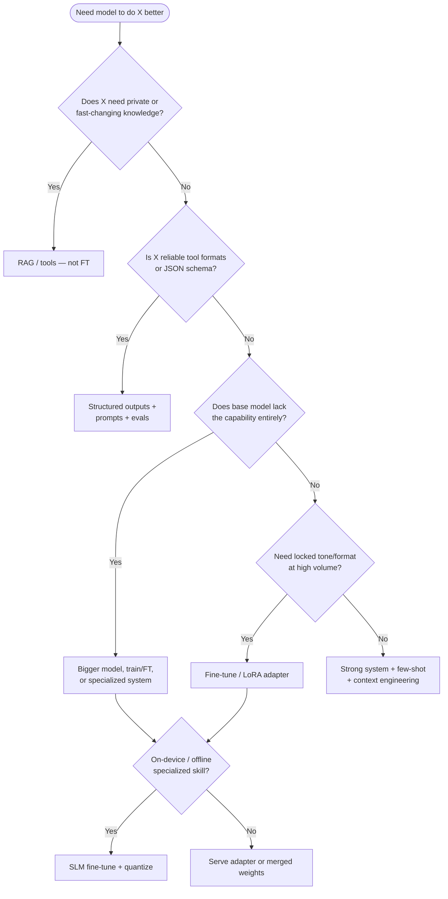

# Module 06 — Fine-Tuning & Model Customization

**Time:** 7–10 days · **Depends on:** [01](01-prompt-engineering.md)–[05](05-context-engineering.md) · **Next:** [Tools & RAG](07-tools-and-rag.md)

<span data-module-id="06" hidden></span>

## Learning objectives

- Decide **when not to fine-tune** — and when PEFT is the right lever
- Build a mental model of **LoRA / QLoRA** (adapters vs full weight updates)
- Prepare **instruction datasets** with quality > quantity and a held-out eval set
- Sketch a **PEFT** training path (conceptual, provider-agnostic for 2026)
- Compare **base vs adapter** with task metrics, not only train loss

## Why this matters (CS engineer view)

<div class="aieng-story" markdown>

Leadership wanted the bot to “know the catalog.” The team fine-tuned on last quarter’s PDF dump. Train loss looked great. Three product launches later the model still confidently recommends retired SKUs—because weekly facts were baked into weights instead of fetched. Rollback meant another training cycle, not a config flip.

</div>

Fine-tuning is a product decision with ops cost: data pipelines, GPU time, eval gates, versioning, and regression risk. Many teams fine-tune because it feels “more ML,” then discover that **prompting + RAG + tools** would have shipped faster with fresher facts.

You fine-tune when you need **sticky behavior** that is expensive or unreliable to re-specify every call: domain tone at high volume, specialized formats, or on-device skills. You do **not** fine-tune to inject a weekly-changing knowledge base—that is RAG/tools.

Default bias for this course:

!!! tip "Default bias"
    Prefer **prompting + RAG + tools** first. Fine-tune when you have stable, high-volume behavioral gaps those cannot fix economically.

## Mental model

Weights encode *distributional skill*. Context encodes *instance facts*. Tools encode *actions and live state*.



| Approach | Pros | Cons |
|----------|------|------|
| Prompt / few-shot | Fast, reversible | Token cost; weaker style lock |
| RAG | Fresh facts | Retrieval quality dependent |
| Tools | Live actions & data | Safety and loop design |
| Fine-tune | Sticky behavior, shorter prompts | Data cost, drift, eval burden |
| Distill | Cheap student model | Teacher quality ceiling |

<div class="aieng-intuition" markdown>
<p class="label">Intuition lock</p>

**Sticky picture:** Weights are **muscle memory**—how you swing after ten thousand reps (tone, format, reflexes). RAG is **open-book**: you look up the current chapter when the fact must be right today. Tools are hands that touch live systems. Fine-tune when the *style or skill* should stick without re-teaching every call; keep open-book for facts that move weekly. LoRA is a thin skill layer you can swap or peel off without rewiring the whole athlete.

<div class="kill" markdown>

**Kill this idea:** “Fine-tuning is how we put our documents into the model.” → **Replace with:** Fine-tune sticky behavior; retrieve or tool-call for changing knowledge—and always score the adapter like a release, not by train loss alone.

</div>
</div>

## Core tutorial

### 1. When NOT to fine-tune

Do **not** fine-tune (as your first move) when:

| Goal | Better first lever |
|------|--------------------|
| Company docs / policies that change | RAG + citations |
| Live prices, tickets, inventory | Tools / APIs |
| “Stop hallucinating our product name” | System policy + retrieval + evals |
| One-off demo tone | Prompt + few-shot |
| JSON reliability | Structured outputs / schema mode |
| Secrets or PII in training data | Redact; never train on secrets |

Fine-tuning **bakes patterns into weights**. Wrong data → wrong product behavior that is harder to reverse than editing a prompt.

<div class="aieng-explainer" markdown>
<p class="label">Explainer</p>

**Parametric vs non-parametric knowledge.** Fine-tuning moves behavior into **parameters** (weights/adapters). RAG keeps knowledge in **external stores** and loads slices into context. Tools fetch or act at runtime. Mixing them up causes the classic failure: fine-tuning on last quarter’s catalog, then wondering why the model “knows” outdated SKUs.
</div>

### 2. When fine-tuning *is* justified

Strong signals:

1. **Stable task distribution** — same intents for months, high volume
2. **Behavioral gap** — base + prompts + RAG still fail evals after serious iteration
3. **Economics** — shorter prompts / smaller model after FT beat larger API calls
4. **Format lock** — industry jargon, fixed report structure, support brand voice
5. **Edge deployment** — SLM + LoRA for offline or privacy-sensitive environments

Write a one-page decision note before spending GPU hours: baseline metrics, failure modes, data plan, success threshold, rollback plan.

<div class="aieng-think" markdown>
<p class="label">Think about it</p>

**Question:** Legal wants the model to “know” every policy PDF. Leadership already booked GPU time and is pitching “we fine-tuned on compliance” to the board. What do you recommend—and what fails first if you bake the corpus into weights anyway?

<details data-think-id="06-t1"><summary>Reveal a strong answer</summary>

Recommend **RAG + strict citation + evals**, not FT-as-knowledge-dump. Policies change; auditors need provenance; FT on PDFs does not guarantee faithful recall and can invent plausible-but-wrong clauses that look official. Use FT later only for *style* (tone, structure) once retrieval is solid—and still ground claims in retrieved text. First failure mode: confident outdated policy after the PDF moves.
</details>
</div>

### 3. Instruction dataset shape

Typical chat / SFT row (messages format, widely used in 2026 toolchains):

```json
{
  "messages": [
    {"role": "system", "content": "You are a concise support agent for Acme."},
    {"role": "user", "content": "How do I reset my API key?"},
    {"role": "assistant", "content": "1. Open Settings → API keys.\n2. Click Rotate.\n3. Store the new key in your secret manager."}
  ]
}
```

**Quality beats quantity.** Hundreds of clean, diverse examples often beat tens of thousands of noisy scraped ones for style and format tasks.

#### Validation checklist

- [ ] No PII / secrets / customer raw tickets without legal clearance  
- [ ] Consistent schema (same roles, same output contract)  
- [ ] Balanced intents and **edge cases** (refusal, ambiguity, multi-step)  
- [ ] Gold answers reviewed by a human who owns the product  
- [ ] **Held-out eval set** never used in training or prompt cherry-picking  
- [ ] Versioned dataset (`dataset_v3.jsonl` + hash in training log)  

#### Diversity beats duplication

If 80% of rows are “reset password,” the adapter will overfit that path and regress on rare but critical intents (billing disputes, safety refusals). Stratify by intent label even if the model never sees the label at inference.

### 4. LoRA / QLoRA mental model

Full fine-tuning updates most of the model’s weights — expensive in VRAM and easy to catastrophically forget general skills.

**LoRA (Low-Rank Adaptation):**

- Freeze base weights \(W\)
- Learn low-rank updates \(\Delta W \approx BA\) with rank \(r \ll d\)
- Train tiny adapter matrices; swap or merge later

**QLoRA:**

- Load base weights in low precision (e.g. 4-bit quantization)
- Still train LoRA adapters in higher precision
- Makes consumer / single-GPU SFT practical for many open models

```text
Base model W (frozen, maybe quantized)
        +
LoRA adapters (trainable: A, B on q_proj, v_proj, ...)
        =
Effective behavior for your task
```

<div class="aieng-explainer" markdown>
<p class="label">Explainer</p>

**Thermostat, not a gut remodel.** Full fine-tuning rewires a lot of the house; LoRA is a small control panel—low-rank adapters you train, swap, or merge. QLoRA keeps the base cold (quantized) so a single GPU can still learn the dial settings. You still measure room temperature with **task metrics**, not how hard the furnace hummed (train loss).
</div>

Hyperparameters you will actually touch:

| Knob | Practical note |
|------|----------------|
| `r` (rank) | Start 8–16; higher = more capacity + overfit risk |
| `lora_alpha` | Scaling; often ~2×`r` as a starting heuristic |
| `target_modules` | Model-specific (`q_proj`, `v_proj`, sometimes MLP) |
| epochs / LR | Small LR; early-stop on **task metric** |
| dropout | Light regularization on small datasets |

Track **task metrics** (Module 04) — not only training loss. Loss can drop while the product regresses.

### 5. Minimal PEFT-shaped sketch

Pseudocode — pin package versions from current PEFT / TRL / Transformers docs before running. Model IDs change; treat names as placeholders.

```python
# Pseudocode — verify flags against current PEFT docs
from peft import LoraConfig, get_peft_model
from transformers import AutoModelForCausalLM, AutoTokenizer

model_name = "microsoft/Phi-4-mini-instruct"  # example SLM family; verify model card

tokenizer = AutoTokenizer.from_pretrained(model_name)
model = AutoModelForCausalLM.from_pretrained(
    model_name,
    device_map="auto",
    # load_in_4bit=True,  # when using bitsandbytes / QLoRA toolchain
)

lora = LoraConfig(
    r=16,
    lora_alpha=32,
    lora_dropout=0.05,
    bias="none",
    task_type="CAUSAL_LM",
    target_modules=["q_proj", "v_proj"],  # model-specific
)
model = get_peft_model(model, lora)
model.print_trainable_parameters()
# → SFTTrainer / custom loop on tokenized chat messages
# → save adapter weights; optionally merge for serving
```

Serving options (conceptual):

- **Runtime adapter load** — swap adapters per tenant/task (multi-tenant platforms)
- **Merge** into base weights — simpler single-model deploy
- **vLLM / TGI / vendor endpoints** — check current adapter support for your stack

### 6. Evaluate the adapter like a release

Compare **base vs adapter** on the **same** golden set (Module 04):

| Check | Why |
|-------|-----|
| Task accuracy / rubric | Did we fix the intended gap? |
| Regression suite | Did we break math, coding, refusals? |
| Latency & VRAM | Still fit the budget? |
| Prompt length | Did we actually shorten production prompts? |
| Slice analysis | Which intents improved / regressed? |

Promotion rule example: ship only if task metric ≥ baseline + δ **and** no critical safety regression.

<div class="aieng-quiz" data-quiz-id="06-q1" data-xp="25" data-success="Correct — fast-changing private knowledge belongs in RAG/tools, not weights." data-fail="Revisit the decision tree: knowledge that changes often is not a fine-tune job." markdown>
<p class="label">Quiz · +25 XP</p>
<p class="quiz-prompt">Which need is a poor reason to fine-tune first?</p>
<div class="quiz-options">
<button type="button" class="quiz-opt" data-correct="false">Lock brand tone on 50k support replies/day after prompts plateau</button>
<button type="button" class="quiz-opt" data-correct="true">Inject a product catalog that changes every week</button>
<button type="button" class="quiz-opt" data-correct="false">Specialize an SLM for offline field diagnostics</button>
<button type="button" class="quiz-opt" data-correct="false">Reduce prompt size for a stable classification format</button>
</div>
<p class="quiz-feedback"></p>
</div>

### 7. Failure modes unique to fine-tuning

| Symptom | Cause | Mitigation |
|---------|-------|------------|
| Great train loss, bad product | Overfit / wrong metric | Held-out task eval; early stop |
| Forgets general skills | Aggressive FT / bad mix | Lower LR, fewer epochs, mix general data |
| Toxic or leaky outputs | Contaminated data | PII scrub; safety suite |
| “Works in notebook” only | Data leakage from eval | Strict held-out; version pin |
| Adapter soup | No versioning | Adapter IDs + eval report per release |

## Common failure modes

| Symptom | Likely cause | Fix |
|---------|--------------|-----|
| Leadership wants FT for “knowledge” | Confused parametric vs retrieval | Decision tree + RAG pilot |
| Noisy scraped data | Quantity fetish | 200–2000 curated rows first |
| Only watching loss curves | Missing product metrics | Golden set + rubrics |
| Single GPU OOM | Full FT attempt | QLoRA / smaller base / lower `r` |
| Cannot roll back | Merged opaque weights only | Keep base + adapter artifacts |

## Lab

<div class="aieng-lab" markdown>
<p class="label">Lab · Fine-tune or not + mini dataset</p>

**Goal:** Practice the decision, not only the training command.

1. **Decision memo (1 page):** For a real or fictional product, answer:
   - What fails today with prompts + RAG + tools?
   - What would success look like numerically?
   - Why FT beats alternatives economically?
2. **Dataset:** Create **30** high-quality instruction rows + **10** held-out (same schema, no overlap).
   - Include at least 3 refusal / edge cases
   - No PII
3. **Baseline:** Score the base model (or API model) on the 10 held-out with a simple metric (exact field match or rubric 1–5).
4. **Optional hardware path:** One epoch LoRA on an open SLM; report metric delta vs baseline. If no GPU, stop at dataset + baseline — that is still a valid lab.
5. Store artifacts: `data/train.jsonl`, `data/eval.jsonl`, `notes/decision.md`.
</div>

## Knowledge check

<div class="aieng-quiz" data-quiz-id="06-q2" data-xp="25" data-success="Yes — LoRA freezes the base and trains small low-rank adapters." data-fail="Review the LoRA mental model: base frozen, low-rank ΔW trained." markdown>
<p class="label">Quiz · +25 XP</p>
<p class="quiz-prompt">What does LoRA primarily do?</p>
<div class="quiz-options">
<button type="button" class="quiz-opt" data-correct="false">Replace RAG by embedding all documents into rank-r matrices</button>
<button type="button" class="quiz-opt" data-correct="true">Freeze base weights and train small low-rank adapter matrices on selected layers</button>
<button type="button" class="quiz-opt" data-correct="false">Quantize only the tokenizer vocabulary</button>
<button type="button" class="quiz-opt" data-correct="false">Guarantee zero catastrophic forgetting under any dataset</button>
</div>
<p class="quiz-feedback"></p>
</div>

<div class="aieng-quiz" data-quiz-id="06-q3" data-xp="25" data-success="Correct — task metrics and regression checks decide shipping, not train loss alone." data-fail="Loss is necessary to watch but insufficient for product release." markdown>
<p class="label">Quiz · +25 XP</p>
<p class="quiz-prompt">You finish one epoch of LoRA. Train loss is down 40%. What next before production?</p>
<div class="quiz-options">
<button type="button" class="quiz-opt" data-correct="false">Ship immediately — lower loss means better product</button>
<button type="button" class="quiz-opt" data-correct="true">Compare base vs adapter on held-out task metrics and a regression/safety suite</button>
<button type="button" class="quiz-opt" data-correct="false">Delete the base model so only the adapter remains</button>
<button type="button" class="quiz-opt" data-correct="false">Fine-tune again on the held-out set to squeeze more loss</button>
</div>
<p class="quiz-feedback"></p>
</div>

<div class="aieng-think" markdown>
<p class="label">Think about it</p>

**Question:** When would distillation into a smaller model be preferable to attaching LoRA to a large base?

<details data-think-id="06-t2"><summary>Reveal a strong answer</summary>

When **inference cost/latency/privacy** dominate and the teacher’s behavior is already good. Distill a student that runs cheaply at scale. LoRA on a large base keeps teacher capacity but may still be expensive to serve; distillation optimizes the deployment envelope once the capability exists.
</details>
</div>

## Open source materials

1. [Hugging Face PEFT](https://github.com/huggingface/peft) — LoRA / QLoRA adapters  
2. [Hugging Face TRL](https://github.com/huggingface/trl) — SFT / preference training loops  
3. [bitsandbytes](https://github.com/bitsandbytes-foundation/bitsandbytes) — quantization building blocks for QLoRA-style stacks  
4. [Axolotl](https://github.com/axolotl-ai-cloud/axolotl) / [LLaMA-Factory](https://github.com/hiyouga/LLaMA-Factory) — practical training configs (verify currency)  
5. [Unsloth](https://github.com/unslothai/unsloth) — efficient fine-tuning tooling (ecosystem option)  
6. Provider fine-tuning docs (OpenAI / Anthropic / Gemini / open-weight hosts) — managed FT when you do not run GPUs

## Checkpoint

- [ ] You can argue for **or against** fine-tuning on your use case in one page  
- [ ] Dataset schema is validated; held-out set is clean  
- [ ] Eval is **task-based**, not only train loss  
- [ ] You know LoRA vs full FT at a systems level  

<div class="aieng-complete" data-module-id="06" data-xp="120" markdown>
<p>When the checklist is true — decision memo + data hygiene + eval plan — mark complete.</p>
<button type="button">Complete module · +120 XP</button>
</div>

**Next:** [Module 07 — Tools & basic RAG](07-tools-and-rag.md)
