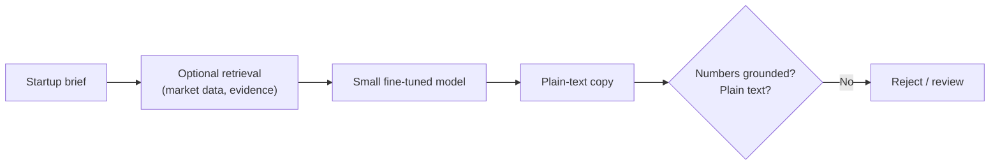
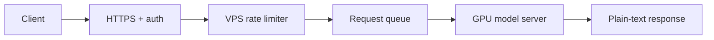

# Hands-on — fine-tune a small model on your own data

**Prerequisites:** [Module 06](../../core/06-fine-tuning.md) and [Module 04](../../core/04-testing-evals.md). Run commands from the repository root. **Time:** 1 hour for the data pipeline on CPU; 1–3 hours of GPU time for one QLoRA run.

<div class="aieng-story" markdown>

*Fictional teaching scenario.*

A founder-tools startup wants one narrow skill: turn a short startup brief into grounded funding-pitch prose. A frontier model does it, but it pads output with invented traction numbers about one time in ten, and its per-request cost is growing. The team bets that a 1.5B model trained on a few hundred reviewed examples can do this one job more consistently and more cheaply. This lab is how they test that bet without fooling themselves.

</div>

**Case question:** What evidence would show that the adapter beats the prompt-only baseline on companies it has never seen, and not just that its training loss dropped?

The task used throughout:

| Input: startup brief | Target: plain-text pitch copy |
|---|---|
| *We help independent clinics reduce missed appointments with automated reminders and patient follow-up. Raising a seed round to expand the product and sales team.* | *Independent clinics lose revenue and staff time when reminders and rescheduling are handled manually. Our platform brings these workflows into one system… We will use the seed round to expand the product and strengthen distribution.* |

The target contains no invented metrics and no slide scaffolding. Fine-tuning can teach tone, structure, and consistency. It cannot teach current market sizes, competitors, or funding trends. Those come from retrieval.



## Pick a runnable path

| Stage | Implementation | Hardware | Evidence |
|---|---|---|---|
| Rights, cleaning, numbers, split | `src/finetune_data.py`, `examples/fine-tuning/prepare_data.py` | Any, stdlib only | Validation errors, split manifest, `pytest tests/test_finetune_data.py` |
| Baseline and adapter eval | `examples/fine-tuning/evaluate.py` | CPU works, slowly; GPU preferred | Plain-text rate, unsupported-number rate, latency per row |
| QLoRA training | `examples/fine-tuning/train_qlora.py` | CUDA GPU (Colab T4 is enough for 1.5B) | Adapter, checkpoints, `environment.json` |
| Serving | vLLM `--enable-lora`, or FastAPI + Transformers | GPU host behind a gateway | Load test, latency, error rate |

## 0. Build three baselines before you train

1. **Strong prompt only.** Best system prompt plus a few examples.
2. **Prompt + retrieval.** Adds evidence for any facts the copy needs.
3. **Fine-tuned small model.** Build this only after baselines 1–2 fail at something specific that you can name.

If baseline 1 already passes your eval, you are done and can skip training. This is the [Module 06 decision tree](../../core/06-fine-tuning.md#1-when-not-to-fine-tune) applied to a concrete task.

## 1. Pick a small base model

Start between 0.5B and 3B parameters: `Qwen/Qwen2.5-1.5B-Instruct` (the lab default), `Qwen/Qwen3-0.6B`, or `HuggingFaceTB/SmolLM2-1.7B-Instruct`. Check each model card's license before you use it.

A 7B or 14B base costs more GPU memory, training time, and serving money, and it overfits a few hundred examples more easily. Move to a larger base only after the small one fails evaluation.

## 2. Clear data rights before downloading anything

Being publicly available does not give you permission to train on something. Record a rights entry for every source **before** you fetch it. `check_source_rights` blocks anything not explicitly approved for training:

```python
from src.finetune_data import check_source_rights

source_record = {
    "source_id": "approved-pitch-decks",
    "source_url": "https://example.com/...",
    "rights_status": "approved",        # never "assumed"
    "permission_scope": "training",
    "commercial_use_permitted": True,
    "redistribution_permitted": False,
    "rights_reviewed_at": "2026-09-17",
    "private_evidence_ref": "private://permissions/...",
}
assert check_source_rights(source_record) == []
```

| Commit to git | Keep private |
|---|---|
| Source metadata, file hashes, processing code, schemas, eval code, split manifests | Raw PDFs, OCR output, human gold transcriptions, permission emails, user-submitted data |

## 3. Download reproducibly

Download only from an explicit allowlist of approved URLs. Never crawl. For every file, check the content type (a PDF starts with `%PDF-`), store it, and write a manifest entry with its URL, `sha256`, byte count, and timestamp. Skip duplicates by content hash so nothing gets downloaded again silently. `sha256_bytes` in `src/finetune_data.py` is the hashing primitive.

## 4. Extract text with a cascade, and keep the failures

Pitch decks are hard documents: tiny footnotes, charts, rotated text, and numbers inside images. Use a cascade:

1. Native PDF text extraction. If it returns enough text, keep it.
2. Otherwise, layout-aware OCR (Docling, PaddleOCR).
3. If that fails too, a second OCR engine or manual review.

Save one record per page with the engine, latency, `review_status: "machine_draft_unverified"`, and an empty `gold_text` until a human reviews it. **Do not drop pages where OCR returned nothing.** Those are your hardest cases, and they show where the pipeline breaks. A machine draft is not ground truth.

## 5. Clean the text, but don't repair it

Cleaning removes extraction noise. It does not make the text nicer.

```python
from src.finetune_data import clean_text, numeric_strings

clean_text("Revenue\x00  grew\u00a0to $12.SM\n\n\n\nnext")
# 'Revenue grew to $12.SM\n\nnext'   ← the OCR error survives on purpose
numeric_strings("We grew 80% to $12.5M in 2024.")
# {'80%', '$12.5M', '2024'}
```

Never auto-correct numbers. If OCR produced `$12.SM`, send the page to review. Don't let a language model "fix" it, because a model trained on wrong numbers writes fluent copy that is financially wrong. Track numeric strings separately and evaluate them separately.

## 6. Build brief → copy examples, not page → text

A raw deck page is not training data. The task is *startup brief → grounded pitch copy*, so each example has to be built:

1. Collect source evidence.
2. Extract the text.
3. Write a short brief.
4. Draft the target copy.
5. Check every claim against the evidence.
6. Have a human review the target.
7. Add the reviewed example to the dataset.

If the evidence doesn't support a metric, leave the metric out. Write "The company is focused on expanding early customer adoption," not "3× growth." The row format, with `company_id` kept for splitting:

```json
{"company_id": "cliniq",
 "messages": [
  {"role": "system", "content": "Write grounded English funding-pitch copy. Return plain text only. Do not invent metrics, customers, revenue, market size, or traction."},
  {"role": "user", "content": "Startup brief:\nWe help independent clinics...\n\nStage:\nSeed"},
  {"role": "assistant", "content": "Independent clinics lose revenue..."}]}
```

`validate_example` rejects a row if the roles or content are wrong, if the target isn't plain text (JSON, `Slide 1:`, markdown headings), or if the target contains **a number that isn't in the brief**. The fictional rows in `examples/fine-tuning/data/sample.jsonl` all pass.

## 7. Split by company, not by page

If page 1 of Company A's deck goes into training and page 2 into validation, the model learns Company A's phrasing and only looks like it generalizes. Assign whole companies to one split (roughly 80/10/10):

```bash
PYTHONPATH=. python examples/fine-tuning/prepare_data.py \
  --input examples/fine-tuning/data/sample.jsonl --out data/processed
# {'train': 5, 'validation': 1, 'test': 2}  + data/processed/split-manifest.json
```

`split_by_company` is deterministic: it hashes each company ID with a split version. The manifest records the dataset hash and the company IDs in each split. **Once you have looked at test results, the test set is burned.** Don't change it. Make a new split version and say that you did.

## 8. Set up the environment, on the right machine

```bash
python3.11 -m venv .venv-finetune && source .venv-finetune/bin/activate
python -m pip install -r examples/fine-tuning/requirements.txt
pip freeze > configs/training-environment.txt
```

A small CPU VPS is a good API gateway: TLS, auth, rate limiting, queueing, Redis, logs, and health checks. It is the wrong machine for QLoRA training or GPU inference.

## 9. Train with QLoRA

QLoRA loads the frozen base in 4-bit NF4 and trains only a small LoRA adapter. It needs much less memory than full fine-tuning (see the [LoRA / QLoRA mental model](../../core/06-fine-tuning.md#4-lora-qlora-mental-model)).

```bash
PYTHONPATH=. accelerate launch examples/fine-tuning/train_qlora.py \
  --data data/processed --output artifacts/adapters/v1
```

| Setting | Default | Why |
|---|---|---|
| `r` / `lora_alpha` | 16 / 32 | Adapter rank; alpha ≈ 2× rank is a common start |
| `lora_dropout` | 0.05 | Light regularization for small data |
| `learning_rate` | 2e-4 | Typical LoRA starting point |
| `num_train_epochs` | 2 | Start low. Small datasets overfit fast |
| `gradient_accumulation_steps` | 8 | Larger effective batch on a small GPU |
| `packing` | True | Better GPU use with short examples |
| `save_steps` | 50 | Survive disconnects |

Don't add epochs just because training loss keeps falling. The model can memorize its training companies while getting worse on unseen ones.

## 10. Train on Google Colab

Colab's free T4 is fine for first experiments. Sessions disconnect, GPU availability varies, and local storage is wiped between sessions, so don't treat it as a training service.

```python
!nvidia-smi
from google.colab import drive; drive.mount("/content/drive")
%pip install -r examples/fine-tuning/requirements.txt
!PYTHONPATH=. python examples/fine-tuning/train_qlora.py \
    --data /content/drive/MyDrive/my-project/processed \
    --output /content/drive/MyDrive/my-project/adapters/v1
# after a disconnect, rerun the same command with --resume
```

Checkpoints go to Drive every 50 steps, so a run that dies at 95% resumes where it stopped. The script writes `environment.json` (Python, torch, transformers, TRL, PEFT, GPU) next to the adapter so every run is reproducible.

## 11. Choose GPUs per stage and budget for iteration

| Stage | Where | Avoid for |
|---|---|---|
| First experiments, debugging | Colab | Long runs, production |
| Longer training jobs | Spot/per-second providers (RunPod, Vast.ai, Modal, Lambda) | Stable-latency serving |
| Public serving | Dedicated GPU hosting | Experiments (you pay while it sits idle) |

At an illustrative $0.40/hour, 3 active hours plus 1 hour of retries plus storage costs about **$1.70**. The first run is not the expensive part. Rebuilt datasets, rank sweeps (8/16/32), different base models, eval runs, and GPUs left running for testing are. Budget **5–10× your first estimate**, and check live prices before every run.

## 12. Evaluate against the prompt-only baseline

Compare the adapter with the system you would otherwise ship, not with training loss. Use the same held-out companies for both:

```bash
PYTHONPATH=. python examples/fine-tuning/evaluate.py --split data/processed/test.jsonl \
  --output results/fine-tuning/base.json
PYTHONPATH=. python examples/fine-tuning/evaluate.py --split data/processed/test.jsonl \
  --adapter artifacts/adapters/v1 --output results/fine-tuning/adapter.json
```

| Metric | How |
|---|---|
| Plain-text compliance | `is_plain_text`, automatic |
| Unsupported numbers | `unsupported_numbers(source, generated)`, automatic. Any number not in the evidence counts as a hallucination |
| Usefulness | Human rubric, 1–10, blind to which model wrote it |
| Unsupported claims (non-numeric) | Human review against the brief |
| Repetition, readability | Rubric or simple heuristics |
| Latency, tokens, cost per request | From the report |

An illustrative shape for the final scorecard:

```text
                     Prompt-only   Fine-tuned
Useful copy            7.1/10        8.0/10
Unsupported claims     8%            2%
Numeric errors         3%            1%
Avg latency            2.4 s         1.5 s
```

You can claim an improvement only if the test companies were isolated **before** you started iterating. With the 8-row sample, the scorecard proves the pipeline works, not that the model is better.

## 13. Serve the adapter behind a gateway

For high throughput, use vLLM with runtime LoRA. Check the current vLLM LoRA docs, because the flags change between versions:

```bash
vllm serve Qwen/Qwen2.5-1.5B-Instruct --enable-lora \
  --lora-modules pitchcopy=./artifacts/adapters/v1 --max-model-len 2048
```

For low traffic, a FastAPI endpoint that renders the same system prompt used in training and returns `PlainTextResponse` is enough. Either way, never expose the raw model server to the internet:



## 14. Monitor quality, and retrain only on reviewed data

Track these from the first day: request latency, queue time, GPU memory and utilization, error rate, empty outputs, tokens per request, user retry rate, unsupported-claim reports, and **model + adapter version** on every request ([Module 13](../../core/13-production.md), [Module 23](../../core/23-prompt-drift.md)).

- Collect user data for retraining only with **explicit opt-in**. Even then, strip phone numbers, emails, customer names, private revenue figures, fundraising terms, and investor contacts before storing anything ([Module 02](../../core/02-security-privacy.md)).
- Keep production-derived training data separate from evaluation data.
- Retrain only when you have a meaningful number of **reviewed** examples, a documented failure pattern, a stable eval set, a versioned dataset, and a rollback plan. A sensible progression: v0 prompt-only → v1 200 reviewed → v2 1,000 reviewed → v3 more data + retrieval.

Every release records a version entry:

```python
version_record = {
    "version": "v2",
    "base_model": "Qwen/Qwen2.5-1.5B-Instruct",
    "base_model_revision": "...",
    "dataset_hash": "...",          # from split-manifest.json
    "num_train_examples": 1000,
    "gpu_type": "A10G",
    "total_gpu_hours": 4.2,
    "eval_unsupported_claims": 0.018,
    "eval_numeric_errors": 0.009,
    "rollback_artifact": "artifacts/adapters/v1",
    "known_failure_modes": ["long briefs > 500 tokens"],
}
```

Don't deploy without a documented rollback path. Keeping the base and adapter as separate artifacts makes rollback a config change.

<div class="aieng-case-checkpoint" markdown>
<p class="label">Case checkpoint</p>

**Opening failure:** A frontier model invented traction numbers in about 10% of pitch drafts.

**What this lab demonstrates:** How to build grounded, reviewed, rights-cleared examples, split them so held-out companies stay unseen, and compare base and adapter on the same rows with automatic numeric-grounding checks.

**What it does not prove:** The 8-row fictional sample can't show that an adapter helps. That takes hundreds of reviewed examples, a human usefulness rubric, and a test set you haven't looked at.

</div>

The biggest improvement almost never comes from the learning rate. It comes from the examples: a clear brief, verified evidence, a human-reviewed target, and a company-level split.

## Project layout

```text
your-project/
├── data/raw/          # private, gitignored
├── data/processed/    # private, gitignored
├── data/splits/       # manifests only — safe to commit
├── scripts/           # download, clean, build examples, train, evaluate
├── configs/           # data.toml, training.toml, training-environment.txt
├── notebooks/         # train_colab.ipynb
├── artifacts/adapters/# private model outputs
└── tests/
```

The raw data stays private, while the processing and evaluation code is public. That way the pipeline can be reproduced without publishing the data.

## Sources

Adapted from [Rahul's "How To Fine-Tune a Small LLM on Your Own Data (Full Guide)"](https://x.com/sairahul1/status/2100882424343265527) (September 2026) and integrated with this course's modules. Primary docs: [TRL SFTTrainer](https://huggingface.co/docs/trl/en/sft_trainer), [PEFT quantization](https://huggingface.co/docs/peft/en/developer_guides/quantization), [bitsandbytes](https://huggingface.co/docs/bitsandbytes), [Qwen2.5-1.5B-Instruct model card](https://huggingface.co/Qwen/Qwen2.5-1.5B-Instruct), [vLLM LoRA serving](https://docs.vllm.ai/en/latest/features/lora.html), [Colab FAQ](https://research.google.com/colaboratory/faq.html).
