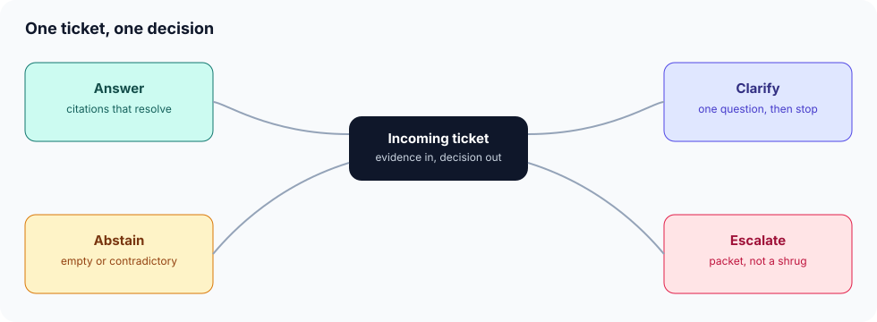
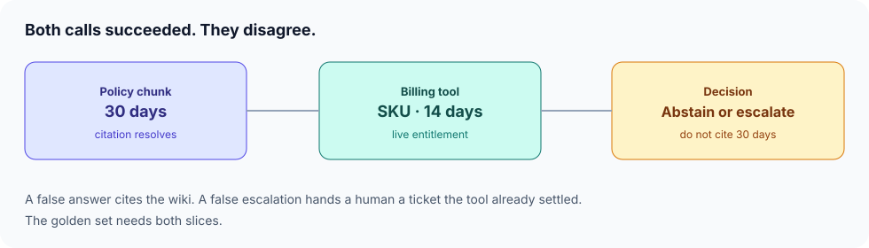

# Answer contract

**Time:** about half a day · **Depends on:** [04 Testing & evals](04-testing-evals.md), [07 Tools & RAG](07-tools-and-rag.md) · **Next:** [Advanced RAG](09-advanced-rag.md)

**Part of:** [Module 07](07-tools-and-rag.md). The module checkpoint and EX-07 stay on the parent page.

---

<span id="why-this-matters-cs-engineer-view"></span>

<div class="aieng-story" markdown>

*Fictional teaching scenario.*

The bot is asked whether an order can be refunded on day 20. Retrieval returns the policy sentence “30 days” and the citation checks out. The billing tool returns the SKU, and that SKU is enterprise, window 14 days. Both calls succeeded. The model writes a helpful paragraph citing the policy. Finance reopens the ticket. A second version of the bot, trying to be safe, escalates every refund question, including the ones the tool had already settled.

</div>

**Case question:** Which single decision object covers answer, clarify, abstain, and escalate, and which two eval slices stop both the false answer and the false escalation?

## Learning objectives

- Emit one decision per ticket: answer, clarify, abstain, or escalate
- Treat a wiki sentence and a live tool result as two sources that can conflict
- Put the conflict on an eval slice, including the cost of escalating a ticket the tool already answered
- Keep the decision in your runtime. The model proposes. The contract checks.

{ .course-figure }

<p class="course-caption">Answer only with citations that resolve. Clarify with one question. Abstain when evidence is empty or contradictory. Escalate with a packet.</p>

<div class="aieng-intuition" markdown>
<p class="label">Intuition lock</p>

**Sticky picture:** The bot stands at a **four-door lobby**. One door opens. The doors are labeled, and a ticket that tries to leave through a crack in the wall is a failed schema, the same as bad JSON in Gate 1.

<div class="kill" markdown>
**Kill this idea:** “If the citation resolves, the answer is allowed.” → **Replace with:** A resolving citation can still be the wrong source for this customer. The contract checks agreement across sources before it allows `answer`.
</div>
</div>

---

## The decision

```json
{
  "decision": "abstain",
  "question": null,
  "citations": [],
  "packet": {
    "retrieved": ["refund-window"],
    "tools": [{"name": "get_subscription", "sku": "enterprise", "window_days": 14}],
    "conflict": "policy-30d vs tool-14d"
  }
}
```

| Decision | When it is legal | What must be present |
|---|---|---|
| `answer` | Sources agree, citations resolve to retrieved ids | `citations` non-empty |
| `clarify` | One missing slot blocks a true answer (which order) | `question` is one question, then stop |
| `abstain` | No evidence, or the evidence contradicts itself | `packet.conflict` or an empty shortlist |
| `escalate` | A person must decide, and you can show them why | `packet` with what was retrieved and what the tool returned |

`src/answer_contract.py` is the runtime check. The model does not get to pick a fifth door.

```python
def decide(*, policy_window, tool_window, citations, retrieved, missing_slot=None) -> dict:
    packet = {
        "retrieved": list(retrieved),
        "tools": [{"window_days": tool_window}] if tool_window is not None else [],
    }
    if missing_slot:
        return {"decision": "clarify", "question": missing_slot, "citations": [], "packet": packet}
    if policy_window is None and tool_window is None:
        return {"decision": "abstain", "question": None, "citations": [],
                "packet": {**packet, "conflict": "no-evidence"}}
    if policy_window is not None and tool_window is not None and policy_window != tool_window:
        return {"decision": "abstain", "question": None, "citations": [],
                "packet": {**packet, "conflict": f"policy-{policy_window}d vs tool-{tool_window}d"}}
    if not citations:
        return {"decision": "abstain", "question": None, "citations": [],
                "packet": {**packet, "conflict": "no-citation"}}
    return {"decision": "answer", "question": None, "citations": list(citations), "packet": packet}

def validate_decision(decision: dict) -> None:
    kind = decision.get("decision")
    if kind not in {"answer", "clarify", "abstain", "escalate"}:
        raise ValueError(f"unknown decision: {kind}")
    citations = decision.get("citations") or []
    packet = decision.get("packet") or {}
    retrieved = packet.get("retrieved") or []
    if not isinstance(citations, list) or not isinstance(retrieved, list):
        raise ValueError("citations and retrieved must be lists of ids")
    if kind == "answer" and not citations:
        raise ValueError("answer requires citations")
    for cite in citations:
        if not isinstance(cite, str) or not cite:
            raise ValueError("citations must be ids")
        if cite not in retrieved:
            raise ValueError(f"unresolved citation: {cite}")
    if kind == "clarify" and (not decision.get("question") or decision["question"].count("?") != 1):
        raise ValueError("clarify asks one question")
    if kind in {"abstain", "escalate"} and not packet:
        raise ValueError(f"{kind} requires a packet")
    if kind == "answer" and packet.get("conflict"):
        raise ValueError("answer is illegal when sources conflict")
```

```python
conflict = decide(
    policy_window=30, tool_window=14,
    citations=["refund-window"], retrieved=["refund-window"],
)
assert conflict["decision"] == "abstain"
assert "refund-window" not in conflict["citations"]
validate_decision(conflict)

settled = decide(
    policy_window=30, tool_window=30,
    citations=["refund-window"], retrieved=["refund-window"],
)
assert settled["decision"] == "answer"
validate_decision(settled)
try:
    validate_decision({
        "decision": "answer",
        "citations": ["invented"],
        "question": None,
        "packet": {"retrieved": ["refund-window"]},
    })
except ValueError as exc:
    assert "unresolved citation" in str(exc)
else:
    raise AssertionError("an invented citation must fail")
```

`pytest tests/test_answer_contract.py -v` runs the five slices. A stub that always cites the policy fails `conflict-enterprise`. A stub that always escalates fails `false-escalation`.

Module 11’s `ask_user` is the runtime form of `clarify`. It is legal only when this contract has already selected that door. A keyword router that sends any sentence containing “status” to a tool and any sentence containing “policy” to retrieval will fire both on this ticket and then let the model reconcile them in prose. That reconciliation is the bug.

{ .course-figure }

<p class="course-caption">The policy chunk says 30 days. The billing tool says this SKU has 14. Success on both calls is the incident.</p>

Authority stays where Module 07 already put it. The billing tool owns the live SKU. The corpus owns the clause text. When they disagree, the contract does not average them. It abstains or escalates. The [corpus lesson](09-corpus.md) is how the 14-day exception stays attached to the rule so this conflict is visible in the shortlist instead of hidden in a neighboring chunk.

---

## Two slices, or the contract is theater

| id | input | sources | expect |
|---|---|---|---|
| `ok-standard` | Day-10 refund, standard SKU | Policy 30, tool 30 | `answer`, cite the policy |
| `conflict-enterprise` | Day-20 refund, enterprise SKU | Policy 30, tool 14 | `abstain` or `escalate`, must not cite 30 as this customer’s window |
| `missing-order` | “Refund it” | No order id | `clarify`, one question |
| `empty` | A product you do not sell | Empty shortlist, tool says unknown SKU | `abstain` |
| `false-escalation` | Day-5 refund, tool and policy both say 30 | Agree | `answer`, not `escalate` |

`false-escalation` is the cost slice. A contract that abstains on every ticket is a green safety metric and a broken desk. Module 04 scores these rows. The [eval flywheel](eval-flywheel.md) is how a production reopen of `conflict-enterprise` becomes the next quarantined case.

<div class="aieng-case-checkpoint" markdown>
<p class="label">Case checkpoint</p>

**Opening failure:** A cited 30-day answer contradicted the billing tool, and the “safe” rewrite escalated tickets the tool had already settled.

**What this lesson demonstrates:** One decision object and five rows that punish both failure directions.

**What it does not prove:** Five rows do not cover every SKU. A packet that omits the tool payload will send the human back to the same ambiguity.

</div>

---

## Lab

1. Implement the decision as a schema. Reject `answer` with an empty `citations`, a citation that is not one of the retrieved ids, or `clarify` with more than one question.
2. Write the five rows above as JSONL.
3. Score a stub that always cites the policy. It must fail `conflict-enterprise` and pass `ok-standard`.
4. Score a stub that always escalates. It must fail `false-escalation`.
5. Write one sentence the runtime checks: if the tool window and the cited clause disagree, `answer` is illegal.

---

<div class="aieng-quiz" data-quiz-id="contract-q1" data-xp="25" data-success="Disagreeing sources make answer illegal. Escalating an agreement fails the other slice." data-fail="Both successes can still be a conflict, and a reflex escalate has its own failing row." markdown>
<p class="label">Quiz · +25 XP</p>
<p class="quiz-prompt">Policy retrieval and the billing tool both return 200. The windows are 30 and 14. What must the contract do?</p>
<div class="quiz-options">
<button type="button" class="quiz-opt" data-correct="false">Answer from the policy, because the citation resolves</button>
<button type="button" class="quiz-opt" data-correct="false">Answer from the tool, and skip the eval because the tool is structured</button>
<button type="button" class="quiz-opt" data-correct="true">Abstain or escalate with both payloads in the packet, and fail any row that cites 30 days for this SKU</button>
<button type="button" class="quiz-opt" data-correct="false">Escalate every refund from now on</button>
</div>
<p class="quiz-feedback"></p>
</div>

## Checkpoint

- [ ] Every ticket emits exactly one of the four decisions
- [ ] `answer` requires citations that resolve
- [ ] A policy-versus-tool conflict cannot take the answer door
- [ ] The golden set contains a false-answer row and a false-escalation row
- [ ] `clarify` asks one question and stops

**Return to the case:** Day 20 on an enterprise SKU no longer leaves the building as a cited 30-day answer, and a standard day-5 refund no longer waits on a human.

**Next:** [Advanced RAG](09-advanced-rag.md), then the [corpus lesson](09-corpus.md) if the exception is still stranded in another chunk.
