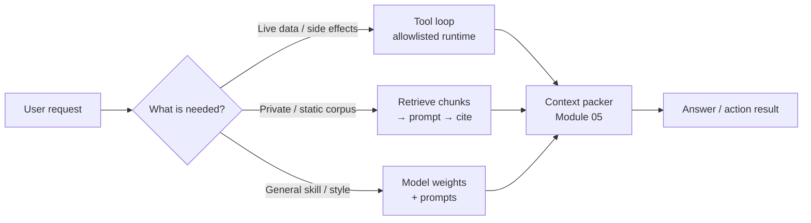

# Module 07 — Tool Integration & Basic RAG

**Time:** 5–7 days · **Depends on:** [01](01-prompt-engineering.md)–[05](05-context-engineering.md) · **Next:** [MCP](08-model-context-protocol.md)

<span data-module-id="07" hidden></span>

## Learning objectives

- Implement a **tool/function-calling loop** safely (allowlists, validation, step limits)
- Build a minimal **retrieve → generate** pipeline with citations
- Choose **tools vs RAG vs weights** for a given knowledge/action need
- Use course `src.rag` (`TinyRAG`, chunking, citation checks) as a learning scaffold
- Apply chunking heuristics and know where FAISS / Chroma / sentence-transformers fit

## Why this matters (CS engineer view)

LLMs are strong at language and weak at **authority over your systems**. They do not magically have:

- Live inventory, ticket state, or calendar slots  
- Your private wiki, unless you retrieve it  
- The right to delete rows or send money  

**Tools** give the model a typed API into *your* runtime.  
**RAG** injects *evidence* into context for questions over corpora.  
**Weights** hold general skill and style — not your weekly-changing catalog.

If you skip this module, you either (a) stuff everything into the prompt, (b) fine-tune for the wrong reasons (Module 06), or (c) let free-form model text pretend to execute side effects.

## Mental model

Three places knowledge and action can live:



| Need | Mechanism | Failure if wrong |
|------|-----------|------------------|
| Live data (price, weather, ticket) | **Tool / API** | Stale hallucination |
| Private/static corpus | **RAG** | Invented “docs” |
| General reasoning / style | **Model weights** | Over-retrieval noise |
| Strict enterprise actions | Tool + **human approval** | Irreversible mistakes |

## Core tutorial

### 1. Tool calling loop

The model **proposes** a tool call; **your code** executes it.

```text
User → Model (may request tool)
         ↓
      Execute tool in your runtime (allowlisted)
         ↓
      Tool result → Model → Final answer
         (or another tool request, until stop / step limit)
```

Provider APIs differ (OpenAI-style `tools`, Anthropic tool use, Gemini function calling), but the **control loop** is the same: you own execution, validation, timeouts, and logging.

```python
import json
from typing import Callable

ToolFn = Callable[..., str]

TOOLS: dict[str, ToolFn] = {
    "get_weather": lambda city: f"Weather in {city}: 22C clear (demo)",
}

TOOL_SPECS = [
    {
        "type": "function",
        "function": {
            "name": "get_weather",
            "description": "Get current weather for a city",
            "parameters": {
                "type": "object",
                "properties": {"city": {"type": "string"}},
                "required": ["city"],
            },
        },
    }
]

def run_tool(name: str, arguments_json: str) -> str:
    if name not in TOOLS:
        return json.dumps({"error": "tool not allowed"})
    args = json.loads(arguments_json or "{}")
    # Validate keys rigorously in production (JSON Schema)
    return TOOLS[name](**args)
```

Wire `TOOL_SPECS` into your provider’s tools API; loop until the model stops requesting tools or hits a **step limit** (e.g. 5–10). Always surface tool errors as structured results the model can recover from — do not crash the agent loop silently.

<div class="aieng-explainer" markdown>
<p class="label">Explainer</p>

**Allowlist ≠ documentation.** Shipping tool *descriptions* without an allowlist invites prompt injection: “call `delete_all`.” The runtime must reject unknown names even if the model invents them. Treat tool args like untrusted HTTP input: schema validate, type-check, bound strings, and timeout I/O.
</div>

### 2. Tool safety checklist

| Control | Why |
|---------|-----|
| Allowlist of tool names | No free-form shell |
| JSON Schema on args | Block type confusion / injection payloads |
| Timeouts + size limits | Hang / memory bombs |
| Auth in *your* service layer | Model never holds root credentials in plain prompts |
| Human approval for destructive tools | Delete, pay, email send |
| Audit log (who, tool, args hash, result status) | Incidents and compliance |
| Sandbox for code execution | If you must run code at all |

Never expose unrestricted shell or SQL as a tool in production without extreme isolation.

<div class="aieng-think" markdown>
<p class="label">Think about it</p>

**Question:** The model returns `run_sql` with `arguments: {"q": "DROP TABLE users;"}`. Your app has a SQL tool for analytics. What layers should have stopped this?

<details data-think-id="07-t1"><summary>Reveal a strong answer</summary>

Multiple layers: (1) tool not present or read-only DB role; (2) allowlist of statements (SELECT only); (3) arg validation / query parser rejecting DDL; (4) human approval for non-SELECT; (5) separate credentials without DROP privilege. Relying on the model to “be careful” is not a control.
</details>
</div>

### 3. Basic RAG pipeline

```text
Ingest → Chunk → Embed → Index
User query → Embed → Retrieve top-k → Prompt with sources → Answer + citations
```

**Ingest** is an offline (or async) path. **Query** is online and must stay under your context budget (Module 05).

#### Chunking heuristics

| Content | Starting point |
|---------|----------------|
| Prose docs | 400–800 tokens, 10–20% overlap |
| Code | By symbol / file section |
| Tables | Keep row groups together |
| Markdown | Split on headings when possible |

Bad chunking → retrieval of half-sentences and wrong neighbors. Oversize chunks → waste tokens and dilute similarity.

### 4. TinyRAG (course package)

Shipped as `src.rag` (no embedding deps — bag-of-words + cosine for teaching). Run `pytest tests/test_rag.py`.

```python
from src.rag import TinyRAG, simple_chunks

chunks = simple_chunks(
    "Cats sleep in sunbeams. Markets move on news.",
    "notes",
    size=6,  # words per chunk in this helper
)
rag = TinyRAG(chunks)
print(rag.retrieve("cat sleep", k=1)[0].text)
print(rag.build_prompt("Where do cats sleep?", k=1))
assert rag.validate_citations("They sleep in sunbeams (cite: notes:0).")
```

What the scaffold teaches:

| Piece | Role |
|-------|------|
| `Chunk(id, text, source)` | Stable IDs for citations |
| `simple_chunks` | Naive word windows (replace with better splitters) |
| `bag_of_words` + `cosine` | Stand-in for embeddings |
| `retrieve` / `retrieve_ids` | Top-k by similarity |
| `build_prompt` | “Answer only from sources; cite ids” |
| `validate_citations` | Reject `(cite: evil)` not in corpus |
| `rrf` | Fuse multiple ranked lists (hybrid search later) |

#### Production upgrades (concepts)

Replace BoW with **dense embeddings**:

- **sentence-transformers** (local, open models)  
- Provider embedding APIs  

Replace linear scan with an **index**:

- **FAISS** — high-performance similarity search  
- **Chroma** — developer-friendly embedding DB  
- **Qdrant / Pinecone / pgvector** — managed or SQL-adjacent options  

The *loop* stays: retrieve → pack → generate → validate citations.

### 5. Citation pattern

Force the model to ground claims:

```text
Answer in Markdown.
After each claim that uses a source, add (cite: chunk_id).
If sources are insufficient, say you do not know.
End with a Sources section listing ids → titles.
```

`TinyRAG.build_prompt` already encodes the “only sources / cite ids / don’t know” contract. In product code, **post-validate** citations against the retrieved set (or full corpus) and fail closed in strict modes:

```python
# From src.rag.TinyRAG.validate_citations
# True if every (cite: id) is in allowed set; answers with no cites pass
# (strict products may require ≥1 cite for factual claims)
```

Unanswerable queries are a **feature**: better “I don’t know” than a fluent lie.

<div class="aieng-quiz" data-quiz-id="07-q1" data-xp="25" data-success="Correct — live state needs a tool, not a static corpus or pure weights." data-fail="Map the need: live data → tool; private docs → RAG; general skill → weights." markdown>
<p class="label">Quiz · +25 XP</p>
<p class="quiz-prompt">User asks: “What is the status of ticket T-9182 right now?” Best primary mechanism?</p>
<div class="quiz-options">
<button type="button" class="quiz-opt" data-correct="false">Fine-tune on last month’s tickets</button>
<button type="button" class="quiz-opt" data-correct="true">Tool/API call to the ticket system</button>
<button type="button" class="quiz-opt" data-correct="false">RAG over a PDF export from last quarter</button>
<button type="button" class="quiz-opt" data-correct="false">Larger context window only</button>
</div>
<p class="quiz-feedback"></p>
</div>

### 6. Hybrid routing (sketch)

```python
def route_knowledge(query: str) -> str:
    q = query.lower()
    if any(k in q for k in ("status of", "current price", "open ticket")):
        return "tool"
    if any(k in q for k in ("according to our docs", "policy", "readme")):
        return "rag"
    return "parametric"  # general reasoning / chitchat
```

Real systems use classifiers or the model itself with constrained tool choice — still keep **hard allowlists** underneath.

### 7. Packing tools + RAG into the window

From Module 05: tools and retrieved chunks are **high-signal but capped**.

```text
1. System policy
2. Task
3. Tool results + RAG chunks (token-capped, cited)
4. Session memory
5. Optional raw dumps
```

Retrieved text is **data**, not instructions (Module 02). Indirect injection via malicious docs is a real threat — wrap sources clearly and never elevate them to system authority.

## Common failure modes

| Symptom | Likely cause | Fix |
|---------|--------------|-----|
| Model “calls” tools in prose only | No tool API / loop | Use provider tool calling; parse structured calls |
| Wrong tool runs | No allowlist | Reject unknown names |
| Fluent wrong docs | No RAG / weak retrieve | Index + top-k + eval Hit@k |
| Citations to ghost ids | No validation | `validate_citations` / fail closed |
| Context blow-ups | Unbounded tool dumps | Cap + summarize tool results |
| “I don’t know” never appears | Prompt rewards guessing | Explicit refuse; grade unanswerables |

## Lab

<div class="aieng-lab" markdown>
<p class="label">Lab · TinyRAG + one allowlisted tool</p>

**Goal:** End-to-end retrieve-and-cite plus a safe tool path.

1. Run tests:
   ```bash
   poetry run pytest tests/test_rag.py -v
   ```
2. Index **5–10** of your own notes or READMEs with `simple_chunks` (or a heading splitter you write).
3. Ask:
   - One **answerable** question → expect correct chunk + valid `(cite: id)`
   - One **unanswerable** question → expect “do not know,” not a guess
4. Assert `rag.validate_citations(answer)` for the answerable case; manually check no ghost ids.
5. Add one tool (e.g. `get_time` or HTTP GET to a public API) behind `TOOLS` allowlist; refuse unknown tool names in a unit test.
6. **Stretch:** fuse two rankers with `rrf` (e.g. keyword list + BoW list) and compare Hit@1 on 5 queries.
</div>

## Knowledge check

<div class="aieng-quiz" data-quiz-id="07-q2" data-xp="25" data-success="Yes — execution must live in your allowlisted runtime." data-fail="The model proposes; your code disposes." markdown>
<p class="label">Quiz · +25 XP</p>
<p class="quiz-prompt">In a correct tool loop, who executes the side-effecting function?</p>
<div class="quiz-options">
<button type="button" class="quiz-opt" data-correct="false">The model weights, via hidden neurons</button>
<button type="button" class="quiz-opt" data-correct="true">Your application runtime after allowlist + validation</button>
<button type="button" class="quiz-opt" data-correct="false">The embedding index</button>
<button type="button" class="quiz-opt" data-correct="false">The user browser only</button>
</div>
<p class="quiz-feedback"></p>
</div>

<div class="aieng-quiz" data-quiz-id="07-q3" data-xp="25" data-success="Correct — citations must resolve to real chunk ids you provided." data-fail="Revisit validate_citations and the citation pattern." markdown>
<p class="label">Quiz · +25 XP</p>
<p class="quiz-prompt">Why require `(cite: chunk_id)` and validate it in code?</p>
<div class="quiz-options">
<button type="button" class="quiz-opt" data-correct="false">It increases token count for billing fairness</button>
<button type="button" class="quiz-opt" data-correct="true">So claims can be grounded and fake ids rejected</button>
<button type="button" class="quiz-opt" data-correct="false">Citations replace the need for chunking</button>
<button type="button" class="quiz-opt" data-correct="false">Providers refuse to answer without markdown links</button>
</div>
<p class="quiz-feedback"></p>
</div>

<div class="aieng-think" markdown>
<p class="label">Think about it</p>

**Question:** When is RAG the wrong fix for “the model doesn’t know our API”?

<details data-think-id="07-t2"><summary>Reveal a strong answer</summary>

If the need is **calling** the API (actions, live reads), use **tools**, not document retrieval of API docs alone. RAG on API reference helps *how to call*; tools actually call. Often you want both: RAG for usage patterns + tools for execution.
</details>
</div>

## Open source materials

1. [FAISS](https://github.com/facebookresearch/faiss) — similarity search at scale  
2. [Chroma](https://github.com/chroma-core/chroma) — embedding database for apps  
3. [sentence-transformers](https://github.com/UKPLab/sentence-transformers) — open embedding models  
4. [LlamaIndex](https://github.com/run-llama/llama_index) / [LangChain](https://github.com/langchain-ai/langchain) — RAG orchestration patterns (learn concepts; avoid mega-framework lock-in early)  
5. Course code: `src/rag.py`, `tests/test_rag.py` (repo root; not part of the docs site)  
6. Provider docs: tool/function calling for your chosen API (OpenAI / Anthropic / Gemini / local servers)

## Checkpoint

- [ ] Tool execution happens in *your* code, not free-form model text alone  
- [ ] Tools are allowlisted and args validated  
- [ ] RAG answers cite sources; unanswerable queries can fail closed  
- [ ] You can choose tools vs RAG vs weights for a new feature in one sentence  

<div class="aieng-complete" data-module-id="07" data-xp="120" markdown>
<p>When tools and basic RAG both work on a small real corpus, mark complete.</p>
<button type="button">Complete module · +120 XP</button>
</div>

**Next:** [Module 08 — Model Context Protocol](08-model-context-protocol.md) · later depth: [Advanced RAG](09-advanced-rag.md)
