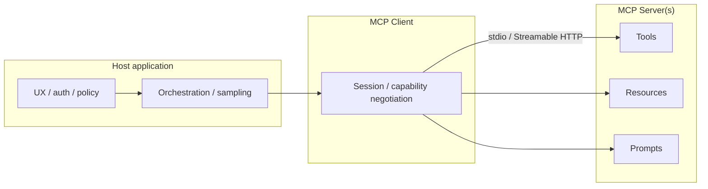

# Module 08 — Model Context Protocol (MCP)

**Time:** 3–5 days · **Depends on:** [Tools & RAG](07-tools-and-rag.md) · **Next:** [Advanced RAG](09-advanced-rag.md)

<span data-module-id="08" hidden></span>

## Learning objectives

- Define **MCP** correctly: Anthropic-originated open standard for connecting AI apps to **tools**, **resources**, and **prompts**
- Explain **host / client / server** roles and transports at a systems level
- Contrast **MCP servers** with **in-process tools** (Module 07)
- Apply a **security bar** for third-party MCP servers (supply chain, scope, approvals)
- Know that MCP is **not** a multi-model load balancer

## Why this matters (CS engineer view)

<div class="aieng-story" markdown>

An engineer installs a trendy “productivity” MCP server from a public list so the IDE can “see the monorepo.” Auto-approve is on. By lunch the server has listed `~/.ssh`, read `.env`, and shipped a “helpful summary” of secrets into the model context — which then lands in provider logs. Nobody wrote malware. They plugged a **peripheral** into the host without a permission model. Same day, a PM deck still labels MCP as “our multi-model load balancer.” Two confusions, one theme: **protocol without host policy is just a nicer way to run untrusted code**.

</div>

Without a shared protocol, every IDE, desktop agent, and chat host reinvents connectors: one filesystem integration for App A, another for App B, N auth stories, N schema formats. That is classic **N×M integration** cost.

**Model Context Protocol (MCP)** standardizes how hosts discover and call external capabilities so the same server can plug into multiple clients. For engineers, MCP is an **interface and process boundary** problem — closer to LSP (Language Server Protocol) for tools/context than to “another prompt trick.”

!!! important "Correct definition (industry)"
    **MCP** is an open standard—originating from Anthropic and now broadly adopted—for connecting AI applications (hosts/clients) to external **tools**, **resources**, and **prompts** via MCP servers.

    It is **not** a multi-model load balancer. Routing and load balancing belong in [Production](13-production.md) and [Integration patterns](16-integration-patterns.md). Earlier course drafts mislabeled those topics as MCP; that error is corrected here.

Primary reference: [modelcontextprotocol.io](https://modelcontextprotocol.io/)

## Mental model



| Role | Responsibility | Examples |
|------|----------------|----------|
| **Host** | UX, user auth, orchestration, approval UI | Claude Desktop, VS Code / Cursor-style hosts, your agent product |
| **Client** | Protocol session with one or more servers | Embedded MCP client library in the host |
| **Server** | Exposes tools, resources, prompts | Filesystem, git, DB, internal ticket API |

Capability types:

| Type | Meaning | Example |
|------|---------|---------|
| **Tools** | Invocable actions (often side-effecting) | `search_issues`, `run_query` |
| **Resources** | Readable data blobs / URIs | `file://...`, `db://schema` |
| **Prompts** | Reusable prompt templates from the server | “Commit message helper” template |

<div class="aieng-intuition" markdown>
<p class="label">Intuition lock</p>

**Sticky picture:** MCP is **USB-C for AI tools**. The **host** is the OS (auth, UX, “do you allow this device?”). **Servers** are peripherals (filesystem, tickets, git). The cable standard does not make a malicious USB stick safe — and it is **not** a multi-model load balancer.

<div class="kill" markdown>
**Kill this idea:** “MCP routes GPT vs Claude” or “MCP means the model is secure.” → **Replace with:** MCP standardizes how hosts discover/call tools, resources, and prompts; **policy and routing stay in the host** (and in Modules 10/13/16).
</div>
</div>

## Core tutorial

### 1. Why MCP exists

Before MCP (and similar standards), each agent host shipped bespoke plugins. Costs:

- Duplicate schema definitions per host  
- Inconsistent auth and logging  
- No shared discovery story for tools/resources  

MCP aims to make the **tool boundary model-agnostic**: swap models or hosts without rewriting every connector. Your internal `acme-tickets` server can serve both a desktop assistant and a CI agent (with different host policies).

<div class="aieng-explainer" markdown>
<p class="label">Explainer</p>

**Protocol vs product.** MCP specifies how hosts and servers talk about capabilities. It does not replace your product’s authn/z, multi-tenant isolation, or eval suite. A secure host can still make unsafe product choices (auto-approve `rm -rf`). Treat MCP as plumbing; **policy stays in the host**.
</div>

### 2. End-to-end call flow

Conceptual sequence (details evolve — read the live spec):

```text
1. Host starts / connects MCP client to server (stdio subprocess or Streamable HTTP; older docs mention HTTP+SSE — prefer the current spec)
2. Client and server negotiate protocol version & capabilities
3. Client lists tools / resources / prompts
4. Model (via host) selects a tool + arguments
5. Host applies policy (allow / deny / ask user)
6. Client invokes tool on server
7. Server returns result
8. Host inserts result into model context (Module 05 packing still applies!)
```

MCP does **not** remove the need for context engineering: tool results still consume tokens and can drown instructions.

### 3. Relation to Module 07 in-process tools

| Module 07 tools | MCP tools |
|-----------------|-----------|
| In-process Python (or same runtime) functions | Out-of-process servers, reusable across hosts |
| App-specific wiring | Shareable across IDE, desktop, agents |
| You own the entire loop | Host may own sampling + UI approvals |
| Fastest path for a single app | Best when portability / ecosystem connectors matter |

**Rule of thumb:**

- **In-process tools** — simple products, tight latency, single deployable  
- **MCP** — portable connectors, IDE integration, multi-host reuse, clear process isolation  

You can use both: core product tools in-process; optional editor integrations via MCP.

<div class="aieng-think" markdown>
<p class="label">Think about it</p>

**Question:** Your team already has a solid in-process `get_ticket` tool in a FastAPI agent. When would you wrap the same backend as an MCP server?

<details data-think-id="08-t1"><summary>Reveal a strong answer</summary>

When a **second host** needs the same capability (e.g. IDE assistant + web agent), or when you want process isolation and standardized discovery without shipping your Python functions into every client. If there is only one host and no reuse, in-process is simpler — do not protocol for protocol’s sake.
</details>
</div>

### 4. Conceptual custom tool server

Pseudocode — use official MCP SDKs (Python / TypeScript / etc.) for real servers; APIs change with the spec.

```python
# Conceptual — follow current MCP SDK docs for real servers
"""
Server name: acme-tickets
Tools:
  - list_tickets(status: open|closed) -> list[Ticket]
  - get_ticket(id: str) -> Ticket
Resources:
  - ticket://{id}
"""

def list_tickets(status: str = "open") -> list[dict]:
    # query internal API with service credentials — never with raw user tokens blindly
    return [{"id": "T-1", "title": "Login timeout", "status": status}]

def get_ticket(ticket_id: str) -> dict:
    return {"id": ticket_id, "title": "Login timeout", "status": "open"}
```

Hosts list tools → model selects tool + args → host/client invokes server → result returns to model context.

Resources differ from tools: they are often **read** as context (file contents, schemas) rather than “actions.” Prompts package reusable instruction templates distributed with the server.

### 5. Security model (non-negotiable)

MCP servers can be as powerful as **local code execution**. Installing a random server is closer to installing a binary than to adding a pure npm types package.

| Risk | Control |
|------|---------|
| Malicious server | Install only reviewed sources; pin versions; prefer internal registry in prod |
| Over-broad filesystem | Scope roots; read-only where possible |
| Secret exfiltration | Host approval for tool calls; redact logs; least-privilege credentials |
| Confused deputy | Per-tenant credentials; never share end-user tokens blindly with servers |
| Supply chain | Lockfiles; SBOM; signed artifacts where available |
| Prompt injection via resources | Treat resource text as untrusted data (Module 02 / 07) |

**Human-in-the-loop** for destructive tools (delete, pay, email send, production writes).

Host policy examples:

```text
dev laptop:  filesystem (repo root only), git read, tickets read
CI:          no filesystem write; tickets read-only; no browser tools
prod agent:  internal MCP only; all writes require approval ticket id
```

<div class="aieng-explainer" markdown>
<p class="label">Explainer</p>

**USB-C is not antivirus.** The protocol only standardizes discovery and invocation. Every dangerous capability still needs host-side gates: which servers may connect, which tools auto-run, which args are scrubbed, which results enter the model window. A “read-only” resource that returns a 2MB paste of production dumps is still a context and privacy incident. Scope the **peripheral**, then scope what the **OS** allows it to do.
</div>

<div class="aieng-quiz" data-quiz-id="08-q1" data-xp="25" data-success="Correct — MCP is the tools/resources/prompts protocol, not model routing." data-fail="MCP ≠ load balancer. Routing lives in production/integration modules." markdown>
<p class="label">Quiz · +25 XP</p>
<p class="quiz-prompt">Which definition of MCP is correct?</p>
<div class="quiz-options">
<button type="button" class="quiz-opt" data-correct="false">A multi-model load balancer that picks GPT vs Claude per request</button>
<button type="button" class="quiz-opt" data-correct="true">An open standard for connecting AI hosts/clients to external tools, resources, and prompts via servers</button>
<button type="button" class="quiz-opt" data-correct="false">A fine-tuning format for chat JSONL datasets</button>
<button type="button" class="quiz-opt" data-correct="false">A vector database wire protocol replacing FAISS</button>
</div>
<p class="quiz-feedback"></p>
</div>

### 6. Multi-model routing (not MCP)

Still important — just correctly named. Keep it out of your MCP mental model:

```python
def route_model(task: str) -> str:
    if task in {"classify", "extract"}:
        return "small-fast-model"  # API id or local SLM
    if task == "deep_reason":
        return "large-reasoner"
    return "default-mid"
```

See Module 10 (cost) and 13 (production) for caching, fallbacks, and load shedding. MCP may *supply tools* to whichever model you routed to; it does not *perform* the routing.

<div class="aieng-think" markdown>
<p class="label">Think about it</p>

**Question:** A slide says “we use MCP to pick Claude for hard tasks and a mini model for extract.” What two systems did they conflate, and where does each live?

<details data-think-id="08-t3"><summary>Reveal a strong answer</summary>

They conflated **tool/context plumbing** (MCP: host ↔ servers for tools/resources/prompts) with **model routing** (which model id receives the sampling call). Routing lives in your app / gateway (Modules 10, 13, 16). MCP may expose the *same* ticket tools to either model after you route; it does not choose the model. Rename the slide before it becomes architecture.
</details>
</div>

### 7. Operational checklist for teams

- [ ] Inventory approved MCP servers (name, version, owner, risk tier)  
- [ ] Separate allowlists for **dev / CI / prod**  
- [ ] Document which tools are auto-run vs approval-required  
- [ ] Log tool name, arg hash, user/tenant, success/failure  
- [ ] Incident plan: revoke server, rotate credentials, disable host integration  

## Common failure modes

| Symptom | Likely cause | Fix |
|---------|--------------|-----|
| “MCP = load balancer” confusion | Outdated internal docs | Use this module’s definition; rename routing docs |
| Shadow IT servers on laptops | No inventory | Approved list + install policy |
| Token blow-ups after MCP | Unbounded resource reads | Cap resource size; summarize (Module 05) |
| Secrets in tool results | Server returns env dumps | Redact; scope tools; never log raw |
| Works in IDE, fails in prod agent | Different hosts/policies | Explicit env matrix |
| Over-protocolization | MCP for a single in-app function | Prefer Module 07 in-process tools |

## Lab

<div class="aieng-lab" markdown>
<p class="label">Lab · Dev-only MCP reconnaissance</p>

**Goal:** Use MCP safely as a consumer, then write policy.

1. Read the current overview/spec at [modelcontextprotocol.io](https://modelcontextprotocol.io/).
2. In a **dev-only** host (not production credentials), install a **reputable** filesystem or git MCP server from a reviewed source.
3. List tools and resources the server exposes. Perform **one read-only** operation (e.g. list files under a sandbox directory).
4. Write a short policy doc (`mcp-policy.md` in your notes — not required in this repo):
   - Servers allowed on laptop vs CI vs prod  
   - Tools that require human approval  
   - Version pinning and update process  
5. **Stretch:** Sketch (or implement with the official SDK) a tiny read-only MCP server wrapping one internal HTTP GET you already trust. Do not expose shell.
</div>

## Knowledge check

<div class="aieng-quiz" data-quiz-id="08-q2" data-xp="25" data-success="Yes — tools act, resources read, prompts template." data-fail="Revisit capability types: tools vs resources vs prompts." markdown>
<p class="label">Quiz · +25 XP</p>
<p class="quiz-prompt">In MCP, which capability is best for “read the contents of ticket://T-1 as context”?</p>
<div class="quiz-options">
<button type="button" class="quiz-opt" data-correct="false">Only a prompt template</button>
<button type="button" class="quiz-opt" data-correct="true">A resource (and/or a read-only tool, depending on design)</button>
<button type="button" class="quiz-opt" data-correct="false">Model fine-tuning on that ticket</button>
<button type="button" class="quiz-opt" data-correct="false">A load balancer weight</button>
</div>
<p class="quiz-feedback"></p>
</div>

<div class="aieng-quiz" data-quiz-id="08-q3" data-xp="25" data-success="Correct — third-party servers need the same distrust as untrusted binaries." data-fail="Security is a first-class host responsibility for MCP." markdown>
<p class="label">Quiz · +25 XP</p>
<p class="quiz-prompt">What is the strongest default stance toward a new third-party MCP server?</p>
<div class="quiz-options">
<button type="button" class="quiz-opt" data-correct="false">Install immediately — the protocol guarantees safety</button>
<button type="button" class="quiz-opt" data-correct="true">Treat it like untrusted code: review source, pin version, scope permissions, require approvals for dangerous tools</button>
<button type="button" class="quiz-opt" data-correct="false">Only worry if it uses HTTP instead of stdio</button>
<button type="button" class="quiz-opt" data-correct="false">Trust any server listed in a public registry without review</button>
</div>
<p class="quiz-feedback"></p>
</div>

<div class="aieng-think" markdown>
<p class="label">Think about it</p>

**Question:** How does MCP interact with context packing when a filesystem server returns a 200k-token file?

<details data-think-id="08-t2"><summary>Reveal a strong answer</summary>

The host must still enforce budgets: refuse oversized reads, truncate, or summarize before the model call. MCP delivers capabilities; **Module 05 packing** decides what enters the window. Unlimited resource injection is a product bug, not a protocol feature to embrace blindly.
</details>
</div>

## Open source materials

1. [Model Context Protocol — official site & spec](https://modelcontextprotocol.io/) — **primary**  
2. [MCP GitHub organization / servers & SDKs](https://github.com/modelcontextprotocol) — reference servers and SDKs (verify before install)  
3. Anthropic / ecosystem docs on MCP hosts — how desktop and API products attach servers  
4. Module 07 course patterns: in-process tools for comparison ([Tools & RAG](07-tools-and-rag.md))  
5. Module 02 threat model: injection and tool abuse ([Security](02-security-privacy.md))  
6. Supply-chain hygiene: pin versions, private registries, SBOM practices for any executable connector  

## Checkpoint

- [ ] You can define MCP **without** saying “load balancer”  
- [ ] You can name host, client, and server responsibilities  
- [ ] You know tools vs resources vs prompts  
- [ ] You have a security bar for third-party servers (dev vs prod)  
- [ ] You know when to stay with in-process tools instead  

<div class="aieng-complete" data-module-id="08" data-xp="120" markdown>
<p>When the definition, architecture, and security policy are clear in your notes, mark complete.</p>
<button type="button">Complete module · +120 XP</button>
</div>

**Next:** [Module 09 — Advanced RAG](09-advanced-rag.md)
