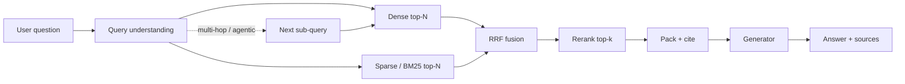

# Module 09 — Advanced RAG & Knowledge Systems

**Time:** 7–10 days · **Depends on:** [07 Tools & RAG](07-tools-and-rag.md) · **Pairs with:** [08 MCP](08-model-context-protocol.md) if retrieval is exposed as a server · **Next:** [Cost optimization](10-cost-optimization.md)

<span data-module-id="09" hidden></span>

---

## Learning objectives

By the end of this module you will be able to:

- Diagnose **why** naive top-k dense retrieval fails on real corpora
- Build **hybrid** retrieval (BM25 + dense) fused with **Reciprocal Rank Fusion (RRF)**
- Apply **cross-encoder reranking** after a cheap first-stage retrieve
- Design **hierarchical** indices (doc → section → span) and **agentic** multi-step retrieval
- Evaluate retrieval and generation **separately** (Hit@k, MRR, faithfulness, context precision)

---

## Why this matters (CS engineer)

<div class="aieng-story" markdown>

Ops bot answers “what does `ERR_INV_88421` mean?” with a confident essay about inventory philosophy. The gold runbook title *is* `ERR_INV_88421` — never retrieved. Dense-only search mapped the question to “inventory errors” prose and missed the rare token. Support escalates. Team “fixes quality” by switching to a larger generator. Bill goes up. Hit@5 stays flat. The crime scene was **retrieval**, not eloquence.

</div>

Basic RAG is a vector nearest-neighbor lookup plus a prompt. Production RAG is closer to a **search system**: inverted indices, multi-stage ranking, query understanding, freshness, and offline metrics.

If you treat embeddings as magic:

- SKU codes, error IDs, and proper nouns miss because dense models blur rare tokens  
- Multi-hop questions (“compare policy A with the exception in B”) need **multiple** retrieves  
- You optimize the LLM when the gold document never entered the context  

Your job is the **information path**: query → candidates → ranking → packing → generation → attribution. Generation quality is capped by what that path delivers.

---

## Mental model



**First stage** optimizes *recall* (get the right docs in a shortlist).  
**Second stage** optimizes *precision* (put the best spans in the window).  
**Generation** should only *compose* what retrieval already supports.

<div class="aieng-intuition" markdown>
<p class="label">Intuition lock</p>

**Sticky picture:** Hybrid search is **keyword cop + semantic cop** on the same case — one chases exact IDs, the other chases paraphrase. **RRF fuses rankings, not scores** (you don’t average Fahrenheit and Celsius). **Agentic RAG** is a detective with a **step budget**, not an infinite coffee tab.

<div class="kill" markdown>
**Kill this idea:** “Better embeddings (or a bigger LLM) fix all RAG failures.” → **Replace with:** Diagnose the path — sparse miss, bad chunk, packing drop, multi-hop need, or generator ignoring context — and measure retrieval separately from generation.
</div>
</div>

---

## Core tutorial

### 1. Failure modes of basic RAG (start here)

| Symptom | Likely cause | Direction |
|---------|--------------|-----------|
| Misses keyword SKUs / IDs | Dense-only; rare tokens | Hybrid BM25 + dense |
| Right doc, wrong span | Chunks too big or overlapping poorly | Smaller / structure-aware chunks + rerank |
| Multi-hop fails | One-shot query | Decomposition / agentic loop |
| Contradictory sources | No time/version filter | Metadata filters + conflict-aware prompt |
| Stale answers | Index drift | Freshness TTL, re-embed policy |
| Fluent wrong answer | No faithfulness gate | Cite + verify against context |

Naive pipeline from Module 07:

```text
embed(query) → top-k cosine → stuff chunks → LLM
```

That is a good lab baseline and a bad production default.

<div class="aieng-explainer" markdown>
<p class="label">Explainer</p>

**Embeddings recap (from Module 07):** a dense retriever embeds the query and each chunk independently (**bi-encoder**) so you can precompute document vectors and search with nearest-neighbor. Nearby vectors mean *semantic* closeness, not shared keywords. BM25 scores *term* match with IDF weighting. Product codes (`INV-88421`) and stack traces are high-IDF; dense models often under-weight them. Hybrid search is not “enterprise theater” — it is covering two different failure modes with two rankers.

A **cross-encoder** (rerank stage) reads query and passage *together*. It is slower and cannot precompute the whole corpus, which is why it only sees a shortlist.

</div>

---

### 2. Query understanding before you retrieve

Do not embed the raw user string blindly. Transform the query into something the index can hit.

**Decompose** multi-part questions:

```python
import json

DECOMPOSE = """
Break the user question into independent search queries.
Return JSON only:
{{"queries": ["...", "..."], "needs_multi_hop": bool}}

Question: {q}
"""

def parse_queries(model_json: str) -> list[str]:
    data = json.loads(model_json)
    return list(data.get("queries") or [])
```

Other useful rewrites:

| Technique | Idea | When |
|-----------|------|------|
| **HyDE** | LLM writes a *hypothetical* answer; embed that | Vague questions, short queries |
| **Step-back** | Ask a more general question first | Policy / conceptual retrieval |
| **Expand synonyms** | Domain glossary expansion | Vertical jargon |
| **Filter extract** | Pull `product=`, `date>` from natural language | Structured metadata exists |

Always log the **rewritten** queries. Eval failures often come from bad rewrites, not bad embeddings.

<div class="aieng-think" markdown>
<p class="label">Think about it</p>

**Question:** A user asks: “Did the 2024 refund policy change the 30-day window that applied to enterprise SKUs last year?” How many retrievals do you need, and what goes wrong if you only retrieve once?

<details data-think-id="09-t1"><summary>Reveal a strong answer</summary>

At least two conceptual hops: (1) 2024 refund policy text for the new window, (2) prior enterprise SKU policy / 30-day rule. A single embedding of the full sentence may land near one policy doc and miss the other. Decomposition into “2024 refund policy window” + “enterprise SKU return window 2023” (plus a filter on product tier if available) raises the chance both sources enter the context so the model can *compare* rather than invent.

</details>
</div>

---

### 3. Hybrid search: dense + sparse

**Dense path:** embedding model → ANN index (FAISS, Qdrant, Pinecone, pgvector).  
**Sparse path:** BM25 / Elasticsearch / OpenSearch / sparse vectors (SPLADE-style).

```text
query → dense top-N  ─┐
                      ├→ fuse → shortlist
query → sparse top-N ─┘
```

Sketch (IDs only — swap in real scorers):

```python
def dense_top(query: str, n: int = 50) -> list[str]:
    ...  # ANN over embeddings

def bm25_top(query: str, n: int = 50) -> list[str]:
    ...  # inverted index

def hybrid_candidates(query: str, n: int = 50) -> list[str]:
    return rrf([dense_top(query, n), bm25_top(query, n)])
```

This repo ships RRF in `src.rag`:

```python
from src.rag import rrf

fused = rrf(
    [
        ["docA", "docB", "docC"],  # dense ranks
        ["docC", "docA", "docD"],  # bm25 ranks
    ],
    k=60,
)
# docs that rank well in *either* list rise; agreement boosts further
```

---

### 4. Reciprocal Rank Fusion (why not just average scores?)

Different retrievers produce **incomparable** scores (cosine vs BM25). RRF ignores raw scores and uses ranks:

\[
\mathrm{RRF}(d) = \sum_{r \in R} \frac{1}{k + \mathrm{rank}_r(d)}
\]

- \(k\) (commonly 60) damps the top ranks so a #1 on one list does not dominate forever  
- Missing from a list ⇒ that list contributes 0  
- No score calibration needed  

```python
def rrf(rank_lists: list[list[str]], k: int = 60) -> list[str]:
    scores: dict[str, float] = {}
    for ranks in rank_lists:
        for i, doc_id in enumerate(ranks):
            scores[doc_id] = scores.get(doc_id, 0.0) + 1.0 / (k + i + 1)
    return [d for d, _ in sorted(scores.items(), key=lambda x: x[1], reverse=True)]
```

**Weighted RRF** (multiply a list’s contribution by \(w\)) is fine once you have offline Hit@k data. Do not invent weights without a labeled set.

<div class="aieng-explainer" markdown>
<p class="label">Explainer</p>

**Why ranks, not scores?** Cosine 0.82 and BM25 12.4 are not comparable — calibrating them is a research project. Rank position *is* comparable: “this doc was #3 for dense and #1 for BM25.” RRF is a cheap agreement vote. If you min-max both score lists into \([0,1]\) without offline labels, you are inventing a fusion that only looks scientific.
</div>

---

### 5. Reranking (second stage)

Cross-encoders score `(query, passage)` jointly. They are **too slow** for millions of docs, perfect for top 50 → top 5.

```text
hybrid shortlist (50) → cross-encoder scores → keep top 5–8 → LLM
```

```python
def rerank(query: str, passages: list[tuple[str, str]], top_k: int = 5):
    """passages: list of (id, text). score_fn is a cross-encoder or API."""
    scored = [(pid, score_fn(query, text)) for pid, text in passages]
    scored.sort(key=lambda x: x[1], reverse=True)
    return scored[:top_k]
```

Options: `sentence-transformers` cross-encoders, Cohere/Jina/Voyage rerank APIs, or a small local model. Measure **latency budget**: rerank should fit inside your p95, not only the happy path.

<div class="aieng-explainer" markdown>
<p class="label">Explainer</p>

Bi-encoders (dense retrieval) embed query and doc **independently** so you can precompute doc vectors. Cross-encoders see both texts at once — higher quality, no ANN precompute. Classic IR cascade: cheap broad recall → expensive precise ranking. Skipping the cascade either explodes cost or tanks quality.

</div>

---

### 6. Hierarchical RAG

Index at multiple granularities:

1. **Doc-level** summaries — route *which* documents matter  
2. **Section-level** chunks — main context for the LLM  
3. **Sentence / span** — precise citations and table cells  

```text
query → retrieve summaries → open top documents
      → retrieve fine chunks *only inside* those docs
      → optional span extract for citations
```

Benefits:

- Less noise (global top-k from a huge corpus mixes unrelated domains)  
- Better parent context (section headers survive)  
- Cheaper fine retrieval when constrained to a doc set  

Implementation tip: store `parent_id` / `doc_id` metadata on every chunk; never drop it in the vector payload.

---

### 7. Graph-oriented retrieval (when relationships matter)

Use entity/graph structure when questions are about **edges**, not bags of text:

- “Who owns service X and what depends on it?”  
- “Which tickets share root cause entity Y?”  

Pattern:

1. Entity-link the query (`service:X`)  
2. Traverse 1–2 hops in a graph or join table  
3. Pull text chunks for the resulting node set  
4. Generate with those chunks  

Start with an **entity linking table** + SQL/Cypher before a full GraphRAG product. Graphs help structure; vectors still help language.

---

### 8. Agentic RAG

When one retrieve is not enough, wrap retrieval in a **bounded loop**:

```text
while not done and steps < limit:
  plan next info need
  retrieve / tool call
  critique: is evidence sufficient?
  answer or continue
```

```python
def agentic_answer(question: str, retrieve, llm, max_steps: int = 4) -> str:
    notes: list[str] = []
    for step in range(max_steps):
        plan = llm(
            f"Goal: {question}\nNotes:\n{notes}\n"
            "Return JSON: {\"action\":\"search|answer\","
            "\"query\":str|null,\"draft\":str|null}"
        )
        # parse plan ...
        if action == "answer":
            return draft
        hits = retrieve(query, k=5)
        notes.append(f"Q: {query}\n" + "\n".join(hits))
    return llm(f"Answer with available notes only:\n{notes}\nQ: {question}")
```

Hard rules (same spirit as Module 11 agents):

- Cap steps and total retrieved tokens  
- Log every query + hit IDs for offline eval  
- Prefer “I don’t know” over another expensive hop when notes are empty  

Agentic RAG **multiplies cost**. Gate it: only when a cheap single-shot retrieve scores low confidence or the query is classified multi-hop.

<div class="aieng-think" markdown>
<p class="label">Think about it</p>

**Question:** Your agentic RAG loop has `max_steps=8` and no memory of prior queries. On step 3–7 it re-embeds the same paraphrase of the original question and re-pulls the same empty shortlist. What two controls stop this class of burn?

<details data-think-id="09-t3"><summary>Reveal a strong answer</summary>

(1) **Repeated-query abort** (normalize query text / embedding near-duplicates) so thrash ends after 1–2 identical retrieves. (2) **Early exit on empty evidence** — if notes stay empty, answer “I don’t know” or escalate instead of spending remaining steps. Bonus: cache retrieve(query)→ids, lower max_steps for single-fact classifiers, and log intermediate queries so offline eval can see the loop.
</details>
</div>

---

### 9. Packing context for the generator

Retrieval quality dies in packing if you:

- Dump 20 near-duplicate chunks  
- Exceed the window so system instructions get truncated  
- Omit source IDs the model cannot cite  

Good packing:

1. Deduplicate near-identical text (hash / embedding similarity)  
2. Enforce a **token budget** (Module 05) — e.g. 2–4k tokens of evidence  
3. Preserve structure: title, section, chunk id  
4. Instruct: *answer only from sources; cite ids; refuse if insufficient*

```python
def pack(chunks: list[tuple[str, str]], budget_chars: int = 12_000) -> str:
    out, used = [], 0
    for cid, text in chunks:
        block = f"[{cid}]\n{text}\n"
        if used + len(block) > budget_chars:
            break
        out.append(block)
        used += len(block)
    return "\n".join(out)
```

---

### 10. Evaluation: measure the path, not the vibes

Split metrics:

| Layer | Metric | Meaning |
|-------|--------|---------|
| Retrieval | **Hit@k** / Recall@k | Gold doc id appears in top-k? |
| Retrieval | **MRR** | \(1/\mathrm{rank}\) of first relevant |
| Retrieval | **nDCG@k** | Graded relevance ranking quality |
| Context | **Context precision** | Fraction of packed chunks that are useful |
| Generation | **Faithfulness** | Claims supported by provided context? |
| Generation | **Answer relevance** | On-topic vs the question? |

```python
def hit_at_k(retrieved_ids: list[str], gold_ids: set[str], k: int) -> float:
    return float(bool(gold_ids & set(retrieved_ids[:k])))

def mrr(retrieved_ids: list[str], gold_ids: set[str]) -> float:
    for i, doc_id in enumerate(retrieved_ids, start=1):
        if doc_id in gold_ids:
            return 1.0 / i
    return 0.0
```

Build a labeled set: `(question, must_have_doc_ids, optional gold_answer)`.  
Run **retrieval eval** without calling the LLM when iterating on hybrid/RRF/rerank.  
Use LLM-as-judge *only* for faithfulness/relevance with a fixed rubric (Module 04), and spot-check humans.

Ecosystem: **RAGAS**, **promptfoo**, **DeepEval**, Langfuse experiments.

<div class="aieng-think" markdown>
<p class="label">Think about it</p>

**Question:** Hit@5 improved from 0.55 → 0.78 after hybrid+RRF, but user-rated answer quality barely moved. What might still be broken?

<details data-think-id="09-t2"><summary>Reveal a strong answer</summary>

Retrieval now finds the right docs, but generation may still fail: wrong span inside the doc (need rerank / smaller chunks), packing drops the gold chunk (budget / dedupe bug), prompt does not force citation grounding, or the gold answer requires multi-hop synthesis the single-shot prompt cannot do. Also check faithfulness: the model may ignore context. Fix by measuring context precision and faithfulness separately, then inspect a few failure traces end-to-end.

</details>
</div>

---

### 11. Multimodal and document structure notes

- **PDFs:** use layout-aware parsers; keep tables as tables, not garbled line soup  
- **Images:** caption-then-embed or vision embeddings; store modality in metadata  
- **Code:** chunk by symbol / AST, not fixed 500-char windows  
- Never mix incompatible embedding spaces without an explicit routing plan  

---

## Failure modes (advanced RAG)

| Symptom | Likely root cause | Fix |
|---------|-------------------|-----|
| Hybrid worse than dense alone | Bad fusion / noisy BM25 corpus | Tune N; filter stopwordy fields; weight lists from eval |
| Reranker slow / timeouts | Scoring 200+ passages | Cap shortlist; batch; smaller cross-encoder |
| Agentic loop burns $ | No step budget / thrashing queries | max_steps, repeated-query abort, cache |
| High Hit@k, low faithfulness | Generator ignores context | Stronger cite prompt; post-hoc claim check |
| Citations hallucinated | Free-form ids | Constrain to provided id set; validate like `TinyRAG.validate_citations` |
| Index stale after deploys | No ingestion versioning | Content hash, re-embed changed docs only |

---

## Lab

**Goal:** Prove hybrid + fusion beats dense-only on a small labeled set.

1. Take 5–10 of your own notes / READMEs (Module 07 corpus is fine).  
2. Write **20 questions** with `must_have` chunk or doc ids (include 5 keyword/ID questions and 5 multi-hop).  
3. Implement or mock:
   - dense ranks  
   - keyword/BM25 ranks  
   - `rrf` from `src.rag`  
4. Report **Hit@5** and **MRR** for dense-only vs hybrid.  
5. Optional: add a tiny rerank (even a lexical overlap score) and show delta.  
6. For 5 multi-hop items, run a 2-step decompose → retrieve → answer; log intermediate queries.

```bash
# sanity: RRF unit behavior lives next to TinyRAG
poetry run pytest tests/test_rag.py -v
```

**Stretch:** hierarchical parent filter — retrieve doc summaries first, then only child chunks of top docs.

---

## Quizzes

<div class="aieng-quiz" data-quiz-id="09-q1" data-xp="25" data-success="Correct — ranks are comparable across heterogeneous scorers." data-fail="Re-read the RRF section: we fuse ranks, not raw cosine/BM25 scores." markdown>
<p class="label">Quiz · +25 XP</p>
<p class="quiz-prompt">Why is Reciprocal Rank Fusion preferred over averaging dense cosine scores with BM25 scores?</p>
<div class="quiz-options">
<button type="button" class="quiz-opt" data-correct="false">RRF always finds more documents than either list alone</button>
<button type="button" class="quiz-opt" data-correct="true">Raw scores from different retrievers are not on a shared scale; ranks are</button>
<button type="button" class="quiz-opt" data-correct="false">BM25 scores are probabilities and must be multiplied by cosine</button>
<button type="button" class="quiz-opt" data-correct="false">Cross-encoders require RRF as a mathematical precondition</button>
</div>
<p class="quiz-feedback"></p>
</div>

<div class="aieng-quiz" data-quiz-id="09-q2" data-xp="25" data-success="Yes — retrieval and generation fail for different reasons." data-fail="Think about which stage puts the gold document into the window." markdown>
<p class="label">Quiz · +25 XP</p>
<p class="quiz-prompt">You change only the embedding model. Which metric should move first if the change is good?</p>
<div class="quiz-options">
<button type="button" class="quiz-opt" data-correct="false">BLEU on the final answer string</button>
<button type="button" class="quiz-opt" data-correct="true">Hit@k / MRR on a labeled retrieval set</button>
<button type="button" class="quiz-opt" data-correct="false">GPU utilization of the generator</button>
<button type="button" class="quiz-opt" data-correct="false">Average output tokens per response</button>
</div>
<p class="quiz-feedback"></p>
</div>

<div class="aieng-quiz" data-quiz-id="09-q3" data-xp="25" data-success="Agentic multiplies retrieves — use budgets." data-fail="Re-read Agentic RAG hard rules." markdown>
<p class="label">Quiz · +25 XP</p>
<p class="quiz-prompt">When is agentic (multi-step) RAG the wrong default?</p>
<div class="quiz-options">
<button type="button" class="quiz-opt" data-correct="false">When questions require comparing two policies</button>
<button type="button" class="quiz-opt" data-correct="true">When most queries are single-fact lookups and cost/latency budgets are tight</button>
<button type="button" class="quiz-opt" data-correct="false">When you already have a cross-encoder</button>
<button type="button" class="quiz-opt" data-correct="false">When Hit@k is already measured offline</button>
</div>
<p class="quiz-feedback"></p>
</div>

---

## Open source materials

| Resource | Use it for |
|----------|------------|
| [mlabonne/llm-course](https://github.com/mlabonne/llm-course) | RAG engineer path context |
| [RAGAS](https://github.com/explodinggradients/ragas) | Faithfulness / context metrics |
| [FAISS](https://github.com/facebookresearch/faiss) · [Qdrant](https://qdrant.tech/documentation/) · [Chroma](https://docs.trychroma.com/) | Vector indices |
| [huggingface/agents-course](https://github.com/huggingface/agents-course) | Agentic retrieval patterns |
| Sentence-transformers docs | Bi-encoders + cross-encoders |
| Course `src/rag.py` | `rrf`, `TinyRAG` teaching baseline |

Also: [Curated resources](../reference/resources.md) → RAG & embeddings.

---

## Checkpoint

- [ ] You can explain hybrid search + RRF in one clear paragraph  
- [ ] You rerank or fuse — not only single-vector top-k  
- [ ] You measure **retrieval** (Hit@k / MRR) separately from generation  
- [ ] Multi-hop path has a **step budget** and logged intermediate queries  
- [ ] Citations are constrained to retrieved ids  

---

<div class="aieng-complete" data-module-id="09" data-xp="120" markdown>
<p>Mark complete when you have run a Hit@k comparison (dense vs hybrid) on a small labeled set and can defend your fusion/rerank choices.</p>
<button type="button">Complete module · +120 XP</button>
</div>

**Next:** [Module 10 — Cost optimization](10-cost-optimization.md)
