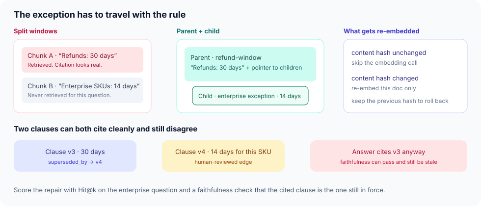
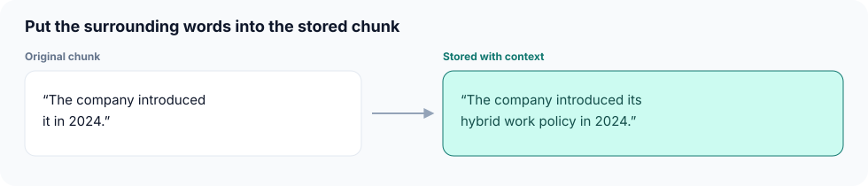

# Corpus engineering

**Time:** about half a day · **Depends on:** [07 Tools & RAG](07-tools-and-rag.md), [09 Advanced RAG](09-advanced-rag.md) · **Next:** [Module 09](09-advanced-rag.md)

**Part of:** [Module 09](09-advanced-rag.md). The Hit@k lab, the checkpoint, and EX-09 stay on the parent page. This page does not add a module.

---

<span id="why-this-matters-cs-engineer-view"></span>

<div class="aieng-story" markdown>

*Fictional teaching scenario.*

The refund policy is one PDF page. The first paragraph says 30 days. The second says enterprise SKUs get 14. Fixed-size chunks put those sentences in different vectors. A customer on an enterprise SKU asks about a refund. Hybrid search returns chunk A, the citation resolves, faithfulness looks fine, and the answer is wrong for this customer. A week later legal replaces the PDF. The index still serves the old vectors because nothing in the pipeline knows the bytes changed.

</div>

**Case question:** Which chunk structure, hash, and disagreement rule would have made the 14-day exception retrievable and the stale clause unmistakable?

## Learning objectives

- Keep an exception attached to the rule it modifies
- Add a parent prefix to a child chunk when the labeled miss is in the vector
- Re-embed a document only when its content hash changes, and keep the previous hash for rollback
- Treat two cited clauses that disagree as a corpus defect, not as a generator failure
- Measure the repair with the same Hit@k and faithfulness split as Module 09

{ .course-figure }

<p class="course-caption">Left: the 14-day exception is a different vector, so the cite looks legitimate and the answer is wrong. Center: the child rides with the parent. Right: only a changed hash pays for a new embedding.</p>

<div class="aieng-intuition" markdown>
<p class="label">Intuition lock</p>

**Sticky picture:** A policy page is a **folder, not a confetti pile**. The folder has a hash on the cover. The exception is stapled to the rule. When legal ships a new folder, you re-embed that folder and you still have the old cover if you need to roll back.

<div class="kill" markdown>
**Kill this idea:** “The retriever is the knowledge base.” → **Replace with:** The retriever searches whatever you indexed. Chunk boundaries, hashes, and retired clauses are the knowledge base.
</div>
</div>

---

## Parent, child, hash

Module 09 already says to store `parent_id` and `doc_id` on every chunk. This is the pipeline that produces those ids.

1. Parse layout-aware. A table stays a table. A heading stays above the paragraphs it owns.
2. Emit one parent chunk per rule (the heading plus the body that states the rule).
3. Emit a child chunk for each exception, example, or table, with `parent_id` set.
4. Retrieval may return the child. Packing always includes the parent, inside the token budget from Module 05.
5. Hash the canonical text of the document. Unchanged hash means the vectors are still valid. Changed hash means re-embed that document only, and write the new hash next to the old one.

The QLoRA lab uses the same discipline on training data: keep extraction failures, do not auto-repair numbers, hash the content, hold out what must stay unseen. The live policy corpus the bot cites gets the same treatment. A number you “fixed” in a chunk is a number you invented.

`src/corpus.py` builds that record and refuses to re-embed unchanged text.

```python
import hashlib
from dataclasses import dataclass

def content_hash(text: str) -> str:
    return hashlib.sha256(text.encode("utf-8")).hexdigest()

def needs_reembed(stored_hash: str | None, text: str) -> bool:
    return stored_hash != content_hash(text)

@dataclass(frozen=True)
class PolicyChunk:
    id: str
    role: str
    text: str
    parent_id: str | None = None

def chunk_rule(rule_id: str, rule_text: str, exceptions: list[tuple[str, str]]) -> list[PolicyChunk]:
    parent = PolicyChunk(id=rule_id, role="parent", text=rule_text)
    children = [
        PolicyChunk(id=exc_id, role="child", text=exc_text, parent_id=rule_id)
        for exc_id, exc_text in exceptions
    ]
    return [parent, *children]

def pack_with_parents(retrieved: list[str], chunks: dict[str, PolicyChunk]) -> list[str]:
    packed: list[str] = []
    for chunk_id in retrieved:
        chunk = chunks[chunk_id]
        if chunk.parent_id and chunk.parent_id not in packed:
            packed.append(chunk.parent_id)
        if chunk_id not in packed:
            packed.append(chunk_id)
    return packed
```

```python
chunks = chunk_rule(
    "refund-window",
    "Standard refund window is 30 days.",
    [("refund-window-enterprise", "Enterprise SKUs: 14 days.")],
)
by_id = {c.id: c for c in chunks}
assert pack_with_parents(["refund-window-enterprise"], by_id) == [
    "refund-window",
    "refund-window-enterprise",
]
text = by_id["refund-window"].text
assert needs_reembed(content_hash(text), text) is False
assert needs_reembed(content_hash(text), text + " ") is True
```

An enterprise question whose gold id is the child, and whose packed context is missing the parent, fails the lab even if the child was retrieved. `pytest tests/test_corpus.py -v`.

---

## Context on the stored chunk

Packing the parent changes what the generator sees. It does not change the vector. A child whose text is only “The company introduced it in 2024” will not sit near a query for “hybrid work policy,” because those words were never embedded.

{ .course-figure }

<p class="course-caption">The original chunk is legal and useless as a vector. The stored text keeps the same fact and adds the words a search would use. Write that prefix from the parent. Do it when a labeled query hits the parent and misses the child.</p>

The default in this lesson stays `pack_with_parents`: the child is retrieved, and the parent rides along inside the token budget. Add the stored prefix when the labeled miss is in the vector, which Hit@k will show and a packing change will not move.

---

## When two citations disagree

A later page can supersede an earlier one and both can still sit in the index. Faithfulness to the chunk you retrieved will pass. The customer still gets the old window.

Record a reviewed relation rather than hoping the generator notices the dates:

```python
def drop_superseded(ids: list[str], edges: list[dict]) -> list[str]:
    """Drop a clause only when its reviewed replacement is also in the shortlist."""
    present = set(ids)
    retired = {
        edge["from"]
        for edge in edges
        if edge.get("reviewed_by") and edge["from"] in present and edge["to"] in present
    }
    return [chunk_id for chunk_id in ids if chunk_id not in retired]

reviewed = [{"from": "refund-window-v3", "to": "refund-window-v4", "reviewed_by": "legal"}]
assert drop_superseded(["refund-window-v3", "refund-window-v4"], reviewed) == ["refund-window-v4"]
assert drop_superseded(["refund-window-v3", "refund-window-v4"], [
    {"from": "refund-window-v3", "to": "refund-window-v4"}  # draft, no reviewer
]) == ["refund-window-v3", "refund-window-v4"]
```

If the shortlist contains a clause and its reviewed replacement, packing keeps the replacement and drops the retired text. Otherwise the [answer contract](07-answer-contract.md) abstains. An edge written by a model is a draft until a person who owns the policy has reviewed it. The model does not mint entitlements from a paragraph. Live SKU and window for *this* customer stay on the billing tool (Module 07).

---

## What to measure

Use the Module 09 split. Do not celebrate a generator change for a corpus bug.

| Question | Gold | Passing retrieval | Passing answer |
|---|---|---|---|
| Standard SKU, day 10 | parent `refund-window` | Hit@5 includes the parent | Cites 30 days |
| Enterprise SKU, day 20 | child plus parent | Hit@5 includes the child, pack includes the parent | Does not cite 30 days as this customer’s window |
| Clause v3 after v4 shipped | v4, v3 retired | v3 absent from the shortlist, or marked superseded | Does not cite v3 |

Add one unanswerable question whose gold is abstain, so a corpus with no supporting clause cannot be “fixed” by a fluent paragraph.

<div class="aieng-case-checkpoint" markdown>
<p class="label">Case checkpoint</p>

**Opening failure:** A real citation to a 30-day sentence answered an enterprise refund, and a replaced PDF stayed in the index.

**What this lesson demonstrates:** Parent and child chunks, a content hash that gates re-embedding, and a reviewed supersession the packer can see.

**What it does not prove:** One policy page is not a corpus. Scan quality, contradictory owners, and a hash you forget to check on deploy are still open.

</div>

---

## Lab

1. Take one real policy page you are allowed to use, or the fictional refund page above.
2. Produce parent and child chunks. The enterprise exception must carry `parent_id`.
3. Write the content hash. Change one character, show that the hash moves, and show that an unchanged file would skip re-embedding.
4. Write the three questions from the table, with gold ids.
5. If you already have the Module 09 hybrid index, report Hit@5 for the enterprise question before and after the parent/child split.

---

<div class="aieng-quiz" data-quiz-id="corpus-q1" data-xp="25" data-success="The parent has to be packed with the child, and the retired clause has to be marked." data-fail="A resolving citation can still be the wrong version of the rule." markdown>
<p class="label">Quiz · +25 XP</p>
<p class="quiz-prompt">Hit@5 returns the enterprise child, the answer cites it, and the customer is still told 30 days. What failed?</p>
<div class="quiz-options">
<button type="button" class="quiz-opt" data-correct="false">Dense retrieval — switch embedding models</button>
<button type="button" class="quiz-opt" data-correct="true">Packing or supersession — the parent or the retired clause was allowed to speak for this SKU</button>
<button type="button" class="quiz-opt" data-correct="false">The generator is too small</button>
<button type="button" class="quiz-opt" data-correct="false">RRF fusion weights</button>
</div>
<p class="quiz-feedback"></p>
</div>

## Checkpoint

- [ ] Every exception chunk has a `parent_id`, and packing can see the parent
- [ ] A stored context prefix is a response to a Hit@k miss, and the parent is still packed with the child
- [ ] Re-embed is gated on a content hash, with the previous hash kept
- [ ] A superseded clause is a reviewed relation, not a hope that the model compares dates
- [ ] The enterprise question and the stale-clause question are in the labeled set
- [ ] You can point at Hit@k or faithfulness and say which one this repair was supposed to move

**Return to the case:** The 30-day sentence and the 14-day exception are one rule again, and a replaced PDF cannot keep serving yesterday’s vectors in silence.

**Next:** [Module 09](09-advanced-rag.md) — hybrid search, rerank, and the Hit@k lab. The checkpoint and EX-09 stay there.
