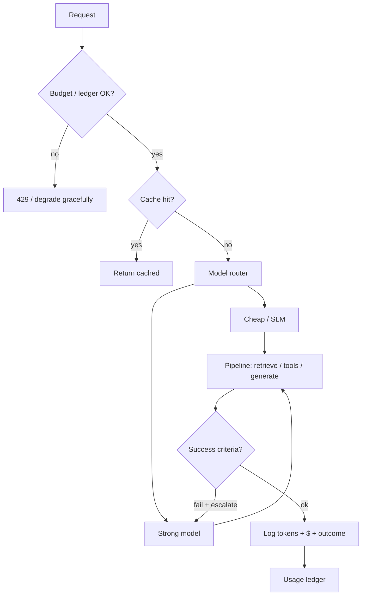

# Module 10 — Cost Optimization & Economics

**Time:** 2–3 days · **Depends on:** [01](01-prompt-engineering.md), [05](05-context-engineering.md), [07](07-tools-and-rag.md) · **Next:** [Single agents](11-single-agents.md)

<span data-module-id="10" hidden></span>

---

## Learning objectives

By the end of this module you will be able to:

- Define and track **unit economics**: `cost_per_success`, not raw token thrift
- Identify the real **token and call drivers** in a request path
- Apply **routing**, **caching**, and **prompt compression** without silent quality collapse
- Implement a **usage ledger** and budget gates before traffic scales
- Read provider bills in terms of architecture choices you control

---

## Why this matters (CS engineer)

<div class="aieng-story" markdown>

Finance screenshots a 40% token drop after “routing everything to mini.” Leadership celebrates thrift. Support reopen rate doubles. The mini model fails validators, retries three times, then escalates to humans who eat the savings. `cost_per_success` barely moved — sometimes rose. Separately, a cache keyed only on user text serves Alice Bob’s invoice answer. Tokens were never the product. **Successful outcomes under a budget** were.

</div>

LLM spend is not a fixed SaaS seat license. It is closer to **pay-per-request compute** with a heavy tail: one agent loop or RAG dump can cost 100× a classifier call.

If you only watch “total tokens this month”:

- You cut the model that was carrying hard cases and quality collapses  
- You cache the wrong key and serve stale personalized answers  
- You “optimize” prompts while retries and tool thrash dominate the bill  

CS framing: treat each product action as a **transaction** with success criteria, measure **$/success**, and put **admission control** (budgets, max steps, cache, routing) in code — the same place you put rate limits and timeouts.

---

## Mental model



Optimize the **path**, not a single hyperparameter. A smaller model that needs 8 retries can lose to one strong call.

<div class="aieng-intuition" markdown>
<p class="label">Intuition lock</p>

**Sticky picture:** Optimize **`cost_per_success`**, not thrift theater. The **router is a triage nurse** — cheap path first, escalate when criteria fail. **Cache keys must version meaning** (model + template + tenant), not just the user’s sentence.

<div class="kill" markdown>
**Kill this idea:** “Lower tokens / always use the smallest model = winning.” → **Replace with:** Minimize $ per successful business outcome under quality and latency SLOs; put gates on the hot path.
</div>
</div>

---

## Core tutorial

### 1. The unit metric that matters

```text
cost_per_success = total_usd / successful_tasks
```

Also track:

| Metric | Why |
|--------|-----|
| `cost_per_request` | Capacity planning |
| `success_rate` | Denominator health |
| `tokens_in` / `tokens_out` | Which side dominates |
| `cache_hit_rate` | Free wins |
| `escalation_rate` | Router working? |
| `p95_latency` | Cost twin (timeouts → retries) |

**Wrong objective:** minimize tokens.  
**Right objective:** minimize **$ per successful business outcome** subject to latency and quality SLOs.

Example: support deflection.

- Cheap bot: $0.002/call, 40% resolve → $0.005 per success, many handoffs  
- Hybrid: $0.008/call, 85% resolve → ~$0.0094 per success but lower human cost  

Include **downstream** cost (human review, chargebacks) when the product owns them.

<div class="aieng-explainer" markdown>
<p class="label">Explainer</p>

Unit economics force you to define *success* in code: JSON schema valid, retrieval Hit, human CSAT, ticket closed without escalate. Without that label, “cost optimization” is just spending less to produce wrong answers faster.

</div>

---

### 2. Cost drivers (where the money actually goes)

| Driver | What inflates it | Levers |
|--------|------------------|--------|
| **Input tokens** | System + tools + RAG junk + full history | Packing, summaries, better retrieval, shorter tools |
| **Output tokens** | Verbose prose, CoT, multi-sample | Caps, schemas, “concise”, extractive answers |
| **Model tier** | Defaulting everything to flagship | Router + escalate on failure |
| **Calls / retries** | Agents, self-consistency, flaky tools | max_steps, idempotent tools, backoff caps |
| **Embeddings** | Re-embed whole corpus every deploy | Content-hash; batch; change-only |
| **Rerank / tools** | External APIs per request | Cache; skip reranking **only** when a retrieval-confidence rule has been calibrated and validated on a representative labeled evaluation set |

Rule of thumb for chat+RAG: **input** often dominates. For agents that write code or long plans: **output** and **step count** dominate.

!!! warning "Don't skip rerank on raw dense score"
    Vector similarity is **not** a calibrated measure of retrieval sufficiency across queries, embedding models, corpora, domains, or query lengths. A high cosine/dot score on one index is not “we already have the right docs” on another.

    **Skip reranking only when a retrieval-confidence rule has been calibrated and validated on a representative labeled evaluation set.**

    **Production path:**

    `baseline retrieval → labeled eval set → measure first-stage sufficiency → calibrate confidence rule → conditionally skip reranker`

    Until that rule is measured, pay for the rerank (or accept the quality risk explicitly). The same calibration requirement applies to gating agentic RAG (Module 09).

```python
# Approximate with tiktoken (or your provider’s usage field — prefer the latter in prod)
import tiktoken

def count_tokens(text: str, model: str = "gpt-4o-mini") -> int:
    try:
        enc = tiktoken.encoding_for_model(model)
    except KeyError:
        enc = tiktoken.get_encoding("o200k_base")
    return len(enc.encode(text))
```

Always log **prompt vs completion** separately. Average “total tokens” hides a verbose-generator bug.

---

### 3. Model routing

Send easy work to a cheap model; escalate hard work.

This course ships `ModelRouter` in `src.cost`:

```python
from src.cost import ModelRouter

router = ModelRouter(cheap="gpt-4o-mini", strong="gpt-4o")  # placeholder ids; see Setup
assert router.pick("classify", "short text") == "gpt-4o-mini"
assert router.pick("complex_reason", "x") == "gpt-4o"
assert router.pick("chat", "x" * 9000) == "gpt-4o"  # long context heuristic
```

Design patterns:

1. **Task-type route** — classify / extract → mini; plan / multi-hop → strong  
2. **Confidence escalate** — mini first; if validator fails → strong  
3. **Cascade** — rules → SLM → large model → human  
4. **Length / complexity features** — input size, tool need, user tier  

!!! warning "Don't route on the model's self-reported confidence"
    A model saying "confidence = 0.93" is not a calibrated signal — LLMs are frequently overconfident and that number isn't grounded in anything measurable. Route on things you can actually verify: deterministic/schema validation, a task classifier, disagreement between two samples or models, or a calibrated router trained and checked against labeled outcomes.

    Token-level log probabilities can provide a more grounded model-internal signal than verbal self-confidence, but they should still be calibrated against task outcomes before being used as a production routing threshold. Logprobs are **not** automatically calibrated probabilities of task correctness.

```python
def answer(task: str, prompt: str, run_model, validate) -> str:
    model = router.pick(task, prompt)
    out = run_model(model, prompt)
    if not validate(out) and model != router.strong:
        out = run_model(router.strong, prompt)
    return out
```

<div class="aieng-think" markdown>
<p class="label">Think about it</p>

**Question:** Your router sends 90% of traffic to a mini model. Token bill drops 60%, but `cost_per_success` barely moves. What happened?

<details data-think-id="10-t1"><summary>Reveal a strong answer</summary>

Success rate likely fell: more retries, more human escalations, or longer sessions. Unit metric uses *successful* tasks in the denominator. Also check whether the remaining 10% on the strong model got heavier (harder mix) or agents started looping. Always pair spend charts with success_rate and escalation_rate.

</details>
</div>

---

### 4. Caching (with safe keys)

Cache **identical** expensive work: embeddings of unchanged docs, pure functions, idempotent tool GETs, deterministic classifications.

Course `MemoryCache` (keep this pattern; swap Redis in production):

```python
import hashlib
import time
from typing import Any

class MemoryCache:
    def __init__(self, ttl_s: int = 3600):
        self.ttl_s = ttl_s
        self.store: dict[str, tuple[float, Any]] = {}

    def _key(self, namespace: str, payload: str) -> str:
        h = hashlib.sha256(payload.encode()).hexdigest()
        return f"{namespace}:{h}"

    def get(self, namespace: str, payload: str) -> Any | None:
        k = self._key(namespace, payload)
        item = self.store.get(k)
        if not item:
            return None
        exp, val = item
        if time.time() > exp:
            del self.store[k]
            return None
        return val

    def set(self, namespace: str, payload: str, value: Any) -> None:
        k = self._key(namespace, payload)
        self.store[k] = (time.time() + self.ttl_s, value)
```

Runnable import:

```python
from src.cost import MemoryCache

cache = MemoryCache(ttl_s=3600)
cache.set("embed:v1", "doc-42 text", [0.1, 0.2])
assert cache.get("embed:v1", "doc-42 text") == [0.1, 0.2]
```

**Key must include:**

- Namespace / purpose (`chat:v3`, `embed:v1`)  
- **Model id**  
- **Prompt template version**  
- Critical params (temperature if non-zero, tools schema hash)  
- User/tenant id when output is personalized or sensitive  

**Do not cache** across tenants without isolation. **Do not cache** high-stakes answers forever without TTL.

Layers:

| Layer | Example |
|-------|---------|
| Exact response cache | Same hashed prompt → same completion |
| Provider prefix cache | Stable system prompt (where offered) |
| Embedding cache | Content-hash → vector |
| Tool HTTP cache | Idempotent GET with cache headers |
| Retrieval cache | Query hash → chunk ids (short TTL) |

<div class="aieng-explainer" markdown>
<p class="label">Explainer</p>

**A cache key is a claim about equivalence.** If two requests hash the same but would produce different *correct* answers (different tenants, new prompt template, new model, personalized data), the key is a bug. Version the **meaning** of the generation: `namespace:model:template_ver:tenant?:payload_hash`. High hit rate with wrong keys is an incident generator with good dashboards.
</div>

---

### 5. Usage ledgers and spend guardrails

```python
from src.cost import UsageLedger

led = UsageLedger()
led.add("user-42", cost_usd=0.004, tokens=1200)
assert led.allowed("user-42", limit_usd=1.0)
print(led.usage("user-42"))
```

Pattern in a request handler:

```python
def handle(user_id: str, prompt: str, ledger: UsageLedger, limit: float):
    if not ledger.allowed(user_id, limit):
        raise PermissionError("budget exceeded")
    # ... call model ...
    ledger.add(user_id, cost_usd=estimated, tokens=usage_total)
```

Pair application ledgers with:

- Provider **hard** billing limits  
- Anomaly alerts (10× baseline rps or $/min)  
- Per-feature budgets (agent loops vs autocomplete)  

<div class="aieng-explainer" markdown>
<p class="label">Explainer</p>

A ledger is admission control, not accounting theater. Soft dashboards without `allowed()` checks do not stop a runaway agent at 3 a.m. Put the gate on the hot path; make “budget exceeded” a first-class, testable branch.

</div>

---

### 6. Prompt and context economy

Checklist that usually moves the needle:

- [ ] **Stable system prefix** → enable provider prompt caching when available  
- [ ] **Retrieve fewer, better chunks** (Module 09) — junk tokens are pure loss  
- [ ] **Summarize long tool outputs** before re-feeding the model  
- [ ] **Batch** offline classification / extraction jobs  
- [ ] Prefer **structured / extractive** answers over essays when product allows  
- [ ] Cap `max_tokens` to what the UI will actually show  
- [ ] Drop full chat transcripts; use rolling summaries (Module 05)  

Compression options (increasing risk):

1. Better retrieval (best quality retention)  
2. Summarize history / tools  
3. Smaller models for substeps  
4. Aggressive truncation (last resort — measure quality)

---

### 7. Agents and tools: the silent bill

Agents multiply cost by **steps × tokens_per_step**.

Controls:

| Control | Effect |
|---------|--------|
| `max_steps` | Hard ceiling |
| Repeated tool-signature abort | Stop thrashing |
| Tool result size limits | Shrink next prompt |
| Cache tool results | Skip duplicate HTTP |
| Plan-then-execute with short plans | Fewer exploratory calls |

Never give an agent an uncapped browse loop in production without a $ budget tied to the ledger.

<div class="aieng-think" markdown>
<p class="label">Think about it</p>

**Question:** A single-turn chat feature costs ~$0.003 median. The new “research agent” averages $0.18 with the same user question. List three architectural multipliers before you blame the model price list.

<details data-think-id="10-t3"><summary>Reveal a strong answer</summary>

(1) **Step count** — each decide+act is another full prompt with growing scratchpad. (2) **Context growth** — tool dumps re-enter every later step (input tokens dominate). (3) **Retries / thrash** — same search args, failed validators, or multi-sample. Also: always-on strong model, no retrieve cache, no max_steps. Fix path cost before negotiating list prices.
</details>
</div>

---

### 8. Estimating cost in tests and CI

Keep a simple estimator for local drills (replace rates with current list prices):

```python
RATES = {  # USD per 1M tokens — update when you read this
    "mini": {"in": 0.15, "out": 0.60},
    "full": {"in": 2.50, "out": 10.00},
}

def estimate_usd(model: str, tokens_in: int, tokens_out: int) -> float:
    r = RATES[model]
    return (tokens_in * r["in"] + tokens_out * r["out"]) / 1_000_000
```

In production, prefer **provider usage fields** on the response over local estimates.

Log line shape worth standardizing:

```text
ts user_id feature model tokens_in tokens_out cost_usd cache_hit success latency_ms
```

---

### 9. Quality gates after savings

Every cost change needs a paired quality check:

1. Fix a golden set (Module 04)  
2. Measure success_rate + cost_per_success before/after  
3. Promote only if quality ≥ threshold and $ within budget  
4. Watch p95 latency (timeouts create retries and *increase* spend)

Savings that fail the gate are regressions, not wins.

<div class="aieng-think" markdown>
<p class="label">Think about it</p>

**Question:** You add an exact-match response cache keyed only on user text. Hit rate is high. What security/product bugs might you have introduced?

<details data-think-id="10-t2"><summary>Reveal a strong answer</summary>

(1) Cross-user leakage if keys omit tenant/user and two users ask the same question about private data. (2) Stale answers after policy or catalog changes (no TTL / template version). (3) Wrong model/version served after a prompt deploy because template version was not in the key. (4) Caching personalized or time-sensitive outputs (“my last invoice”). Namespace keys by tenant, include model+template version, set TTLs, and exclude sensitive personalized paths.

</details>
</div>

---

## Failure modes

| Symptom | Cause | Fix |
|---------|-------|-----|
| Bill down, tickets up | Optimized $ not $/success | Restore quality gate; fix router |
| Cache high, users confused | Stale or cross-tenant keys | Versioned keys + TTL + isolation |
| Mini model “too expensive” | Retries / long outputs | Cap tokens; fix validators; fewer loops |
| Embedding bill spikes | Full re-embed | Hash + incremental ingest |
| Ledger useless | Not on hot path | `allowed()` before call |
| Agent 100× cost | No max_steps | Hard stops + repeated-call abort |

---

## Lab

1. Log tokens and estimated $ for **50** real or fixture requests on one feature.  
2. Compute `cost_per_success` with an explicit success predicate.  
3. Route easy traffic through `ModelRouter` to a mini/local model; measure quality delta on a 20-case golden set.  
4. Add `MemoryCache` (or Redis) for one idempotent subcall; report hit rate.  
5. Enforce `UsageLedger.allowed` with a low test limit; write a unit test that the gate trips.

```bash
poetry run pytest tests/test_cost.py -v
```

**Stretch:** break down $ by stage (retrieve / rerank / generate) for one RAG request.

---

## Quizzes

<div class="aieng-quiz" data-quiz-id="10-q1" data-xp="25" data-success="Unit economics need a success definition." data-fail="Re-read the unit metric section." markdown>
<p class="label">Quiz · +25 XP</p>
<p class="quiz-prompt">What is the primary optimization target for production LLM features?</p>
<div class="quiz-options">
<button type="button" class="quiz-opt" data-correct="false">Minimize total tokens regardless of outcome</button>
<button type="button" class="quiz-opt" data-correct="true">Minimize cost per successful task subject to quality and latency SLOs</button>
<button type="button" class="quiz-opt" data-correct="false">Always use the smallest model available</button>
<button type="button" class="quiz-opt" data-correct="false">Maximize cache size</button>
</div>
<p class="quiz-feedback"></p>
</div>

<div class="aieng-quiz" data-quiz-id="10-q2" data-xp="25" data-success="Cache keys must version the full generation context." data-fail="Think about what changes the meaning of a cached completion." markdown>
<p class="label">Quiz · +25 XP</p>
<p class="quiz-prompt">Which fields belong in a safe LLM response cache key?</p>
<div class="quiz-options">
<button type="button" class="quiz-opt" data-correct="false">Only the raw user string</button>
<button type="button" class="quiz-opt" data-correct="true">User text + model id + prompt template version (+ tenant when personalized)</button>
<button type="button" class="quiz-opt" data-correct="false">Only the user id</button>
<button type="button" class="quiz-opt" data-correct="false">Only the HTTP path</button>
</div>
<p class="quiz-feedback"></p>
</div>

---

## Open source materials

| Resource | Use it for |
|----------|------------|
| Course `src/cost.py` | `ModelRouter`, `MemoryCache`, `UsageLedger` |
| Provider pricing pages (OpenAI / Anthropic / Google) | Live rates for estimators |
| [humanlayer/12-factor-agents](https://github.com/humanlayer/12-factor-agents) | Budgets, owned control flow |
| Langfuse / Phoenix / provider dashboards | Token traces in real traffic |
| [mlabonne/llm-course](https://github.com/mlabonne/llm-course) | Deploy/cost-aware engineer path |

---

## Checkpoint

- [ ] You know **cost per successful task** for one real flow  
- [ ] At least one of: **routing**, **caching**, **budget cap** is implemented  
- [ ] Quality gate still enforced after savings  
- [ ] Logs separate prompt vs completion tokens  

---

<div class="aieng-complete" data-module-id="10" data-xp="80" markdown>
<p>Mark complete when you can show cost_per_success for one feature and at least one enforced control (router, cache, or ledger gate).</p>
<button type="button">Complete module · +80 XP</button>
</div>

## Exercise

- **Catalog:** [EX-10 — Cost controls](../reference/exercises.md#ex-10)
- **Prove:** Router, cache, and ledger actually deny over-budget work.
- **Test:** `pytest tests/test_cost.py -v`

**Next:** [Module 11 — Single-agent workflows](11-single-agents.md)
