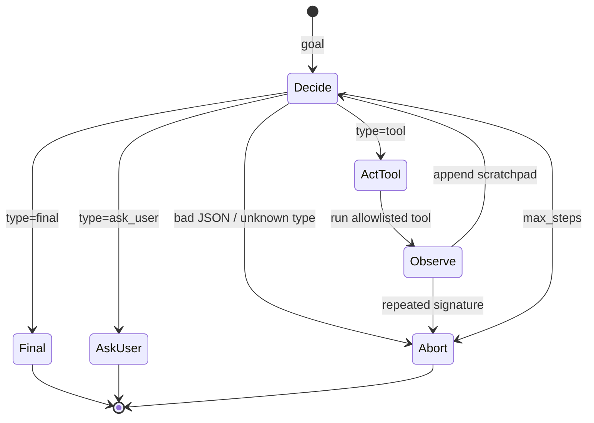

# Module 11 — Single-Agent Workflows

**Time:** 7–10 days · **Depends on:** [03](03-advanced-prompting.md)–[05](05-context-engineering.md), [07](07-tools-and-rag.md) · **Next:** [Multi-agent](12-multi-agents.md)

<span data-module-id="11" hidden></span>

---

## Learning objectives

By the end of this module you will be able to:

- Implement a **plan–act–observe** loop with **hard stops**
- Constrain the model to an **allowlisted** tool surface and structured decisions
- Add **reflection** and tool-error recovery without unbounded cost
- Make agents **observable and testable** (replayable step logs)
- Prefer understanding the loop **before** adopting LangGraph or similar frameworks

---

## Why this matters (CS engineer)

<div class="aieng-story" markdown>

Overnight, a “helpful research agent” leaves 400+ tool calls in the logs: same `search` query, same empty hits, same optimistic retry. No `max_steps`. No repeated-signature abort. Morning bill: four figures for zero tickets closed. The demo had a charming persona and a ReAct prompt. It did not have a **state machine with circuit breakers**. Personality does not terminate; code does.

</div>

An “agent” is not a personality. It is a **state machine** that repeatedly:

1. Chooses an action (tool call, final answer, ask user)  
2. Executes that action in *your* runtime  
3. Observes the result  
4. Updates state until a terminal condition  

If you skip the systems view, you get:

- Infinite tool loops  
- Unbounded spend (Module 10)  
- Non-reproducible failures (“it just did something weird”)  
- Tools that escape the allowlist  

Frameworks (LangGraph, etc.) are useful **after** you can write the loop, name the state, and test stop conditions. Otherwise you debug the framework instead of the policy.

---

## Mental model



**State** is explicit: goal, scratchpad, steps[], done, result, abort_reason.  
**Policy** is the LLM (or rules) that emits the next decision.  
**Runtime** is your code: tools, limits, logging.

<div class="aieng-intuition" markdown>
<p class="label">Intuition lock</p>

**Sticky picture:** An agent is a **state machine**, not a personality. **`max_steps` is a circuit breaker.** Tool allowlists are **capability tokens** — if the name isn’t in the bag, it doesn’t run, no matter how confident the model sounds.

<div class="kill" markdown>
**Kill this idea:** “Agents are autonomous coworkers; give them freedom and they’ll figure it out.” → **Replace with:** Bounded decide→act→observe with allowlisted tools, hard stops, structured decisions, and replayable logs.
</div>
</div>

---

## Core tutorial

### 1. The core loop (no framework)

```text
goal
  → plan (optional)
  → select action (tool | respond | ask_user)
  → observe result
  → update state
  → until done | max_steps | abort
```

Minimal decision protocol (JSON only):

```json
{"type": "tool", "name": "search_notes", "args": {"q": "refund policy"}}
{"type": "final", "content": "The refund window is 30 days."}
{"type": "ask_user", "content": "Which order id?"}
```

Why JSON decisions?

- Parsable in tests  
- Easy to log and replay  
- Harder (not impossible) for the model to invent free-form shell commands  

---

### 2. Course agent: `src.agents.Agent`

This repo implements a teaching agent with hard stops. Read it as a **spec**, not as production middleware.

```python
import json
from src.agents import Agent

def llm(prompt: str) -> str:
    # stub: real systems call a model with structured outputs
    if "Scratchpad:" in prompt and "Tool" not in prompt.split("Scratchpad:")[-1]:
        return json.dumps({"type": "tool", "name": "echo", "args": {"text": "hi"}})
    return json.dumps({"type": "final", "content": "hi"})

agent = Agent(llm=llm, tools={"echo": lambda text: text}, max_steps=5)
state = agent.run("echo hi then finish")
assert state.result == "hi"
assert state.done
```

What `Agent` enforces for you:

| Control | Behavior |
|---------|----------|
| `max_steps` | Stops with `abort_reason="max_steps"` |
| Allowlisted tools | Unknown name → observation error string, not exception death |
| Repeated tool signature | Same `name+args` twice → abort `repeated_tool_call` |
| Bad JSON decision | Abort `bad_decision` |
| Tool exceptions | Surfaced as `error: ...` in the scratchpad |

```bash
poetry run pytest tests/test_agents.py -v
```

<div class="aieng-explainer" markdown>
<p class="label">Explainer</p>

The scratchpad is working memory: a append-only log of tool observations the model sees on the next decide step. It is not a database. Cap what you append (the teaching agent truncates observations to 2000 chars) so one huge tool dump cannot blow the context window.

</div>

---

### 3. Plan–act–observe in more detail

#### Decide

Prompt ingredients:

- Goal (immutable)  
- Scratchpad / recent observations  
- Tool catalog (names, schemas, one-line descriptions)  
- Output contract (JSON types)  
- Remaining step budget (optional but helpful)

#### Act

Your runtime executes tools — **never** trust model text as code.

```python
def run_tool(tools: dict, name: str, args: dict) -> str:
    if name not in tools:
        return f"error: unknown tool {name}"
    # validate args against JSON Schema in production
    try:
        return str(tools[name](**args))
    except Exception as e:
        return f"error: {e}"
```

#### Observe

Write structured observations back:

```text
Tool search_notes args={"q":"..."} -> (3 hits) [doc:12] Refunds within 30 days...
```

Prefer structured tool returns (`json.dumps`) so later steps can parse — but still treat them as untrusted text in the prompt (Module 02).

---

### 4. Stop conditions (non-negotiable)

| Condition | Why |
|-----------|-----|
| `max_steps` | Prevent infinite loops |
| Token / $ budget | Economic safety (Module 10) |
| Repeated tool signature | Detect thrashing |
| User gate | Irreversible or high-impact actions |
| Validation pass | Structured success criteria met |
| Wall-clock timeout | Hung tools |

```python
# Product pattern beyond the teaching agent
if steps >= max_steps or spend >= budget or time.time() > deadline:
    return abort("limit")
if tool_sig in seen:
    return abort("thrash")
if needs_approval(tool_name):
    return wait_for_human()
```

<div class="aieng-think" markdown>
<p class="label">Think about it</p>

**Question:** Your agent has `max_steps=20` and no repeated-call detection. It calls `search` with the same query 20 times and fails. What two code changes fix the class of bug, not just this instance?

<details data-think-id="11-t1"><summary>Reveal a strong answer</summary>

(1) Abort on repeated tool signature (name + canonicalized args) after 1–2 identical calls. (2) Lower max_steps for search-only goals and/or require the model to change the query after empty hits (encode “if empty, reformulate or final with I don’t know” in the decision prompt). Bonus: cache tool results so even retries are cheap and log the thrash for evals.

</details>
</div>

---

### 5. Planning patterns

For multi-step goals, **externalize** the plan into state — do not leave it only inside free-form CoT.

```python
# Plan as data
plan = [
    {"id": 1, "step": "Find refund policy chunk", "status": "pending"},
    {"id": 2, "step": "Find order date for user", "status": "pending"},
    {"id": 3, "step": "Compare and answer", "status": "pending"},
]
```

Loop:

1. Produce short checklist (JSON)  
2. Execute current pending item  
3. Mark complete / failed in state  
4. Re-plan only when blocked (cap re-plans)

**Do not** replan every step by default — that doubles cost and causes oscillation.

---

### 6. Reflection (bounded)

After a draft answer:

```text
Critique the draft against the goal.
List missing evidence or contradictions.
If gaps are material, return {"type":"tool",...} else {"type":"final",...}.
```

Rules:

- Cap to **1–2** reflection passes  
- Reflect only when stakes or uncertainty are high  
- Never reflect in an unbounded while-loop  

Reflection is a **product choice**, not a default for autocomplete.

<div class="aieng-explainer" markdown>
<p class="label">Explainer</p>

**Reflection is another edge in the state machine**, not a vibe of self-awareness. Encode it as: if `validate(draft)` fails and `reflect_count < 2`, append critique notes and decide again; else final or abort. Without a counter, “think harder” becomes an infinite loop with better prose. Use it where mistakes are expensive; skip it for autocomplete and classification.
</div>

---

### 7. Tool-use discipline

| Practice | Reason |
|----------|--------|
| Small tool surface | Fewer wrong picks |
| Typed args + schema validation | Fail closed on garbage |
| Idempotent tools when possible | Safe retries |
| Explicit errors in observations | Model can recover |
| Timeouts and size limits | Protect context and latency |
| No raw shell without sandbox | Security |

Tool design tip: one tool = one clear side effect. Avoid god-tools like `do_anything(command: str)`.

<div class="aieng-think" markdown>
<p class="label">Think about it</p>

**Question:** Product wants one tool: `run(cmd: str)` so the agent can “do anything in the shell.” You push back with capability tokens. What’s the concrete redesign?

<details data-think-id="11-t3"><summary>Reveal a strong answer</summary>

Split into **narrow allowlisted tools**: `read_file(path)`, `list_dir(path)`, `run_tests()`, `git_diff()` — each with path sandboxes, timeouts, and arg schemas. Destructive ones (`git_push`, `rm`) require human approval. The model still *proposes* which tool; the runtime maps names to fixed code paths. One free-form shell string is an unbounded capability token and an injection magnet.
</details>
</div>

---

### 8. Recovery from tool failure

```text
observe error → model may:
  - retry with fixed args (different signature)
  - switch tool
  - ask_user
  - final with partial answer / failure explanation
```

Your job:

- Make errors **informative** (`error: timeout after 5s`, not `Error`)  
- Stop identical retries  
- Count failures toward max_steps (they already should)  

```python
# Observation the model can use
"error: unknown tool nope"
"error: missing required arg 'order_id'"
"error: rate limited; retry after 30s"
```

---

### 9. Observability and replay

Log **per step**:

| Field | Example |
|-------|---------|
| timestamp | ISO time |
| step index | 0..n |
| decision type | tool / final / ask_user |
| tool name + arg hash | `search:sha256...` |
| latency_ms | tool and model separately |
| tokens / $ | Module 10 |
| success / error | bool + code |
| scratchpad length | detect bloat |

If you cannot replay a failure from logs + stored decisions, you cannot improve the agent systematically.

```python
def log_step(state, decision, obs_meta: dict) -> None:
    print({
        "goal": state.goal[:80],
        "decision": decision,
        "meta": obs_meta,
        "steps": len(state.steps),
    })
```

In production: OpenTelemetry spans, Langfuse/Phoenix traces, or your APM — same fields.

---

### 10. Testing agents

**Unit-test the runtime**, not the prose of a live model:

```python
def test_max_steps():
    def llm(_):
        return json.dumps({"type": "tool", "name": "inc", "args": {"n_arg": 1}})

    agent = Agent(llm=llm, tools={"inc": lambda n_arg=1: str(n_arg)}, max_steps=2)
    state = agent.run("loop")
    assert state.abort_reason == "max_steps"
```

Eval layer (Module 04) for stochastic success:

- Task success rate on a fixed suite  
- Steps-to-success  
- Tool error rate  
- Budget violations == 0  

Use a **stub LLM** that returns scripted JSON for CI; use a real model in a scheduled eval job.

---

### 11. When to reach for LangGraph (later)

Prefer a framework when you need:

- Complex branching graphs with shared state reducers  
- Durable execution / human-in-the-loop checkpoints  
- Team conventions around one orchestration library  

Still keep:

- Explicit max steps / budgets  
- Allowlisted tools  
- Structured messages  
- Tests for terminal conditions  

Studying LangGraph **after** this module is ideal: you will map nodes onto decide/act/observe instead of cargo-culting demos. Named failure modes, sandboxes, and trajectory evals are modules [20](20-agent-reliability.md)–[22](22-agent-evaluation.md); framework vs custom is [26](26-orchestrator-comparison.md).

<div class="aieng-think" markdown>
<p class="label">Think about it</p>

**Question:** Should “plan” be a free-text paragraph in the scratchpad or a structured list in agent state? Why?

<details data-think-id="11-t2"><summary>Reveal a strong answer</summary>

Structured list in agent state. Free-text plans get rewritten, partially forgotten, and are hard to test (“did step 2 complete?”). A list of `{id, step, status}` lets the runtime mark progress, skip done work, and assert in tests that the agent does not re-execute completed steps. Use the LLM to *propose* plan JSON; keep the source of truth in code.

</details>
</div>

---

### 12. What you can build with one agent

| Build | Tools | Hard stops |
|-------|-------|------------|
| Research assistant | search, fetch_url, final | max_steps=8, domain allowlist |
| Repo refactor helper | read_file, patch, test | approval before write |
| Ticket triage | classify, lookup_customer, escalate | ask_user on low confidence |

Default to **one agent + tools** until a second role needs a crisp interface (Module 12).

---

## Failure modes

| Symptom | Cause | Fix |
|---------|-------|-----|
| Infinite loop | No max_steps / no thrash detect | Hard stops |
| Tool thrash | Same args retried | Signature abort + better errors |
| Context blow-up | Huge tool dumps | Truncate / summarize observations |
| Hallucinated tool args | Weak schema | Validate; return errors |
| Unreplayable bug | No step logs | Structured logging |
| $ explosion | Uncapped steps + big model | Budget + router (Module 10) |
| Silent wrong final | No success criteria | Validator before accept |

---

## Lab

1. Build an agent with tools: `search_notes`, `calculator`, and final answer (type `final`).  
2. Force a tool failure (unknown tool or bad args); ensure the agent recovers or aborts cleanly.  
3. Set `max_steps=5`; unit-test that a noop looping tool policy terminates with `max_steps`.  
4. Add logging of each decision + observation meta.  
5. Optional: one reflection pass only when a `validate_answer` function fails.

```bash
poetry run pytest tests/test_agents.py -v
```

Use `src.agents.Agent` as the baseline; extend only if you need new abort reasons.

---

## Quizzes

<div class="aieng-quiz" data-quiz-id="11-q1" data-xp="25" data-success="Hard stops are part of the runtime, not a hope." data-fail="Re-read stop conditions." markdown>
<p class="label">Quiz · +25 XP</p>
<p class="quiz-prompt">What is the primary role of max_steps in a single-agent loop?</p>
<div class="quiz-options">
<button type="button" class="quiz-opt" data-correct="false">To increase creativity of the model</button>
<button type="button" class="quiz-opt" data-correct="true">To guarantee termination when the policy keeps calling tools</button>
<button type="button" class="quiz-opt" data-correct="false">To replace the need for tool allowlists</button>
<button type="button" class="quiz-opt" data-correct="false">To force the agent to use a stronger model</button>
</div>
<p class="quiz-feedback"></p>
</div>

<div class="aieng-quiz" data-quiz-id="11-q2" data-xp="25" data-success="Runtime executes; model only proposes." data-fail="Think about who should own side effects." markdown>
<p class="label">Quiz · +25 XP</p>
<p class="quiz-prompt">In a safe agent architecture, who executes tools?</p>
<div class="quiz-options">
<button type="button" class="quiz-opt" data-correct="false">The model, by emitting shell code the client evals blindly</button>
<button type="button" class="quiz-opt" data-correct="true">Your runtime, after allowlist and argument validation</button>
<button type="button" class="quiz-opt" data-correct="false">A second unconstrained agent</button>
<button type="button" class="quiz-opt" data-correct="false">The embedding index</button>
</div>
<p class="quiz-feedback"></p>
</div>

<div class="aieng-quiz" data-quiz-id="11-q3" data-xp="25" data-success="Learn the loop first." data-fail="Re-read the framework guidance." markdown>
<p class="label">Quiz · +25 XP</p>
<p class="quiz-prompt">When should you introduce LangGraph (or similar) in this course path?</p>
<div class="quiz-options">
<button type="button" class="quiz-opt" data-correct="false">Before writing any loop, to save time</button>
<button type="button" class="quiz-opt" data-correct="true">After you understand plan–act–observe, state, and hard stops</button>
<button type="button" class="quiz-opt" data-correct="false">Only if you never need tests</button>
<button type="button" class="quiz-opt" data-correct="false">Never — frameworks are always wrong</button>
</div>
<p class="quiz-feedback"></p>
</div>

---

## Open source materials

| Resource | Use it for |
|----------|------------|
| Course `src/agents.py` + `tests/test_agents.py` | Reference loop and stop conditions |
| [huggingface/agents-course](https://github.com/huggingface/agents-course) | smolagents / modern agent patterns |
| [humanlayer/12-factor-agents](https://github.com/humanlayer/12-factor-agents) | Production control-flow principles |
| [LangGraph docs](https://langchain-ai.github.io/langgraph/) | Study graphs *after* this module |
| DAIR.AI / prompting guide ReAct sections | Historical plan–act–observe framing |

---

## Checkpoint

- [ ] Loop has a **hard stop** (`max_steps` or stronger)  
- [ ] Tools are **allowlisted** and executed only in your code  
- [ ] Steps are **logged** for replay  
- [ ] Repeated tool thrash is detected or impossible  
- [ ] At least one unit test covers termination  

---

<div class="aieng-complete" data-module-id="11" data-xp="120" markdown>
<p>Mark complete when your agent terminates under max_steps, allowlists tools, and you can replay a run from step logs.</p>
<button type="button">Complete module · +120 XP</button>
</div>

## Exercise

- **Catalog:** [EX-11 — Agent loop](../reference/exercises.md#ex-11)
- **Prove:** The stub calls `add` then `final`; repeated identical tool calls abort in code.
- **Test:** `pytest tests/test_agents.py -v`

**Next:** [Module 12 — Multi-agent systems](12-multi-agents.md)
