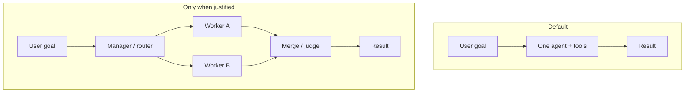

# Module 12 — Multi-Agent Coordination

**Time:** 10–14 days · **Depends on:** [11 Single agents](11-single-agents.md) · **Next:** [Production](13-production.md)

<span data-module-id="12" hidden></span>

---

## Learning objectives

By the end of this module you will be able to:

- Decide **when multi-agent is wrong** (default remains one agent + tools)
- Choose among **sequential**, **hierarchical (manager–worker)**, and **peer** topologies
- Define **message contracts** and role charters with structured payloads
- Handle disagreement, handoffs, and shared memory without clobbering
- **Measure** multi-agent quality and cost against a single-agent baseline

---

## Why this matters (CS engineer)

<div class="aieng-story" markdown>

Hackathon energy: “CEO, engineer, designer, critic” agents write a README. Each persona re-reads the whole repo context. Critic and writer debate for six uncapped rounds. Final doc is worse than a single agent with `read_file` + one pass. Cost: ~10×. Latency: painful. The team shipped a **microservice mesh for a 200-line CRUD app** — theater, not topology. The fix was not more personas; it was **one agent + tools**, then maybe a capped writer→critic contract if metrics demand it.

</div>

Multi-agent systems are distributed systems with **nondeterministic workers**. Every extra agent adds:

- Latency (serial) or coordination overhead (parallel)  
- Tokens (each role re-reads context)  
- Failure modes (dropped handoffs, conflicting writes, critique loops)  

The industry demo pattern (“team of 5 personas”) often loses to **one competent agent with good tools** on cost and reliability. Use multiple roles only when specialization has a **crisp interface** and a metric that proves the split helps.

Think: microservices. You do not split a 200-line CRUD app into 12 services for “architecture.” You split when independent deployability, scaling, or ownership boundaries demand it.

---

## Mental model



**Charter per role:** goal, inputs schema, outputs schema, tools allowed, max steps, success metric.  
**No charter → no second agent.**

<div class="aieng-intuition" markdown>
<p class="label">Intuition lock</p>

**Sticky picture:** Multi-agent is **microservices for cognition**. **Default to one agent.** Message contracts are **APIs between roles** — schemas, versions, validation — not free-form personality chat.

<div class="kill" markdown>
**Kill this idea:** “More agents / personas = smarter system.” → **Replace with:** Add a role only with a written charter, structured I/O, budgets, and a measured win over single-agent (or a hard separation constraint).
</div>
</div>

---

## Core tutorial

### 1. When multi-agent helps — and when it hurts

| Helps | Hurts |
|-------|-------|
| Clear role boundaries (research vs write vs test) | Tiny tasks (coordination > work) |
| Parallelizable subtasks with mergeable outputs | Shared mutable state without a single writer |
| Independent critique with a capped revision loop | No success metric vs single-agent |
| Different tools/permissions per role | “Personas” that share one prompt soup |
| Human handoff at role boundaries | Unbounded debate between peers |

**Default:** one agent + tools (Module 11) until a second role has:

1. A written charter  
2. A structured I/O schema  
3. A hypothesis for quality or latency improvement  
4. A plan to **measure** against single-agent  

<div class="aieng-think" markdown>
<p class="label">Think about it</p>

**Question:** Product asks for “a team of agents: CEO, engineer, designer, critic” to write a README. Is this multi-agent? Should you build it?

<details data-think-id="12-t1"><summary>Reveal a strong answer</summary>

It is multi-*persona* prompting, often implemented as one sequential chain or even one prompt with roleplay — not a meaningful distributed design. For a README, a single agent with repo tools usually wins. If you want quality, use a **capped** writer→critic loop with structured critique (`issues[]`, `severity`) and max 1–2 revisions — two roles, clear contract — not four theatrical titles.

</details>
</div>

---

### 2. Topologies

```text
Sequential:    A → B → C → answer
Hierarchical:  Manager → delegates → workers → merge
Peer graph:    Agents message on channels / shared store
```

| Topology | Strength | Weakness |
|----------|----------|----------|
| **Sequential pipeline** | Simple, easy to log | Latency sums; early errors poison later stages |
| **Manager–worker** | Clear ownership; parallel workers | Manager can be a bottleneck / single point of bad plans |
| **Peer / blackboards** | Flexible collaboration | Hard to debug; deadlock and conflict risk |
| **Router + specialists** | Good when intent classes are stable | Needs solid classification upfront |

Frameworks to **study** (concepts first): **LangGraph**, **CrewAI**, **AutoGen/AG2**, provider agent SDKs. Adopt a framework when the topology is clear — not to discover the topology.

<div class="aieng-explainer" markdown>
<p class="label">Explainer</p>

**Pick topology like you pick RPC vs pub/sub** — from data flow, not from blog aesthetics. Sequential = pipeline stages with typed handoffs. Manager–worker = fan-out when subtasks are independent. Peer graphs = last resort when you accept debugging pain. If you cannot draw the graph and name stop conditions before coding, you are not ready for a multi-agent framework.
</div>

---

### 3. Message contracts

Natural language only at the **edges** (user in, final prose out). Internally, prefer structured messages:

```python
from dataclasses import dataclass, field
from typing import Any
import time

@dataclass
class Message:
    sender: str
    recipient: str  # or "broadcast"
    type: str       # task | result | critique | question | abort
    payload: dict[str, Any]
    ts: float = field(default_factory=time.time)
    correlation_id: str = ""
```

Example payloads:

```python
# task
{"role": "researcher", "instruction": "Find 3 sources on X", "budget_steps": 4}

# result
{"facts": [{"text": "...", "source_id": "doc:9"}], "open_questions": []}

# critique
{"issues": [{"severity": "high", "msg": "Missing citation for claim 2"}], "accept": False}
```

Version your schemas. A worker that returns free-form essays into a manager that expects `facts[]` will fail silently until you validate.

<div class="aieng-explainer" markdown>
<p class="label">Explainer</p>

A message contract is an API between agents. You would not let microservice A POST arbitrary HTML into service B’s database. Do not let agent A dump poetry into agent B’s context and call it architecture. Validate payloads; reject with a structured error message type.

</div>

---

### 4. Role charters (write them down)

Template:

```text
Role: researcher
Goal: gather evidence for the manager’s question
Inputs: {question: str, constraints: str[]}
Outputs: {facts: {text, source_id}[], open_questions: str[]}
Tools: search, fetch_url
Max steps: 5
Must not: invent sources; write final user-facing prose
```

| Role | Typical responsibility |
|------|------------------------|
| Router / manager | Split goal, assign, merge, enforce budgets |
| Researcher | Retrieve and extract facts |
| Writer | Produce user-facing artifact from facts |
| Critic / judge | Score against rubric; request revision once |
| Executor | Code / ticket actions with tight tool allowlist |

---

### 5. Manager–worker sketch

```python
class Manager:
    def __init__(self, workers: dict[str, callable], llm, max_tasks: int = 6):
        self.workers = workers
        self.llm = llm
        self.max_tasks = max_tasks

    def run(self, goal: str) -> str:
        plan_raw = self.llm(
            f"Split into at most {self.max_tasks} tasks as JSON list of "
            f'{{"role": str, "instruction": str}}. Goal: {goal}'
        )
        tasks = parse_tasks(plan_raw)[: self.max_tasks]
        results = []
        for t in tasks:
            worker = self.workers.get(t["role"])
            if not worker:
                results.append({"role": t["role"], "error": "unknown role"})
                continue
            results.append({"role": t["role"], "output": worker(t["instruction"])})
        return self.llm(
            f"Synthesize final answer for: {goal}\n"
            f"Worker results (JSON):\n{results}\n"
            "Cite worker facts; flag conflicts; do not invent."
        )
```

Production upgrades:

- Parallelize independent workers with a thread/async pool  
- Per-worker **max_steps** and $ budget  
- Structured result validation before merge  
- Manager may not invent tools — only workers with allowlists  

---

### 6. Sequential pipeline example: research → write → critique

```text
researcher(goal) → facts
writer(facts) → draft
critic(draft, facts) → accept | issues
if issues and rounds < 2: writer(draft, issues) → draft
else: return draft or escalate
```

```python
def pipeline(goal: str, research, write, critique, max_rounds: int = 2) -> str:
    facts = research(goal)
    draft = write(goal, facts)
    for _ in range(max_rounds):
        verdict = critique(draft, facts)  # {"accept": bool, "issues": [...]}
        if verdict.get("accept"):
            return draft
        draft = write(goal, facts, issues=verdict.get("issues") or [])
    return draft  # or escalate to human
```

Cap critique rounds. Unbounded critic–writer loops are a sophisticated way to light money on fire.

---

### 7. Consensus, conflict, and judges

When workers disagree:

| Strategy | Use when |
|----------|----------|
| **Critic with one revision** | Writing quality, checklist compliance |
| **Judge rubric / pairwise rank** | Choosing among candidate answers |
| **Union + flag conflicts** | Fact gathering (don’t silently overwrite) |
| **Human gate** | High impact: legal, prod deploys, payments |
| **Majority vote** | Independent samples of same task (costly) |

```python
def merge_facts(blobs: list[list[dict]]) -> dict:
    seen = {}
    conflicts = []
    for fact in (f for blob in blobs for f in blob):
        key = fact["text"].strip().lower()
        if key in seen and seen[key]["source_id"] != fact["source_id"]:
            conflicts.append((seen[key], fact))
        else:
            seen[key] = fact
    return {"facts": list(seen.values()), "conflicts": conflicts}
```

Never “last writer wins” on a shared answer document without an explicit merge policy.

---

### 8. Shared memory

| Store | Use | Danger |
|-------|-----|--------|
| Per-agent scratchpad | Local reasoning | Not visible to others (often good) |
| Shared task board | Status of subtasks | Needs ownership fields |
| Vector store | Long research notes | Stale / duplicated notes |
| Single-writer artifact | Final doc / PR | Avoid multi-writer clobber |
| Message log | Audit / replay | Growth — compact summaries |

Rules:

- One **owner** for the final artifact  
- Append-only message logs when possible  
- Summarize shared boards; do not paste every scratchpad into every agent  

<div class="aieng-think" markdown>
<p class="label">Think about it</p>

**Question:** Researcher and writer both “own” a shared Markdown file and rewrite it each turn. What’s the distributed-systems bug, and what’s the multi-agent fix?

<details data-think-id="12-t3"><summary>Reveal a strong answer</summary>

**Multi-writer clobber** / lost update: last agent wins, intermediate facts vanish, no merge policy. Fix: **single writer** for the artifact (usually writer); researcher emits structured `facts[]` messages only; optional merge function with conflict flags; append-only message log for audit. Same rule as microservices: one service owns the table.
</details>
</div>

---

### 9. Handoffs and human-in-the-loop

Handoff checklist:

1. Structured payload validated  
2. Correlation id preserved  
3. Budget remaining passed downstream  
4. Explicit `accept` / `reject` / `escalate` states  

Human gates for:

- Irreversible tools (delete, charge, page on-call)  
- Persistent critic–worker deadlock  
- Low confidence on high-severity domains  

```python
if message.type == "escalate":
    return wait_for_human(message.payload)
```

---

### 10. Measure vs single-agent baseline

If you cannot show improvement, the multi-agent system is costume jewelry.

On a fixed suite of **N ≥ 10** tasks:

| Metric | Single agent | Multi-agent |
|--------|--------------|-------------|
| Task success rate | | |
| Median steps / LLM calls | | |
| Cost per success | | |
| p95 latency | | |
| Human edits required | | |

Promote multi-agent only if success improves **enough** to justify $ and latency — or if organizational constraints (permissions, compliance) require separation of roles.

```python
def compare(baseline_fn, multi_fn, tasks: list) -> dict:
    def run(fn):
        ok = cost = 0
        for t in tasks:
            r = fn(t)  # returns {success: bool, cost_usd: float}
            ok += int(r["success"])
            cost += r["cost_usd"]
        return {"success_rate": ok / len(tasks), "cost": cost}
    return {"single": run(baseline_fn), "multi": run(multi_fn)}
```

<div class="aieng-think" markdown>
<p class="label">Think about it</p>

**Question:** Multi-agent success_rate is +4% vs single-agent, but cost_per_success is 3× and p95 latency 4×. Ship it?

<details data-think-id="12-t2"><summary>Reveal a strong answer</summary>

Usually no — not as the default path. A 4% quality bump rarely justifies 3× unit cost unless the task is extremely high value (e.g. rare legal review) and you route *only* those cases through the multi-agent graph. Prefer: single agent default, multi-agent escalate on hard cases, or fix the single agent (better tools/RAG) first. Always recompute cost_per_success, not vanity success alone.

</details>
</div>

---

### 11. Failure modes unique to multi-agent

| Symptom | Cause | Fix |
|---------|-------|-----|
| Circular critique | No max rounds | Cap revisions; judge accept threshold |
| Manager hallucination of worker output | Soft merge prompt | Structured results only; validate |
| Duplicate work | No task board status | Idempotent task ids; mark in progress |
| Cost explosion | Fan-out × deep workers | max_tasks, per-worker budgets |
| Lost handoff | Free-text channels | Message schema + dead-letter |
| Worse than single agent | Overhead, conflict | Revert; narrow to 2-role pipeline |

---

### 12. Mapping to frameworks (study refs)

| Concept here | LangGraph-ish | CrewAI-ish |
|--------------|---------------|------------|
| Topology | Graph nodes + edges | Crew + process |
| State | Shared state object | Memory / context |
| Worker | Node + tools | Agent + tools |
| Manager | Router node / supervisor | Hierarchical process |
| Stop | Conditional edges + recursion limit | max_iter |

Learn the concepts in this module; use frameworks as **implementations**, not as substitutes for charters and metrics.

---

## Failure modes (summary table)

| Symptom | Likely root cause | Direction |
|---------|-------------------|-----------|
| Beautiful demo, prod chaos | No contracts / budgets | Schemas + hard stops |
| Agents rewrite each other | Multi-writer artifact | Single owner + merge |
| Endless debate | Peer topology without judge | Critic cap or human |
| Latency too high | Sequential overkill | Parallel workers or single agent |
| No idea if it helps | No baseline | A/B on fixed suite |

---

## Lab

1. Implement **researcher + writer + critic** with **max 2** critique rounds.  
2. Use a `Message` (or dict) log for every handoff; print/save it.  
3. Define JSON schemas for researcher output and critic verdict; reject invalid payloads.  
4. On **10 tasks**, compare quality and cost vs a **single-agent** baseline (same tools, Module 11 loop).  
5. Write a short memo: keep multi-agent, narrow it, or revert — with numbers.

**Stretch:** manager–worker with two parallel researchers and a conflict-flagging merge.

---

## Quizzes

<div class="aieng-quiz" data-quiz-id="12-q1" data-xp="25" data-success="Default is single agent until the interface is crisp." data-fail="Re-read when multi-agent helps." markdown>
<p class="label">Quiz · +25 XP</p>
<p class="quiz-prompt">What is the best default architecture before multi-agent?</p>
<div class="quiz-options">
<button type="button" class="quiz-opt" data-correct="false">Five peer agents with shared free-text memory</button>
<button type="button" class="quiz-opt" data-correct="true">One agent with allowlisted tools and hard stops</button>
<button type="button" class="quiz-opt" data-correct="false">Unbounded critic–writer debate</button>
<button type="button" class="quiz-opt" data-correct="false">Manager with unlimited workers and no budgets</button>
</div>
<p class="quiz-feedback"></p>
</div>

<div class="aieng-quiz" data-quiz-id="12-q2" data-xp="25" data-success="Structured contracts prevent silent failure." data-fail="Think about microservice APIs." markdown>
<p class="label">Quiz · +25 XP</p>
<p class="quiz-prompt">Why prefer structured payloads between agents over free-form prose?</p>
<div class="quiz-options">
<button type="button" class="quiz-opt" data-correct="false">Prose cannot contain facts</button>
<button type="button" class="quiz-opt" data-correct="true">Schemas enable validation, testing, and reliable merges</button>
<button type="button" class="quiz-opt" data-correct="false">LLMs cannot read JSON</button>
<button type="button" class="quiz-opt" data-correct="false">Frameworks forbid natural language</button>
</div>
<p class="quiz-feedback"></p>
</div>

<div class="aieng-quiz" data-quiz-id="12-q3" data-xp="25" data-success="Measure both quality and unit cost." data-fail="Re-read measure vs single-agent." markdown>
<p class="label">Quiz · +25 XP</p>
<p class="quiz-prompt">You should keep a multi-agent design when:</p>
<div class="quiz-options">
<button type="button" class="quiz-opt" data-correct="false">It uses more personas than the competitor’s blog post</button>
<button type="button" class="quiz-opt" data-correct="true">It beats a single-agent baseline on agreed metrics enough to justify cost/latency (or meets a hard separation constraint)</button>
<button type="button" class="quiz-opt" data-correct="false">The manager prompt is longer than 2k tokens</button>
<button type="button" class="quiz-opt" data-correct="false">Critique rounds are unbounded</button>
</div>
<p class="quiz-feedback"></p>
</div>

---

## Open source materials

| Resource | Use it for |
|----------|------------|
| [huggingface/agents-course](https://github.com/huggingface/agents-course) | Multi-agent and LangGraph exposure |
| [LangGraph](https://langchain-ai.github.io/langgraph/) | Graph topologies, durable execution ideas |
| [CrewAI](https://docs.crewai.com/) | Role/process framing (study critically) |
| [AutoGen / AG2](https://github.com/microsoft/autogen) | Multi-agent conversation patterns |
| [humanlayer/12-factor-agents](https://github.com/humanlayer/12-factor-agents) | Control flow, human gates, ownership |
| Module 11 `src/agents.py` | Worker implementation building block |

---

## Checkpoint

- [ ] Each agent has a written **charter** and **I/O schema**  
- [ ] There is a **max round / budget** on coordination  
- [ ] Handoffs are **structured and logged**  
- [ ] You **measured** multi-agent vs single-agent on a fixed suite  
- [ ] You know when you would **not** use multi-agent  

---

<div class="aieng-complete" data-module-id="12" data-xp="120" markdown>
<p>Mark complete when you have a capped multi-role pipeline with message logs and a numeric comparison to a single-agent baseline.</p>
<button type="button">Complete module · +120 XP</button>
</div>

**Next:** [Module 13 — Production systems](13-production.md)
