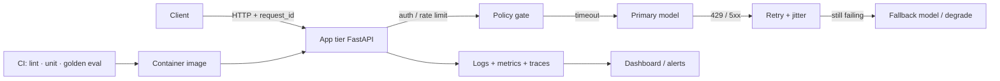
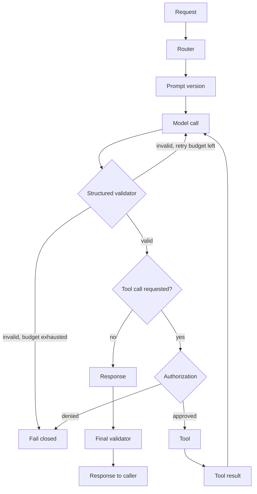

# Module 13 — Production-Grade Systems

<span data-module-id="13" hidden></span>

**Time:** 2–3 weeks (alongside a real project) · **Depends on:** 04, 07, 10 · **Next:** [Compliance](14-compliance.md)

---

## Learning objectives

- Serve models behind stable APIs with timeouts, retries, and fallbacks
- Instrument the request path with metrics, traces, and structured logs
- Version prompts and model IDs so deploys are reproducible and roll-backable
- Ship a containerized inference service with a realistic CI gate

## What you can build

- FastAPI (or similar) inference service with `/healthz` and `/v1/generate`
- Latency / error / token dashboards wired to request IDs
- Blue/green or canary prompt versions with eval gates in CI

---

## Why this matters (CS engineer)

<div class="aieng-story" markdown>

Friday 16:40. Support chat p95 jumps from 1.2s to “hung.” The provider is rate-limiting; your SDK default has **no timeout**. Workers pile up, health checks still pass (process is “up”), autoscaler adds pods that also hang, and the bill spikes from retries without jitter. Nobody can answer “what did user X see?” because logs have no shared `request_id` — only “the bot was weird.” Someone had also hot-edited the system prompt in the dashboard that morning; there is no version pin to roll back.

</div>

*Gate 5 of the [running app](index.md#the-running-app): everything above worked on a laptop with one user. This is the failure that forces the rest — every other Gate-5 module exists to make this incident debuggable instead of mysterious.*

In class, a notebook cell that calls an LLM “works.” In production, that same call is a **distributed dependency**: network timeouts, rate limits, model outages, prompt regressions, secret leaks in logs, and unbounded token spend. Your job is not “call the model” — it is to put a **contracted, observable, fail-soft service** around stochastic generation.

Treat the LLM like any other unreliable remote system (payment gateway, search index), with three extra twists:

1. **Outputs are non-deterministic** — you need evals (Module 04), not only unit tests.
2. **Prompts are code** — they need versioning, review, and rollback.
3. **Cost is continuous** — every retry and every missing timeout is money.

---

## Mental model



**Invariant:** every egress call has a timeout; every public route has authz + rate limits; every request has a `request_id` you can grep from UI ticket → logs → provider span.

<div class="aieng-intuition" markdown>

<p class="label">Intuition lock</p>

**Sticky picture:** an LLM call is **remote I/O** (like a payment gateway), not a local function. **Timeouts** are blast-radius walls. A **prompt version** is deployable config (same as a feature flag). A **`request_id`** is the flight recorder that ties UI complaint → your logs → provider span.

<p class="kill"><strong>Kill this idea:</strong> “It works in the notebook, so we just need a public HTTP route.” Without timeouts, pins, and request IDs you have a demo endpoint, not a production service.</p>

</div>

---

## Execution flow, with cost and latency overlaid

The Mental model diagram above is the system view. Zoom into **one request** and every box is somewhere your `request_id` can stall, retry, or spend money — this is the shape [22 — Evaluating agentic systems](22-agent-evaluation.md#agent-flight-recorder) formalizes into a trace schema once tool calls enter the picture:



Every hop on this path carries four numbers you should be logging per `request_id`, not just per service:

| Hop | Latency | Tokens / cost | Retries | Failure mode if unmeasured |
|---|---|---|---|---|
| Model call | Time to first token + total | Input + output tokens | Count against budget | Silent timeout, hung worker |
| Structured validator | Parse time (usually negligible) | — | Counts toward the same retry budget as the model call | Invalid JSON passed downstream |
| Authorization | Should be near-zero | — | None — deny is terminal, not retried | A denied action silently retried until approved by accident |
| Tool call | Its own p95, independent of the model's | Often billed separately (API calls, compute) | Its own budget, capped below the agent's total step cap | Tool timeout mistaken for model timeout in logs |

**Invariant:** a retry at *any* hop still has to respect the end-to-end deadline for the whole request — retrying the model call after the tool call already burned most of the budget is how "one retry" becomes a timeout anyway.

---

## 1. Serving skeleton (FastAPI)

Start with a **thin, stateless** API. Business logic and provider SDKs live behind clear boundaries so you can swap models without rewriting HTTP glue.

```python
from fastapi import FastAPI, HTTPException, Request
from pydantic import BaseModel, Field
import os
import uuid
import time
import logging

log = logging.getLogger("llm.api")
app = FastAPI(title="AI Engineering Demo API")


class GenerateRequest(BaseModel):
    prompt: str = Field(min_length=1, max_length=20000)
    user_id: str = "anonymous"
    # pin client-visible options carefully; prefer server-side policy
    max_tokens: int = Field(default=512, ge=1, le=4096)


class GenerateResponse(BaseModel):
    text: str
    model: str
    request_id: str
    latency_ms: int


@app.middleware("http")
async def add_request_id(request: Request, call_next):
    rid = request.headers.get("x-request-id") or str(uuid.uuid4())
    request.state.request_id = rid
    started = time.perf_counter()
    response = await call_next(request)
    response.headers["x-request-id"] = rid
    elapsed_ms = int((time.perf_counter() - started) * 1000)
    log.info(
        "request done",
        extra={
            "request_id": rid,
            "path": request.url.path,
            "status": response.status_code,
            "latency_ms": elapsed_ms,
        },
    )
    return response


@app.get("/healthz")
def healthz():
    # liveness: process is up. readiness can check provider credentials separately
    return {"ok": True}


@app.post("/v1/generate", response_model=GenerateResponse)
def generate(req: GenerateRequest, request: Request):
    rid = getattr(request.state, "request_id", "unknown")
    if not os.getenv("OPENAI_API_KEY") and not os.getenv("ANTHROPIC_API_KEY"):
        raise HTTPException(503, "No model credentials configured")

    t0 = time.perf_counter()
    # call provider with timeout; catch and map errors (see §2)
    text = f"echo:{req.prompt[:200]}"  # replace with real client
    model = "demo"
    latency_ms = int((time.perf_counter() - t0) * 1000)
    return GenerateResponse(
        text=text, model=model, request_id=rid, latency_ms=latency_ms
    )
```

### Production checklist (app tier)

- [ ] Timeouts on **all** egress (provider, tools, vector DB)
- [ ] Retries with jitter — **idempotent** paths only
- [ ] Fallback model or degraded mode (cached / templated)
- [ ] Authn/z on public routes; no open generate endpoints
- [ ] Rate limits per user / API key
- [ ] Structured JSON logging; **no secrets or full PII** in logs
- [ ] Horizontal scale of *stateless* app tier; sticky session not required

<div class="aieng-explainer" markdown>

<p class="label">Explainer · healthz vs readiness</p>

`/healthz` (liveness) answers: “Should the orchestrator kill and restart me?” Keep it cheap — process up, event loop alive. A **readiness** probe answers: “Can I take traffic?” That may fail closed when the provider key is missing or the circuit breaker is open. Do not make liveness depend on OpenAI being happy, or a provider outage will thrash your pods.

</div>

---

## 2. Timeouts, retries, fallbacks

Provider SDKs default to “wait a long time.” That is wrong for interactive UX. Cap wait time; map exceptions to **your** HTTP status model.

```python
import logging
import time
from typing import Callable

log = logging.getLogger("llm")


class RateLimitError(Exception):
    pass


class ProviderOutage(Exception):
    pass


def call_model_with_fallback(
    prompt: str,
    primary: Callable[[str], str],
    backup: Callable[[str], str],
    *,
    retries: int = 3,
) -> str:
    """Retry primary on rate limits; fall back on outage."""
    last_err: Exception | None = None
    for attempt in range(retries):
        try:
            return primary(prompt)
        except RateLimitError as e:
            last_err = e
            # exponential backoff + jitter in real code
            log.warning("rate_limited attempt=%s", attempt + 1)
            time.sleep(2**attempt)
        except ProviderOutage:
            log.error("primary_outage; using backup")
            return backup(prompt)
    raise RuntimeError(f"primary failed after retries: {last_err}")
```

| Provider symptom | Your API | Client expectation |
|------------------|----------|--------------------|
| Validation / bad input | `422` | Fix request |
| Rate limited after retries | `429` + `Retry-After` | Back off |
| Provider / fallback down | `503` | Temporary; retry later |
| Auth failure to *your* API | `401` / `403` | Fix credentials |

**Circuit breaker (concept):** after N consecutive primary failures, stop calling primary for a cool-down window; serve backup or fail fast. Prevents cascading load on a dying dependency.

<div class="aieng-think" markdown>

<p class="label">Think · retry safety</p>

<details data-think-id="13-t1">
<summary>Reveal: when is retrying an LLM call dangerous?</summary>

Retries are safe when the call is **read-only** or **idempotent** from the product’s perspective (e.g. summarize a document already stored). They are dangerous when a successful first call already **side-effected** (sent email, charged a card, wrote a ticket) and the client timed out before seeing the response. For tool-using agents, use idempotency keys, outbox patterns, or “check then act” before retrying the whole plan.

</details>

</div>

---

## 3. Observability: metrics, traces, logs

You cannot debug “the bot was weird yesterday” without three signals sharing a `request_id`.

| Signal | Examples for LLM apps |
|--------|------------------------|
| **Metrics** | QPS, p50/p95/p99 latency, error rate by status, tokens in/out, $, cache hit %, fallback rate |
| **Traces** | Request → auth → retrieve → rerank → generate → validate |
| **Logs** | `request_id`, hashed `user_id`, `template_version`, `model_id`, tool names, latency stages |

**Tools to know:** OpenTelemetry (vendor-neutral instrumentation), Prometheus/Grafana, Langfuse / Phoenix / Helicone (LLM-specific), provider dashboards.

### Minimal structured log shape

```python
import json
import time


def log_generation(
    *,
    request_id: str,
    model: str,
    template_version: str,
    tokens_in: int,
    tokens_out: int,
    latency_ms: int,
    status: str,
) -> None:
    print(
        json.dumps(
            {
                "ts": time.time(),
                "event": "generation",
                "request_id": request_id,
                "model": model,
                "template_version": template_version,
                "tokens_in": tokens_in,
                "tokens_out": tokens_out,
                "latency_ms": latency_ms,
                "status": status,
            }
        )
    )
```

**Redaction rule:** prefer hashes or truncated previews of prompts over full bodies in default logs. Store full transcripts only in access-controlled stores with retention policy (Module 14).

<div class="aieng-explainer" markdown>

<p class="label">Explainer · the three questions</p>

On-call should answer in under five minutes:

1. **Is it broken?** (error rate / SLO burn)
2. **Is it slow?** (p95 latency, which span?)
3. **Is it expensive or wrong?** (token spike, fallback rate, eval drift)

If your dashboard only has “number of requests,” you will guess. Instrument the stages you own: retrieve, generate, validate.

</div>

---

## 4. CI/CD for prompts and models

```text
PR → lint / typecheck / unit tests
   → golden eval subset (Module 04)
   → build image (git SHA tag)
   → deploy staging → smoke (/healthz + 1 generate)
   → prod (canary or blue/green)
```

Pin **prompt template version** and **model id** in config (env, feature flag, or config service) — not buried in ad-hoc strings across files.

```python
# config example — load from env or remote config
PROMPT_VERSION = "support_reply@v3"
PRIMARY_MODEL = "gpt-4o-mini"      # placeholder ids — see Setup
FALLBACK_MODEL = "claude-haiku-xxxxxx"
```

**Canary idea:** route 5% of traffic to `support_reply@v4`; compare eval score + human thumbs + error rate; promote or roll back by flipping config, not redeploying code if the template is externalized.

<div class="aieng-think" markdown>

<p class="label">Think · prompt as release artifact</p>

<details data-think-id="13-t2">
<summary>Reveal: what must travel with a prompt version when you roll back?</summary>

Rollback is not “paste the old string into the dashboard.” You need the **template id/version**, the **model id**, decoding defaults (temperature, max tokens), and any **tool allowlist / policy version** that template assumed. If v4 added a new tool and you only revert the prose, the agent still has the wider blast radius. Treat the pin as a small **config bundle**, canaried and rolled back together.

</details>

</div>

---

## 5. Docker sketch

```dockerfile
FROM python:3.11-slim
WORKDIR /app
COPY requirements.txt .
RUN pip install --no-cache-dir -r requirements.txt
COPY src ./src
ENV PORT=8000
# do not bake secrets into the image
CMD ["uvicorn", "src.api:app", "--host", "0.0.0.0", "--port", "8000"]
```

- Run as non-root in real images; pin base digests when you harden.
- Inject `OPENAI_API_KEY` / `ANTHROPIC_API_KEY` at runtime (K8s secrets, cloud secret manager).
- Tag images with **git SHA** so “what is in prod?” is answerable.

---

## Failure modes

| Failure | Symptom | Fix |
|---------|---------|-----|
| No timeout | Hung workers, cascade | Bound every HTTP client |
| Retry storms | Amplified outages | Jitter, circuit breaker, bulkheads |
| Prompt edit in prod by hand | Mystery regressions | Versioned templates + PR + eval |
| Logs contain prompts + secrets | Compliance incident | Redact; separate secure transcript store |
| Single model provider | Total outage | Fallback model / degrade mode |
| Eval only on laptop | Silent quality drop | Golden suite in CI (subset) + nightly full |

---

## Lab

<div class="aieng-lab" markdown>

<p class="label">Lab · ship a production-shaped endpoint</p>

1. Put one module feature behind FastAPI with `/healthz` and `/v1/generate` (or your path).
2. Add `request_id` middleware and JSON structured logs (no raw secrets).
3. Implement `call_model_with_fallback` (can stub primary/backup).
4. Write a Dockerfile; build and run locally.
5. Add a **20-case** golden eval that can run in CI (nightly if costly; PR subset of 5).

Capture: p95 latency under a small load script, and a greppable `request_id` from log line → response header.

</div>

---

## Quizzes

<div class="aieng-quiz" data-quiz-id="13-q1" data-xp="25" data-success="Yes — timeouts contain blast radius on every egress dependency." data-fail="Re-read §2: production LLM calls are remote I/O and must be bounded." markdown>

<p class="label">Quiz · 25 XP</p>
<p class="quiz-prompt">What is the single most important default for every LLM provider call in production?</p>
<div class="quiz-options">
<button type="button" class="quiz-opt" data-correct="false">Temperature = 0 so outputs are deterministic</button>
<button type="button" class="quiz-opt" data-correct="true">An explicit client timeout (and mapped failure handling)</button>
<button type="button" class="quiz-opt" data-correct="false">Logging the full prompt body for every request</button>
<button type="button" class="quiz-opt" data-correct="false">Retrying infinitely until the provider responds</button>
</div>
<div class="quiz-feedback"></div>
<p class="quiz-meta">One attempt grades immediately. Correct answers award XP.</p>
</div>

<div class="aieng-quiz" data-quiz-id="13-q2" data-xp="25" data-success="Correct — prompts and model IDs need version pins and rollback paths." data-fail="Think about how you roll back a bad release when the ‘code’ is a prompt string." markdown>

<p class="label">Quiz · 25 XP</p>
<p class="quiz-prompt">Why pin prompt template versions and model IDs in config rather than hardcoding them only in scattered call sites?</p>
<div class="quiz-options">
<button type="button" class="quiz-opt" data-correct="false">Providers require config files for billing</button>
<button type="button" class="quiz-opt" data-correct="true">So you can reproduce, canary, and roll back behavior without archaeology</button>
<button type="button" class="quiz-opt" data-correct="false">Config files make the model more accurate</button>
<button type="button" class="quiz-opt" data-correct="false">It removes the need for evals in CI</button>
</div>
<div class="quiz-feedback"></div>
</div>

---

## OSS & further materials

| Resource | Why |
|----------|-----|
| [FastAPI](https://fastapi.tiangolo.com/) | Async-friendly API skeleton used above |
| [OpenTelemetry](https://opentelemetry.io/) | Traces/metrics/logs standard |
| [Langfuse](https://langfuse.com/) / [Arize Phoenix](https://phoenix.arize.com/) | LLM tracing & eval UIs |
| [Twelve-Factor App](https://12factor.net/) | Config, logs, disposability habits |
| Course Modules 04, 10 | Evals and unit economics |

---

## Checkpoint

- [ ] Timeouts + fallback path exist on the critical generate path  
- [ ] You can diagnose a slow request from logs/traces via `request_id`  
- [ ] Deploy is reproducible from a git SHA (image + config pins)  
- [ ] At least a small golden eval runs before promote  

<div class="aieng-complete" data-module-id="13" data-xp="120" markdown>
<p>Mark Module 13 complete when the lab and checkpoint are honest — not when you only skimmed.</p>
<button type="button">Complete module · +120 XP</button>
</div>

**Next:** [Module 14 — Compliance & governance](14-compliance.md)
