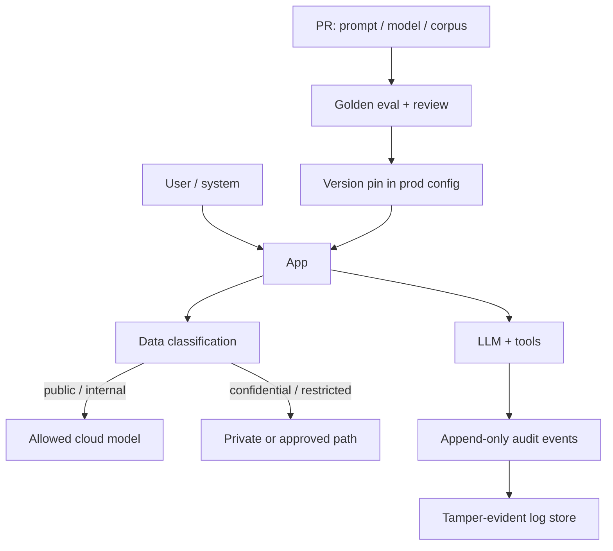

# Module 14 — Legal, Compliance & Governance

<span data-module-id="14" hidden></span>

**Time:** 3–5 days · **Depends on:** 02, 13 · **Next:** [Domain apps](15-domain-apps.md)

!!! warning "Not legal advice"
    This module is an **engineering orientation** for CS practitioners. It is **not** legal advice, a compliance certification, or a substitute for qualified counsel, privacy officers, or security review. Laws and contracts are jurisdiction- and product-specific. When in doubt, escalate to specialists before shipping regulated data flows.

---

## Learning objectives

- Map product data flows so privacy and security reviews have a single diagram of truth
- Implement append-oriented audit trails for high-impact model and tool actions
- Establish lightweight change management for prompts, tools, and model pins
- Classify data and route it according to policy (without inventing legal conclusions)

## What you can build

- Audit log schema for prompts/actions (hashes + redaction), using `src.audit`
- Data inventory table: training, RAG, logs, evals, vendors
- Model/prompt change approval checklist tied to eval evidence

---

## Why this matters (CS engineer)

<div class="aieng-story" markdown>

Enterprise security questionnaire, week before renewal. They ask: *Where does customer text go? How long do you keep it? Which model version answered ticket #88421 last Tuesday?* Your team discovers prompts in the default log stream, no data inventory for the vector index, and a system prompt last changed by “someone on-call” with no PR. Legal cannot answer “are we allowed to send this field to Vendor X?” because engineering never drew the map. The deal stalls — not because the model is weak, but because **controls and provenance** were an afterthought.

</div>

You already version APIs and database migrations. LLM systems introduce **new artifact types** that change behavior without a classic “code deploy”:

- Prompt templates and system policies  
- Retrieval corpora and chunking rules  
- Tool allowlists and agent max-steps  
- Model IDs and temperature defaults  

Regulators, enterprise customers, and your own incident process will ask: *What ran? On whose data? With which policy version? Can we prove it?* If the answer is “someone edited a string in prod,” you fail that interview.

Engineering’s job is **traceability, data hygiene, and change control** — the substrate lawyers and compliance teams need. You do not “self-certify GDPR.”

---

## Mental model



**Invariant:** every high-impact action is attributable (`actor`, `request_id`, `policy_version`, `model_id`) without dumping raw secrets into the default log stream.

<div class="aieng-intuition" markdown>

<p class="label">Intuition lock</p>

**Sticky picture:** **map the data first** (every store that touches user content). Audit is a **black-box recorder**: hashes and metadata in the default stream, full transcripts only in a restricted hangar when policy requires them. Engineers **build the controls**; counsel **owns the legal determination**.

<p class="kill"><strong>Kill this idea:</strong> “If we hash prompts and add a privacy policy page, we’re GDPR compliant.” Hashing is an engineering control. Compliance is a legal conclusion over the whole system — not a checkbox you invent in a PR description.</p>

</div>

---

## 1. Frameworks you will hear about

| Area | Examples (jurisdiction-dependent) | Engineering takeaway |
|------|-----------------------------------|----------------------|
| Privacy | GDPR, CCPA/CPRA, sector rules | Inventory, purpose limitation, deletion paths |
| Healthcare | HIPAA (US) and similar | BAAs, PHI minimization, access logs |
| Finance | SEC/FINRA recordkeeping, model risk guidance | Retention of advice-like outputs; model change control |
| AI / safety | EU AI Act risk tiers, internal AI policies | Risk classification → human oversight requirements |
| IP / training | Vendor DPAs, license constraints | Customer data not used for training without contract |

You do **not** need to memorize statutes. You need a **data-flow diagram** and a **subprocessor list** you can hand to counsel in one page.

<div class="aieng-explainer" markdown>

<p class="label">Explainer · engineering vs legal</p>

| Role | Owns |
|------|------|
| Legal / privacy | Interpretation of law, contracts, DPIAs, external commitments |
| Security | Threat model, access control, encryption standards |
| Engineering | Implementation: inventory, RBAC, audit events, retention jobs, version pins |
| Product | User-facing disclosures, consent UX (with legal review) |

If someone asks you “Are we GDPR compliant?” the correct engineering answer is: “Here is the data map, retention, and controls — counsel owns the compliance determination.”

</div>

---

## 2. Audit trail pattern

Prefer **append-only events** with **content hashes** over logging full sensitive prompts in the default stream. Full transcripts, when required, go to a restricted store with retention and access review.

### Course package: `src.audit`

Runnable and tested (`pytest tests/test_audit.py`):

```python
from pathlib import Path
from src.audit import AuditLog, make_event, sha256_text

# hash is stable; raw secret does not appear as plaintext field
assert sha256_text("secret prompt") == make_event(
    "user1", "query", "chat", "secret prompt", request_id="r1"
)["input_hash"]

log = AuditLog(path=Path("var/audit.jsonl"))
log.record(
    make_event(
        actor="user:42",
        action="tool.invoke",
        resource="ticket_update",
        raw_input="update ticket T-9 status=open",
        request_id="req-abc",
        policy_version="policy@v2",
        model_id="gpt-4o-mini",
        metadata={"tool": "tickets.update", "dry_run": False},
    )
)
```

Core shape (simplified from `src/audit.py`):

```python
from dataclasses import dataclass, asdict
from datetime import datetime, timezone
import hashlib
import json
from pathlib import Path
from typing import Any


def sha256_text(text: str) -> str:
    return hashlib.sha256(text.encode("utf-8")).hexdigest()


@dataclass
class AuditEvent:
    ts: str
    actor_id: str
    action: str
    resource: str
    request_id: str
    input_hash: str
    policy_version: str
    model_id: str | None = None
    metadata: dict[str, Any] | None = None


def make_event(
    actor: str,
    action: str,
    resource: str,
    raw_input: str,
    *,
    request_id: str = "",
    policy_version: str = "v1",
    model_id: str | None = None,
    metadata: dict[str, Any] | None = None,
) -> dict[str, Any]:
    ev = AuditEvent(
        ts=datetime.now(timezone.utc).isoformat(),
        actor_id=actor,
        action=action,
        resource=resource,
        request_id=request_id,
        input_hash=sha256_text(raw_input),
        policy_version=policy_version,
        model_id=model_id,
        metadata=metadata,
    )
    return asdict(ev)
```

**What to audit at minimum**

| Event class | Examples |
|-------------|----------|
| Generation | chat completion, batch classify |
| Retrieval | index id, top-k, corpus version |
| Tool / agent action | name, args summary, approval status |
| Policy decision | refuse, redact, escalate to human |
| Admin | prompt version promote, model pin change |

<div class="aieng-think" markdown>

<p class="label">Think · hash vs full body</p>

<details data-think-id="14-t1">
<summary>Reveal: when is a hash insufficient for audit?</summary>

Hashes prove “this exact input was processed” if you still hold the original under controlled access, or if you only need integrity checks. They are **insufficient** when a regulator or dispute process requires reconstructing what the user saw (e.g. financial advice-like text retention rules). In those cases you need **policy-driven retention of redacted or full transcripts** in a restricted store — not more fields in your debug logs. Design both layers; do not dump PHI into stdout “for safety.”

</details>

</div>

---

## 3. Data inventory (start here)

Before fancy classifiers, make a table. Here is a **worked sketch** for a support chatbot — copy the columns, replace the rows with your stores.

**Example flow:** user types a ticket → API redacts PII → prompt + retrieved chunks go to a cloud vendor → answer and citations return → traces land in the log pipeline → chunks sit in a vector index.

| Hop | Store | Typical class | Leaves your VPC? |
|-----|-------|---------------|------------------|
| 1 | App DB (ticket body, user email) | confidential | no |
| 2 | Vector index (chunk text from tickets/docs) | confidential — still personal data | no, unless hosted |
| 3 | LLM vendor (prompt + retrieved snippets) | confidential | **yes** — this is a subprocessor |
| 4 | APM / logs (request_id, hashes, maybe previews) | internal / confidential | maybe |
| 5 | Eval golden set (copied real tickets) | confidential | only if you export it |

If you cannot fill that table for *your* app, you are not ready for a vendor security questionnaire. Then generalize:

| Data store | Contains | Classification | Retention | Who accesses | Leaves environment? |
|------------|----------|----------------|-----------|--------------|---------------------|
| App DB | tickets, users | confidential | … | … | no / yes? |
| Vector index | chunk text | … | … | … | … |
| LLM vendor | prompts / outputs | … | per DPA | vendor subprocessors | **yes** |
| Observability | traces, logs | … | 7–30d typical | eng on-call | maybe |
| Eval golden set | labeled cases | … | long-lived | eng / QA | careful |
| Fine-tune set | examples | … | … | … | training risk |

### Classification labels (working set)

```text
public → internal → confidential → restricted
```

Map each class to **allowed model destinations** (public cloud mini vs private VPC endpoint vs “never leave premises”). That table is product policy; counsel reviews it for regulated sectors.

### Data governance checklist

- [ ] Inventory: training, RAG corpora, logs, eval sets, backups  
- [ ] Classification labels on stores and API fields  
- [ ] Retention & deletion workflows (including vectors and caches)  
- [ ] Vendor / subprocessor list with DPAs where needed  
- [ ] RBAC on indexes, traces, and transcript stores  
- [ ] Customer data never used for provider training without contract  

<div class="aieng-think" markdown>

<p class="label">Think · the store you forgot</p>

<details data-think-id="14-t2">
<summary>Reveal: which LLM-adjacent stores are most often missing from the first inventory?</summary>

Teams list “app DB” and “vendor API” and stop. Common misses: **embedding / vector indexes** (chunk text is still personal data), **prompt caches**, **eval golden sets** with real tickets, **browser or CDN logs**, **support tooling exports**, **fine-tune datasets**, and **replay buffers** for agents. If it can reconstruct what the user said or what you retrieved, it belongs on the map with classification, retention, and access control.

</details>

</div>

---

## 4. Change management for prompts & models

Treat prompts, tools, and models like production code:

1. **PR** with description of behavior change  
2. **Eval results** attached (golden subset + risk cases)  
3. **Reviewer approval** for high-risk surfaces (support, billing, health, finance UX)  
4. **Version pin** in prod config (`policy@v3`, `model=…`)  
5. **Rollback path** (previous pin is one config flip away)

```text
prompt_v3 ──eval pass──► config pin ──canary 5%──► 100%
                │                        │
                └──── fail ──────────────┴── rollback pin
```

Agent max-steps, tool allowlists, and temperature defaults belong in the same change process — they are behavior, not “infra trivia.”

<div class="aieng-explainer" markdown>

<p class="label">Explainer · model risk in plain English</p>

“Model risk” means: the system can make or influence decisions that harm users or the business if it is wrong, biased, or outdated. Banks and large enterprises already have model-risk programs for credit scoring; LLM apps inherit the same *idea* even when the formality differs. Your contribution is **documentation of intended use**, **limits**, **monitoring**, and **change history** — not a PhD thesis on fairness (unless that is your team’s mandate).

</div>

---

## 5. Minimal “allowed data by destination” table

Write this for *your* app (example only):

| Data class | On-prem SLM | Approved private endpoint | Public multi-tenant API |
|------------|-------------|---------------------------|-------------------------|
| Public docs | ✓ | ✓ | ✓ |
| Internal wiki | ✓ | ✓ | maybe (contract) |
| Customer confidential | ✓ | ✓ if DPA/BAA | ✗ |
| Restricted / secrets | ✓ or never to LLM | special review | ✗ |

Wire routing in code (Module 16) so the table is enforced, not a wiki wish.

---

## Failure modes

| Failure | Why it hurts | Mitigation |
|---------|--------------|------------|
| No data map | Privacy review stalls or misses stores | One living inventory diagram |
| Full prompts in Loki/CloudWatch | Leak + retention violations | Hash default; secure transcript store |
| Prompt hot-edit in prod | Unreproducible behavior | Version pins + PR |
| Eval set contains real PII | Secondary breach surface | Synthetic / redacted goldens |
| “We’ll be compliant later” | Retrofitting audit is expensive | Ship audit events with the feature |
| Engineering signs legal attestations | Wrong accountability | Escalate; do not self-certify |

---

## Lab

<div class="aieng-lab" markdown>

<p class="label">Lab · governance substrate</p>

1. Draw a data-flow diagram: user → API → model vendor → vector DB → logs/traces. Label each store with classification.
2. Use `src.audit.AuditLog` to record tool calls (or generation events) to a JSONL file; prove `for_actor` filters work via a small test or script.
3. Write a one-page **allowed data by model destination** table for your project.
4. Draft a PR checklist for prompt/model changes (eval evidence required).

</div>

---

## Quizzes

<div class="aieng-quiz" data-quiz-id="14-q1" data-xp="25" data-success="Right — this module builds engineering controls; counsel owns legal determinations." data-fail="Re-read the warning and explainer: engineers implement controls; they do not self-certify law." markdown>

<p class="label">Quiz · 25 XP</p>
<p class="quiz-prompt">A teammate asks you to “sign off that our chatbot is GDPR compliant.” What is the most appropriate engineering response?</p>
<div class="quiz-options">
<button type="button" class="quiz-opt" data-correct="false">Add a GDPR badge to the README and ship</button>
<button type="button" class="quiz-opt" data-correct="true">Provide the data map, retention, and audit controls; escalate legal determination to counsel/privacy</button>
<button type="button" class="quiz-opt" data-correct="false">Hash all user IDs and declare compliance complete</button>
<button type="button" class="quiz-opt" data-correct="false">Only use open-source models so GDPR does not apply</button>
</div>
<div class="quiz-feedback"></div>
</div>

<div class="aieng-quiz" data-quiz-id="14-q2" data-xp="25" data-success="Correct — hashes + policy version + actor support traceability without default plaintext dumps." data-fail="Look at make_event: we store input_hash and policy_version, not the raw secret in the event body." markdown>

<p class="label">Quiz · 25 XP</p>
<p class="quiz-prompt">Why does `make_event` store `input_hash` instead of the raw prompt by default?</p>
<div class="quiz-options">
<button type="button" class="quiz-opt" data-correct="false">SHA-256 compresses prompts for cheaper storage</button>
<button type="button" class="quiz-opt" data-correct="true">It supports integrity/attribution while reducing sensitive content in general-purpose logs</button>
<button type="button" class="quiz-opt" data-correct="false">Vendors reject requests that include audit metadata</button>
<button type="button" class="quiz-opt" data-correct="false">Hashes make model outputs deterministic</button>
</div>
<div class="quiz-feedback"></div>
</div>

---

## OSS & further materials

| Resource | Why |
|----------|-----|
| Course `src/audit.py` + `tests/test_audit.py` | Minimal append log you can extend |
| Module 02 Security | Injection, PII redaction, least privilege |
| Module 13 Production | Request IDs, structured logs, deploy pins |
| [OWASP LLM Top 10](https://owasp.org/www-project-top-10-for-large-language-model-applications/) | Security-oriented risk language |
| Vendor DPAs / trust centers | What subprocessors and training uses are allowed |

---

## Checkpoint

- [ ] You can list every system that stores user content  
- [ ] High-impact actions are auditable with `request_id` + policy/model versions  
- [ ] Prompt/model changes are versioned with an eval-backed rollback path  
- [ ] You treat this module as engineering controls — not legal certification  

<div class="aieng-complete" data-module-id="14" data-xp="80" markdown>
<p>Mark Module 14 complete when your data map and audit path exist for a real (even small) app.</p>
<button type="button">Complete module · +80 XP</button>
</div>

## Exercise

- **Catalog:** [EX-14 — Audit log](../reference/exercises.md#ex-14)
- **Prove:** Tool events are hashed to JSONL; raw secrets never appear on disk.
- **Test:** `pytest tests/test_audit.py -v`

**Next:** [Module 15 — Domain applications](15-domain-apps.md)
