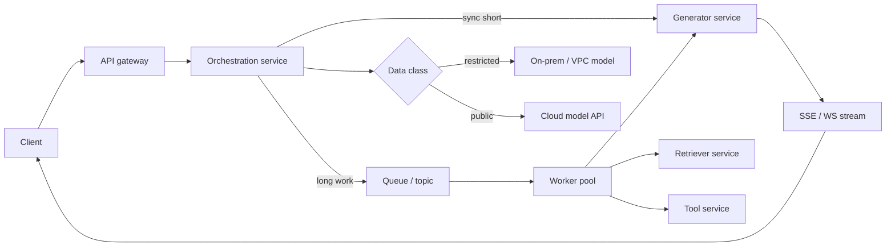

# Module 16 — Advanced Integration Patterns

<span data-module-id="16" hidden></span>

**Time:** 1–2 weeks · **Depends on:** 13 · **Next:** [Small models](17-small-models.md)

---

## Learning objectives

- Embed LLMs into event-driven and microservice architectures without blocking the UX tier
- Choose sync vs async vs batch generation paths with clear SLIs
- Route by **data class** in hybrid cloud / on-prem designs
- Stream tokens safely and version contracts between services

## What you can build

- Queue-backed generation workers with job status APIs
- Hybrid router (sensitive → on-prem; bulk → cloud)
- LLM microservice boundaries with gateway policies
- SSE/WebSocket streaming path with `request_id` propagation

---

## Why this matters (CS engineer)

<div class="aieng-story" markdown>

Product wants “chat that researches the whole corpus.” Engineering puts a multi-tool agent behind `POST /chat` with a 120s gateway timeout. Users refresh when the spinner stalls; each refresh starts a **new** agent run. Load balancers kill connections mid-flight; workers keep spending tokens; support cannot find which run belongs to which ticket because `request_id` dies at the first hop. Fixing it is not “a faster model” — it is **jobs, queues, and progressive delivery**, the same patterns you use for video encoding or report generation.

</div>

A single FastAPI handler that calls the model synchronously is fine for demos and low-QPS chat. Real platforms have **spikes**, **multi-minute agents**, **tenant isolation**, and **data residency**. If you bolt an LLM into a monolith request thread, you will hit: worker exhaustion, double-billing on retries, cross-tenant data leaks in shared caches, and “the API felt down” when only the model was slow.

Integration design is classic distributed systems — queues, backpressure, bulkheads, contracts — applied to stochastic generators and retrieval.

---

## Mental model



**Invariant:** long work is async; data class influences routing; service contracts are versioned; every hop carries `request_id`.

<div class="aieng-intuition" markdown>

<p class="label">Intuition lock</p>

**Sticky picture:** a long agent is a **background job**, not an HTTP handshake that hopes the client stays on the line. **`data_class` routes like security zones** (restricted traffic never crosses into the public-model lane). **Streaming** is progressive delivery of partial work — not a license to skip validation or durable state.

<p class="kill"><strong>Kill this idea:</strong> “Just raise the load balancer timeout to 15 minutes.” Timeouts hide the wrong architecture; users refresh, mobiles drop, and you still lack job status, cancel, and idempotency.</p>

</div>

---

## 1. Event-driven pipeline

```text
Producer → Kafka / SQS / PubSub topic → worker pool → results topic → consumers
```

```python
# Conceptual worker — enforce schema, authz, budget before calling the model
def handle_message(msg: dict, llm) -> dict:
    # msg: {id, prompt, model?, data_class, tenant_id, budget_tokens}
    prompt = msg["prompt"]
    # enforce schema, authz, budget
    text = llm(prompt)
    return {
        "id": msg["id"],
        "text": text,
        "model": msg.get("model"),
        "request_id": msg.get("request_id"),
    }
```

**Why queues help**

| Concern | Queue benefit |
|---------|----------------|
| Traffic spikes | Buffer instead of 503 storms |
| Retries | Poison-message handling, DLQ |
| Scale | Workers scale independently of API pods |
| Multi-consumer | Search index, CRM, email each subscribe to results |

<div class="aieng-explainer" markdown>

<p class="label">Explainer · at-least-once delivery</p>

Most queues deliver **at least once**. Your worker must be **idempotent** (same `id` processed twice → same outcome, no double side effects). Store a processed-id set, use idempotency keys for tools, and make “send email” an outbox step, not an inline side effect inside the LLM call.

</div>

---

## 2. Sync vs async vs batch

| Mode | Latency UX | Use | API shape |
|------|------------|-----|-----------|
| **Sync HTTP** | ms–few s | Chat turn, classify, extract | `POST /v1/generate` |
| **Async job** | seconds–minutes | Multi-doc agents, deep research | `POST /jobs` → `GET /jobs/{id}` |
| **Batch** | hours / nightly | Re-embed corpus, bulk classify | Object storage + scheduler |

```python
from enum import Enum
from dataclasses import dataclass
import uuid
import time


class JobStatus(str, Enum):
    queued = "queued"
    running = "running"
    done = "done"
    failed = "failed"


@dataclass
class Job:
    id: str
    status: JobStatus
    result: str | None = None
    error: str | None = None
    created_at: float = 0.0


# In-memory sketch — replace with Redis/DB + queue
JOBS: dict[str, Job] = {}


def enqueue_generate(prompt: str) -> str:
    jid = str(uuid.uuid4())
    JOBS[jid] = Job(id=jid, status=JobStatus.queued, created_at=time.time())
    # publish to queue: {"job_id": jid, "prompt": prompt}
    return jid


def get_job(jid: str) -> Job | None:
    return JOBS.get(jid)
```

**Rule of thumb:** never block a public request for a 10-minute agent run without streaming **or** a job UX. Mobile clients drop connections; load balancers time out; users refresh and double-submit.

<div class="aieng-think" markdown>

<p class="label">Think · picking a mode</p>

<details data-think-id="16-t1">
<summary>Reveal: sync, async, or batch?</summary>

- **Sync:** user waits in UI for &lt; ~5–15s work; single model call or short tool chain.  
- **Async job:** multi-step agent, many documents, or unpredictable tool latency; return `job_id` immediately.  
- **Batch:** no interactive user; rebuild embeddings after corpus update; overnight classification of yesterday’s tickets.  

If product wants “chat” but work is agentic and long, use **streaming partial updates** *plus* a durable job record so reconnects work.

</details>

</div>

---

## 3. Hybrid cloud / on-prem routing by data class

Pair with Module 14’s classification table. Routing is a **policy enforcement point**, not a performance micro-optimization alone.

```python
def route_endpoint(data_class: str, need_gpu: bool) -> str:
    """Return logical model endpoint name from data classification."""
    if data_class in {"confidential", "restricted"}:
        return "onprem-vllm"
    if need_gpu:
        return "cloud-gpu"
    return "cloud-mini"


def route_request(req: dict) -> str:
    return route_endpoint(
        data_class=req.get("data_class", "internal"),
        need_gpu=bool(req.get("need_gpu")),
    )
```

**Operational requirements**

- Tag every request with `data_class` (from auth context + payload inspection — do not trust the client blindly).  
- Private networking / VPC endpoints for sensitive paths.  
- CMEK / customer-managed keys when contracts require them.  
- Separate caches per tenant and class — no shared Redis keyspace for confidential completions.

<div class="aieng-explainer" markdown>

<p class="label">Explainer · security zones, not GPU shopping</p>

Hybrid routing fails when teams treat it as “pick the cheapest GPU.” The first question is **where this payload is allowed to go**. A public cloud mini model can be smarter and still be the wrong endpoint for restricted data. Encode the allowed-destination table (Module 14) in the router; measure cost and latency *within* each allowed lane.

</div>

---

## 4. Microservice boundaries

```text
API gateway → orchestration service → {retriever, tool service, generator}
```

| Service | Owns | SLIs |
|---------|------|------|
| **Gateway** | Authn/z, quotas, WAF | 4xx/5xx, admit rate |
| **Orchestration** | Workflow, job state, policy | success %, step count |
| **Retriever** | Indexes, hybrid search | hit rate, p95 latency |
| **Tool service** | Side effects, allowlists | error rate, approval lag |
| **Generator** | Model I/O only (stateless) | tokens/s, p95, fallback % |

**Design rules**

- Keep **generator** stateless — scale horizontally; pin model via config.  
- Version **tool contracts** like public APIs (`tools.tickets.v2`).  
- Own **retrieval** as a separate SLI; do not bury vector latency inside “model is slow.”  
- FastAPI / gRPC sketches from Module 13 apply; add gateway policies for auth and quotas.

```python
# Orchestrator pseudo-interface
class Orchestrator:
    def __init__(self, retriever, generator, tools, router):
        self.retriever = retriever
        self.generator = generator
        self.tools = tools
        self.router = router

    def answer(self, req: dict) -> dict:
        endpoint = self.router(req)
        docs = self.retriever.search(req["query"], tenant=req["tenant_id"])
        # optional: tool calls with policy
        text = self.generator.complete(
            prompt=build_prompt(req, docs),
            endpoint=endpoint,
            request_id=req["request_id"],
        )
        return {"text": text, "endpoint": endpoint, "doc_ids": [d.id for d in docs]}
```

---

## 5. Streaming

For chat UX, stream tokens (SSE or WebSocket).

**Engineering requirements**

- Propagate `request_id` on the stream (header or first event).  
- On **client disconnect**, cancel upstream generation when the provider supports it — stop burning tokens.  
- Do not assume the client received the full answer; persist final text server-side if needed for audit.  
- Heartbeats keep proxies from killing idle streams.  
- Backpressure: if the client is slow, bound buffers; drop or cancel rather than OOM.

```text
event: meta
data: {"request_id":"…","model":"…"}

event: token
data: {"t":"Hello"}

event: done
data: {"tokens_out":128}
```

<div class="aieng-explainer" markdown>

<p class="label">Explainer · streaming ≠ unvalidated</p>

Streaming improves perceived latency but does not remove the need for **output validation** (JSON schema, policy filters). Strategies: stream to UI for prose, but only **commit side effects** after a complete validated message; or stream only after a short non-streamed “plan/validate” phase for tool-heavy agents.

</div>

---

## 6. Putting it together: hybrid async worker

```python
def process_job(job: dict, llm_clients: dict) -> dict:
    """Worker entrypoint combining routing + generation."""
    endpoint = route_endpoint(job["data_class"], job.get("need_gpu", False))
    client = llm_clients[endpoint]
    try:
        text = client.generate(
            job["prompt"],
            timeout_s=job.get("timeout_s", 60),
            request_id=job["request_id"],
        )
        return {"id": job["id"], "status": "done", "text": text, "endpoint": endpoint}
    except Exception as e:
        # dead-letter after N failures at the queue layer
        return {"id": job["id"], "status": "failed", "error": type(e).__name__}
```

Load-test **p95 latency** and **error rate** separately for API tier vs worker tier. Document scaling knobs: worker concurrency, queue depth alerts, max tokens per tenant.

---

## Failure modes

| Failure | Symptom | Fix |
|---------|---------|-----|
| Sync agent in HTTP | Timeouts, double submit | Jobs + polling/SSE |
| Shared cache across tenants | Data leak | Tenant-prefixed keys, class isolation |
| No DLQ | Poison messages block partition | DLQ + alert |
| Client-trusted `data_class` | Restricted data → public model | Derive class server-side |
| Stream without cancel | Token burn after tab close | Abort upstream on disconnect |
| God orchestration service | Un-deployable ball of mud | Split retriever/tools/generator |

---

## Lab

<div class="aieng-lab" markdown>

<p class="label">Lab · from sync to integrated</p>

1. Move a sync generate endpoint to a **queue worker**; return `job_id` from `POST /jobs`.  
2. Tag requests with `data_class=public|internal|confidential` and **route** to different endpoints (can stub URLs).  
3. Add SSE streaming for the short path **or** job progress events for the long path.  
4. Load-test p95 latency and error rate; write down three scaling knobs.  
5. Verify `request_id` appears in API logs and worker logs for one end-to-end call.

</div>

---

## Quizzes

<div class="aieng-quiz" data-quiz-id="16-q1" data-xp="25" data-success="Correct — long, variable work belongs on jobs/queues, not a single blocking HTTP request." data-fail="Re-read sync vs async: multi-minute agents need job UX or streaming+durability." markdown>

<p class="label">Quiz · 25 XP</p>
<p class="quiz-prompt">A research agent may run 3–12 minutes with multiple tool calls. What integration pattern should the public API use by default?</p>
<div class="quiz-options">
<button type="button" class="quiz-opt" data-correct="false">One synchronous HTTP request with a 15-minute load balancer timeout</button>
<button type="button" class="quiz-opt" data-correct="true">Async job (queue + status API), optionally with streaming progress</button>
<button type="button" class="quiz-opt" data-correct="false">Only batch overnight — never allow interactive research</button>
<button type="button" class="quiz-opt" data-correct="false">Call the model directly from the mobile app SDK</button>
</div>
<div class="quiz-feedback"></div>
</div>

<div class="aieng-quiz" data-quiz-id="16-q2" data-xp="25" data-success="Yes — data class is a policy input that must be enforced server-side." data-fail="Hybrid routing is about where data is allowed to go, not only about GPU availability." markdown>

<p class="label">Quiz · 25 XP</p>
<p class="quiz-prompt">In a hybrid cloud design, what is the primary reason to route `restricted` data to an on-prem generator?</p>
<div class="quiz-options">
<button type="button" class="quiz-opt" data-correct="false">On-prem models always have higher accuracy</button>
<button type="button" class="quiz-opt" data-correct="true">Policy and data residency/control requirements limit where that data may be sent</button>
<button type="button" class="quiz-opt" data-correct="false">Queues do not work with cloud providers</button>
<button type="button" class="quiz-opt" data-correct="false">SSE streaming is impossible in the cloud</button>
</div>
<div class="quiz-feedback"></div>
</div>

---

## OSS & further materials

| Resource | Why |
|----------|-----|
| Module 13 Production | Timeouts, FastAPI, observability baseline |
| Module 14 Compliance | Data classification tables to enforce in routers |
| [NATS](https://nats.io/) / [Kafka](https://kafka.apache.org/) / cloud SQS | Work queues |
| [OpenTelemetry](https://opentelemetry.io/) | Trace context across services |
| gRPC + protobuf | Strict contracts between microservices |

---

## Checkpoint

- [ ] Long work is async (or streaming with durable job state)  
- [ ] Data class influences routing and is enforced server-side  
- [ ] Contracts between orchestrator, retriever, tools, and generator are versioned  
- [ ] `request_id` survives gateway → worker → model client  

<div class="aieng-complete" data-module-id="16" data-xp="100" markdown>
<p>Mark Module 16 complete when you have either a job pipeline or hybrid router working end-to-end.</p>
<button type="button">Complete module · +100 XP</button>
</div>

**Next:** [Module 17 — Small & local models](17-small-models.md)
