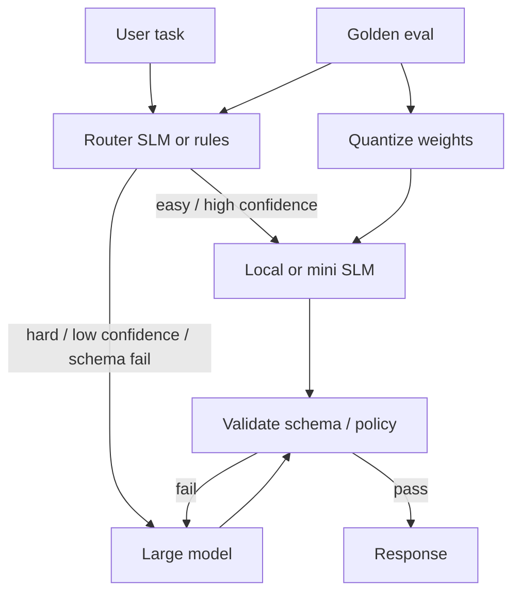

# Module 17 — Small & Local LLM Models

<span data-module-id="17" hidden></span>

**Time:** 5–7 days · **Depends on:** 01, 05, 10 · **Pairs with:** tracks using Phi / Ollama · **Next:** [Specialization tracks](../tracks/index.md)

---

## Learning objectives

- Match small language models (SLMs) to tasks they can actually own
- Run local inference with Ollama, llama.cpp, and/or vLLM
- Apply quantization deliberately and **re-eval** quality after every compress step
- Build a router that sends easy work to SLMs and hard work to larger models

## What you can build

- Offline / private assistant over local files
- Cheap classifier or router in front of a large model
- Quantized deployment on a laptop or small GPU with measured quality

---

## Why this matters (CS engineer)

<div class="aieng-story" markdown>

Finance wants the bill cut in half. The team swaps every call to a 3B local model “because demos looked fine,” then quantizes to Q4 so it fits on a laptop GPU. Schema pass rate on extraction collapses; the agent loops on tools the small model cannot plan. There was no **router**, no **re-eval after quant**, and no list of tasks the SLM actually owns. Cost went down; product quality and on-call load went up. The fix was not “bigger GPU” — it was **specialist first-line + escalate**, with golden metrics as the gate.

</div>

Not every token deserves a frontier model. Most production traffic is **classification, routing, extraction, short rewrite, and retrieval-augmented lookup** — tasks where a 1B–8B-class model (or a “mini” cloud tier) wins on **latency, cost, and privacy**. CS engineers who only know one cloud chat API overspend and cannot ship air-gapped or VPC-only features.

SLMs are not “GPT but free.” They need **tighter prompts, harder validation, and honest evals**. Treated as specialized workers in a system (Module 10 routing, Module 16 hybrid), they are one of the highest-ROI tools in the stack.

---

## Mental model



**Invariant:** choose SLMs by **task fit + measured quality**, not by parameter count marketing. Always re-run golden evals after quantization or prompt changes.

<div class="aieng-intuition" markdown>

<p class="label">Intuition lock</p>

**Sticky picture:** an SLM is a **specialist intern** — fast, cheap, great on narrow labeled work. A frontier model is the **senior consultant** you escalate to when confidence is low or the schema fails. **Quantize, then re-eval** (never blog-trust a quant level). Privacy and latency economics often justify local run even when raw accuracy is a few points lower *on the right tasks*.

<p class="kill"><strong>Kill this idea:</strong> “Small model = free GPT for everything.” Parameter count marketing is not a task assignment. Without routing and validation you only move failure modes around.</p>

</div>

---

## 1. Strengths and limits

| Advantages | Limits |
|------------|--------|
| Lower latency and $ per call | Weaker multi-step / long-horizon reasoning |
| Privacy and air-gap options | Smaller context (model-dependent) |
| Fine-tune / LoRA friendly on modest hardware | Brittle to sloppy or huge prompts |
| Edge and on-prem control | Gaps in world knowledge and some multilingual settings |
| Great as routers and extractors | Tool-heavy agents may thrash without strong validation |

**Modern families to evaluate (verify latest model cards):** Phi-class, Llama 3.x compact sizes, Gemma, Qwen2.5 smaller sizes, Mistral small models, and cloud “mini/haiku/flash” tiers when local is not required.

<div class="aieng-explainer" markdown>

<p class="label">Explainer · small ≠ weak at everything</p>

A 3B model that **only** outputs one of five labels with a strict schema can beat a frontier model on **cost-adjusted reliability** for that task. A 70B model asked to “handle the ticket” with no structure can still fail product SLOs. Task design and validation often matter more than raw size.

</div>

---

## 2. Local runtimes

| Runtime | Fit | Notes |
|---------|-----|-------|
| [Ollama](https://ollama.com) | Dev laptop ergonomics | Pull/run UX; good default for learning |
| [llama.cpp](https://github.com/ggerganov/llama.cpp) | CPU / Apple Metal, GGUF | Fine control of quant and threads |
| vLLM / TGI | Throughput serving on GPU | Batching, continuous batching for multi-user |
| LM Studio | GUI exploration | Fast qualitative checks |

```bash
# Ollama quickstart (install from ollama.com first)
ollama pull llama3.2
ollama run llama3.2 "Summarize RAG in 3 bullets."

# OpenAI-compatible local endpoint (typical pattern)
# curl http://localhost:11434/v1/chat/completions ...
```

```python
# Conceptual OpenAI-compatible client pointed at local server
from openai import OpenAI

client = OpenAI(base_url="http://localhost:11434/v1", api_key="ollama")


def local_chat(prompt: str, model: str = "llama3.2") -> str:
    resp = client.chat.completions.create(
        model=model,
        messages=[{"role": "user", "content": prompt}],
        temperature=0.2,
    )
    return resp.choices[0].message.content or ""
```

**Serving note:** for multi-user prod on GPU, prefer vLLM/TGI-style servers; Ollama is excellent for dev and small deployments but measure concurrency limits before betting the company on it.

---

## 3. Prompting SLMs well

- **Shorter instructions**; explicit output formats  
- **More few-shot** when structure is fragile  
- **Decompose** → many small calls beat one giant reasoning soup  
- **Validate hard** (JSON schema, enum labels, regex)  
- Prefer temperature **0–0.2** for extract/classify  

```python
def classify_short(text: str, labels: list[str], llm) -> str:
    label_line = ", ".join(labels)
    prompt = (
        f"Classify into exactly one label: {label_line}.\n"
        f"Reply with the label only.\n\nText: {text}"
    )
    out = llm(prompt).strip()
    if out not in labels:
        raise ValueError(f"invalid_label:{out!r}")
    return out
```

On schema failure: **retry once with a repair prompt**, then **escalate** to a larger model (router pattern below).

<div class="aieng-think" markdown>

<p class="label">Think · when not to use an SLM</p>

<details data-think-id="17-t1">
<summary>Reveal: red flags that you need a larger model (or a non-LLM system)</summary>

- Multi-hop reasoning over long, conflicting documents without a strong RAG scaffold  
- Open-ended strategy / novel coding on large repos  
- Safety-critical nuance where small models fail your golden **risk** cases  
- Tasks already solved better by rules, SQL, or classical ML classifiers  

If a deterministic extractor works, do not pay for tokens — small or large.

</details>

</div>

---

## 4. Quantization

Quantization reduces weight precision so models fit in RAM/VRAM and run faster — **at a quality cost you must measure**.

| Approach | Notes |
|----------|-------|
| 8-bit / 4-bit weights | Big VRAM wins; measure task metrics |
| GGUF Q4 / Q5 / Q6 | Common for llama.cpp / Ollama |
| Speculative decoding | Draft small model + verify large (advanced speed) |
| Distillation | Teacher large → student small (training pipeline) |

```text
FP16 model → quantize Q4 → golden eval
                │
                ├─ pass SLO → ship Q4
                └─ fail → try Q5/Q8, different model, or keep FP16 for hard path only
```

**Rules**

1. Never ship a quant level because a blog said “Q4 is fine.”  
2. Re-run **your** golden set (Module 04) after every quant change.  
3. Watch **refuse / schema failure rate**, not only average “vibe.”  
4. You may run **Q4 for router** and **higher precision for final answer** on the same host.

<div class="aieng-explainer" markdown>

<p class="label">Explainer · quality cliffs</p>

Quantization error is uneven: some tasks (sentiment, short classify) stay flat until aggressive quants; others (multi-digit reasoning, brittle JSON) fall off a cliff. Plot metric vs quant level. The right product answer is often **mixed precision routing**, not one global quant for every call.

</div>

---

## 5. Router pattern (highest ROI)

```text
User → cheap SLM router / rules
         ├─ easy → SLM answer (+ validate)
         └─ hard / low confidence / validation fail → large model
```

```python
from dataclasses import dataclass


@dataclass
class RouteDecision:
    model: str
    reason: str


class ModelRouter:
    def __init__(self, cheap: str, strong: str):
        self.cheap = cheap
        self.strong = strong

    def pick(self, task: str, prompt: str, *, confidence: float | None = None) -> RouteDecision:
        if task in {"classify", "route", "extract_fields"}:
            return RouteDecision(self.cheap, "narrow_task")
        if task == "complex_reason" or len(prompt) > 8000:
            return RouteDecision(self.strong, "hard_or_long")
        if confidence is not None and confidence < 0.6:
            return RouteDecision(self.strong, "low_confidence")
        return RouteDecision(self.cheap, "default_cheap")


def generate_with_escalation(task: str, prompt: str, llms: dict, router: ModelRouter) -> str:
    decision = router.pick(task, prompt)
    text = llms[decision.model](prompt)
    # example: escalate if JSON parse fails
    if task == "extract_fields":
        try:
            import json

            json.loads(text)
        except Exception:
            text = llms[router.strong](prompt)
    return text
```

Combine with Module 10 cost ledgers: track **% escalated**, **$ per successful task**, and **quality** on a fixed eval set.

<div class="aieng-think" markdown>

<p class="label">Think · economics of escalate</p>

<details data-think-id="17-t2">
<summary>Reveal: when is a high escalate rate still a win?</summary>

If 80% of traffic is cheap classify/extract that the SLM nails, and 20% escalates to a large model, blended **$ per success** and p95 can still beat “always large” — *if* escalate catches the hard tail and quality SLOs hold. A 90% escalate rate means your router is noise: fix task labels, prompts, or stop pretending the SLM owns the hard path. Track escalate rate next to quality; optimize the blend, not “never call large.”

</details>

</div>

---

## 6. SLMs + RAG + privacy

Local models shine when documents must not leave the device or VPC:

1. Embed and retrieve on-prem (or on-laptop).  
2. Generate with local SLM grounded on retrieved chunks.  
3. Keep audit logs local (Module 14).  

Still apply **injection hygiene** (Module 02): retrieved text is data, not instructions. Small models can be *more* suggestible — validation and allowlisted tools matter more, not less.

---

## Failure modes

| Failure | Symptom | Fix |
|---------|---------|-----|
| One giant prompt to 3B | Gibberish / truncate | Decompose + retrieve less junk |
| Quant without eval | Silent quality drop | Golden suite gate |
| SLM as sole agent brain | Looping tools, bad plans | Router + max steps + large-model escalate |
| Trusting “label only” without check | Free-form prose labels | Enum validate / repair / escalate |
| Undersized context | Lost instructions | Shorter system prompts; external memory |
| Local server open to LAN | Data exposure | Bind localhost / auth / firewall |

---

## Lab

<div class="aieng-lab" markdown>

<p class="label">Lab · measure before you commit</p>

1. Run a **3B–8B-class** model locally (Ollama is fine) on **20 golden tasks** from your project.  
2. Score accuracy / schema-pass vs a cloud mini model on the same set.  
3. Implement confidence or validation routing (schema fail → escalate).  
4. If you quantize (e.g. compare two GGUF levels), **re-run the same 20** and record the delta.  
5. Write a short decision: which tasks SLM owns, which escalate, and why.

</div>

---

## Quizzes

<div class="aieng-quiz" data-quiz-id="17-q1" data-xp="25" data-success="Correct — quantization is a product decision only after evals say quality is still good enough." data-fail="Re-read §4: always re-run golden evals after quantizing." markdown>

<p class="label">Quiz · 25 XP</p>
<p class="quiz-prompt">You quantize a local model from Q8 to Q4 to fit on a laptop. What must you do before shipping?</p>
<div class="quiz-options">
<button type="button" class="quiz-opt" data-correct="false">Nothing — Q4 is always within 1% of FP16</button>
<button type="button" class="quiz-opt" data-correct="true">Re-run your golden evals and compare task metrics / failure modes</button>
<button type="button" class="quiz-opt" data-correct="false">Only check that `ollama run` still prints text</button>
<button type="button" class="quiz-opt" data-correct="false">Switch temperature to 1.0 to compensate</button>
</div>
<div class="quiz-feedback"></div>
</div>

<div class="aieng-quiz" data-quiz-id="17-q2" data-xp="25" data-success="Yes — routers + validation capture most of the economic win." data-fail="Think about Module 10/17: SLMs as first-line workers with escalate paths." markdown>

<p class="label">Quiz · 25 XP</p>
<p class="quiz-prompt">What is usually the highest-ROI production pattern involving SLMs?</p>
<div class="quiz-options">
<button type="button" class="quiz-opt" data-correct="false">Replace every frontier call with the smallest model that fits in RAM, no validation</button>
<button type="button" class="quiz-opt" data-correct="true">Use an SLM (or rules) to handle easy tasks and route hard/low-confidence work to a larger model</button>
<button type="button" class="quiz-opt" data-correct="false">Always ensemble five SLMs and majority vote</button>
<button type="button" class="quiz-opt" data-correct="false">Fine-tune a 70B model on a laptop overnight</button>
</div>
<div class="quiz-feedback"></div>
</div>

---

## OSS & further materials

| Resource | Why |
|----------|-----|
| [Ollama](https://ollama.com) | Fast local dev loop |
| [llama.cpp](https://github.com/ggerganov/llama.cpp) | GGUF + CPU/Metal control |
| [vLLM](https://github.com/vllm-project/vllm) | High-throughput GPU serving |
| Hugging Face model cards | License, context length, intended use |
| Module 10 Cost optimization | Routing and unit economics |
| Module 04 Testing & evals | Golden sets for quant gates |

---

## Checkpoint

- [ ] You ran at least one local model end-to-end  
- [ ] You know which of *your* tasks SLMs can own  
- [ ] Quantization (if any) is eval-backed  
- [ ] A router or validation-escalation path exists on paper or in code  

<div class="aieng-complete" data-module-id="17" data-xp="100" markdown>
<p>Mark Module 17 complete when local run + eval comparison are done honestly.</p>
<button type="button">Complete module · +100 XP</button>
</div>

**Next:** Pick a [specialization track](../tracks/index.md) or review [Troubleshooting](../reference/troubleshooting.md)
