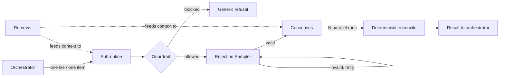

# Module 18 — Agent Design Patterns

<span data-module-id="18" hidden></span>

**Time:** 5–8 days · **Depends on:** [11 Single agents](11-single-agents.md), [12 Multi-agent systems](12-multi-agents.md) · **Pairs with:** [09 Advanced RAG](09-advanced-rag.md) · **Next:** [Orchestration patterns](19-orchestration-patterns.md)

---

## Learning objectives

- Decompose an agent workflow into small, testable, single-purpose units instead of one long reasoning loop
- Place **gates** at agent/tool/user boundaries that block unsafe or noncompliant content without leaking why
- Use **rejection sampling** to enforce format and quality contracts cheaply, and know when it can't fix a real bug
- Use **consensus** (parallel independent runs + deterministic reconciliation) to raise reliability and estimate confidence
- Use a two-stage **retriever** (cheap recall → expensive precision) to keep massive corpora out of the context window

## What you can build

- A field-extraction subroutine with a validated schema boundary
- A tool gate that blocks destructive or cross-tenant database writes
- A rejection sampler that retries a JSON-mode call until it parses, with a hard budget
- A consensus ensemble that reports both an answer and a confidence score
- A hybrid retriever with reciprocal rank fusion and an adaptive re-query loop

---

## Why this matters (CS engineer)

<div class="aieng-story" markdown>

A team builds an agent to scan a missing person's hard drive: one big "reason and act" loop reading file after file, deciding what's relevant, summarizing as it goes. It works on the demo laptop with 200 files. On a real 400GB drive it blows the context window by lunch, drifts off-task after a few hundred files, and takes eleven hours because every step waits on the last one. The fix isn't a bigger context window — it's decomposition: a **subroutine** that extracts facts from one file at a time (parallelizable, stateless, disposable reasoning), a **guardrail** that keeps PII out of the running case file, a **rejection sampler** that guarantees each extraction parses as JSON, and a **retriever** that means the agent never has to "read everything" to answer "did we see a passport photo."

</div>

Single-agent loops (Module 11) and multi-agent topologies (Module 12) tell you *when* to split work into roles. This module is about the smaller-grained patterns you reach for **inside** a role, or at the seams between roles, once you already know a split is justified — the load-bearing engineering primitives, not the org chart.

### Already taught vs this module

These names are **not** new inventions. They are the same levers from earlier modules, sized as *leaf units* you can test in isolation.

| Pattern here | You met it as | What is new |
|--------------|---------------|-------------|
| Subroutine | “One prompt per job” (01), extract-then-generate (03) | Isolated call with discarded scratch; orchestrator never sees CoT |
| Guardrail | Sanitize + tool allowlist (02, 07, 11) | Named gate types (handoff / tool / egress) and **split internal vs user messages** |
| Rejection Sampler | Retry-until-parse (03), self-consistency cousin (03) | **Same prompt**, no feedback; budget then escalate — not a repair loop |
| Consensus | Self-consistency majority vote (03) | Parallel N + **deterministic** reconcile + entropy as a confidence proxy |
| Retriever | TinyRAG (07), hybrid + RRF + rerank (09) | Two-stage funnel as an agent *primitive*, plus adaptive re-query |

If you cannot name the **failure mode**, do not add a pattern. Module 19 then composes these leaves into workflow *shape* (map-reduce, planner, ReAct, …).

---

## Mental model



**Invariant:** every pattern here returns a small, validated, disposable result to its caller — none of them mutate agent state directly, and none of them are a substitute for deciding *whether* to split work in the first place (that's Modules 11–12).

<div class="aieng-intuition" markdown>
<p class="label">Intuition lock</p>

**Sticky picture:** a Subroutine is a **pure function call** the agent makes, not a chat turn. A Guardrail is a **firewall rule**, not a debate. A Rejection Sampler is **rerolling dice**, not editing the outcome. Consensus is **N independent witnesses reconciled by a clerk**, not a group chat. A Retriever is **an index lookup before you open the book**, not reading the whole shelf.

<div class="kill" markdown>
**Kill this idea:** "Just give the model a bigger context window and let it figure it out." → **Replace with:** decompose into the smallest pattern that solves the actual failure mode (format drift → Rejection Sampler; unreliable reasoning → Consensus; unsafe output → Guardrail; corpus too big → Retriever; task too broad → Subroutine).
</div>
</div>

---

## Core tutorial

### 1. Subroutine — the leaf unit of work

**Idea:** pull one narrow job out of the agent's reasoning loop, run it in isolation with its own context and its own model call, return only the final value, and discard everything else — chain-of-thought, retries, tool calls. The orchestrator never sees that mess.

**Defining properties:** unifunctional (does one thing), unidirectional (input → output, no back-and-forth), discards intermediate reasoning, has no side effects on agent state, small enough to be trivially testable.

```python
from anthropic import Anthropic
from pydantic import BaseModel, ValidationError

client = Anthropic()

class InvoiceFields(BaseModel):
    vendor: str
    invoice_number: str
    total_cents: int
    due_date: str  # ISO-8601

def extract_invoice_fields(raw_ocr_text: str) -> InvoiceFields:
    """Subroutine: OCR text -> structured invoice fields.
    No memory of prior calls, no access to agent state, one shot in/out.
    """
    resp = client.messages.create(
        model="claude-sonnet-xxxxxx",  # placeholder
        max_tokens=300,
        system=(
            "Extract invoice fields from OCR text. "
            "Respond with ONLY a JSON object matching this schema: "
            "{vendor: str, invoice_number: str, total_cents: int, due_date: str (ISO-8601)}"
        ),
        messages=[{"role": "user", "content": raw_ocr_text}],
    )
    raw = resp.content[0].text
    try:
        return InvoiceFields.model_validate_json(raw)
    except ValidationError as e:
        raise ValueError(f"subroutine produced non-conforming output: {e}") from e

# Orchestrator only ever sees the validated object — reasoning trace discarded.
fields = extract_invoice_fields(ocr_dump)
```

**Trade-off:** subroutines multiply model calls, and each call re-pays the shared context (system prompt, schema, instructions). Mitigate with prompt caching when the shared portion is stable across calls.

<div class="aieng-explainer" markdown>
<p class="label">Explainer</p>

**A subroutine is a pure function, not a chat turn.** Input in, validated object out, memory of the call dropped. That is why it is testable: you can fixture `raw_ocr_text` and assert `total_cents` without standing up an agent loop. If the extract step needs “what we already know about this vendor,” you leaked agent state into the leaf — promote that fact to an explicit argument instead of a hidden scratchpad. Use a subroutine when the job is narrow and repeatable (one file, one field set, one label). Keep a loop (Module 11) when the *next* action depends on the last observation.
</div>

**Common uses:** formatting, classification/tagging, pass/fail judging, information extraction — see the pattern table below.

| Use case | Example |
|---|---|
| Formatting | Force math answers into `<answer>N</answer>` |
| Classification | Sentiment tag, ticket routing category |
| Judging | Pass/fail verdict on a draft |
| Extraction | Invoice fields, form fields, entities |

---

### 2. Guardrail — a gate at a boundary

**Idea:** a cheap, narrow, hard-to-fool classifier sits at a boundary and makes one binary call — forward or block. It never edits content; editing is a different job entirely.

**Three boundaries, three names:**

| Boundary | Sits between | Name |
|---|---|---|
| Two subagents | Handoff between roles | **Handoff Gate** |
| Agent and an external system | Tool call, database, API | **Tool Gate** |
| Agent and the user | Final response | **Egress Gate** |

The critical detail: **the internal block reason and the user-facing message are two different strings.** Leaking *why* something was blocked is itself an attack surface — adversaries iterate on the rejection reason to find a bypass.

```python
from dataclasses import dataclass
from enum import Enum

class GateVerdict(Enum):
    ALLOW = "allow"
    BLOCK = "block"

@dataclass
class GateResult:
    verdict: GateVerdict
    internal_reason: str | None = None   # visible to orchestrator / logs
    user_message: str | None = None      # generic, no info leak

def sql_write_gate(proposed_sql: str, tenant_id: str) -> GateResult:
    """Tool Gate: runs before any agent-proposed SQL touches the database."""
    lowered = proposed_sql.lower()

    if any(kw in lowered for kw in ("drop table", "truncate", "delete from users")):
        return GateResult(
            verdict=GateVerdict.BLOCK,
            internal_reason="destructive statement blocked by static rule",
            user_message="I can't make that change directly — let's use a safer approach.",
        )

    if "where" in lowered and f"tenant_id = '{tenant_id}'" not in lowered:
        return GateResult(
            verdict=GateVerdict.BLOCK,
            internal_reason="query missing tenant_id scoping — possible cross-tenant leak",
            user_message="That request couldn't be completed. Let's try rephrasing it.",
        )

    return GateResult(verdict=GateVerdict.ALLOW)

def execute_tool_call(sql: str, tenant_id: str, db):
    gate = sql_write_gate(sql, tenant_id)
    if gate.verdict is GateVerdict.BLOCK:
        log.warning("tool_gate_blocked", reason=gate.internal_reason, sql=sql)
        return {"error": gate.user_message}
    return db.execute(sql)
```

**Deployment timing variants:**

| Variant | When it runs | Trade-off |
|---|---|---|
| **Sequential** | After output is fully generated | Simple, adds full latency |
| **Parallel** | While the agent is still generating | Lower latency, wastes compute if it ends up blocking |
| **Buffered** | After the full input is available | Straightforward, no partial view |
| **Streaming** | On incomplete input as it streams | Lowest latency, only safe in closed ecosystems |
| **Resampling** | Combined with a Rejection Sampler (§3) | Retries generation instead of returning a static error |

<div class="aieng-explainer" markdown>
<p class="label">Explainer</p>

**A guardrail is a firewall rule, not a debate.** It returns allow or block. It does not rewrite the SQL to be “safer,” and it does not explain the regex to the user. The internal reason is for your logs and the orchestrator; the user message is generic on purpose. If you leak “blocked because tenant_id missing,” an attacker iterates until the string matches. If you *edit* the content instead of blocking, you have a different pattern (a sanitizer or a refiner) — useful, but no longer a gate you can prove in a unit test with two outcomes.
</div>

---

### 3. Rejection Sampler — retry, don't repair

**Idea:** this is [rejection sampling](https://en.wikipedia.org/wiki/Rejection_sampling) applied to LLM output. Don't try to *fix* a noncompliant response — sample again with the **exact same prompt**, unmodified, and lean on the model's stochasticity to eventually produce something that passes a cheap, deterministic check.

**Defining property — no feedback:** the prompt is identical on every trial. Telling the model what it got wrong turns this into a different pattern (a **Refiner**), and invites the model to game the assessment criteria instead of genuinely retrying.

```python
import json
from dataclasses import dataclass
from typing import Callable, TypeVar

T = TypeVar("T")

@dataclass
class RejectionSamplerResult:
    value: T | None
    accepted: bool
    trials_used: int

def rejection_sample(
    worker: Callable[[], str],
    assess: Callable[[str], bool],
    parse: Callable[[str], T],
    max_trials: int = 4,
) -> RejectionSamplerResult:
    for trial in range(1, max_trials + 1):
        candidate = worker()               # SAME prompt every time — no feedback injected
        if assess(candidate):
            return RejectionSamplerResult(parse(candidate), True, trial)
    return RejectionSamplerResult(None, False, max_trials)

def worker() -> str:
    resp = client.messages.create(
        model="claude-sonnet-xxxxxx",  # placeholder
        max_tokens=200,
        temperature=1.0,
        messages=[{"role": "user", "content": "Return the extracted date range as JSON: {start, end}"}],
    )
    return resp.content[0].text

def is_valid_json_range(text: str) -> bool:
    try:
        obj = json.loads(text)
        return set(obj.keys()) == {"start", "end"}
    except (json.JSONDecodeError, AttributeError):
        return False

result = rejection_sample(worker, is_valid_json_range, json.loads, max_trials=4)
if not result.accepted:
    # budget exhausted — do NOT silently return None. Escalate to a
    # feedback-driven Refiner, or a human queue.
    escalate_to_refiner(...)
```

**Two variants:**

- **Resampling Guardrail** — a Rejection Sampler wrapped around a Guardrail (§2): instead of returning a static block, re-generate until a passing response is produced or the budget is exhausted.
- **Input-Stochastic Resampler** — used when the worker isn't random enough on its own. Perturb the *input* each trial (paraphrase the prompt, shuffle documents, subsample candidates) to force different trajectories.

**Limits:** poorly suited to security (never rely on chance to plug a data leak — use a Guardrail instead) and to deep systemic errors (a model that fundamentally can't do the task won't succeed on trial 20 either — that needs a Refiner or a different model).

<div class="aieng-explainer" markdown>
<p class="label">Explainer</p>

**Reroll the dice; do not coach the player.** Temperature > 0 means two calls with the identical prompt can still differ. Rejection sampling bets that *format* noise is random: the third JSON blob will parse even if the first two had a trailing comma. The moment you paste “you forgot the `end` key” into the next prompt, the model can game the checker (emit a fake key, wrap the error in valid JSON, etc.). That coaching loop is a **Refiner** — right for *content* bugs, wrong for *format* luck. Cap trials. When the budget is gone, escalate; do not return `None` into a payment path.
</div>

---

### 4. Consensus — parallel independent runs, deterministic reconciliation

**Idea:** run the same (or deliberately varied) worker N times in parallel and combine results with **dumb, deterministic code** — the aggregation step is never itself another model call. Independent reasoning errors tend to cancel out; a consistent signal survives.

```python
from collections import Counter
from concurrent.futures import ThreadPoolExecutor
import math

def solve_once(problem: str) -> str:
    resp = client.messages.create(
        model="claude-sonnet-xxxxxx",  # placeholder
        max_tokens=800,
        temperature=1.0,   # non-zero temp is required for genuine diversity
        messages=[{"role": "user", "content": f"{problem}\nEnd with 'ANSWER: <value>'"}],
    )
    return resp.content[0].text.rsplit("ANSWER:", 1)[-1].strip()

def consensus(problem: str, n: int = 8) -> dict:
    with ThreadPoolExecutor(max_workers=n) as pool:
        votes = list(pool.map(lambda _: solve_once(problem), range(n)))

    tally = Counter(votes)
    total = sum(tally.values())
    winner, winner_count = tally.most_common(1)[0]

    # Shannon entropy of the vote distribution — cheap, deterministic confidence proxy
    probs = [c / total for c in tally.values()]
    entropy = -sum(p * math.log2(p) for p in probs)
    max_entropy = math.log2(len(tally)) if len(tally) > 1 else 1

    return {
        "answer": winner,
        "confidence": winner_count / total,
        "normalized_entropy": entropy / max_entropy if max_entropy else 0.0,  # 0 = unanimous, 1 = max disagreement
        "raw_votes": dict(tally),
    }

result = consensus("A train leaves at 60mph...", n=8)
if result["normalized_entropy"] > 0.7:
    route_to_human_review(result)   # low confidence -> don't trust the majority blindly
```

**Variants:**

| Variant | Workers | Objective | Reconciliation |
|---|---|---|---|
| **Consensus (standard)** | Same model/prompt | Shared | Majority vote / probability weighting |
| **Committee** | Different models or personas | Shared | Majority vote, or averaged scores |
| **Divergent Committee** | Deliberately different objectives | Different | Union of findings (agreement on the *complete set*, not one value) |

The Divergent Committee variant doesn't converge on a single answer — its "consensus" is agreement that a compiled list captures every distinct finding surfaced by any member. Don't force a majority vote where a union is the right reconciliation.

**Trade-off:** cost and latency multiply by N. Reserve for tasks where a wrong single-shot answer is expensive and independent errors are plausible (math, judging, safety-adjacent classification) — not for tasks with one obviously correct deterministic path.

<div class="aieng-explainer" markdown>
<p class="label">Explainer</p>

**N independent witnesses, one clerk.** The clerk is *code* (`Counter`, a median, a union) — never another model that “summarizes the votes.” A second model in the merge step reintroduces the same bias you were averaging out. Self-consistency in Module 03 is the same idea on one prompt; Consensus here makes the parallel fan-out and the confidence number (vote share, entropy) explicit so you can route low-agreement cases to a human. If every worker is the same model with the same blind spot, majority vote is a louder wrong answer — switch to a Committee (different models or personas) instead of raising N.
</div>

---

### 5. Retriever — cheap recall, then expensive precision

**Idea:** a two-stage funnel. A cheap, high-recall search pass narrows a massive corpus down to a shortlist; an expensive, high-precision pass re-ranks that shortlist so the agent only ever reads the handful of items that actually matter.

```python
from dataclasses import dataclass

@dataclass
class Candidate:
    doc_id: str
    text: str

def reciprocal_rank_fusion(dense: list[Candidate], sparse: list[Candidate], k: int = 60) -> list[Candidate]:
    scores: dict[str, float] = {}
    by_id: dict[str, Candidate] = {}
    for rank, c in enumerate(dense, start=1):
        scores[c.doc_id] = scores.get(c.doc_id, 0) + 1 / (k + rank)
        by_id[c.doc_id] = c
    for rank, c in enumerate(sparse, start=1):
        scores[c.doc_id] = scores.get(c.doc_id, 0) + 1 / (k + rank)
        by_id.setdefault(c.doc_id, c)
    ranked_ids = sorted(scores, key=scores.get, reverse=True)
    return [by_id[i] for i in ranked_ids]

def rerank(query: str, candidates: list[Candidate], top_k: int = 3) -> list[Candidate]:
    """Expensive stage: cross-encoder or LLM judges relevance precisely."""
    scored = cross_encoder.score(query, [c.text for c in candidates])
    ranked = sorted(zip(candidates, scored), key=lambda pair: pair[1], reverse=True)
    return [c for c, _ in ranked[:top_k]]

def adaptive_retrieve(query: str, max_reformulations: int = 2) -> list[Candidate]:
    """Adaptive Retriever: re-query when the first pass doesn't clear a relevance floor."""
    top: list[Candidate] = []
    for _ in range(max_reformulations + 1):
        dense = vector_db.search(embed(query), top_k=50)
        sparse = bm25_index.search(query, top_k=50)
        fused = reciprocal_rank_fusion(dense, sparse)
        top = rerank(query, fused, top_k=3)

        if any(cross_encoder.score(query, [c.text])[0] > 0.5 for c in top):
            return top

        query = reformulate_query(query)  # e.g. LLM call: "rephrase this search query more specifically"
    return top  # best effort after exhausting the reformulation budget
```

**Two variants:**

- **Hybrid Retriever** — the pattern above: dense (semantic) + sparse (keyword) search fused with Reciprocal Rank Fusion, combining strength on concepts ("connection issues") with strength on exact identifiers ("Error 0x80040").
- **Adaptive Retriever** — wraps a Hybrid Retriever with a relevance floor and a bounded re-query loop (shown above). Distinct from the Rejection Sampler (§3): it mutates the *query* between attempts rather than resampling the same request unchanged.

**Trade-off:** re-ranking and query reformulation add latency in exchange for precision. Measure retrieval hit-rate and p95 latency as their own SLI (Module 16) — don't bury vector-search latency inside "the model is slow."

<div class="aieng-explainer" markdown>
<p class="label">Explainer</p>

**Look up the shelf, then open two books — do not read the library.** Stage 1 (BM25 + dense + RRF) optimizes *recall*: the gold doc must be in a shortlist of ~50. Stage 2 (cross-encoder) optimizes *precision*: the three passages that enter the window should actually answer the question. Adaptive re-query mutates the *search string* when that floor fails; that is different from a Rejection Sampler, which mutates nothing and hopes the *generator* rolls a valid JSON. Module 09 is the full search-system treatment. Here the retriever is a leaf the agent calls, with a budget on reformulations so it cannot become an uncapped browse loop.
</div>

---

## Failure modes

| Symptom | Likely cause | Fix |
|---|---|---|
| Agent context blows up mid-task | No Subroutine decomposition; one giant loop reads everything | Split into leaf Subroutines with discarded reasoning traces |
| Blocked users find workarounds fast | Guardrail leaks its block reason externally | Separate internal reason / external message (Egress Gate) |
| Rejection Sampler burns budget every time | Task has a systemic error, not a formatting fluke | Switch to a Refiner (feedback loop) or fix the worker prompt |
| Consensus majority is confidently wrong | All N runs share a common blind spot (same model, same bias) | Use a Committee with varied models/personas instead of same-model Consensus |
| Retriever returns confident garbage | No relevance floor before handing results to the agent | Add a re-rank threshold; use Adaptive Retriever to re-query below it |
| Everything is a pattern | Patterns applied without a concrete failure mode driving them | Only add a pattern when it fixes a specific, observed failure |

---

## Lab

<div class="aieng-lab" markdown>

<p class="label">Lab · pattern-driven refactor</p>

1. Take one Module 11 single-agent loop and pull one repeated step into a **Subroutine** with a validated (Pydantic or JSON-schema) output boundary.
2. Add a **Tool Gate** in front of your riskiest tool call (a write, a send, a delete) with separate internal and external messages.
3. Wrap one format-sensitive call (JSON/XML output) in a **Rejection Sampler** with `max_trials=4` and log trials-used per call.
4. Run one judging or math task through **Consensus** with `n=5`; report the answer, confidence, and normalized entropy for 10 test cases.
5. If your agent does retrieval, add a relevance floor and turn it into an **Adaptive Retriever**; measure hit-rate before/after on 10 queries.

</div>

---

## Quizzes

<div class="aieng-quiz" data-quiz-id="18-q1" data-xp="25" data-success="Correct — no feedback is what keeps rejection sampling from being gamed." data-fail="Re-read Rejection Sampler: the prompt must stay identical across trials." markdown>
<p class="label">Quiz · +25 XP</p>
<p class="quiz-prompt">Why does a Rejection Sampler retry with the exact same prompt instead of telling the model what it got wrong?</p>
<div class="quiz-options">
<button type="button" class="quiz-opt" data-correct="false">Because feedback tokens are too expensive to include</button>
<button type="button" class="quiz-opt" data-correct="true">Because injecting failure feedback turns it into a different pattern and risks the model gaming the assessment</button>
<button type="button" class="quiz-opt" data-correct="false">Because models ignore system prompts on retry</button>
<button type="button" class="quiz-opt" data-correct="false">Because temperature must be zero for rejection sampling to work</button>
</div>
<p class="quiz-feedback"></p>
</div>

<div class="aieng-quiz" data-quiz-id="18-q2" data-xp="25" data-success="Right — leaking the reason gives an attacker a target to iterate against." data-fail="Re-read the Guardrail section on internal vs external messages." markdown>
<p class="label">Quiz · +25 XP</p>
<p class="quiz-prompt">Why should an Egress Gate's user-facing message differ from its internal block reason?</p>
<div class="quiz-options">
<button type="button" class="quiz-opt" data-correct="false">Users prefer shorter error messages</button>
<button type="button" class="quiz-opt" data-correct="true">Revealing the exact block reason gives adversaries a signal to iterate a bypass against</button>
<button type="button" class="quiz-opt" data-correct="false">Internal reasons are always classified information</button>
<button type="button" class="quiz-opt" data-correct="false">It has no security benefit, only UX benefit</button>
</div>
<p class="quiz-feedback"></p>
</div>

<div class="aieng-quiz" data-quiz-id="18-q3" data-xp="25" data-success="Exactly — same-model Consensus shares blind spots; a Committee varies the worker itself." data-fail="Re-read the Consensus variants table." markdown>
<p class="label">Quiz · +25 XP</p>
<p class="quiz-prompt">Standard Consensus (same model, same prompt, N parallel runs) is confidently wrong on a task. What should you try instead?</p>
<div class="quiz-options">
<button type="button" class="quiz-opt" data-correct="false">Increase N from 8 to 20 with the same model</button>
<button type="button" class="quiz-opt" data-correct="true">Switch to a Committee — vary the underlying model or persona across trajectories</button>
<button type="button" class="quiz-opt" data-correct="false">Lower the temperature to 0 for more consistent votes</button>
<button type="button" class="quiz-opt" data-correct="false">Replace Consensus with a single call and no ensemble</button>
</div>
<p class="quiz-feedback"></p>
</div>

---

## Open source materials

| Resource | Use it for |
|---|---|
| Module 11 `src/agents.py` | Single-agent loop to decompose with Subroutines |
| Module 12 message contracts | Structured I/O boundaries, reused by Handoff Gates |
| Module 09 Advanced RAG | Deeper hybrid search / re-ranking background for Retriever |
| [Self-consistency decoding (Wang et al., 2022)](https://arxiv.org/abs/2203.11171) | Theoretical basis for the Consensus pattern |
| [Rejection sampling](https://en.wikipedia.org/wiki/Rejection_sampling) | Theoretical basis for the Rejection Sampler pattern |

---

## Checkpoint

- [ ] You can name the failure mode each pattern fixes without notes
- [ ] You have a Subroutine with a validated, discardable output boundary
- [ ] You have a Guardrail that separates internal reason from external message
- [ ] You have a Rejection Sampler with an explicit trial budget and a defined failure path
- [ ] You have measured Consensus confidence (entropy or vote share) on at least 10 cases
- [ ] You know when Consensus should be a Committee instead of same-model voting

<div class="aieng-complete" data-module-id="18" data-xp="125" markdown>
<p>Mark Module 18 complete when you've applied at least three of the five patterns to a real agent workflow and can point to the specific failure each one fixed.</p>
<button type="button">Complete module · +125 XP</button>
</div>

**Next:** [Module 19 — Orchestration patterns](19-orchestration-patterns.md)
