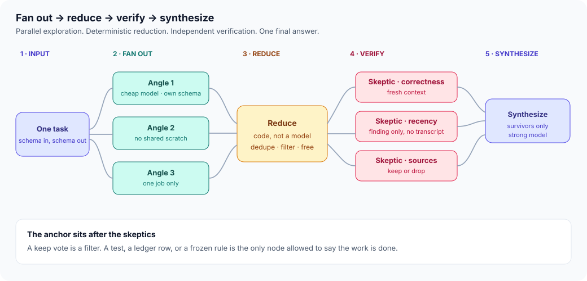
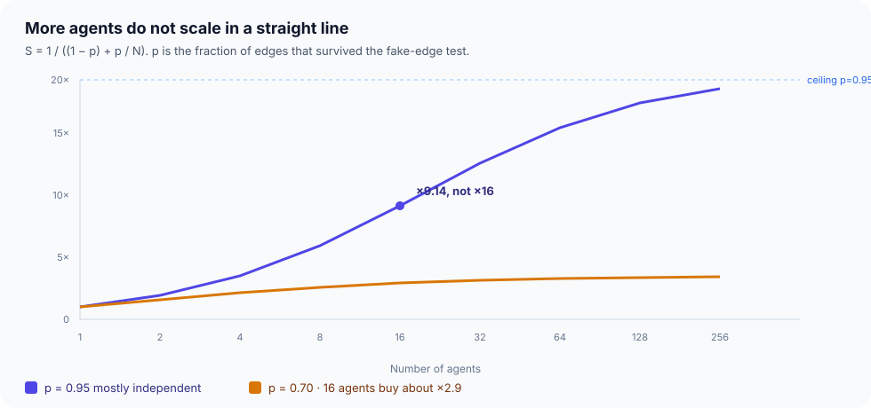
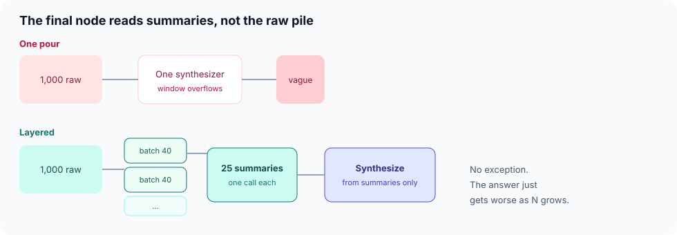
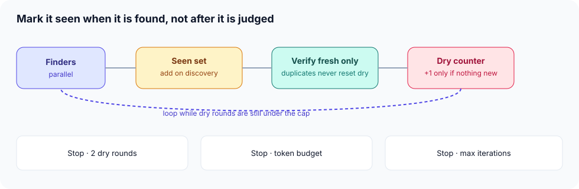
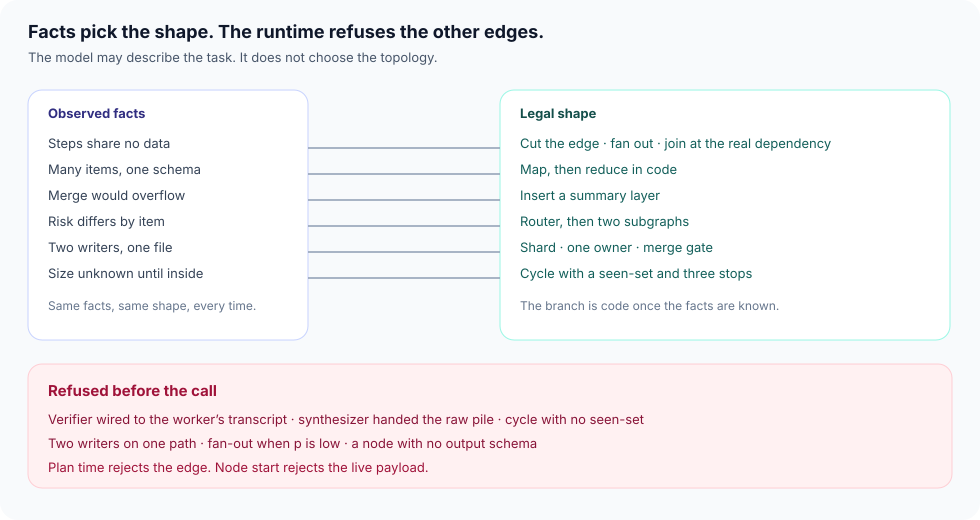

# Orchestration graph

**Time:** about 1 day · **Depends on:** [18 Agent design patterns](18-agent-design-patterns.md), [19 Orchestration patterns](19-orchestration-patterns.md) · **Uses:** [12](12-multi-agents.md), [21](21-secure-tool-use.md), [25](25-durable-orchestration.md), [27](27-harness-engineering.md) · **Next:** [Agent reliability](20-agent-reliability.md)

**Part of:** [Module 19](19-orchestration-patterns.md). The six patterns, the checkpoint, and EX-19 stay on the parent page. This page does not add a module.

---

<span id="why-this-matters-cs-engineer-view"></span>

<div class="aieng-story" markdown>

*Fictional teaching scenario.*

A triage investigation is typed as one long conversation: pull the policy, check the subscription, look for similar tickets, draft the reply. Around minute twenty it has forgotten the SKU it looked up at minute three, and the certificate-style step you chained after the policy read never needed the policy at all. It waited because the sentence said “and then.” Restarting the chat starts from zero. Adding a second agent that grades the first agent’s draft, inside the same transcript, produces a confident keep. The grade and the draft were the same hand.

</div>

**Case question:** Which edges are real, which node is allowed to say done, and which shape should the runtime have refused before the first fan-out?

## Learning objectives

- Delete edges that exist only because the prompt said “and then”
- Run the diamond: fan out, reduce in code, verify in a fresh context, synthesize
- Estimate the speedup ceiling from the independent fraction before raising N
- Layer the fan-in when the merge would swallow the raw pile
- Stop a discovery loop with a seen-set written at discovery, plus three stacked stops
- Encode those choices in a knowledge context graph the runtime evaluates at plan time and at node start

---

## The diamond

Module 19 already has map-reduce and a router that does not rewrite its payload. Module 18 already says the clerk who counts votes is code. This is those pieces drawn as one shape, with the verifier pulled out of the worker’s conversation.

{ .course-figure }

<p class="course-caption">Workers do not share scratch. Reduce is a set operation. Skeptics see the finding, not the reasoning that produced it. The anchor after them is a test, a ledger row, or a frozen rule.</p>

`src/orchestration_graph.py`. Reduce is a dict. The skeptic function is not allowed to accept a transcript.

```python
class PlanError(ValueError):
    pass

def reduce_findings(groups: list[list[dict]]) -> list[dict]:
    seen: dict[str, dict] = {}
    for group in groups:
        for finding in group:
            source = finding["source"]
            if source not in seen:
                seen[source] = finding
    return list(seen.values())

def verifier_input(finding: dict, *, transcript: str | None = None) -> dict:
    if transcript:
        raise PlanError("verifier sees worker transcript")
    return {"finding": finding}

reduced = reduce_findings([
    [{"source": "policy", "claim": "30 days"}, {"source": "ssl", "claim": "expires"}],
    [{"source": "policy", "claim": "duplicate"}],
])
assert [item["source"] for item in reduced] == ["policy", "ssl"]
assert verifier_input(reduced[0]) == {"finding": reduced[0]}
```

A call that passes the worker transcript raises `PlanError` before any skeptic model runs. `pytest tests/test_orchestration_graph.py -v`.

A verifier that receives the worker’s transcript is nodding along in a different font. Three lenses (correctness, recency, source) are still three calls on the same weights. Module 18’s warning stands: identical witnesses share a blind spot, and a majority is a louder wrong answer. The lens vote decides what reaches the anchor. The anchor decides what ships. Module 27’s verifier is that anchor when the check can be a script. A research finding has no script yet, so the skeptic is a filter in front of whatever anchor you do have. It is not a substitute for one.

<div class="aieng-intuition" markdown>
<p class="label">Intuition lock</p>

**Sticky picture:** The diamond is a **newsroom**. Reporters work separate stories. A clerk throws out duplicate clippings with a stamp, not with another reporter. A skeptic who was not in the room tries to kill the story. The printing press is a machine with a rule, and it does not take the reporter’s word.

<div class="kill" markdown>
**Kill this idea:** “The worker already checked its own output.” → **Replace with:** Self-check is one opinion. Fresh context is a filter. An anchor that cannot be talked out of its result is the decision.
</div>
</div>

---

## Count the fake edges, then read the ceiling

Ask of every “and then”: does this step use the previous step’s result? A yes stays a sequence. A no was a queue created by a sentence. The fraction of edges that survive is \(p\).

{ .course-figure }

<p class="course-caption">Sixteen agents at p = 0.95 buy about ×9, not ×16. At p = 0.70 they buy about ×3. The formula is a ceiling. Agent steps are not uniform CPU work. The critical path you measure on a small run replaces it.</p>

```python
def independence_fraction(uses_previous: list[bool]) -> float:
    independent = sum(1 for needed in uses_previous if not needed)
    return independent / len(uses_previous)

def speedup(p: float, n: int) -> float:
    return 1.0 / ((1.0 - p) + (p / n))

def fanout_pays(p: float, n: int) -> bool:
    # Half of N is the bar used by check_edge. 16 agents at p=0.70 do not clear it.
    return speedup(p, n) >= 0.5 * n

uses_previous = [False, False, True]  # two fake waits, one real edge
p = independence_fraction(uses_previous)
assert p == 2 / 3
assert round(speedup(0.95, 16), 2) == 9.14
assert round(speedup(0.70, 16), 2) == 2.91
assert fanout_pays(0.95, 16) is True
assert fanout_pays(0.70, 16) is False
```

Do this arithmetic before you pay for N. Module 12 already says a sequential pipeline sums the latency. Module 19 already says parallel fragments can cut it and that cost grows with the fragment count. The chart is that advice as a number you can reject a plan with.

---

## Layer the fan-in

A thousand raw findings poured into one synthesizer do not throw. The answer gets vaguer as the run gets wider. Module 05’s budget applies to the merge node.

{ .course-figure }

<p class="course-caption">Batch the raw results, summarize each batch, synthesize from the summaries. The final node’s input size stays flat while the sweep grows.</p>

```python
def layered_batches(items: list, batch_size: int) -> list[list]:
    return [items[i : i + batch_size] for i in range(0, len(items), batch_size)]

batches = layered_batches(list(range(1000)), 40)
assert [len(b) for b in batches[:2]] == [40, 40]
assert sum(len(b) for b in batches) == 1000
assert max(len(b) for b in batches) <= 40
```

---

## Loop until dry

Some jobs have no size in advance. One similar ticket reveals three more. A cycle back to the finder is legal only with the stops drawn here. The bug that keeps the loop looking productive: a finding is added to `seen` only after it survives verification, so the same bug returns, counts as fresh, and resets the dry counter.

{ .course-figure }

<p class="course-caption">Add the key the moment the finder emits it, confirmed or not. Verify only the unseen ones. Stop on two dry rounds, a token budget, and a max iteration count. Any one stop alone will eventually fail open.</p>

```python
def loop_until_dry(find_round, *, max_dry=2, max_iter=10, token_budget=100, cost_per_round=1):
    seen, confirmed = set(), []
    dry = iterations = spent = 0
    while dry < max_dry and iterations < max_iter and spent + cost_per_round <= token_budget:
        found = find_round(iterations)
        iterations += 1
        spent += cost_per_round
        fresh = []
        for bug in found:
            if bug in seen:
                continue
            seen.add(bug)  # on discovery, not after the verdict
            fresh.append(bug)
        if not fresh:
            dry += 1
            continue
        dry = 0
        confirmed.extend(fresh)
    return {"confirmed": confirmed, "iterations": iterations, "dry": dry, "spent": spent}

rounds = [["a", "a"], ["a"], []]  # duplicate in the first round, then nothing new
report = loop_until_dry(lambda i: rounds[i] if i < len(rounds) else [])
assert report["confirmed"] == ["a"]
assert report["dry"] == 2
assert report["iterations"] == 3
```

---

## Knowledge context graph

The pictures above are the shapes. The knowledge context graph is the lookup that picks one while the flow is running. It is a versioned table of observable facts. The model may describe the task. Once the facts are known, the branch is code, the same way Module 19’s router forwards a payload without rewriting it.

{ .course-figure }

<p class="course-caption">Each arrow is a rule the runtime can check. The red plate is the edges that never get a call: shared transcript, raw pile, unmarked cycle, two writers, a fan-out the ceiling does not pay for.</p>

| Fact you can check | Shape the table requires |
|---|---|
| This step does not use the previous step’s output | Cut the edge. Fan out. Join at the first real dependency |
| Many items share one schema, and a set can dedupe them | Map, then a code reduce |
| Each finding can be wrong, and no script can judge it yet | Diamond. The skeptic’s inbound edge carries the finding only |
| A keep vote exists, and so does an anchor | The anchor runs after the skeptic |
| The merge is about to receive more items than one window holds | Insert the summary layer |
| Risk differs across items | Router node, then two subgraphs. The classifier is a model call. The branch is this table |
| Two nodes name the same file | One owner per file, worktree, merge gate (Modules 21 and 25) |
| The job grows as it runs | Cycle, seen-set on discovery, three stops |
| The run can die or outlive the window | Nodes read and write disk. The queue is the outputs that do not exist yet (Modules 25 and 27) |
| \(p\) is high, and the scale gate below has three yeses | Raise \(N\), up to the ceiling you computed |

The table refuses a graph when the work is one isolated change, when you intend to watch every step, when you cannot name the path yet (a single steerable agent, Module 11), when the surviving edges are mostly real dependencies, when \(p\) says N does not pay, or when a node has no output schema. Two skeptics that both read the same upstream source are not confirmation.

Pin the table the way Module 23 pins a prompt bundle. An unreviewed edit to a row is a behavior change.

### When it fires

At plan time, walk the proposed edges and reject the illegal ones before any solve call. The divide-solve-join capstone already rejects a plan that invents checks or drops a requirement. This table is that rejection, applied to shape.

```python
def check_edge(edge: dict) -> None:
    kind = edge["kind"]
    if kind == "verify" and edge.get("includes_transcript"):
        raise PlanError("verifier sees worker transcript")
    if kind == "synthesize" and edge.get("item_count", 0) > edge.get("window_limit", 0):
        raise PlanError("raw pile exceeds the window")
    if kind == "write" and edge.get("path") in set(edge.get("owned_paths") or []):
        raise PlanError("two writers one file")
    if kind == "cycle" and not edge.get("seen_on_discovery"):
        raise PlanError("cycle without seen-set")
    if kind == "fanout" and not fanout_pays(edge["p"], edge["n"]):
        raise PlanError("fan-out does not pay")
    if kind == "map" and not edge.get("schema"):
        raise PlanError("no output schema")

check_edge({"kind": "fanout", "p": 0.95, "n": 16})
check_edge({"kind": "verify", "includes_transcript": False})
```

`fanout_pays` and `PlanError` are the functions from the sections above. A `p` of 0.70 at `n` of 16 raises `PlanError` and spends nothing.

```python
def scale_gate(*, found_new: bool, verifier_caught: bool, cost_justified: bool) -> bool:
    return bool(found_new and verifier_caught and cost_justified)
```

At node start, look at the live payload. Item count crossed the fan-in budget, so a summary layer is inserted. The write set collides, so the node moves to its own worktree. A duplicate would reset the dry counter, so it is marked seen and does not count as fresh.

Guidance that arrives as a paragraph in the system prompt will be skipped the same way any other instruction is skipped. Guidance that is an edge the runtime will not traverse is the version that matches the rest of the course.

### Scale gate

Cap the first real run at twenty items. Read the usage. Double the cap only when all three answers are yes:

1. The fan-out found something the single agent missed.
2. The verifier caught something the worker missed.
3. The result justified the bill.

A graph that fails any of the three at twenty items will fail them at two thousand, at a hundred times the cost. A large rewrite done by a fleet is a ceiling, including the question of whether anyone can review that much generated code. It is not a target.

<div class="aieng-case-checkpoint" markdown>
<p class="label">Case checkpoint</p>

**Opening failure:** A line of “and then” made independent checks wait, a shared transcript graded its own draft, and a restart forgot the SKU.

**What this lesson demonstrates:** A diamond with a fresh-context filter, a ceiling computed from \(p\), a layered merge, a discovery loop that marks seen on the way in, and a table that refuses the illegal edges before the call.

**What it does not prove:** Twenty items and a formula are not a production fleet. Rate limits, a weak anchor, and a table nobody pinned will still spend the budget on a shape you thought you had forbidden.

</div>

---

## Lab

1. Take one workflow you have actually run as a sequence. List every edge. Mark each real or fake. Compute \(p\) and \(S\) at N = 16. Write down whether you would buy those agents.
2. Draw the diamond for one fan-out you would keep. Name the field the skeptic receives, and name the anchor that runs after a keep vote. If you have no anchor, say so and do not call the skeptic a decision.
3. Write five rows of the knowledge context graph for that workflow, as JSON: `fact`, `shape`, `refused_edge`. Include at least one refused edge.
4. Show a plan-time check that rejects a verifier whose input contains the worker transcript, before any model call.
5. If the workflow has a discovery loop, move `seen.add` to discovery time and name the three stops.

---

<div class="aieng-quiz" data-quiz-id="graph-q1" data-xp="25" data-success="The skeptic sees the finding. The anchor is not another pass of the same transcript." data-fail="Shared history is agreement, not a check." markdown>
<p class="label">Quiz · +25 XP</p>
<p class="quiz-prompt">A verifier receives the worker’s reasoning and returns keep. What did you measure?</p>
<div class="quiz-options">
<button type="button" class="quiz-opt" data-correct="false">An independent disproof</button>
<button type="button" class="quiz-opt" data-correct="true">Agreement with a transcript the verifier was already shown</button>
<button type="button" class="quiz-opt" data-correct="false">The anchor, because a second model call is a check</button>
<button type="button" class="quiz-opt" data-correct="false">Amdahl’s p</button>
</div>
<p class="quiz-feedback"></p>
</div>

<div class="aieng-quiz" data-quiz-id="graph-q2" data-xp="25" data-success="Sixteen agents at p = 0.70 buy about ×3. The table should refuse the fan-out." data-fail="Read the ceiling from p before you buy N." markdown>
<p class="label">Quiz · +25 XP</p>
<p class="quiz-prompt">You counted the edges. About 70% are real independence. A plan asks for 16 parallel agents. What does the table do?</p>
<div class="quiz-options">
<button type="button" class="quiz-opt" data-correct="false">Allow it — 16 agents means 16×</button>
<button type="button" class="quiz-opt" data-correct="true">Refuse the fan-out. The ceiling is about ×3, and a line or a smaller N fits the work</button>
<button type="button" class="quiz-opt" data-correct="false">Allow it if the model requests the fan-out in the plan</button>
<button type="button" class="quiz-opt" data-correct="false">Replace the workers with a larger model and keep all 16</button>
</div>
<p class="quiz-feedback"></p>
</div>

## Checkpoint

- [ ] You can point at one fake edge and one real edge in a workflow you drew
- [ ] Reduce is code. The skeptic’s input is the finding. The anchor is not a model
- [ ] You computed \(S\) at your actual \(p\) before choosing N
- [ ] A merge that would exceed the window has a summary layer
- [ ] A discovery loop marks seen on discovery and has three stops
- [ ] The knowledge context graph refused at least one edge with no model call

**Return to the case:** The certificate check no longer waits on the headlines, the grade no longer shares a transcript with the draft, and a restart reads the disk instead of an empty chat.

**Next:** [Agent reliability](20-agent-reliability.md) — named failure modes for the loops this graph is allowed to run. Isolation and the merge gate are [Module 21](21-secure-tool-use.md) and [Module 25](25-durable-orchestration.md). The anchor in code is [Module 27](27-harness-engineering.md).
