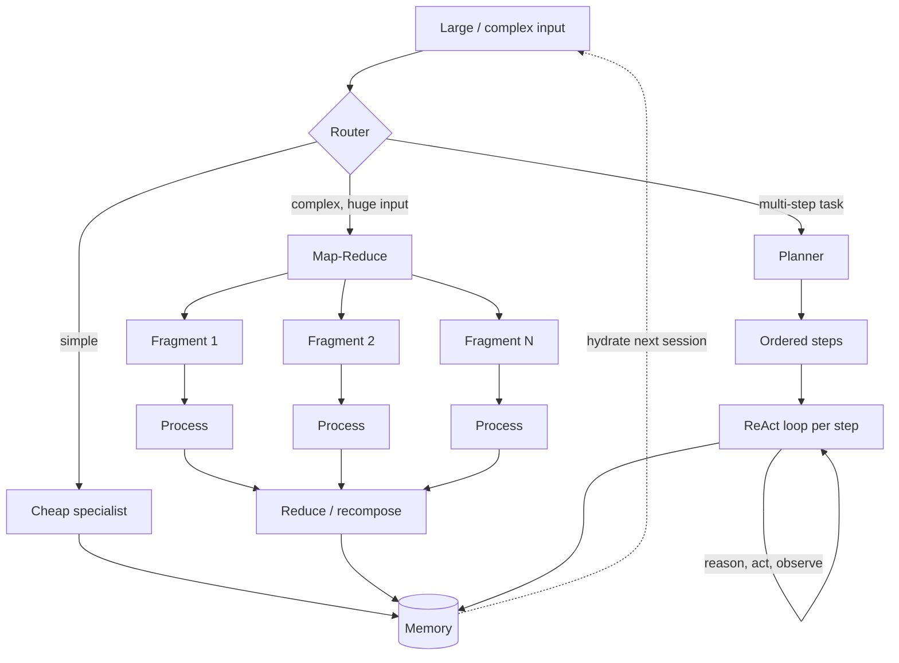

# Module 19 — Orchestration Patterns

<span data-module-id="19" hidden></span>

**Time:** 6–9 days · **Depends on:** [18 Agent design patterns](18-agent-design-patterns.md) · **Pairs with:** [12 Multi-agent systems](12-multi-agents.md) · **Next:** [Agent reliability](20-agent-reliability.md)


## Learning objectives

- Apply **Map-Reduce** to inputs too large for one pass: split, process fragments independently, merge without losing global coherence
- Use a **Router** to send input to the right specialist instead of one agent trying to do everything
- Use a **Planner** to separate "decide the steps" from "execute the steps" on long, multi-stage tasks
- Build a **ReAct** loop for tasks where the right next step only becomes clear after seeing the last observation
- Give an agent a **Memory** that reads automatically but writes selectively, so it persists across sessions without drowning in its own history
- Use a **Duet** to split one task into two complementary roles that check each other in a closed loop

## What you can build

- A chunked contract scanner that finds every predatory clause in a 300-page PDF and merges findings without duplicates
- A support router that sends billing questions to one specialist and security escalations to an air-gapped one
- A relocation-planning agent that drafts a dependency-ordered plan, then executes it step by step with a compressed running context
- A self-correcting SQL agent that reasons, runs a query, reads the error, and retries
- A tutoring agent that remembers a student's level across sessions without replaying the whole transcript
- A cascading draft/critique pipeline where a cheap model writes and an expensive model only edits

---

## Why this matters (CS engineer)

<div class="aieng-story" markdown>

A compliance team asks for an agent that audits vendor contracts against 40 regulatory clauses. First attempt: one prompt, whole contract, all 40 clauses at once. It misses clauses buried mid-document ("lost in the middle"), and by clause 30 it's forgotten what it flagged for clause 3. Second attempt: an unstructured "just read and reason" loop — better, but it wanders, re-reads the same section twice, and never produces the same audit trail twice. What actually ships is three patterns stacked: **Map-Reduce** splits the contract into sections so each gets full attention; a **Planner** turns "audit for compliance" into an explicit 40-item checklist executed in order; and a lean **Router** sends flagged financial clauses to a finance-tuned model and flagged privacy clauses to a privacy-tuned one. None of these are exotic — they're the same divide-and-conquer, dispatch, and staged-execution ideas from classic systems design, applied to a stochastic worker instead of a deterministic one.

</div>

Module 18 covered the small, leaf-level primitives (Subroutine, Guardrail, Rejection Sampler, Consensus, Retriever). This module covers the **orchestration-level** patterns that decide *what runs when, in what order, and who owns which piece* — the shape of the workflow itself, not the individual calls inside it.

### Already taught vs this module

| Pattern here | You met it as | What is new |
|--------------|---------------|-------------|
| Map-Reduce | Chunking + packing (05, 07) | Split → independent process → **merge with conflict rules**, not concatenate |
| Router | Cost/task router (10), data-class router (16) | Classifier that **does not rewrite** the payload or the answer |
| Planner | Externalized plan list in agent state (11) | Separate “write the TODO” from “run step N,” with compressed facts between steps |
| ReAct | Plan–act–observe JSON loop (11) | Observation-driven loop; XML/`<result>` is one encoding, JSON decisions are another — pick one contract |
| Memory | Session / profile tiers (05) | Compulsory **read** at session start; **writes** only for durable facts |
| Duet | Writer → critic pipeline (12) | Two objectives, two roles, shared transcript, hard done-signal |

Module 18’s leaves **plug into** these shapes: a Map-Reduce “process” step is often a Subroutine; a Router’s specialist is often a Guardrail + tools; ReAct actions should still hit a Tool Gate.

---

## Mental model



**Invariant:** orchestration patterns decide *shape* (fan-out, sequence, dispatch, loop, persistence) — they compose with Module 18's leaf patterns (a Router's specialist is often itself built from Subroutines and Guardrails).

<div class="aieng-intuition" markdown>
<p class="label">Intuition lock</p>

**Sticky picture:** Map-Reduce is **chunk the file, `map()`, then `reduce()`** — nothing more exotic than the batch job you've already written. A Router is **a `switch` statement with a classifier instead of a literal match**. A Planner is **write the TODO list before touching code**. ReAct is **a `while` loop where the condition is "the model says it's not done yet."** Memory is **automatic context load on session start, explicit `save()` calls during it** — never automatic writes. A Duet is **two functions calling each other until one returns `done`**.

<div class="kill" markdown>
**Kill this idea:** "One well-prompted agent should handle the whole workflow end to end." → **Replace with:** name the actual shape of the problem — is it too big (Map-Reduce), ambiguous which specialist (Router), long and ordered (Planner), exploratory (ReAct), cross-session (Memory), or adversarial-collaborative (Duet) — and reach for that pattern specifically.
</div>
</div>

---

## Core tutorial

### 1. Map-Reduce — split, process independently, merge

**Idea:** an input too large or dense for one pass (a feature-length video, a legal archive, a gigapixel image) is split into fragments, each processed independently — often in parallel — and the intermediate results are merged into one coherent output. The split must keep each **logical unit** intact (a clause, a scene, a heading) so the merge can still see a complete fact. If you cut a sentence in half, the reduce step cannot recover what you threw away. The merge must reconcile contradictions and duplicates, not just concatenate.

```python
import json
from dataclasses import dataclass
from concurrent.futures import ThreadPoolExecutor

# client = Anthropic()  # or your provider; model ids are placeholders (see Setup)

@dataclass
class Finding:
    clause_id: str
    section: str
    risk: str
    excerpt: str

def chunk_by_section(contract_text: str, max_chars: int = 6000) -> list[str]:
    """Split near section boundaries so a clause is never cut mid-sentence."""
    sections = contract_text.split("\n## ")
    chunks, current = [], ""
    for section in sections:
        if len(current) + len(section) > max_chars and current:
            chunks.append(current)
            current = section
        else:
            current += "\n## " + section if current else section
    if current:
        chunks.append(current)
    return chunks

def map_find_predatory_clauses(chunk: str) -> list[Finding]:
    """Process stage: one fragment in, structured findings out. Runs in parallel."""
    resp = client.messages.create(
        model="claude-sonnet-xxxxxx",  # placeholder
        max_tokens=500,
        system="Flag predatory clauses (auto-renewal traps, unilateral fee changes, "
               "liability waivers). Return JSON list of {clause_id, section, risk, excerpt}.",
        messages=[{"role": "user", "content": chunk}],
    )
    return [Finding(**f) for f in json.loads(resp.content[0].text)]

def reduce_findings(all_findings: list[list[Finding]]) -> list[Finding]:
    """Recompose: dedupe by excerpt similarity, keep highest-risk version."""
    seen: dict[str, Finding] = {}
    for chunk_findings in all_findings:
        for f in chunk_findings:
            key = f.excerpt[:80].lower().strip()
            if key not in seen or f.risk == "high":
                seen[key] = f
    return sorted(seen.values(), key=lambda f: f.section)

def audit_contract(contract_text: str) -> list[Finding]:
    chunks = chunk_by_section(contract_text)
    workers = min(8, max(1, len(chunks)))  # cap — do not spawn one thread per page
    with ThreadPoolExecutor(max_workers=workers) as pool:
        per_chunk = list(pool.map(map_find_predatory_clauses, chunks))
    return reduce_findings(per_chunk)
```

**Split axes:** spatial (image tiles), temporal (video/audio windows), semantic (chapters, paragraphs), technical (token/file-size limits). Pick the axis that keeps a single logical unit (a clause, a scene, a paragraph) from being cut across a fragment boundary.

<div class="aieng-explainer" markdown>
<p class="label">Explainer</p>

**This is the same MapReduce you already know from batch jobs.** `map` runs the same function on each fragment (often in parallel). `reduce` is *business logic*: dedupe, conflict-flag, keep highest risk — not `sum()` of strings. People sometimes call the same shape **decompose → process → recompose**. That is Map-Reduce with friendlier words, not a different algorithm (and it is not Dense Passage Retrieval). Cost grows with fragment count because each call re-pays the shared instructions; cache the system prefix when the provider allows it.
</div>

**Trade-off:** cost rises (constant overhead per fragment, shared context re-paid each time — mitigate with caching), but latency can *drop* if fragments process in parallel, and per-fragment attention quality goes up because each call sees less.

**Variants:**

| Variant | Change |
|---|---|
| **Decompose-Voter** | Reduce stage is replaced by a Consensus/vote — used when fragments are being classified (e.g., sentiment per section → overall sentiment) rather than merged as facts |
| **Decompose-Retriever** | Decomposer builds an on-demand index over an unindexed input; a Retriever then searches fragments for a specific answer instead of processing all of them |
| **Retrieve-Process-Recompose** | Retrieval stage replaces the decomposer entirely — fragments come from an external corpus, not from splitting one input |

---

### 2. Router — classify, then dispatch unaltered

**Idea:** a lightweight classifier sits in front of specialist agents. It reads the input just enough to pick a destination, then forwards the **unaltered** payload to that specialist and returns the specialist's **unaltered** output. The router never rewrites the task or the answer — it only decides who handles it.

```python
from enum import Enum

class Domain(Enum):
    BILLING = "billing"
    SECURITY = "security"
    GENERAL = "general"

def classify(query: str) -> Domain:
    resp = client.messages.create(
        model="claude-haiku-xxxxxx",  # cheap classifier placeholder — this call must stay fast
        max_tokens=10,
        system="Classify as exactly one of: billing, security, general. Reply with one word.",
        messages=[{"role": "user", "content": query}],
    )
    label = resp.content[0].text.strip().lower()
    try:
        return Domain(label)
    except ValueError:
        return Domain.GENERAL

SPECIALISTS = {
    Domain.BILLING: billing_agent,       # tuned on refund/pricing policy
    Domain.SECURITY: security_agent,     # runs in an air-gapped environment
    Domain.GENERAL: general_agent,
}

def route(query: str, user_ctx: dict) -> str:
    domain = classify(query)
    specialist = SPECIALISTS[domain]
    return specialist(query, user_ctx)   # payload forwarded unaltered, output returned unaltered
```

**Why it exists:** a single agent with dozens of tools misroutes calls (tool choice overload) and silently blends domain rules (billing refund logic leaking into a security escalation). A Router fixes both by keeping domains behind separate, independently-tunable specialists.

<div class="aieng-explainer" markdown>
<p class="label">Explainer</p>

**A router is a `switch` statement whose condition is a classifier.** It reads only enough to pick a lane, then forwards the **original** query. If the router rewrites the question (“user probably wants a refund, ask for order id”), it has become a planner and you can no longer test specialists in isolation. Module 10’s `ModelRouter` picks *model size*. Module 16’s router picks *where data is allowed to go*. This router picks *which specialist owns the skill*. You can stack them: data-class first, then domain, then cheap vs strong model.
</div>

**Variants:**

| Variant | Shape | Use when |
|---|---|---|
| **Ensemble Router** | Top-k specialists run in parallel, a reconciler synthesizes | Query is ambiguous across domains and hedging matters (e.g., "chest tightness" → cardiology + anxiety, both evaluated) |
| **Multi-layered Router** | Coarse-to-fine tree (top router → mid routers → leaf agents) | Too many specialists for one flat classifier prompt |
| **Proximity Router** | Specialists forward to a related neighbor if they can't handle it | Decentralized systems without a central dispatcher |

---

### 3. Planner — decide the steps, then execute them

**Idea:** two explicit phases. First, a **planner model** (strong at the domain, not necessarily the same model that executes) drafts an ordered plan with dependencies. Second, a dispatcher executes the plan step by step, and a context manager compresses prior steps' output into only the facts the next step actually needs — step 6 never sees the raw output of steps 1–5.

```python
import json
from dataclasses import dataclass, field

@dataclass
class Step:
    id: int
    description: str
    depends_on: list[int] = field(default_factory=list)
    result: str | None = None

def formulate_plan(goal: str) -> list[Step]:
    resp = client.messages.create(
        model="claude-sonnet-xxxxxx",  # placeholder
        max_tokens=600,
        system="Break the goal into an ordered JSON list of steps: "
               "{id, description, depends_on: [ids]}. Respect real-world dependencies.",
        messages=[{"role": "user", "content": goal}],
    )
    return [Step(**s) for s in json.loads(resp.content[0].text)]

def compress_context(completed: list[Step]) -> str:
    """Context manager: extract only durable facts, not raw step transcripts."""
    resp = client.messages.create(
        model="claude-sonnet-xxxxxx",  # placeholder
        max_tokens=200,
        system="Summarize completed steps into a short fact list needed by future steps only.",
        messages=[{"role": "user", "content": "\n".join(f"{s.id}: {s.result}" for s in completed)}],
    )
    return resp.content[0].text

def execute_plan(goal: str, step_executor) -> list[Step]:
    plan = formulate_plan(goal)
    completed: list[Step] = []
    for step in plan:
        lean_context = compress_context(completed) if completed else ""
        step.result = step_executor(step.description, lean_context)
        completed.append(step)
    return completed
```

**Why the compression matters:** without it, step 6 of a 12-step relocation plan (visa → housing → bank account → school enrollment → utilities → ...) inherits the raw transcript of every prior step, and the visa deadline from step 1 quietly drifts out of the effective attention window by step 6. The context manager's whole job is making sure it doesn't.

<div class="aieng-explainer" markdown>
<p class="label">Explainer</p>

**Write the TODO list before touching tools.** Module 11 already said: keep the plan as `{id, step, status}` in *code*, not as a paragraph in the scratchpad. The Planner pattern adds a hard phase split: you do not start step 1 until the whole list exists, and you do not feed step 6 the novel of steps 1–5. Compression is a Module 05 packer sitting between steps. If a step fails, you re-plan from the remaining TODOs — you do not throw the whole agent into a free-form ReAct wander (unless you chose ReAct on purpose, next section).
</div>

**Variants:**

| Variant | Change |
|---|---|
| **Routing Planner** | Each step is dispatched through a Router — cheap steps to a small model, hard reasoning steps to a frontier model |
| **Planner with Strategy Retrieval** | A Retriever pulls prior successful task-plan pairs before drafting, instead of planning from scratch |
| **Constrained Planner** | Plan is generated entirely upfront against a fixed toolkit, then executed deterministically with no intermediate reasoning — used when auditability matters more than adaptivity |

---

### 4. ReAct — reason, act, observe, repeat

**Idea:** a cyclical loop. A **policy model** looks at everything accumulated so far, reasons about the next move, and either emits an action or signals it's done. The action runs, its result is appended to a single growing context, and the loop repeats. Nothing is decided upfront — the path emerges from what the environment returns.

```python
MAX_STEPS = 12

def react_loop(task: str, tools: dict) -> str:
    context = [{"role": "user", "content": task}]

    for _ in range(MAX_STEPS):
        resp = client.messages.create(
            model="claude-sonnet-xxxxxx",  # placeholder
            max_tokens=500,
            system="Reason about the next step. Emit exactly one of: "
                   '<action tool="name">args</action> or <result>final answer</result>.',
            messages=context,
        )
        text = resp.content[0].text
        context.append({"role": "assistant", "content": text})

        if "<result>" in text:
            return text.split("<result>")[1].split("</result>")[0]

        tool_name, args = parse_action(text)     # e.g. "sql_query", "SELECT * FROM ..."
        observation = tools[tool_name](args)     # pure (read) or impure (write) action
        context.append({"role": "user", "content": f"Observation: {observation}"})

    raise TimeoutError("ReAct loop hit MAX_STEPS without a <result>")
```

**Pure vs. impure actions matter operationally:** pure actions (search, read, calculate) are safe to retry freely; impure actions (a database write, an email send) need the Module 18 Guardrail/Tool Gate in front of them, because the loop *will* eventually retry after an unexpected observation.

The XML tags above are **one** decision encoding. Module 11’s teaching agent uses JSON `{"type":"tool",...}` instead. Pick **one** contract per product and parse it strictly — do not mix `<result>` and JSON `type=final` in the same loop.

<div class="aieng-explainer" markdown>
<p class="label">Explainer</p>

**ReAct is a `while` loop whose condition is “the model has not emitted done.”** That is why `MAX_STEPS` is not optional: without it the loop is `while True`. Use ReAct when you cannot write the plan up front (SQL errors, unknown search hits). Use a Planner when the steps *are* knowable (visa then housing then school). Plan-and-ReAct is the hybrid: a checklist, with ReAct *inside* a single step. Module 11 is the same state machine with JSON decisions; this section names the pattern and its variants (ReWOO, ReBAct) so you can read papers and framework docs without thinking they are different products.
</div>

**Variants:**

| Variant | Change | Trade-off |
|---|---|---|
| **Plan-and-ReAct** | A Planner runs before the loop starts | Cheaper, more reliable on standard tasks; less adaptive to surprises |
| **ReBAct** (reflect before act) | A second model call double-checks the action before it fires (cousin of Module 18’s sampler/refiner, but it *does* see the proposed action) | Extra latency, but catches costly/irreversible mistakes before they happen |
| **ReWOO** (reason without observation) | Full reasoning chain generated upfront with placeholders for observations; actions then run in parallel | Much lower latency/cost; only works when steps don't actually depend on each other's real-time results |
| **ReSpAct** (reason, speak, act) | Adds a `<speak>` action that defers to a human | Needed whenever ambiguity or a physical step requires a person |

---

### 5. Memory — compulsory read, optional write

**Idea:** memory is hydrated into context automatically at the start of every session — the agent never chooses whether to consult it. Writing is the opposite: selective, parsed, and deliberate. Not every utterance gets saved; something has to decide what's durable.

```python
@dataclass
class MemoryRecord:
    subject_id: str
    summary: str
    char_count: int = 0

COMPACTION_THRESHOLD = 4096

def hydrate(subject_id: str, store: dict[str, MemoryRecord]) -> str:
    """Compulsory read — always called before reasoning starts, never optional."""
    record = store.get(subject_id)
    return record.summary if record else ""

def update_memory(subject_id: str, new_info: str, store: dict[str, MemoryRecord]) -> None:
    """Selective write — only durable facts get merged in, and long summaries get compacted."""
    record = store.setdefault(subject_id, MemoryRecord(subject_id, summary=""))

    resp = client.messages.create(
        model="claude-sonnet-xxxxxx",  # placeholder
        max_tokens=300,
        system="Merge new_info into the existing summary. Keep only durable facts "
               "(preferences, level, constraints) — drop greetings and resolved one-offs.",
        messages=[{"role": "user", "content": f"Existing: {record.summary}\nNew: {new_info}"}],
    )
    record.summary = resp.content[0].text

    if len(record.summary) > COMPACTION_THRESHOLD:
        compact = client.messages.create(
            model="claude-sonnet-xxxxxx",  # placeholder
            max_tokens=300,
            system="Compress this summary further, preserving all durable facts.",
            messages=[{"role": "user", "content": record.summary}],
        )
        record.summary = compact.content[0].text
    record.char_count = len(record.summary)

def start_session(subject_id: str, store: dict[str, MemoryRecord]) -> list[dict]:
    prior = hydrate(subject_id, store)
    return [{"role": "system", "content": f"What you know about this user: {prior}"}] if prior else []
```

This is **Compacting Monolithic Memory** — one evolving summary, condensed on overflow. Two other shapes:

| Variant | Shape | Use when |
|---|---|---|
| **Fragmental (vector) memory** | Discrete embedded fragments, retrieved by cosine similarity at hydration time | History is too vast to compact without losing specifics — same mechanics as RAG |
| **Paged memory** | Fixed in-context window as short-term store, external DB as long-term; oldest content condenses out under pressure | Long single sessions, OS-page-cache-style |
| **Tiered hierarchical memory** | Short/mid/long-term layers queried in parallel | Need both "what did they just say" and "who are they" simultaneously |
| **Shared memory** | Multi-agent write-reconciliation before update | Multiple agents could write conflicting facts about the same subject |

<div class="aieng-explainer" markdown>
<p class="label">Explainer</p>

**Load memory like a config file; save it like a database write.** Hydration is automatic so the model cannot “forget” to look. Writes are opt-in so greetings and one-off questions do not become fake user preferences (Module 05’s “librarian, not a hoarder”). Compaction on overflow is a rolling summary with a size cap — the same idea as `SessionMemory.should_summarize`. Vector (“fragmental”) memory is RAG over *this user’s* notes; do not mix it with the company wiki without a namespace.
</div>

---

### 6. Duet — two complementary roles, one closed loop

**Idea:** split a task with two competing objectives (engaging *and* factual; fast *and* cheap; correct *and* readable) into two agents that alternate turns on a shared conversation, each fully focused on one objective, until one emits a done signal.

```python
DONE_SIGNAL = "<done>"
MAX_TURNS = 6

def duet(topic: str, agent_a_system: str, agent_b_system: str) -> str:
    """Two roles, one labeled log. Each turn the other role reads the full log."""
    log = f"Task:\n{topic}\n"
    reply = ""
    for turn in range(MAX_TURNS):
        is_a = turn % 2 == 0
        role = "copywriter" if is_a else "fact_checker"
        system = agent_a_system if is_a else agent_b_system
        resp = client.messages.create(
            model="claude-sonnet-xxxxxx",  # placeholder
            max_tokens=500,
            system=system,
            messages=[{
                "role": "user",
                "content": log + f"\nYou are the {role}. Reply next. "
                           f"If the work is finished, include {DONE_SIGNAL}.",
            }],
        )
        reply = resp.content[0].text
        log += f"\n[{role}]\n{reply}\n"
        if DONE_SIGNAL in reply:
            return reply.replace(DONE_SIGNAL, "").strip()
    return reply  # budget exhausted, return best-so-far

copywriter_prompt = "Write engaging marketing copy. When the fact-checker approves, end with <done>."
fact_checker_prompt = "Flag any unverifiable claim in the copy. If everything checks out, reply <done>. Otherwise state the issue."

final_copy = duet(brief, copywriter_prompt, fact_checker_prompt)
```

Do not invert `user`/`assistant` roles on a shared OpenAI-style transcript to simulate two speakers — that scramble is hard to debug. A labeled log (or two explicit message lists) keeps the contract obvious.

**Variants:**

| Variant | Shape | Use when |
|---|---|---|
| **Symmetric Duet** | Two distinct roles, shared history, role-swap between turns | Draft/critique, propose/scrutinize |
| **Fully Symmetric Duet** | Same (or no) system prompt for both — diversity comes from sampling alone | Exploratory brainstorming, synthetic dialogue generation |
| **Optimization Duet** | Opposing numeric objectives (maximize coverage vs. minimize cost) | Negotiating toward a compromise, not a single "correct" answer |
| **Cascading Duet** | Cheap model drafts at length, expensive model only critiques briefly | Cost optimization — bulk of tokens generated by the cheap model |

<div class="aieng-explainer" markdown>
<p class="label">Explainer</p>

**One objective per speaker.** A single prompt that says “be witty *and* strictly factual” will hedge or hallucinate. A duet splits those jobs the way Module 12 splits writer vs critic, with a hard `<done>` and `MAX_TURNS` so they cannot debate forever. Cascading duet is also a cost move: the cheap model burns tokens on drafts; the expensive model only nits. Same idea as Module 10 routing, applied to a two-role loop.
</div>

---

## Failure modes

| Symptom | Likely cause | Fix |
|---|---|---|
| Findings from different sections contradict or duplicate | Map-Reduce merge just concatenated instead of reconciling | Give the reduce step an explicit dedupe/conflict-resolution pass |
| Agent invokes the wrong tool constantly | No Router — one agent holds every tool | Split into a classifier + specialists, each with a narrow toolset |
| Long task drifts off an early constraint | Planner without a context manager between steps | Compress completed steps to durable facts before the next step runs |
| Agent loops forever or times out | ReAct with no step budget or ambiguous done-condition | Hard `MAX_STEPS`, explicit `<result>` contract, log every cycle |
| Agent repeats the same question every session | No Memory, or memory write never triggered | Add compulsory-read hydration; decide explicitly what's durable enough to write |
| Draft is either over-hedged or full of hallucinated claims | Single agent optimizing two conflicting objectives at once | Split into a Duet — one role per objective |

---

## Lab

<div class="aieng-lab" markdown>

<p class="label">Lab · orchestration refactor</p>

Pick **three** of the six patterns and apply them to one workflow (do not build six products). Suggested combo: Map-Reduce **or** Planner, plus Router **or** ReAct, plus Memory **or** Duet.

1. **Map-Reduce:** a document too long for one window; chunk → process → reduce with an explicit dedupe.
2. **Router:** two specialist prompts; misrouting rate on ≥20 labeled queries.
3. **Planner:** step N receives only a compressed fact list, never raw transcripts of 1..N-1.
4. **ReAct:** tool loop with a hard step budget; log every reason/act/observe cycle.
5. **Memory:** compulsory read + selective write; a second session already knows a prior fact.
6. **Duet:** two competing objectives vs a single-agent baseline on the same brief.

</div>

---

## Quizzes

<div class="aieng-quiz" data-quiz-id="19-q1" data-xp="25" data-success="Correct — keep each logical unit intact so the reduce step still has a complete fact." data-fail="Re-read Map-Reduce: fragments must not cut a clause or scene in half." markdown>
<p class="label">Quiz · +25 XP</p>
<p class="quiz-prompt">Why should a Map-Reduce split keep logical units intact rather than cutting at a fixed token count?</p>
<div class="quiz-options">
<button type="button" class="quiz-opt" data-correct="false">Fixed token counts are always slower to compute</button>
<button type="button" class="quiz-opt" data-correct="true">Cutting a logical unit (a clause, a scene) across a fragment boundary loses information the reduce step can't recover</button>
<button type="button" class="quiz-opt" data-correct="false">Models refuse to process fixed-length chunks</button>
<button type="button" class="quiz-opt" data-correct="false">It's required for parallelization to work at all</button>
</div>
<p class="quiz-feedback"></p>
</div>

<div class="aieng-quiz" data-quiz-id="19-q2" data-xp="25" data-success="Right — Planner's context manager compresses prior steps into durable facts only." data-fail="Re-read Planner: raw transcripts are never passed to later steps." markdown>
<p class="label">Quiz · +25 XP</p>
<p class="quiz-prompt">In the Planner pattern, what does step 6 of a 12-step plan receive from steps 1–5?</p>
<div class="quiz-options">
<button type="button" class="quiz-opt" data-correct="false">The full raw transcript of every prior step</button>
<button type="button" class="quiz-opt" data-correct="true">A compressed summary containing only the facts step 6 actually needs</button>
<button type="button" class="quiz-opt" data-correct="false">Nothing — each step starts from a blank context</button>
<button type="button" class="quiz-opt" data-correct="false">Only the output of step 5</button>
</div>
<p class="quiz-feedback"></p>
</div>

<div class="aieng-quiz" data-quiz-id="19-q3" data-xp="25" data-success="Exactly — memory reads are automatic; writes require a deliberate decision about what's durable." data-fail="Re-read Memory: it's compulsory-read, optional-write, not the reverse." markdown>
<p class="label">Quiz · +25 XP</p>
<p class="quiz-prompt">What does "compulsory-read, optional-write" mean for the Memory pattern?</p>
<div class="quiz-options">
<button type="button" class="quiz-opt" data-correct="false">The agent must save every utterance but can skip reading memory if it wants</button>
<button type="button" class="quiz-opt" data-correct="true">Memory is always hydrated into context automatically, but writing is selective and deliberate</button>
<button type="button" class="quiz-opt" data-correct="false">Memory can only be read once per session and never updated</button>
<button type="button" class="quiz-opt" data-correct="false">Reads and writes both require explicit user permission every time</button>
</div>
<p class="quiz-feedback"></p>
</div>

---

## Open source materials

| Resource | Use it for |
|---|---|
| Module 18 Agent design patterns | Leaf-level primitives these orchestration patterns compose with |
| Module 12 Multi-agent systems | Topology and message-contract background for Router/Duet |
| [ReAct paper (Yao et al., 2022)](https://arxiv.org/abs/2210.03629) | Original formulation this pattern is named after |
| [ReWOO paper (Xu et al., 2023)](https://arxiv.org/abs/2305.18323) | Reasoning-without-observation variant referenced above |
| Classic MapReduce (Dean & Ghemawat, 2004) | The distributed-systems origin of the Map-Reduce pattern |

---

## Checkpoint

- [ ] You can explain why decompose → process → recompose is the same shape as Map-Reduce (and is **not** Dense Passage Retrieval)
- [ ] Your Router forwards payloads and outputs unaltered — it only decides, never rewrites
- [ ] Your Planner's step executor never receives raw prior-step transcripts, only compressed facts
- [ ] Your ReAct loop has a hard step budget and an explicit done-signal contract
- [ ] Your Memory hydrates automatically but writes only after a deliberate extraction step
- [ ] You can name which competing objectives a Duet in your system is splitting apart

<div class="aieng-complete" data-module-id="19" data-xp="130" markdown>
<p>Mark Module 19 complete when you've applied at least three of these six patterns to a real workflow and can point to the specific coordination problem each one solved.</p>
<button type="button">Complete module · +130 XP</button>
</div>

## Exercise

- **Catalog:** [EX-19 — Orchestration shape](../reference/exercises.md#ex-19)
- **Prove:** Three orchestration shapes on *one* workflow, with the combo rule from the lab.
- **Test:** `pytest tests/test_orchestrators.py -v`

**Next:** [Module 20 — Agent reliability & failure modes](20-agent-reliability.md)
