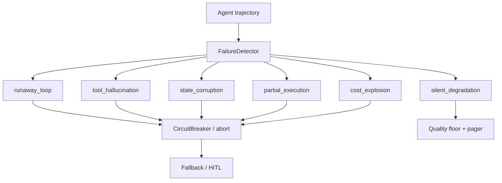
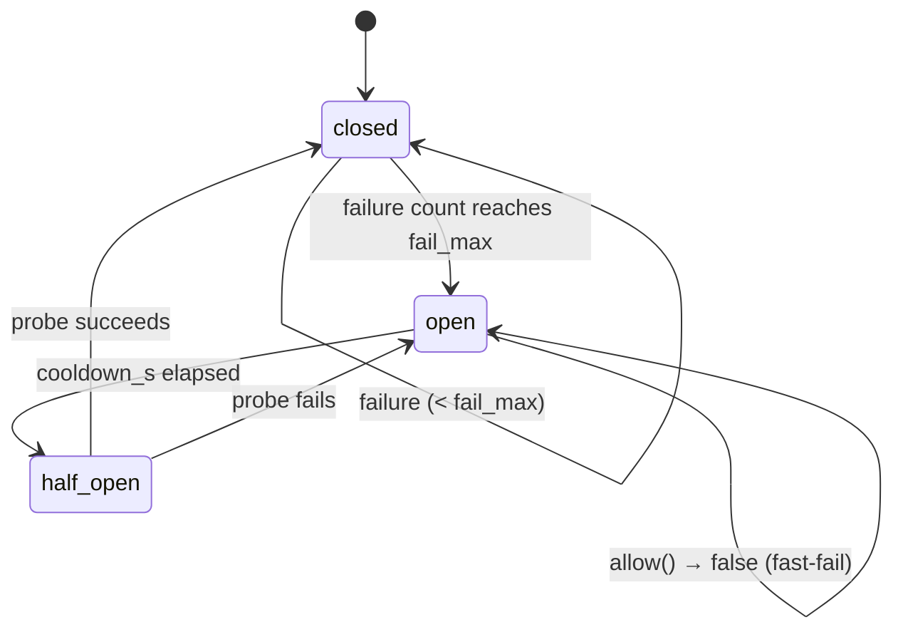

# Module 20 — Agent Reliability & Failure Modes

**Time:** 4–6 days · **Depends on:** [11 Single agents](11-single-agents.md), [12 Multi-agent](12-multi-agents.md), [10 Cost](10-cost-optimization.md) · **Next:** [Secure tool use](21-secure-tool-use.md)

<span data-module-id="20" hidden></span>

---

## Learning objectives

- Name a **failure taxonomy** for agents: runaway loops, tool hallucination, state corruption, partial execution, cost explosions, silent degradation
- Detect each mode from a **trajectory** (step log), not from a vibe
- Put **circuit breakers** and spend guards in the runtime, not in the prompt
- Treat reliability as a **control-plane** problem: abort, degrade, page — then eval

---

## Why this matters (CS engineer)

<div class="aieng-story" markdown>

Friday 17:10. The “research crew” has been “almost done” for ninety minutes. Logs show the same `search` signature 140 times, then a hallucinated `run_sql` that your allowlist never declared — except one intern had wired `**kwargs` through to a helper. Meanwhile a second worker wrote three of five planned tickets and crashed; the UI showed a green check because `done=True` was set on the first success. Cost: $186. Customer-visible quality: a 12-point drop vs last week’s golden set, no pager, because the HTTP layer still returned 200. Personality did not fail. **Controls** were missing.

</div>

Module 11 taught `max_steps` and repeated-signature abort. That is the minimum viable circuit breaker. Production agents fail in **families**. If you cannot name the family, you will patch the last incident forever.

<div class="aieng-intuition" markdown>
<p class="label">Intuition lock</p>

**Sticky picture:** An agent run is a **transaction with a flight recorder**. Failure modes are **classes of invariant violation**. A circuit breaker is a **fuse** — it trips on consecutive faults, cools down, then allows one probe. Silent degradation is a **slow leak**: HTTP 200, worse answers, no abort.

<div class="kill" markdown>
**Kill this idea:** “If it returned a final answer, the agent worked.” → **Replace with:** Score the **trajectory** (loops, tools, spend, commits, quality floor). A fluent final with a corrupted state or a $200 loop is a failed run.
</div>
</div>

---

## Mental model



**Invariant:** every production run emits a step log you can scan. Detectors are **pure functions** over that log. Breakers wrap **side-effecting** dependencies (tools, MCP servers, model providers).

---

## The six modes (taxonomy)

| Mode | What broke | Detection | Control |
|------|------------|-----------|---------|
| **Runaway loop** | Same tool signature or oscillating plan | Count canonical `name+args`; cap re-plans | Abort `repeated_tool_call`; `max_steps` |
| **Tool hallucination** | Model invents a name or args the runtime must not honor | Allowlist + JSON schema | Return observation error; never `eval` |
| **State corruption** | Scratchpad/plan/schema no longer checksums or parses | Hash + schema after each write | Refuse the write; restore last good snapshot |
| **Partial execution** | N of M side effects committed; process died | Compare `expected_commits` vs `committed` | Idempotent tools; compensating txn or HITL |
| **Cost explosion** | Tokens/$ grow without success | Spend guard **before** the next call | Open circuit; degrade to cheap model / cache |
| **Silent degradation** | Success-shaped output, quality floor missed | Trajectory eval vs golden (Module 22) | Don’t ship; canary + rollback (Module 23) |

Module 11 already stops identical tool signatures. This module **names the rest** and gives you scanners you can unit-test without a live model.

---

## Core tutorial

### 1. Step records are the source of truth

```python
from src.reliability import StepRecord, FailureDetector, FailureMode

steps = [
    StepRecord(index=0, decision_type="tool", tool_name="search",
               args={"q": "refund"}, cost_usd=0.02, latency_ms=120),
    StepRecord(index=1, decision_type="tool", tool_name="search",
               args={"q": "refund"}, cost_usd=0.02, latency_ms=110),
]
det = FailureDetector(
    max_repeat=2,
    cost_budget_usd=1.0,
    known_tools={"search", "lookup_order"},
)
hits = det.scan(steps)
assert any(h.mode is FailureMode.RUNAWAY_LOOP for h in hits)
```

Do not wait for a tracing SaaS to exist. A JSONL of `StepRecord` is enough to catch five of six modes. Silent degradation needs a **quality number** from Module 22.

<div class="aieng-explainer" markdown>
<p class="label">Explainer</p>

**Canonicalize before you count.** `{"q": "a", "k": 1}` and `{"k": 1, "q": "a"}` are the same call. `src.reliability.tool_signature` JSON-dumps with `sort_keys=True`. If you hash the raw model string, you will miss loops that shuffle keys or add spaces.
</div>

---

### 2. Circuit breakers wrap dependencies, not “the agent”

```python
from src.reliability import CircuitBreaker

breaker = CircuitBreaker(fail_max=3, cooldown_s=30)

def call_search(now: float, q: str) -> str:
    if not breaker.allow(now):
        return "error: search circuit open; use cache or abort"
    try:
        result = search(q)  # real I/O
    except Exception:
        breaker.record_failure(now)
        raise
    breaker.record_success()
    return result
```

States:

| State | Meaning |
|-------|---------|
| **closed** | Normal; failures increment a counter |
| **open** | Fast-fail; no I/O until cooldown |
| **half-open** | Exactly one in-flight probe (`allow` is false until that probe is recorded); success closes, failure re-opens |



This is the same fuse you want around **MCP servers** (Module 08) and **providers** (Module 13). Do not put “please stop looping” in the system prompt and call it a breaker.

<div class="aieng-think" markdown>
<p class="label">Think about it</p>

**Question:** Your tool succeeds HTTP-wise but returns empty hits. The model retries the identical query. Does `record_success` or `record_failure` fire? What else must trip?

<details data-think-id="20-t1"><summary>Reveal a strong answer</summary>

HTTP 200 empty is **not** a circuit failure of the search cluster — the dependency is up. It **is** a runaway-loop candidate: same signature, no new information. Trip the **signature counter** (and optionally a “empty-hit” policy: reformulate once, then final/I-don’t-know). Using the breaker here would open search for everyone after three empty product queries. Distinguish **infra faults** (timeouts, 5xx) from **policy faults** (thrash, hallucination).

</details>
</div>

---

### 3. Spend guards are admission control

```python
from src.reliability import SpendGuard

guard = SpendGuard(budget_usd=0.50)
if not guard.allow(estimated_usd=0.12):
    abort("cost_budget")
# ... call model ...
guard.charge(actual_usd=0.11)
```

Estimate **before** the call. Charging after a 20k-token completion is an autopsy. Pair with Module 10’s `UsageLedger` (per user) and Module 26’s per-agent attribution (per role).

---

### 4. State checksums and partial commits

```python
from src.reliability import state_checksum

before = state_checksum({"plan": plan, "facts": facts})
# worker writes
after = state_checksum({"plan": plan, "facts": facts})
if after != expected_after_schema_validate:
    restore_snapshot()
```

**Why a hash, not a deep-equal?** A checksum is one short string you can log, diff, and compare across processes without holding two full copies of state in memory; deep-equality needs both snapshots present at once and gets expensive as state grows. The hash trades a (vanishingly small) collision risk for O(1) comparison and a value that fits in a log line.

Partial execution: if the plan said “open 5 tickets” and the log shows 3 `ticket.create` successes plus a crash, the run is **not** `done`. Surface `committed=3/5` and either compensate (idempotent creates with a client key) or hand to a human (Module 25).

---

### 5. Silent degradation is an eval problem wearing a reliability badge

A run can have:

- `abort_reason is None`
- HTTP 200
- Valid JSON
- Quality 0.61 vs last week’s 0.88

That is **silent degradation**. Detectors need a `quality_score` from a golden trajectory suite (Module 22) and a **config pin** so you can roll back the prompt (Module 23). Reliability without evals is uptime theater.

---

## Failure modes (meta)

| Symptom | Cause | Fix |
|---------|-------|-----|
| Breaker flaps | Threshold too low / no cooldown | Raise `fail_max`; require consecutive faults |
| Loops missed | Uncanonicalized args | Sort keys; drop noise fields |
| Cost still explodes | Estimate always 0 | Charge a conservative floor per step |
| “Done” with 2/5 writes | Success flag on first commit | Track expected vs committed |
| Quality cliff, no ticket | No floor on composite score | Module 22 dashboard + CI gate |

---

## Lab

1. Script an `Agent` (Module 11) whose stub LLM repeats `search` twice; assert `FailureDetector` reports `runaway_loop`.
2. Propose a tool name not in `known_tools`; assert `tool_hallucination`.
3. Trip a `CircuitBreaker` with three failures; assert `allow` is false until cooldown.
4. Charge a `SpendGuard` past budget; assert the next `allow` is false.
5. Optional: checksum agent state before/after a stubbed worker; fail the run if the schema breaks.

```bash
poetry run pytest tests/test_reliability.py tests/test_agents.py -v
```

---

## Quizzes

<div class="aieng-quiz" data-quiz-id="20-q1" data-xp="25" data-success="Breakers wrap I/O; loops are a policy detector on signatures." data-fail="Re-read circuit breaker vs runaway loop." markdown>
<p class="label">Quiz · +25 XP</p>
<p class="quiz-prompt">Which failure is a circuit breaker the wrong first tool for?</p>
<div class="quiz-options">
<button type="button" class="quiz-opt" data-correct="false">Provider 5xx on three consecutive calls</button>
<button type="button" class="quiz-opt" data-correct="true">Identical search args retried while the search cluster is healthy</button>
<button type="button" class="quiz-opt" data-correct="false">MCP server timeouts</button>
<button type="button" class="quiz-opt" data-correct="false">Half-open probe after cooldown</button>
</div>
<p class="quiz-feedback"></p>
</div>

<div class="aieng-quiz" data-quiz-id="20-q2" data-xp="25" data-success="Partial execution is about committed side effects vs the plan." data-fail="Think distributed transactions, not prose quality." markdown>
<p class="label">Quiz · +25 XP</p>
<p class="quiz-prompt">What makes a run a partial-execution failure?</p>
<div class="quiz-options">
<button type="button" class="quiz-opt" data-correct="false">The model’s final answer is shorter than usual</button>
<button type="button" class="quiz-opt" data-correct="true">The plan required N side effects and fewer actually committed</button>
<button type="button" class="quiz-opt" data-correct="false">Token spend was under budget</button>
<button type="button" class="quiz-opt" data-correct="false">The user asked a follow-up</button>
</div>
<p class="quiz-feedback"></p>
</div>

<div class="aieng-quiz" data-quiz-id="20-q3" data-xp="25" data-success="Silent degradation needs a quality floor, not just HTTP success." data-fail="Uptime is not quality." markdown>
<p class="label">Quiz · +25 XP</p>
<p class="quiz-prompt">Why can a 200 OK agent still be a reliability incident?</p>
<div class="quiz-options">
<button type="button" class="quiz-opt" data-correct="false">HTTP 200 is illegal for LLM APIs</button>
<button type="button" class="quiz-opt" data-correct="true">Quality can fall below a floor with no abort or pager</button>
<button type="button" class="quiz-opt" data-correct="false">200 means the circuit breaker is stuck open</button>
<button type="button" class="quiz-opt" data-correct="false">Only 5xx counts as degradation</button>
</div>
<p class="quiz-feedback"></p>
</div>

---

## Open source materials

| Resource | Use it for |
|----------|------------|
| Course `src/reliability.py` + `tests/test_reliability.py` | Taxonomy, detector, breaker, spend guard |
| [12-factor agents](https://github.com/humanlayer/12-factor-agents) | Control flow, owned state |
| Module 11 / 13 | Hard stops; provider timeouts |
| Module 22 | Trajectory scores that make “silent” visible |

---

## Checkpoint

- [ ] You can list all **six** modes without notes  
- [ ] A detector runs on a stub trajectory in CI  
- [ ] A breaker wraps at least one real dependency (tool or HTTP)  
- [ ] Spend is admitted **before** the next model/tool call  
- [ ] “Done” requires expected side effects, not just a final string  

<div class="aieng-complete" data-module-id="20" data-xp="120" markdown>
<p>Mark complete when you can classify a bad run into the taxonomy and show the control that would have tripped.</p>
<button type="button">Complete module · +120 XP</button>
</div>

**Next:** [Module 21 — Secure tool use & sandboxing](21-secure-tool-use.md)
