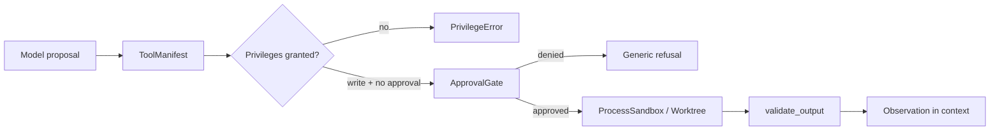
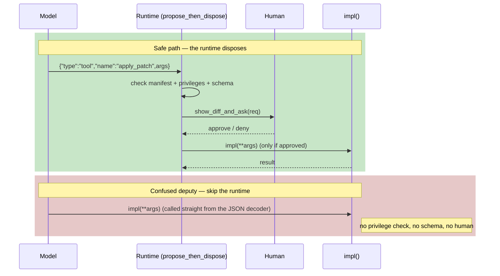

# Module 21 — Secure Tool Use & Sandboxing

**Time:** 5–7 days · **Depends on:** [02 Security](02-security-privacy.md), [11 Single agents](11-single-agents.md), [20 Reliability](20-agent-reliability.md) · **Pairs with:** [08 MCP](08-model-context-protocol.md) · **Next:** [Harness engineering](27-harness-engineering.md)

<span data-module-id="21" hidden></span>

---

## Learning objectives

- Ship tools as **least-privilege manifests**, not `run(cmd: str)`
- Put **approval gates** on writes; split internal reasons from user messages
- **Validate outputs** (size, secrets, schema) before they re-enter context
- Execute untrusted work in **isolation**: process bounds, temp worktrees, or containers
- Keep the sentence true: **the model proposes; the runtime disposes**

---

## Why this matters (CS engineer)

<div class="aieng-story" markdown>

An editor agent is told “clean up this module.” It has a god-tool `bash`. The model proposes `git checkout --orphan tmp && git add -A && git commit`. No path sandbox. No approval. The user’s uncommitted novel in a sibling folder is gone from the index. Postmortem: the prompt said “be careful.” The process had the user’s full UID, env, and credentials. **Policy lived in English.** English is not a sandbox.

</div>

Module 02 taught injection and allowlists. Module 11 executed tools in-process. This module is the **security course handshake**: capability tokens, human gates, and an execution environment that cannot reach the rest of the laptop.

<div class="aieng-intuition" markdown>
<p class="label">Intuition lock</p>

**Sticky picture:** Each tool is a **badge with listed doors** (read / write / exec / network). Approval is a **physical key** for write doors. A worktree is a **photocopy of the repo in a locked room** — the original stays on the shelf until a merge gate says otherwise. Output validation is the **x-ray of what comes back**.

<div class="kill" markdown>
**Kill this idea:** “We’ll sandbox later; for now the agent has shell so it can be useful.” → **Replace with:** Narrow tools, granted privileges, approval on writes, isolated cwd/env/timeout, validate the bytes that re-enter the prompt.
</div>
</div>

---

## Mental model



**Invariant:** the model never receives a shell. It receives names from a catalog. Your code maps names to fixed functions with schemas.

---

## Core tutorial

### 1. Manifests are capability tokens

```python
from src.sandbox import Privilege, ToolManifest, ToolRegistry, PrivilegeError

reg = ToolRegistry()
reg.register(
    ToolManifest(
        name="read_file",
        privileges=frozenset({Privilege.READ}),
        arg_schema={"path": str},
        max_output_chars=4000,
    ),
    lambda path: open(path, encoding="utf-8").read(),
)
reg.register(
    ToolManifest(
        name="apply_patch",
        privileges=frozenset({Privilege.WRITE}),
        arg_schema={"diff": str},
        requires_approval=True,
    ),
    apply_patch_impl,
)

reg.invoke("read_file", {"path": "README.md"}, granted={Privilege.READ})
# PrivilegeError — write not granted, and approval required:
# reg.invoke("apply_patch", {"diff": "..."}, granted={Privilege.READ})
```

| Privilege | Typical tools |
|-----------|----------------|
| `READ` | `read_file`, `list_dir`, `search` |
| `WRITE` | `apply_patch`, `ticket.close` |
| `EXEC` | `run_tests` (fixed argv, not a string) |
| `NETWORK` | `fetch_url` with host allowlist |

If a tool needs more than one privilege, that is a smell: split it.

---

### 2. Approval gates (HITL)

```python
from src.sandbox import ApprovalGate, propose_then_dispose

gate = ApprovalGate()
out = propose_then_dispose(
    reg,
    "apply_patch",
    {"diff": "--- a/x\n+++ b/x\n"},
    granted={Privilege.WRITE},
    gate=gate,
    approver=lambda req: show_diff_and_ask(req),  # UI / CLI
)
```

Rules:

- Default **deny** if the human walks away (timeout → denied)
- Internal log: `apply_patch denied: unapproved production path`
- User-facing: generic, no gadget for attackers (`I can't apply that change yet`)
- MCP write tools use the **same** gate (Module 08). No protocol shortcut.

<div class="aieng-explainer" markdown>
<p class="label">Explainer</p>

**Propose / dispose** is the whole security model. The LLM can emit `{"type":"tool","name":"apply_patch",...}` all day. Nothing hits disk until `propose_then_dispose` checks the manifest, privileges, schema, and human. If you find a code path that calls `impl(**args)` from the JSON decoder, you have a confused deputy.
</div>



The bottom half is the bug to grep for: any handler that unpacks model JSON straight into a privileged function is a confused deputy, because it lets the model's *proposal* act with the runtime's *authority*.

---

### 3. Output validation

Tool results are **untrusted** — they can contain secrets, injection, or 2MB of noise.

```python
from src.sandbox import validate_output

safe = validate_output(raw, max_chars=4000)
# raises if 'BEGIN RSA PRIVATE KEY' / 'AWS_SECRET' appear
```

Production extras: JSON schema on structured tools, URL allowlists on `fetch_url`, strip ANSI / null bytes, never log raw.

---

### 4. Process isolation (the laptop-friendly sandbox)

You do not need gVisor to get 80% of the value:

```python
from src.sandbox import ProcessSandbox

box = ProcessSandbox(root=repo_subdir, timeout_s=8)
proc = box.run(["pytest", "tests/test_foo.py", "-q"])  # argv list, no shell
```

`ProcessSandbox`:

- `cwd` fixed to a root
- env scrubbed to `PATH` + explicit extras (no inherited `AWS_*` by default)
- `timeout`
- `shell=False`

Still not a security boundary against a malicious binary with the same UID. It **is** a boundary against “the model concatenated a string into bash.” The gap: any process running as your UID can read your files, use your credentials, and ptrace your other processes — a fixed `cwd` and scrubbed env do not stop that, they only stop *accidental* reach. Closing it needs a UID the untrusted work does not share with you: a dedicated non-root runner user, or a container (drop capabilities, read-only root, no network) whose namespace the host process cannot cross.

---

### 5. Worktrees: copy, mutate, merge-gate

```python
from src.sandbox import WorktreeExecutor

with WorktreeExecutor(source=Path(".")) as wt:
    wt.write_file("src/foo.py", new_src)
    # run tests inside wt.path
    snap = wt.snapshot_files()
# original tree untouched
```

Coding agents should **never** edit the user’s working copy as their first write. Isolated copy → tests → [merge gate](25-durable-orchestration.md) → human approve → apply. This is the same shape as CI: PR branch, not `main`.

<div class="aieng-think" markdown>
<p class="label">Think about it</p>

**Question:** Product wants one tool `bash(command: str)` “like a senior engineer.” You have a container. Is that enough?

<details data-think-id="21-t1"><summary>Reveal a strong answer</summary>

A container with a network and a mounted Docker socket is a **root-equivalent** confused deputy. Even a tight container still lets the model probe until it finds `curl | sh`. Split into `read_file` / `list_dir` / `run_tests` / `git_diff` with argv arrays, path prefixes, and approval on writes. Isolation **reduces blast radius**; it does not replace least privilege. Keep network off unless a named `fetch_url` tool needs it.

</details>
</div>

---

## Mapping to the security course

| Security idea | Agent encoding |
|---------------|----------------|
| Confused deputy | Model-proposed args into a privileged runtime |
| Least privilege | `ToolManifest.privileges` ∩ granted set |
| Dual control | `requires_approval` + `ApprovalGate` |
| Untrusted input | Tool observations wrapped as data (Module 02 / 08) |
| Blast radius | Worktree / container / non-root UID |

---

## Failure modes

| Symptom | Cause | Fix |
|---------|-------|-----|
| Agent “needed bash” | God-tool | Split capabilities |
| Writes apply in the UI tree | No worktree | Copy-on-write + merge gate |
| Secrets in scratchpad | Unvalidated tool dump | `validate_output` + redact |
| Approval fatigue | Every read gated | Gate **writes** and high-risk MCP only |
| Escape via `../` | Path not resolved vs root | `relative_to` after `resolve()` |

---

## Lab

1. Register `echo` (read) and `apply_patch` (write, approval). Unit-test deny without grant and deny without human.
2. Feed `validate_output` a fake key; assert raise. Feed a 10k string; assert truncate.
3. `ProcessSandbox` on a temp dir: run `sys.executable -c` that reads a file **in** the dir; confirm.
4. `WorktreeExecutor`: mutate a copy; assert the source file is unchanged.
5. Stretch: wrap `run_tests` as `EXEC` with a fixed argv, timeout 30s.

```bash
poetry run pytest tests/test_sandbox.py -v
```

---

## Quizzes

<div class="aieng-quiz" data-quiz-id="21-q1" data-xp="25" data-success="Runtime disposes; manifests are the capability tokens." data-fail="Re-read propose vs dispose." markdown>
<p class="label">Quiz · +25 XP</p>
<p class="quiz-prompt">Who is allowed to execute a write tool?</p>
<div class="quiz-options">
<button type="button" class="quiz-opt" data-correct="false">The model, if the prompt says it is careful</button>
<button type="button" class="quiz-opt" data-correct="true">Your runtime, after privilege check, schema, and approval when required</button>
<button type="button" class="quiz-opt" data-correct="false">Any MCP server the host auto-started</button>
<button type="button" class="quiz-opt" data-correct="false">A second agent with the same shell</button>
</div>
<p class="quiz-feedback"></p>
</div>

<div class="aieng-quiz" data-quiz-id="21-q2" data-xp="25" data-success="Worktrees protect the original tree until a merge gate." data-fail="Isolation is copy-then-merge, not hope." markdown>
<p class="label">Quiz · +25 XP</p>
<p class="quiz-prompt">Why should a coding agent write into a worktree first?</p>
<div class="quiz-options">
<button type="button" class="quiz-opt" data-correct="false">Worktrees make the model smarter</button>
<button type="button" class="quiz-opt" data-correct="true">Failed or unapproved edits never touch the user’s original files</button>
<button type="button" class="quiz-opt" data-correct="false">Git forbids editing the working tree</button>
<button type="button" class="quiz-opt" data-correct="false">It removes the need for tests</button>
</div>
<p class="quiz-feedback"></p>
</div>

---

## Open source materials

| Resource | Use it for |
|----------|------------|
| `src/sandbox.py` + `tests/test_sandbox.py` | Manifests, gates, process + worktree |
| [Module 02](02-security-privacy.md) | Injection / confused deputy |
| [MCP spec](https://modelcontextprotocol.io/) | Host policy on third-party tools |
| Containers: drop capabilities, read-only root | Stronger isolation when you outgrow subprocess |

---

## Checkpoint

- [ ] No god-tool `run(cmd)` in your design  
- [ ] Writes require approval; reads do not spam the human  
- [ ] Tool output is size-capped and scanned  
- [ ] At least one isolated executor (process **or** worktree) has a test  
- [ ] Paths cannot escape the sandbox root  

<div class="aieng-complete" data-module-id="21" data-xp="120" markdown>
<p>Mark complete when a write cannot land without a manifest, a grant, and (if required) a human.</p>
<button type="button">Complete module · +120 XP</button>
</div>

## Exercise

- **Catalog:** [EX-21 — Sandbox](../reference/exercises.md#ex-21)
- **Prove:** Writes deny without grant+human; a worktree edit leaves the source file untouched.
- **Test:** `pytest tests/test_sandbox.py -v`

**Next:** [Module 27 — Harness engineering](27-harness-engineering.md)
