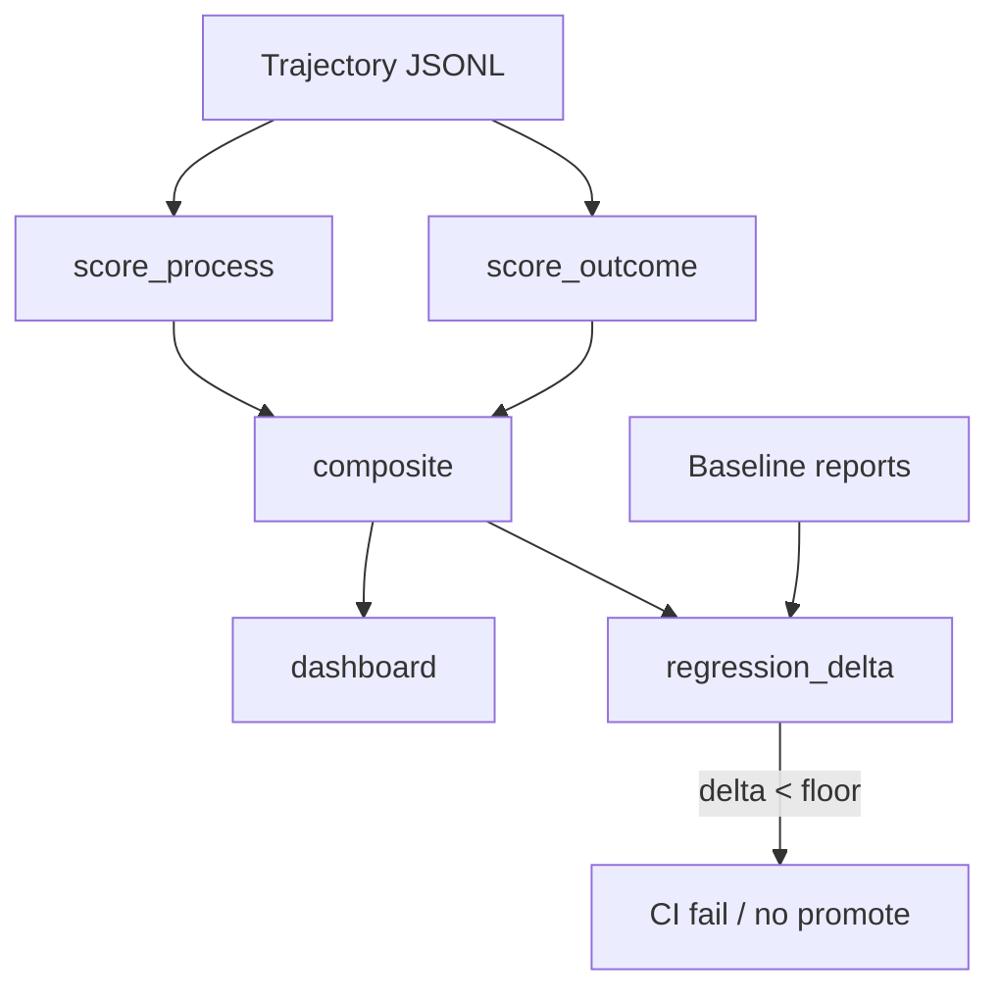
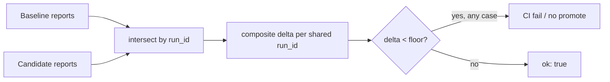

# Module 22 — Evaluating Agentic Systems

**Time:** 5–7 days · **Depends on:** [04 Testing & evals](04-testing-evals.md), [11](11-single-agents.md)–[12](12-multi-agents.md), [20 Reliability](20-agent-reliability.md) · **Next:** [Prompt & config drift](23-prompt-drift.md)

<span data-module-id="22" hidden></span>

---

## Learning objectives

- Score **trajectories**, not only final strings
- Separate **process** metrics (loops, tools, spend, latency) from **outcome** metrics (task success)
- Detect **regressions** on multi-step suites when a prompt or model changes
- Ship a tiny **cost / latency / quality** dashboard from real stubbed runs

---

## Why this matters (CS engineer)

<div class="aieng-story" markdown>

Golden-set extract accuracy is 94%. Leadership ships the new “agentic” support bot. A week later, tickets close slower and the bill is 6×. Extract evals are still green — the bot still parses invoices. What died was the **path**: 18 tool calls instead of 3, two hallucinated tools per session, $0.40 vs $0.04, and a 40-second p95. Single-turn evals never saw a trajectory. The regression was **silent on the only dashboard you had**.

</div>

Module 04 is necessary and insufficient. Agents fail **in the middle**. If you only assert the final JSON, you will promote a loop that lucks into the right answer.

<div class="aieng-intuition" markdown>
<p class="label">Intuition lock</p>

**Sticky picture:** Outcome is the **exam score**. Process is the **proctor’s tape**: did they copy, burn the budget, or invent a tool? Composite = outcome minus process penalties. A regression is a **negative delta vs a pinned baseline suite**, not a worse demo anecdote.

<div class="kill" markdown>
**Kill this idea:** “We’ll eval the final answer like a chatbot.” → **Replace with:** Log every step, score process and outcome, compare suites by `run_id`, fail CI when composite drops below a floor.
</div>
</div>

---

## Mental model



**Invariant:** every eval case has a stable `run_id`. You cannot diff “the vibe of Tuesday.”

---

## Core tutorial

### 1. A trajectory is a typed object

```python
from src.agent_evals import Trajectory, evaluate_trajectory
from src.reliability import StepRecord, FailureDetector

traj = Trajectory(
    run_id="refund-001",
    goal="What is the refund window?",
    steps=[
        StepRecord(
            index=0, decision_type="tool", tool_name="search",
            args={"q": "refund"}, cost_usd=0.01, latency_ms=80,
        ),
        StepRecord(index=1, decision_type="final", cost_usd=0.02, latency_ms=200),
    ],
    outcome="30 days",
    success=True,
)
report = evaluate_trajectory(
    traj,
    expect="30 days",
    detector=FailureDetector(known_tools={"search"}, cost_budget_usd=1.0),
)
assert report.outcome.exact
assert report.process.budget_ok
assert report.composite == 1.0
```

Wire this to `src.agents.Agent` by appending a `StepRecord` per loop iteration (tokens/cost if you have them; zeros are honest in CI stubs).

#### Agent Flight Recorder

`StepRecord` above is this repo's minimal version of a more complete trace schema — the **Agent Flight Recorder** — worth logging in full once an agent is calling tools in production, because it's the only thing that turns "the agent did something weird" into a diagnosable incident:

```text
request_id
timestamp
model
model_version
prompt_version
input_tokens
output_tokens
step
tool_requested
tool_arguments
authorization_result
tool_result
latency
cost
retry_count
validation_result
final_status
```

Every field earns its place: `request_id` is the join key back to [13 — Production](13-production.md#execution-flow-with-cost-and-latency-overlaid)'s logs and traces; `prompt_version`/`model_version` are what [23 — Prompt & config drift](23-prompt-drift.md) diffs against; `authorization_result` is the auditable proof that a tool call was actually checked (not just requested); `tool_arguments` + `tool_result` are what let you replay a run offline against a new detector without re-calling the real tool. A trajectory report (`report` in the example above) is this schema aggregated across every step of one run — the dashboard in §4 is this schema aggregated across every *run*.

---

### 2. Process vs outcome

| Layer | Questions | Fail closed when |
|-------|-----------|------------------|
| **Outcome** | Did we solve the user’s task? Exact match / rubric / human | Success criteria unmet |
| **Process** | Loops? Hallucinated tools? Over budget? Slow? | Detector hits; spend > budget |
| **Composite** | Outcome minus penalties | Below floor **or** vs baseline delta |

A run can **succeed on outcome and fail process** (lucky loop). That is still a failed promote: it will not stay lucky at 10× traffic.

<div class="aieng-explainer" markdown>
<p class="label">Explainer</p>

**Why not 50/50 weights?** Outcome-heavy composites match the product: a cheap, clean failure that admits “I don’t know” can be better than a looping success. Process penalties are **caps** so you cannot buy a correct answer with an unbounded graph. Tune floors on *your* golden set; do not cargo-cult the teaching `composite_score`.

Concretely, `src.agent_evals.composite_score` starts at `1.0` if the outcome succeeded, `0.0` if it did not, then subtracts:

| Penalty | Weight | Fires when |
|---------|--------|------------|
| Loop violation | `-0.25` each | `FailureDetector` hits `runaway_loop` |
| Hallucinated tool | `-0.35` each | Model proposed a name outside `known_tools` |
| Over budget | `-0.4` flat | Total spend exceeded `cost_budget_usd` |

The score is clamped to `[0.0, 1.0]`. So a “successful” run that loops twice and blows budget still lands at `1.0 - 0.5 - 0.4 = 0.1` — a near-fail composite despite `outcome.success is True`. That gap between outcome and composite is exactly what the process penalties are for.
</div>

---

### 3. Regression on multi-step workflows

```python
from src.agent_evals import regression_delta

delta = regression_delta(baseline_reports, candidate_reports, floor=-0.05)
assert delta["ok"], delta["regressions"]
```

Practice:

1. Freeze a **baseline** JSON of `TrajectoryReport` (or recompute from pinned traces).
2. On each prompt/model/tool change, rerun the suite with the **same** `run_id`s.
3. Fail if any case drops more than `floor`, or if mean delta is red.



Matching is by `run_id`, not by list position or prompt text. `regression_delta` only compares the **intersection** of baseline and candidate `run_id`s — a case dropped or renamed in the candidate suite silently disappears from the comparison instead of failing the gate, so treat "case count changed" as its own check, not something the delta will catch for you.

This is Module 04’s golden gate, lifted to agents.

---

### 4. Dashboard (the three axes)

```python
from src.agent_evals import dashboard
print(dashboard(reports))
# n, success_rate, mean_composite, mean_steps, mean_spend_usd,
# p95_latency_ms, budget_violations
```

Put these next to Module 10 unit economics. A quality win that 4×’s p95 and 10×’s $ is a product decision, not an automatic merge.

`dashboard()` above returns a slice of this; the fuller reliability/cost picture — reused verbatim as the ops dashboard in [13 — Production](13-production.md#3-observability-metrics-traces-logs) — is:

| Metric | Source | Why it's on the dashboard |
|---|---|---|
| Success rate | Outcome score | The headline number, and the one most likely to hide the rest |
| Schema-valid rate | Structured validator (Gate 1) | Separates "wrong answer" from "broken contract" |
| p50 / p95 / p99 latency | Per-request timing | Tail latency is what pages you, not the median |
| Input / output tokens | Model call metadata | Cost driver #1, independent of $/token pricing changes |
| Cost / request | Tokens × pricing + tool costs | The number finance actually asks for |
| Retry rate | Retry counter per hop | A silent multiplier on both latency and cost |
| Fallback rate | Fallback-path counter | How often the primary path is actually failing, hidden by a working fallback |
| Retrieval failure rate | RAG pipeline (Gate 3) | Empty or low-confidence retrievals, if you have retrieval in the loop |
| Tool failure rate | Tool call outcome | Distinguishes "the agent chose badly" from "the tool was down" |
| Average agent steps | Trajectory step count | Rising steps with flat success rate is a loop or drift developing quietly |
| Eval pass rate | CI golden-set gate (Module 04/here) | Whether quality is regressing before a human notices |

A dashboard missing any row here can look "green" while one of these is quietly getting worse — `budget_violations` above is one instance of that pattern (spend rising while `success_rate` still looks fine), not the only one.

<div class="aieng-think" markdown>
<p class="label">Think about it</p>

**Question:** Candidate suite: success_rate 0.90 → 0.93, mean_spend $0.04 → $0.40, mean_steps 3 → 14. Promote?

<details data-think-id="22-t1"><summary>Reveal a strong answer</summary>

Not on success_rate alone. Composite should penalize budget; `budget_violations` and `mean_steps` are the story. Either tighten the spend guard (Module 20) and re-eval, or accept the cost with a documented SLO. Promoting because “accuracy went up” is how you buy a money fire. Show the three-axis dashboard in the PR.

</details>
</div>

---

### 5. How to score *real* agent runs in this repo

You do not need a paid model for CI:

1. Stub LLM returns scripted JSON decisions (see `tests/test_agents.py`).
2. Convert `AgentState.steps` → `StepRecord` list (add fake costs in tests).
3. `evaluate_trajectory` + `dashboard` + `regression_delta`.

Scheduled job (optional): replay the same fixtures against a live model, write JSONL traces, compare to baseline. Cap spend with `SpendGuard`.

---

## Failure modes

| Symptom | Cause | Fix |
|---------|-------|-----|
| Flaky evals | Live model in PR CI | Stub in PR; live on nightly |
| “N=3” dashboard | Tiny suite | ≥20 tasks, include fail/loop cases |
| Outcome-only gate | Process not scored | Composite + budget_violations |
| Unstable ids | Prompt text as key | Stable `run_id` |
| Lucky loops look green | No process penalty | Detector in the scorer |

---

## Lab

1. Build three stub trajectories: exact success, looping success, hallucinated-tool failure.
2. Print `dashboard([...])`; confirm `budget_violations` / composite move.
3. Compute `regression_delta` where the candidate loops; assert `ok is False`.
4. Optional: adapter from `AgentState` → `Trajectory` in ten lines; test it.

```bash
poetry run pytest tests/test_agent_evals.py tests/test_reliability.py -v
```

---

## Quizzes

<div class="aieng-quiz" data-quiz-id="22-q1" data-xp="25" data-success="Process catches loops and spend the outcome score cannot see." data-fail="Re-read process vs outcome." markdown>
<p class="label">Quiz · +25 XP</p>
<p class="quiz-prompt">Why score process separately from outcome?</p>
<div class="quiz-options">
<button type="button" class="quiz-opt" data-correct="false">Process scores replace the need for a golden set</button>
<button type="button" class="quiz-opt" data-correct="true">A correct final answer can still hide loops, hallucinated tools, or budget violations</button>
<button type="button" class="quiz-opt" data-correct="false">Outcome metrics are illegal in CI</button>
<button type="button" class="quiz-opt" data-correct="false">Process is only for multi-agent systems</button>
</div>
<p class="quiz-feedback"></p>
</div>

<div class="aieng-quiz" data-quiz-id="22-q2" data-xp="25" data-success="Regressions are deltas on stable run ids." data-fail="Think baseline vs candidate, not one-off demos." markdown>
<p class="label">Quiz · +25 XP</p>
<p class="quiz-prompt">What is the input to a trajectory regression gate?</p>
<div class="quiz-options">
<button type="button" class="quiz-opt" data-correct="false">A single chat screenshot</button>
<button type="button" class="quiz-opt" data-correct="true">Paired reports for the same run_ids, baseline vs candidate</button>
<button type="button" class="quiz-opt" data-correct="false">Provider status page uptime</button>
<button type="button" class="quiz-opt" data-correct="false">The system prompt length</button>
</div>
<p class="quiz-feedback"></p>
</div>

---

## Open source materials

| Resource | Use it for |
|----------|------------|
| `src/agent_evals.py` + tests | Trajectory, composite, dashboard, regression |
| Module 04 | Golden sets, unit vs eval |
| Langfuse / Phoenix / OpenTelemetry | Prod traces with the same fields |
| [Inspect](https://inspect.aisi.org.uk/) / agent eval papers | Deeper process graders |

---

## Checkpoint

- [ ] You log steps on every teaching agent run  
- [ ] Process and outcome are **both** in the report  
- [ ] A regression helper fails a worsened suite  
- [ ] You can explain the dashboard dict without notes  

<div class="aieng-complete" data-module-id="22" data-xp="120" markdown>
<p>Mark complete when a stubbed multi-step suite scores process + outcome and would fail CI on a loop regression.</p>
<button type="button">Complete module · +120 XP</button>
</div>

**Next:** [Module 23 — Prompt & config drift](23-prompt-drift.md)
