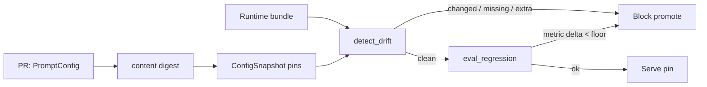

# Module 23 — Prompt & Config Drift Detection

**Time:** 3–5 days · **Depends on:** [04](04-testing-evals.md), [13 Production](13-production.md), [22 Agent evals](22-agent-evaluation.md) · **Next:** [Local-first agents](24-local-first-agents.md)

<span data-module-id="23" hidden></span>

---

## Learning objectives

- Treat prompts, decoding params, model IDs, and tool allowlists as **one versioned bundle**
- Pin **content hashes** in each environment and detect silent edits
- Gate deploys on **eval regression** against the pinned bundle, not on “looks fine in playground”
- Roll back the **bundle**, not a lone string in a dashboard

---

## Why this matters (CS engineer)

<div class="aieng-story" markdown>

Tuesday: someone “just tweaks” the support system prompt in a vendor playground to be “warmer.” No PR. Hash changes. Tool list accidentally includes `export_transcript`. Wednesday: parse_rate on the golden set is 71% (was 92%); a user gets an internal runbook in the reply. Logs still say `prompt_version=v3` because the env var was never bumped — only the blob behind it moved. **The pin lied.** Drift is a config-integrity bug.

</div>

Module 13 said prompts are code. This module is the **checksum and the CI hook**. Agent systems make it worse: a one-line tool addition is a privilege change (Module 21) disguised as copyedits.

<div class="aieng-intuition" markdown>
<p class="label">Intuition lock</p>

**Sticky picture:** A prompt is a **release artifact** — like a container image digest. The snapshot is the **lockfile**. Drift is `git status` for production config. Eval regression is the **smoke test** that catches meaning changes the hash already flagged as bytes-changed.

<div class="kill" markdown>
**Kill this idea:** “We’ll version the name (`v3`) and edit the text in place.” → **Replace with:** Hash the whole bundle (template + model + temperature + tools + policy). Name and digest must move together. Unpinned live text is an incident waiting for a diff.
</div>
</div>

---

## Mental model



**Invariant:** what the model sees in prod is byte-identical to what CI scored, or you have a drift finding.

---

## Core tutorial

### 1. The bundle, not the string

```python
from src.drift import PromptConfig, ConfigSnapshot, detect_drift

cfg = PromptConfig(
    prompt_id="support_reply",
    version="v3",
    template="You are a clerk. Cite policy ids. Refuse medical advice.",
    model_id="cloud-mini",
    temperature=0.0,
    max_tokens=512,
    tools=("lookup_policy",),
    policy_version="legal-2026-01",
)
snap = ConfigSnapshot(env="prod")
snap.pin(cfg)
```

Changing **any** field changes `cfg.digest()`. That is the point: temperature 0.7 and a new tool are behavior, not cosmetics.

<div class="aieng-explainer" markdown>
<p class="label">Explainer</p>

**Why hash instead of trusting `version="v3"`?** Humans reuse names. Vendors edit hosted prompts behind a stable id. A digest over a canonical JSON bundle (`sort_keys=True`) is the same idea as pinning a Docker digest instead of `:latest`. Store both: `v3` for humans, hash for machines.

`cfg.digest()` is `sha256` over the canonical bundle — a 256-bit digest, so an accidental collision between two *different* bundles is not a practical concern at course or even large-org scale. The real risk is not a hash collision; it is comparing an **uncanonicalized** blob (different key order, extra whitespace) and getting a false `changed` finding. That is why the digest always runs over `sort_keys=True` JSON, not the raw dict repr.
</div>

---

### 2. Three kinds of drift

```python
findings = detect_drift(snap, live_configs)
# kind: changed | missing | extra
```

| Kind | Meaning | Typical cause |
|------|---------|----------------|
| `changed` | Same `prompt_id`, different digest | Silent edit, model id swap, tool added |
| `missing` | Pin exists, runtime does not | Failed deploy / wrong env |
| `extra` | Runtime has an unpinned id | Shadow prompt, forgotten experiment |

Any finding is a **failed ready check**. Do not “log and continue” in prod.

---

### 3. Bytes-equal is not behavior-equal? Then eval.

A *deliberate* change should:

1. Bump `version` and re-pin after review
2. Run Module 04 golden + Module 22 trajectories
3. `eval_regression(baseline_metrics, candidate_metrics, floor=-0.03)`

```python
from src.drift import eval_regression

gate = eval_regression(
    {"parse_rate": 0.92, "refuse": 1.0, "agent_composite": 0.81},
    candidate_metrics,
)
assert gate["ok"], gate["regressions"]
```

Hash detects **unreviewed** change. Eval detects **reviewed but harmful** change.

<div class="aieng-think" markdown>
<p class="label">Think about it</p>

**Question:** Hash is unchanged, eval composite dropped 8 points overnight. What drifted that this module’s snapshot does not cover?

<details data-think-id="23-t1"><summary>Reveal a strong answer</summary>

Upstream of the bundle: retrieved corpus, MCP server version, tool implementation, tokenizer, provider silent model swap behind the same API id, or the eval set itself. Pin those too (corpus content hash, `MCPServerSpec.version`, tool image digest). Module 08’s `assert_version` and Module 13’s model pin are the same pattern. If the provider won’t pin, treat the model id as unreliable and watch evals harder.

</details>
</div>

---

### 4. Lightweight production hook

At process boot (or every N minutes):

1. Load pinned snapshot from config repo / S3 / env
2. Load live templates the worker will use
3. `detect_drift` → fail health **readiness** (keep liveness up so orchestrators can restart)
4. On deploy, write `prompt_id`, `version`, `digest` into every log line (Module 13 `request_id` family)

Canary: 5% of traffic on `v4` digest; compare Module 22 dashboard; promote the pin or roll back the pin.

---

## Failure modes

| Symptom | Cause | Fix |
|---------|-------|-----|
| Version label stable, behavior new | Text edited in place | Hash the bundle |
| Hash fire on whitespace | Uncanonical JSON | `sort_keys`, stable separators |
| Drift clean, quality dead | Corpus / MCP / model | Pin those artifacts too |
| Dashboard edit in prod | Humans have write on live blob | Read-only prod; PR to config repo |

---

## Lab

1. Pin `PromptConfig`; copy it; assert `detect_drift` is empty.
2. Change only `tools`; assert `kind == "changed"`.
3. Drop the id from `live`; assert `missing`.
4. `eval_regression` with `parse_rate` 0.92 → 0.70; assert not `ok`.
5. Optional: print digest in a fake `/healthz` readiness payload.

```bash
poetry run pytest tests/test_drift.py -v
```

---

## Quizzes

<div class="aieng-quiz" data-quiz-id="23-q1" data-xp="25" data-success="The digest covers the whole behavior bundle." data-fail="A name is not a pin." markdown>
<p class="label">Quiz · +25 XP</p>
<p class="quiz-prompt">What must a production pin include besides the template string?</p>
<div class="quiz-options">
<button type="button" class="quiz-opt" data-correct="false">Only the author’s Slack handle</button>
<button type="button" class="quiz-opt" data-correct="true">Model id, decoding params, tool list, and policy version — hashed together</button>
<button type="button" class="quiz-opt" data-correct="false">The full conversation history</button>
<button type="button" class="quiz-opt" data-correct="false">Nothing — v3 as a string is enough</button>
</div>
<p class="quiz-feedback"></p>
</div>

<div class="aieng-quiz" data-quiz-id="23-q2" data-xp="25" data-success="Hash catches silent edits; eval catches harmful reviewed edits." data-fail="You need both detectors." markdown>
<p class="label">Quiz · +25 XP</p>
<p class="quiz-prompt">When do you need eval_regression in addition to detect_drift?</p>
<div class="quiz-options">
<button type="button" class="quiz-opt" data-correct="false">Never — hashes guarantee quality</button>
<button type="button" class="quiz-opt" data-correct="true">When the bundle change is intentional and you must know if behavior got worse</button>
<button type="button" class="quiz-opt" data-correct="false">Only for image models</button>
<button type="button" class="quiz-opt" data-correct="false">Only if detect_drift already failed</button>
</div>
<p class="quiz-feedback"></p>
</div>

---

## Open source materials

| Resource | Use it for |
|----------|------------|
| `src/drift.py` + tests | Hash, snapshot, regression gate |
| Module 13 prompt-as-release | Rollback bundles |
| Module 22 | Agent composite as a drift metric |
| Feature flags / config services | Canary the pin |

---

## Checkpoint

- [ ] Prompt + model + tools are one object with a digest  
- [ ] Prod snapshot is compared at boot or promote  
- [ ] Intentional changes bump version **and** re-run evals  
- [ ] Logs carry `prompt_id` / version / digest  

<div class="aieng-complete" data-module-id="23" data-xp="100" markdown>
<p>Mark complete when a silent template edit would fail a pin check, and a reviewed edit would still need an eval gate.</p>
<button type="button">Complete module · +100 XP</button>
</div>

## Exercise

- **Catalog:** [EX-23 — Prompt drift](../reference/exercises.md#ex-23)
- **Prove:** A tool-list change is `changed`, a missing pin is `missing`, a parse-rate drop fails the gate.
- **Test:** `pytest tests/test_drift.py -v`

**Next:** [Module 24 — Local-first, cost-aware agents](24-local-first-agents.md)
