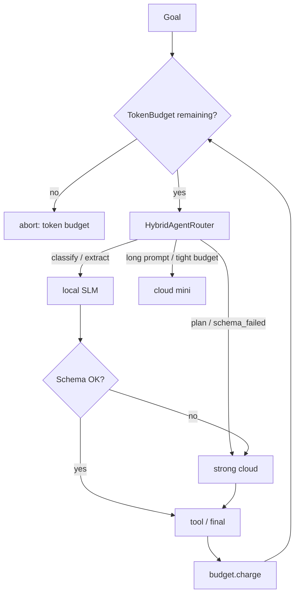
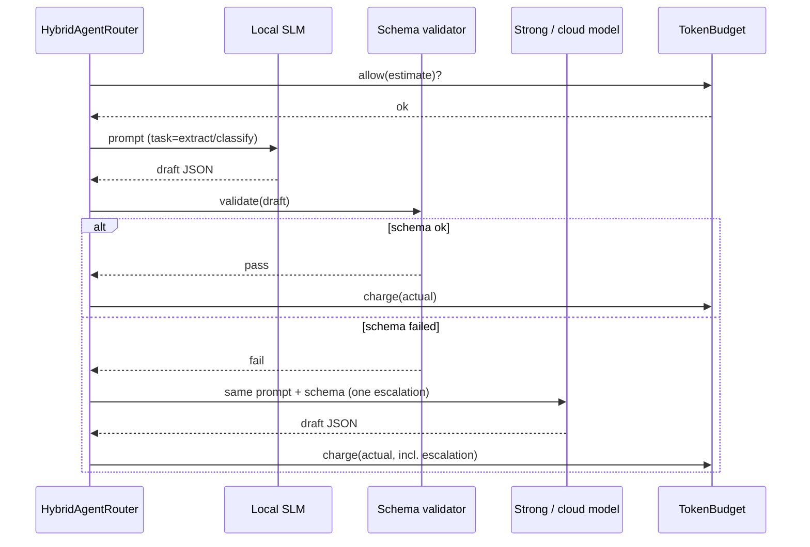

# Module 24 — Local-First, Cost-Aware Agents

**Time:** 4–6 days · **Depends on:** [10 Cost](10-cost-optimization.md), [11 Single agents](11-single-agents.md), [17 Small models](17-small-models.md), [20 Reliability](20-agent-reliability.md) · **Next:** [Durable orchestration](25-durable-orchestration.md)

<span data-module-id="24" hidden></span>

---

## Learning objectives

- Run a **useful** agent on a laptop: local/SLM first, cloud only on escalate
- Enforce a **token budget** in the runtime (hard stop), not in the prompt
- Route by **task class + remaining budget + schema failure**, not by vibes
- Keep the course ethos: **no GPU required** for the teaching path; optional Ollama

---

## Why this matters (CS engineer)

<div class="aieng-story" markdown>

A weekend hack ships a “personal repo agent” that calls a flagship model for `list_dir`. Four hours of thrash: $40, a warm laptop, and a summary you could have gotten from `rg`. The SLM on Ollama would have classified and extracted; the cloud model was only needed when JSON failed twice. There was no **token budget**, no **tier**, and no admission control. Local-first is not charity. It is the same routing idea as Module 10, applied to **agents that otherwise loop**.

</div>

Module 17 taught how to *run* small models. This module teaches how to *assign work* to them inside a plan–act–observe loop without lighting money on fire when they fail.

<div class="aieng-intuition" markdown>
<p class="label">Intuition lock</p>

**Sticky picture:** The local model is the **on-call intern with a clipboard** — classify, extract, route, short rewrite. The cloud model is the **consultant you page** when the schema fails or the task is `plan`. The token budget is a **prepaid meter**: the next prompt is refused if it would overflow. Hybrid routing is **triage**, not a personality contest.

<div class="kill" markdown>
**Kill this idea:** “Local models aren’t good enough for agents, so always use the biggest API.” → **Replace with:** Local/SLM owns narrow steps under a hard token cap; escalate on schema failure or hard tasks; abort when the meter is empty.
</div>
</div>

---

## Mental model



**Invariant:** `allow(estimate)` runs **before** the provider call. Charging after a 8k completion is an autopsy (same rule as Module 20’s spend guard).

---

## Core tutorial

### 1. Token budgets are circuit breakers for tokens

```python
from src.local_agents import TokenBudget, estimate_tokens

budget = TokenBudget(max_tokens=4096)
est = estimate_tokens(prompt) + 64  # reserve for the reply
if not budget.allow(est):
    abort("token_budget")
out = llm(prompt)
budget.charge(est + estimate_tokens(out))
```

> ⚠️ **`estimate_tokens` in this repo is a ~4 chars/token heuristic** — good enough to teach admission control, but it under- or over-counts real tokenizers by a wide margin (whitespace-heavy code, non-English text, and BPE merges all break the 4:1 ratio). Replace it with a real tokenizer (`tiktoken`, Hugging Face) before this number gates a production budget or a bill.

Pair with Module 10 `UsageLedger` if you also track **USD**.

---

### 2. Hybrid router: local → mini → strong

```python
from src.local_agents import HybridAgentRouter, TokenBudget

r = HybridAgentRouter(
    local_id="ollama:llama3.2",
    mini_id="cloud-mini",
    strong_id="cloud-strong",
)
tier, model = r.pick("classify", "short ticket", TokenBudget(4000))
assert tier == "local"
tier, model = r.pick("plan", "x", TokenBudget(4000), schema_failed=True)
assert tier == "strong"
```

| Signal | Tier |
|--------|------|
| `classify` / `extract_fields` / `route` and budget left | **local** |
| `plan` / `deep_reason` or JSON schema failed | **strong** (mini if budget is tiny) |
| Prompt longer than local cap | **mini/strong** via Module 10 `ModelRouter` |

Re-eval after quantization (Module 17). A Q4 local model that cannot emit JSON will escalate **every** step and lose the cost plot.

<div class="aieng-explainer" markdown>
<p class="label">Explainer</p>

**Escalate on validator failure, not on vibes.** The intern (SLM) drafts JSON; Pydantic/`json.loads` is the exam. Fail → one strong call with the same schema. That is cheaper than starting every loop on a flagship model, and it keeps the laptop path honest when the network is down: classify still works; planning degrades or pauses.
</div>



Escalation happens **at most once per step** with the same schema — the local attempt is not wasted work, it is the cheap first try that only costs a strong call when it actually fails the validator.

---

### 3. Wrap the Module 11 agent

```python
from src.local_agents import TokenBudget, run_local_first
import json

def local_llm(prompt: str) -> str:
    return json.dumps({"type": "final", "content": "ok"})

state, route_log = run_local_first(
    {"local": local_llm, "mini": local_llm, "strong": local_llm},
    tools={"echo": lambda text: text},
    goal="say hi",
    budget=TokenBudget(max_tokens=2048),
    max_steps=6,
    task="chat",
)
```

If the next prompt would exceed the budget, the helper aborts with `abort_reason` containing `budget` — a **hard stop**, same family as `max_steps`.

Laptop path without GPU:

```bash
ollama pull llama3.2
# OpenAI-compatible: http://localhost:11434/v1
```

Point `local_llm` at that base URL. Keep cloud keys out of the local process env when you do not intend to escalate (Module 21 env scrub).

Hardware is a **routing input**, not a footnote: [Module 17 §7](17-small-models.md#7-working-effectively-on-limited-hardware) sizes the local tier (`recommend_local_setup`) so the 3B you route to actually fits. An 8B that swaps is not “local-first”; it is a slower, hotter cloud.

---

### 4. What SLMs can own in an agent

| Own locally | Escalate |
|-------------|----------|
| Intent classify, tool pick among 3–5 names | Multi-hop plans, novel APIs |
| Field extract into a schema | Ambiguous policy / legal tone |
| Short rewrite, commit message | Long synthesis from many tool dumps |
| Router (Module 19) | Critic on high-severity drafts |

Measure with Module 22: process score should **drop** loops when the local model cannot plan — because `max_steps` and the budget fire, not because you “hope.”

<div class="aieng-think" markdown>
<p class="label">Think about it</p>

**Question:** Local 3B model is free. Why still put a 4k token budget on it?

<details data-think-id="24-t1"><summary>Reveal a strong answer</summary>

Local is not free in **wall-clock, battery, context quality, or fan noise**. Unbounded local loops still thrash tools, fill scratchpads, and block the UI. The budget is a **termination condition** and a product SLO (p95 latency), not only a cloud invoice. If you later add a mini escalate, the same meter prevents a surprise bill.

</details>
</div>

---

## Failure modes

| Symptom | Cause | Fix |
|---------|-------|-----|
| Every step hits `strong` | Schema too hard for SLM / task labeled `plan` | Narrow JSON; fix task tags |
| Budget never trips | Estimate always 0 | Floor estimate per step |
| Local path unused | `prefer_local=False` or huge prompts | Pack context (Module 05); split subroutines (18) |
| Quality cliff after Q4 | No re-eval | Module 17 golden after quant |

---

## Lab

1. `TokenBudget(10)`: assert `allow(11)` is false.
2. Router: `classify` → local; `plan` + `schema_failed` → strong.
3. `run_local_first` with a tiny budget; assert abort reason mentions budget.
4. Optional: point `local` at Ollama if installed; leave CI on stubs.

```bash
poetry run pytest tests/test_local_agents.py tests/test_cost.py -v
```

---

## Quizzes

<div class="aieng-quiz" data-quiz-id="24-q1" data-xp="25" data-success="Budgets admit the next call before it happens." data-fail="Re-read TokenBudget.allow." markdown>
<p class="label">Quiz · +25 XP</p>
<p class="quiz-prompt">When should a token budget abort an agent?</p>
<div class="quiz-options">
<button type="button" class="quiz-opt" data-correct="false">Only after the monthly invoice arrives</button>
<button type="button" class="quiz-opt" data-correct="true">Before a call whose estimated tokens would exceed the remaining meter</button>
<button type="button" class="quiz-opt" data-correct="false">Never, if the model is local</button>
<button type="button" class="quiz-opt" data-correct="false">Only on tool hallucination</button>
</div>
<p class="quiz-feedback"></p>
</div>

<div class="aieng-quiz" data-quiz-id="24-q2" data-xp="25" data-success="Escalate on schema failure or hard tasks." data-fail="Local-first is triage, not a ban on cloud." markdown>
<p class="label">Quiz · +25 XP</p>
<p class="quiz-prompt">When is escalating from local to a strong model the right move?</p>
<div class="quiz-options">
<button type="button" class="quiz-opt" data-correct="false">On every tool call, to be safe</button>
<button type="button" class="quiz-opt" data-correct="true">When the task is plan-level or the local JSON/schema validator failed</button>
<button type="button" class="quiz-opt" data-correct="false">When the user used a long word</button>
<button type="button" class="quiz-opt" data-correct="false">Never — local must always finish</button>
</div>
<p class="quiz-feedback"></p>
</div>

---

## Open source materials

| Resource | Use it for |
|----------|------------|
| `src/local_agents.py` + tests | Budget, router, `run_local_first` |
| [Ollama](https://ollama.com) / llama.cpp | Laptop inference |
| Modules 10, 17 | Unit economics; quant + re-eval |
| Module 20 `SpendGuard` | USD twin of the token meter |

---

## Checkpoint

- [ ] Hard token (or $) budget on the agent loop  
- [ ] Local/SLM owns at least one step class with a measured success rate  
- [ ] Escalate path exists and is tested with a stub  
- [ ] CI does not require a GPU or a paid key  

<div class="aieng-complete" data-module-id="24" data-xp="110" markdown>
<p>Mark complete when a stubbed agent aborts on an empty token meter and routes classify locally.</p>
<button type="button">Complete module · +110 XP</button>
</div>

**Next:** [Module 25 — Durable orchestration](25-durable-orchestration.md)
