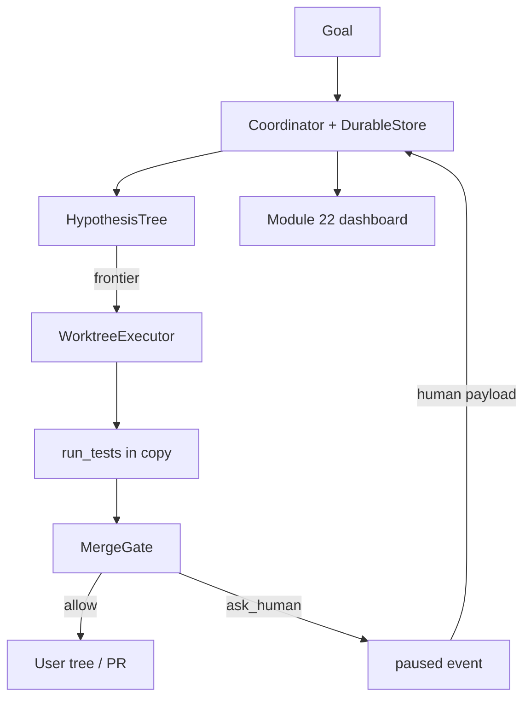
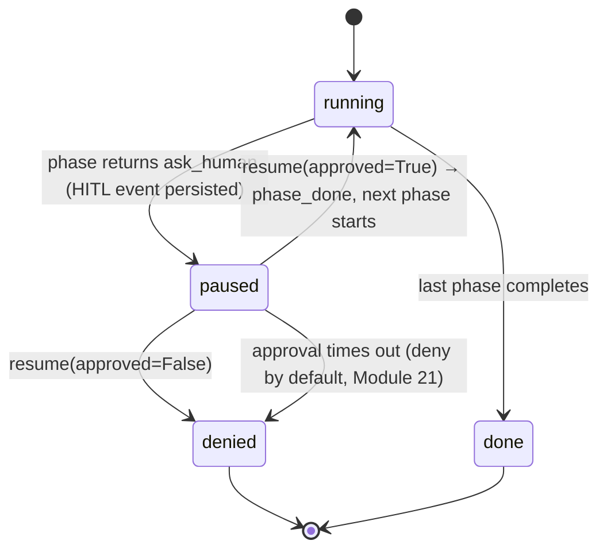
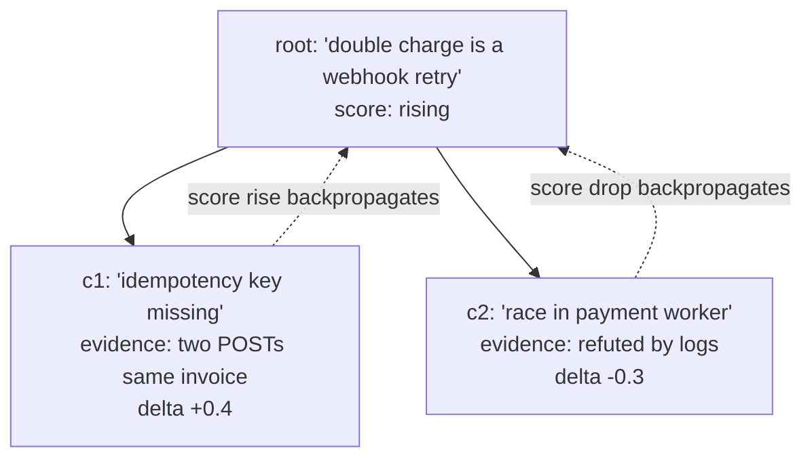

# Module 25 — Durable Orchestration & Real Agent Patterns

**Time:** 7–10 days · **Depends on:** [12](12-multi-agents.md), [19](19-orchestration-patterns.md), [21](21-secure-tool-use.md), [22](22-agent-evaluation.md) · **Next:** [Orchestrator comparison](26-orchestrator-comparison.md)

<span data-module-id="25" hidden></span>

---

## Learning objectives

- Run a **long-running coordinator** that persists phases and can pause/resume
- Grow a **hypothesis tree** and back-propagate evidence to parent claims
- Execute writes in an **isolated worktree**, then pass a **merge gate**
- Keep **durable state** (append-only log) and **human-in-the-loop** as first-class states
- Eval the whole graph under **cost and latency** caps (Module 22), not only the last message

---

## Why this matters (CS engineer)

<div class="aieng-story" markdown>

A “codebase investigator” is supposed to find why billing double-charges. It chats for forty minutes, holds the hypothesis in free-form CoT, writes the user’s tree directly, dies on a laptop sleep, and comes back with no memory. A junior re-runs it; it files a PR that fails tests; merge is a Slack thumbs-up. Durable orchestration is the opposite design: **coordinator with a log**, **tree of claims with scores**, **photocopy worktree**, **tests + approval before merge**, **HITL as a state**, not a hope.

</div>

Modules 18–19 gave leaf patterns and workflow *shape*. This module is the **end-to-end machine**: something that can survive a restart and refuse to merge junk.

<div class="aieng-intuition" markdown>
<p class="label">Intuition lock</p>

**Sticky picture:** The coordinator is a **job queue with named phases**. The hypothesis tree is a **bug tracker**: children prove or kill the parent. A worktree is a **scratch branch**. The merge gate is **CI + CODEOWNERS**. Durable JSONL is the **WAL**. HITL is a **paused coroutine**, not a print statement.

<div class="kill" markdown>
**Kill this idea:** “Long-running means a bigger context window and a while loop.” → **Replace with:** Persist events, isolate side effects, gate merges, pause for humans, resume from the log.
</div>
</div>

---

## Mental model



**Invariant:** crash + replay of the JSONL yields the same `current_phase()`. Side effects live in the worktree until the gate opens.

---

## Core tutorial

### 1. Durable store = write-ahead log

```python
from src.durable import DurableStore, Coordinator

store = DurableStore(path)
# restart:
store = DurableStore(path)
assert store.last("phase_done") is not None
```

Kinds you should actually emit: `phase_done`, `hitl`, `hitl_resolved`, `merge_blocked`. Do not persist raw chain-of-thought if you can persist **structured results**.

---

### 2. Coordinator: run until a gate

```python
def research(ctx):
    return {"facts": [...], "ask_human": "approve write?"}

def write(ctx):
    return {"ok": True}

c = Coordinator(store, ["research", "write"], {"research": research, "write": write})
paused = c.run_until_gate({})
assert paused["status"] == "paused"
resumed = c.resume({}, {"approved": True})   # next phase runs
# c.resume({}, {"approved": False}) → status "denied"; write never runs
```

`ask_human` does **not** record `phase_done`. Approval writes `phase_done` then runs the next phase. **Denial aborts** — it must not advance into the write worker. Timeouts on pending approvals should **deny** (Module 21). HITL is an event plus a resume API, not `input()` inside a tool.



The key property: a crash while `paused` loses nothing, because the pause itself is a durable event, not in-memory state. Replaying the JSONL after a restart lands you back in `paused` with the same pending question, not at `running` with amnesia.

---

### 3. Hypothesis trees and insight backprop

```python
from src.durable import Hypothesis, HypothesisTree

tree = HypothesisTree()
tree.add(Hypothesis(id="root", claim="double charge is a webhook retry"))
tree.add(Hypothesis(id="c1", claim="idempotency key missing", parent_id="root"))
tree.record_evidence("c1", "logs: two POSTs same invoice", delta=0.4)
# child score high → parent score rises (backpropagate)
```

Use this for research/investigation agents:

1. Manager proposes 2–5 **competing** hypotheses (cap the fan-out).
2. Workers gather evidence **in isolation** (Module 18 subroutine).
3. Evidence updates the child; a fraction **back-propagates** to the parent.
4. `frontier()` is what you work next — do not DFS the whole tree.

This is not gradient descent. It is a **scored AND/OR tree** so the coordinator does not forget why it is reading file 40.

<div class="aieng-explainer" markdown>
<p class="label">Explainer</p>

**Backpropagation of insight** means: a leaf finding should change the parent’s priority, or you will keep exploring a refuted story. If the child is refuted (`score <= 0.2`), the parent should drop too (negative delta). Cap depth; cap total nodes; each node has a token/step budget (Module 20/24). Unbounded trees are runaway loops with prettier names.
</div>



`record_evidence` moves the child's own score by `delta`, then backpropagates **half** that delta to the parent — one level up, not recursively to the grandparent. So `c1`'s `+0.4` raises `root` by `+0.2`, and `c2`'s `-0.3` lowers `root` by `-0.15`; the parent's score is a damped blend of what its children are finding. `frontier(min_score=0.4)` only returns **leaf** nodes still `open` and above the floor — so once `c2` drops to `refuted`, work shifts to `c1` and any new children of it, not back to the root.

---

### 4. Isolated executor + merge gate

```python
from src.sandbox import WorktreeExecutor
from src.durable import MergeGate

with WorktreeExecutor(source) as wt:
    wt.write_file("src/foo.py", new_src)
    tests_ok = run_pytest(wt.path)
    decision = MergeGate().review(
        tests_passed=tests_ok,
        diff_files=["src/foo.py"],
        approved=human_said_yes,
    )
# original tree unchanged unless you apply after decision["allow"]
```

| Gate check | Why |
|------------|-----|
| Tests passed | Don’t merge red |
| Human approved | Dual control on writes |
| Diff size cap | Stop “rewrite the monorepo” |

Production: this is a PR, not `shutil.copy` back. The teaching gate is the **policy**, GitHub/GitLab is the **transport**.

---

### 5. Eval the graph, not the soloist

Long coordinators fail on **cost and latency** even when the answer is right:

- Per-phase `CostEvent` (Module 26)
- Trajectory per worker + composite (Module 22)
- Wall-clock SLO: pause and HITL rather than spin

A coordinator that takes 25 minutes and $12 to find a one-line fix is a failed design unless you documented that trade.

<div class="aieng-think" markdown>
<p class="label">Think about it</p>

**Question:** The coordinator persists phases, but each worker still dumps its full scratchpad into the next phase’s context. What went wrong?

<details data-think-id="25-t1"><summary>Reveal a strong answer</summary>

You persisted **the wrong artifact**. Durable events should carry **compressed results** (`facts[]`, hypothesis scores, diff paths) — Module 19 planner rule. Scratchpads stay inside the worker. Otherwise restart is durable *and* you still drown the window (Module 05). Pair store payloads with schemas; reject oversized events.

</details>
</div>

---

## Failure modes

| Symptom | Cause | Fix |
|---------|-------|-----|
| Restart replays side effects | Non-idempotent workers | Idempotency keys; worktree until merge |
| Tree explodes | No cap on children | Max nodes; min_score frontier |
| Merge thumbs-up in Slack | No `MergeGate` | Tests + approval object |
| HITL deadlock | No timeout | Deny by default (Module 21) |
| Cheap demo, $ prod | No per-phase budget | Modules 22 + 26 |

---

## Lab

1. `HypothesisTree`: child evidence raises parent score; `frontier()` returns leaves.
2. `DurableStore` on a temp JSONL; new instance sees `phase_done`.
3. Coordinator pauses on `ask_human`; **denial does not run the next phase**; approval then resumes.
4. `MergeGate`: fail tests → `allow` false; tests + approval → true.
5. Stretch: run a worktree write + gate in one script (no live model).

```bash
poetry run pytest tests/test_durable.py tests/test_sandbox.py -v
```

---

## Quizzes

<div class="aieng-quiz" data-quiz-id="25-q1" data-xp="25" data-success="HITL is a persisted pause, not a blocking print." data-fail="Re-read coordinator states." markdown>
<p class="label">Quiz · +25 XP</p>
<p class="quiz-prompt">What should happen when a phase returns ask_human?</p>
<div class="quiz-options">
<button type="button" class="quiz-opt" data-correct="false">The worker busy-loops until stdin has a line</button>
<button type="button" class="quiz-opt" data-correct="true">The coordinator persists a HITL event and returns paused so a UI can resume later</button>
<button type="button" class="quiz-opt" data-correct="false">The merge gate auto-approves to save time</button>
<button type="button" class="quiz-opt" data-correct="false">The hypothesis tree is deleted</button>
</div>
<p class="quiz-feedback"></p>
</div>

<div class="aieng-quiz" data-quiz-id="25-q2" data-xp="25" data-success="Merge gates require tests and approval; worktrees isolate writes." data-fail="Think CI + CODEOWNERS." markdown>
<p class="label">Quiz · +25 XP</p>
<p class="quiz-prompt">A worktree patch is ready. What does MergeGate require before allow=True?</p>
<div class="quiz-options">
<button type="button" class="quiz-opt" data-correct="false">A longer system prompt</button>
<button type="button" class="quiz-opt" data-correct="true">Tests passed, human approval, and a bounded diff</button>
<button type="button" class="quiz-opt" data-correct="false">At least five hypotheses</button>
<button type="button" class="quiz-opt" data-correct="false">The original files already overwritten</button>
</div>
<p class="quiz-feedback"></p>
</div>

---

## Open source materials

| Resource | Use it for |
|----------|------------|
| `src/durable.py`, `src/sandbox.py` | Coordinator, tree, gate, worktree |
| LangGraph checkpoints / HITL | Industry analog after you can name the states |
| 12-factor agents | Owned control flow |
| Module 22 / 26 | Eval and $ attribution on the graph |

---

## Checkpoint

- [ ] Restart does not lose phase  
- [ ] Hypotheses are data with scores, not a paragraph  
- [ ] Writes happen off the user’s original tree until a gate  
- [ ] HITL is a state in the log  
- [ ] You can say what the run cost and how long it took  

<div class="aieng-complete" data-module-id="25" data-xp="130" markdown>
<p>Mark complete when you can pause a coordinator, resume it from JSONL, and refuse a red merge.</p>
<button type="button">Complete module · +130 XP</button>
</div>

## Exercise

- **Catalog:** [EX-25 — Durable graph](../reference/exercises.md#ex-25)
- **Prove:** Pause/resume from JSONL; a denied HITL does not run the next phase; merge gate blocks failed tests.
- **Test:** `pytest tests/test_durable.py -v`

**Next:** [Module 26 — Orchestrators in production](26-orchestrator-comparison.md)
