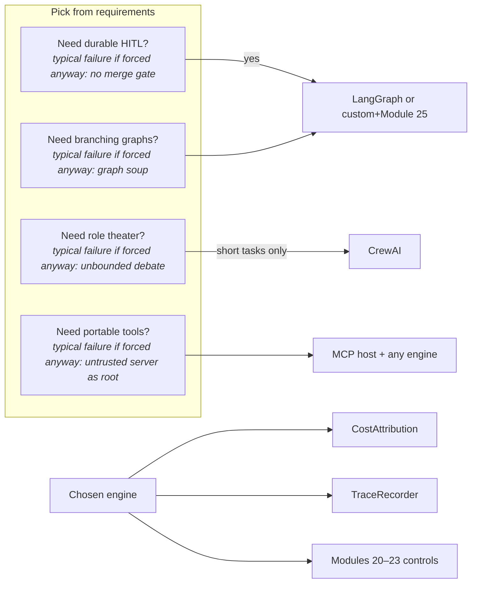

# Module 26 — Orchestrators in Production

**Time:** 5–7 days · **Depends on:** [12](12-multi-agents.md), [19](19-orchestration-patterns.md), [25](25-durable-orchestration.md) · **Pairs with:** [08 MCP](08-model-context-protocol.md), [13](13-production.md) · **Next:** [Specialization tracks](../tracks/index.md)

<span data-module-id="26" hidden></span>

---

## Learning objectives

- Compare **custom loops**, **LangGraph**, **CrewAI**, and **MCP hosts** with explicit trade-offs (control, HITL, durability, lock-in)
- Attribute **cost and latency per agent/step**, not only a monthly invoice
- Export **reasoning traces** as structured spans (replayable), not hidden essays
- Choose a stack from **failure modes you can name**, then keep Module 20–25 controls either way

---

## Why this matters (CS engineer)

<div class="aieng-story" markdown>

Two teams ship “multi-agent.” Team A copies a CrewAI demo: five personas, unbounded debate, $9/ticket, no step ids. Team B copies LangGraph: a 40-node graph nobody can draw, checkpoints on, still no spend guard, still auto-merge. Team C writes a 200-line custom loop, then rediscovers durable HITL the hard way. None of them can answer **“which worker spent the money on step 7?”** Frameworks are not villains. **Unmeasured topology** is.

</div>

Module 11 said learn the loop before LangGraph. This module is the **comparison you can put in a design doc**, plus the production numbers that make the comparison falsifiable.

<div class="aieng-intuition" markdown>
<p class="label">Intuition lock</p>

**Sticky picture:** Orchestrators are **engines**. Custom = building a kart (full control, you own brakes). LangGraph = a rail yard (graphs, checkpoints, HITL). CrewAI = an improv troupe (roles first, isolation last). MCP = **USB-C peripherals** (tools/resources), not the engine. Cost attribution is the **itemized receipt**. Traces are the **black box recorder**.

<div class="kill" markdown>
**Kill this idea:** “Pick the hottest agent framework and reliability appears.” → **Replace with:** Rank control, HITL, durability, ecosystem, and lock-in for *your* failure modes; keep breakers, sandboxes, evals, and per-step $ regardless of brand.
</div>
</div>

---

## Mental model



**Invariant:** MCP can sit **next to** any engine. It does not replace LangGraph or a custom loop. Routing models is still Module 10.

---

## Core tutorial

### 1. Comparison matrix (teaching ranks; 1 = best)

```python
from src.orchestrators import compare_orchestrators, tradeoff_score

rows = compare_orchestrators("custom loop", "LangGraph", "CrewAI", "MCP hosts")
# columns: control, ops_cost, hitl, durable, ecosystem, lock_in
score = tradeoff_score(
    next(r for r in rows if r["name"] == "LangGraph"),
    {"hitl": 2.0, "durable": 1.0},
)
```

| | Custom loop | LangGraph | CrewAI | MCP hosts |
|--|-------------|-----------|--------|-----------|
| **Control / testability** | Highest — you wrote the state machine | High if you keep graphs small | Lower — personas hide control flow | Medium — policy is host-side |
| **HITL / checkpoints** | You build Module 25 | First-class interrupt + durable state | Weak unless you bolt it on | Host approval UI; not a job queue |
| **Durability** | JSONL/WAL you own | Built-in checkpointers | Process memory unless you add store | Session with the server, not the graph |
| **Ecosystem** | None | Large (LangChain world) | Fast demos, role packs | Many servers; supply-chain risk |
| **Lock-in** | Lowest | Medium (graph + APIs) | Medium | Protocol is open; hosts differ |
| **Typical failure** | Reimplement persistence badly | Graph soup; debug the library | Unbounded debate; weak isolation | Untrusted server as root |
| **Use when** | Topology is small and tests matter first | Branching + HITL + resume are load-bearing | Short role pipelines with caps | Portable tools across IDE and product |

These ranks are **ordinal teaching scores**, not public benchmarks. Re-score with *your* weights (`tradeoff_score`). If HITL+durability dominate, LangGraph (or custom + Module 25) wins even if CrewAI demos prettier.

<div class="aieng-explainer" markdown>
<p class="label">Explainer</p>

**Custom vs framework is a build-vs-buy on the control plane.** Buy LangGraph when you would otherwise spend a quarter on checkpoints and resume. Stay custom when the graph would have six nodes and you already have `Agent` + `Coordinator`. CrewAI is a **role abstraction**; you still need Module 12 charters, budgets, and message schemas or you bought a costume. MCP is **not in the same category as LangGraph** — it is how tools show up. A serious design uses **engine + MCP + host policy**.
</div>

---

### 2. Failure analysis (how each dies in prod)

| Stack | Runaway loops | Tool hallucination | Partial exec | Cost explosion | Silent degradation |
|-------|---------------|--------------------|--------------|----------------|--------------------|
| Custom | You forgot `max_steps` | Allowlist in your registry | Your WAL / commits | Your `SpendGuard` | Your Module 22 suite |
| LangGraph | Graph cycles without a step cap | Node still calls whatever you bound | Checkpoint mid-write | Recursion limits ≠ $ | Tracing without golden composite |
| CrewAI | Agents “discuss” uncapped | Shared tools, wide by default | No merge gate | Role fan-out | Demo metrics |
| MCP host | Server retries | Server exposes extra tools | Tool half-applied on the server | Unbounded resources | Host still 200 |

**Regardless of stack, keep:** Module 20 detectors + breakers, Module 21 manifests/sandboxes, Module 22 trajectories, Module 23 pins. Frameworks do not waive those.

---

### 3. Cost attribution per agent/step

```python
from src.orchestrators import CostAttribution, CostEvent

led = CostAttribution()
led.record(CostEvent(
    agent="researcher", step=0, model="mini",
    tokens_in=100, tokens_out=40, usd=0.01, latency_ms=80, tool="search",
))
led.record(CostEvent(
    agent="writer", step=0, model="strong",
    tokens_in=400, tokens_out=200, usd=0.09, latency_ms=400,
))
led.by_agent()
# researcher vs writer itemized; total_usd()
```

This is the **itemized receipt** from the intuition lock, not a metaphor: `by_agent()` is the line-by-line breakdown, `total_usd()` is the total at the bottom. Put `agent`, `step`, `model`, `tool` on every span — those are the columns of the receipt. Monthly invoices cannot tell you the critic loop is 70% of $ — **this** can. Pair with Module 10 `cost_per_success` and Module 22 `mean_spend_usd`.

---

### 4. Observability of “reasoning”

Do not log raw chain-of-thought to a shared dashboard if policy forbids it. Do log:

```python
from src.orchestrators import TraceRecorder

tr = TraceRecorder()
tr.span("decide", "researcher", tool="search", signature_hash="…")
tr.span("observe", "researcher", error=None, latency_ms=80)
tr.span("final", "writer", prompt_digest="abc")
tr.export()
```

Same fields as Module 11 step logs and OpenTelemetry. Langfuse/Phoenix are UIs over this shape. **If you cannot replay, you cannot eval.**

<div class="aieng-think" markdown>
<p class="label">Think about it</p>

**Question:** Product insists on CrewAI because a blog showed a “research team.” You need durable HITL, isolated writes, and $ per step. What do you actually ship?

<details data-think-id="26-t1"><summary>Reveal a strong answer</summary>

Ship an **engine that has HITL and isolation** (custom Module 25 or LangGraph interrupts) plus **MCP or in-process tools** behind Module 21 gates. If you still want Crew-style *roles*, implement them as Module 12 charters on that engine — names in a YAML file are cheap; unbounded personas on a framework that does not pause are not. Measure vs a single-agent baseline (Module 12) before you keep the crew.

</details>
</div>

---

### 5. Emerging standards vs products

| Layer | Standard / product | Owns |
|-------|-------------------|------|
| Tool/resource protocol | **MCP** | Discovery, invocation, (some) auth sketches |
| Agent graph runtime | LangGraph, custom, others | State, edges, checkpoints |
| Role packs | CrewAI, AutoGen, … | Persona orchestration |
| Eval / trace UIs | Phoenix, Langfuse, OTel | After-the-fact truth |

Do not let a vendor slide collapse these layers. Write them as **four boxes** on the architecture diagram.

---

## Failure modes

| Symptom | Cause | Fix |
|---------|-------|-----|
| “We picked X so we’re production” | Framework as talisman | List controls 20–25 still missing |
| Bill unexplained | No `CostEvent.agent` | Attribute or do not scale |
| Can’t replay | Prose logs | Structured spans + prompt digest |
| MCP vs LangGraph argument | Category error | Protocol vs engine |
| Matrix treated as science | Teaching ranks | Re-weight on your SLOs |

---

## Lab

1. `compare_orchestrators` for all four; write three sentences: when you’d pick each.
2. Record two `CostEvent`s; assert writer > researcher in `by_agent()["usd"]`.
3. `TraceRecorder` export has `agent` on every span.
4. Take **one** real workflow (even stubbed): name engine + MCP yes/no + which Module 20–25 controls you kept.
5. Optional: read LangGraph HITL docs *after* Module 25 and map `interrupt` → `hitl` events.

```bash
poetry run pytest tests/test_orchestrators.py -v
```

---

## Quizzes

<div class="aieng-quiz" data-quiz-id="26-q1" data-xp="25" data-success="MCP is the peripheral protocol; LangGraph is an engine." data-fail="Re-read the category table." markdown>
<p class="label">Quiz · +25 XP</p>
<p class="quiz-prompt">Why is “LangGraph vs MCP” a bad comparison?</p>
<div class="quiz-options">
<button type="button" class="quiz-opt" data-correct="false">They are the same product from one vendor</button>
<button type="button" class="quiz-opt" data-correct="true">MCP standardizes tools/resources/prompts; LangGraph runs graphs/state — they stack</button>
<button type="button" class="quiz-opt" data-correct="false">MCP always includes LangGraph</button>
<button type="button" class="quiz-opt" data-correct="false">Neither is used in production</button>
</div>
<p class="quiz-feedback"></p>
</div>

<div class="aieng-quiz" data-quiz-id="26-q2" data-xp="25" data-success="Itemized receipts beat monthly invoices." data-fail="Attribution is per agent and step." markdown>
<p class="label">Quiz · +25 XP</p>
<p class="quiz-prompt">What is cost attribution for in a multi-agent system?</p>
<div class="quiz-options">
<button type="button" class="quiz-opt" data-correct="false">Hiding the invoice from finance</button>
<button type="button" class="quiz-opt" data-correct="true">Assigning tokens, USD, and latency to each agent and step so you can kill expensive topology</button>
<button type="button" class="quiz-opt" data-correct="false">Using only the cheapest model forever</button>
<button type="button" class="quiz-opt" data-correct="false">A LangGraph-only feature</button>
</div>
<p class="quiz-feedback"></p>
</div>

---

## Open source materials

| Resource | Use it for |
|----------|------------|
| `src/orchestrators.py` + tests | Matrix, attribution, traces |
| [LangGraph](https://langchain-ai.github.io/langgraph/) | Graphs, HITL, checkpointers — after Module 25 |
| [CrewAI](https://docs.crewai.com/) | Role crews — with Module 12 skepticism |
| [MCP](https://modelcontextprotocol.io/) | Portable tools |
| [12-factor agents](https://github.com/humanlayer/12-factor-agents) | Control-plane principles |

---

## Checkpoint

- [ ] You can explain custom vs LangGraph vs CrewAI vs MCP **without mixing categories**  
- [ ] You have a written pick for one workflow with weights  
- [ ] Per-step $ / latency exist in a stub ledger  
- [ ] Traces are structured and replayable  
- [ ] Modules 20–25 controls are listed as **kept**, not “framework will handle it”  

<div class="aieng-complete" data-module-id="26" data-xp="120" markdown>
<p>Mark complete when you can defend an orchestrator choice with trade-offs and show a per-agent receipt.</p>
<button type="button">Complete module · +120 XP</button>
</div>

**Next:** [Specialization tracks](../tracks/index.md) — add hardening, security review, and eval harnesses to the 90-day projects.
