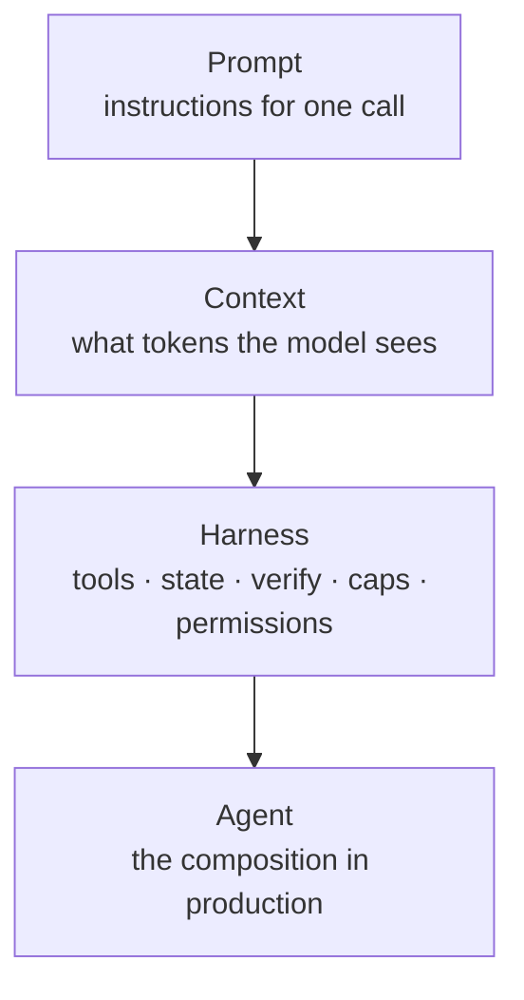

# Module 27 — Harness Engineering

**Time:** 4–6 days · **Depends on:** [05 Context](05-context-engineering.md), [11 Single agents](11-single-agents.md), [20 Reliability](20-agent-reliability.md), [21 Secure tool use](21-secure-tool-use.md) · **Pairs with:** [04 Evals](04-testing-evals.md), [22 Agent evals](22-agent-evaluation.md) · **Next:** [Production](13-production.md)

<span data-module-id="27" hidden></span>

---

<span id="why-this-matters-cs-engineer-view"></span>

<div class="aieng-story" markdown>

*Fictional teaching scenario.*

Gate 3 packed the refund policy into context. Gate 4 gave the triage bot `lookup_order` and `write_note`. The prompt said “cite the policy and stop.” Tuesday the bot wrote six drafts, never attached a policy id, and burned the step budget on `lookup_order` with the same args. The prompt was fine. The context had the docs. Nothing **outside the model** checked the note, saved progress, or refused a repeated tool. Shipping a smarter model the next week did not help: same loop, more fluent drafts. **The missing product was the harness.**

</div>

**Case question:** Which checks, persistent state, permissions, and stop conditions must the harness enforce when the prompt and context are already adequate?

## Learning objectives

- Name **prompt**, **context**, and **harness** as three nested layers, not synonyms
- Treat a harness as the **control layer**: tools, external state, verification, permissions, termination
- Split **generator** (the model) from **evaluator** (code, tests, rubrics) so “done” is not a model opinion
- Persist **progress outside the context window** so a long job survives a new session
- Stop a loop on **evidence** — verifier, caps, and a no-progress brake — not on the model saying it is done
- Keep a long loop's context and tool set small enough to stay usable
- Change the harness before you change the model when the same weights fail a long task
- **Delete** a control once evals show the model no longer needs it

---

!!! important "What this module is"
    **Discipline taught:** harness engineering — the software around an LLM loop.
    **Last verified:** 2026-08-27 against public lab/write-up language (Anthropic long-running agents; OpenAI Codex harness notes; LangChain deep-agent harness results). The *label* is young; the *controls* are the ones you already built in Modules 05, 11, 20–23, 25. This chapter names the layer and forbids collapsing it back into “a better prompt.”


*Same failure the [running app](index.md#the-running-app) hits once it can act: grounded ≠ safe to act, and “act” is not a prompt instruction — it is a control loop with stop conditions.*

Prompt engineering writes the message. Context engineering decides what tokens the model sees. **Harness engineering is the runtime that calls the model at all:** which tools exist, what state survives a window, who verifies an artifact, when the loop dies, and what an eval suite is allowed to fail. If you only tune the inner two layers, you will keep promoting agents that look clever in a playground and stall on a real ticket.

A fourth name shows up in 2026 write-ups: **loop engineering** — designing the autonomous cycle itself (goal, brakes, verifier) rather than steering it turn by turn. Treat it as the *lifecycle* subsystem below, not a fifth thing to build. The layers nest:

```text
PROMPT    →  the instruction for one call
CONTEXT   →  the working view the model gets
HARNESS   →  the operating system it runs inside
LOOP      →  the cycle that repeats until a check says stop
```

The vocabulary is young and not standardized; the jobs are the ones you already built in Modules 05, 11, 20–23, 25. What matters is that none of them is a longer system prompt.

<div class="aieng-intuition" markdown>
<p class="label">Intuition lock</p>

**Sticky picture:** The model is an **engine**. The prompt is the **throttle**. Context is the **fuel in the tank**. The harness is the **chassis, brakes, gauges, and pit crew** — without it the engine still spins, it just does not finish a lap.

<div class="kill" markdown>
**Kill this idea:** “We’ll fix the agent by writing a longer system prompt.” → **Replace with:** Put stop, verify, persist, and permission in code. Then evaluate the *harness*, not the anecdote.
</div>
</div>

---

## Mental model

Three nested layers. Each one can be excellent while the outer one is missing.



| Layer | Owns | Does not own |
|-------|------|----------------|
| Prompt | Wording of a single call | Stop conditions, file system, authz |
| Context | Packing, retrieval, memory tiers | Whether a write is allowed |
| Harness | Loop, tools, external state, verifier, caps | The weights |

**Invariant:** the model **proposes**; the harness **authorizes, persists, verifies, and stops**. English in the prompt is not a brake.

The five subsystems you actually ship (call them what you want in a design doc — the jobs do not change):

```text
Instructions  →  standing orders (AGENTS.md / system + policy), versioned
State         →  progress the model does not own (files, handles, tickets)
Verification  →  tests, schema, must-cite, CI — evaluator ≠ generator
Scope         →  tool allowlist, worktree, network, secrets (Module 21)
Lifecycle     →  step/cost caps, resume, handoff, when a session is over
```

Modules you already have **are** those subsystems. This module is the assembly drawing.

| Subsystem | Course pieces |
|-----------|----------------|
| Instructions | 01, 03, 23 (bundle hash) |
| State | 05 memory tiers, 25 durable graphs |
| Verification | 04 golden sets, 22 trajectories |
| Scope | 08 host policy, 21 manifests / worktrees |
| Lifecycle | 11 `max_steps`, 20 detectors / breakers, 10 cost ledger |

---

## Core tutorial

### 1. Same weights, different harness

A published 2026 result that is worth remembering as a **calibration**, not a trophy: teams have moved a coding-agent bench score **without changing the model**, by changing only the harness (tools, instructions, verify loop, state files). Treat that as evidence that the outer layer is a first-class engineering surface.

**Production reality:** your ticket bot will not quote Terminal Bench. The transferable claim is smaller: if two runs share weights and differ only in tools/verifier/state, attribute the quality delta to the harness and A/B that — do not swap models first.

**Where this stops being true:** a weak model with a perfect harness still cannot invent facts that are not in context or tools. Harness engineering does not replace Gate 3.

### 2. Generator vs evaluator

If the same model grades its own “done,” you have one opinion, not a check.

```python
from src.harness import HarnessSpec, run_harness, verify_artifact

spec = HarnessSpec(
    name="refund_note",
    instructions="Write a short note that cites REFUND. Stop when the verifier passes.",
    tools=("write_note", "lookup_policy"),
    step_cap=4,
    cost_cap_usd=0.5,
)

def propose(state):
    # stand-in for a model call — first draft is empty of the required token
    text = "looking up policy" if not state.artifacts else "REFUND window is 30 days"
    return {"tool": "write_note", "artifact": text, "cost_usd": 0.01}

report = run_harness(
    spec,
    propose=propose,
    verify=lambda a: verify_artifact(a, must_contain=("REFUND",)),
)
assert report.stopped == "verified"
assert report.steps == 2
```

The verifier is **code**. It does not ask the model “are you done?” It looks for a required token, a schema, a test suite, a `must_cite` id. That is the same instinct as Module 04’s golden set and Module 22’s process vs outcome split, pulled **into the loop** so a long job can stop for a reason.

### 3. Four things a long loop needs

Every failure in the opening story is one of these four missing. Read this as the loop checklist you return to when a run stalls.

<div class="aieng-cardgrid" markdown>

<div class="card" markdown>
#### Keep the context clean

Long loops rot from the inside: old tool outputs, dead ends, and stale reasoning pile up, and quality drops as the pile grows. Write-ups call this **context rot**, and it compounds — a rotted context produces a worse decision, which adds more noise.

- **Compact** — summarize, then continue from the summary
- **Offload** — push big output to a file, keep the slice you need
- **Sub-agents** — isolate a messy subtask, return only the clean result

Treat context as a budget, not a bucket (Module 05).
</div>

<div class="card" markdown>
#### Know when to stop

A terminal message ends **the turn**, not **the job**. An agent that stops asking for tools has not proven anything. Layer brakes so it stops for a reason:

| Brake | Stops |
|---|---|
| `step_cap` | Runaway loop |
| `cost_cap_usd` | Token/$ burn |
| `no_progress_cap` | Same call, same args |
| verifier | Only real "done" |

The verifier carries the weight: done means the check passes, not that the model sounds satisfied.
</div>

<div class="card" markdown>
#### A critic that can say no

Left alone, an agent tends to agree with itself. Separate the **maker** from the **checker** — one proposes, something else grades.

```text
propose()  →  artifact
verify()   →  ok / reason
```

The grader should be the cheapest thing that can fail honestly: a test, a type check, a schema, a real error. It does not grade its own homework (§2).
</div>

<div class="card" markdown>
#### Tools it can actually use

Pile on a hundred tools and the model loses track of which to reach for. A tight, non-overlapping set wins. Anthropic's rule of thumb: if a human engineer cannot say which tool fits, the model has no chance.

- **Few and focused** — no overlapping verbs
- **Safe to repeat** — loops retry; a retried `create_customer` must not bill twice (Module 25 idempotency)
- **Errors written for the agent** — say what to do next, not just what broke

In a loop, an error is the next instruction.
</div>

</div>

**Where this stops being true:** these are loop-control properties. None of them makes a wrong answer right — they make a stuck or unverified run *stop being mistaken for a finished one*.

#### Adding the no-progress brake

The opening failure was `lookup_order` called repeatedly with the same args. `step_cap` alone does not catch that — it lets the loop burn the whole budget first. `no_progress_cap` stops it as soon as the loop starts spinning:

```python
from src.harness import HarnessSpec, run_harness, verify_artifact

spec = HarnessSpec(
    name="refund_note",
    instructions="Cite REFUND. Stop when the verifier passes.",
    tools=("write_note", "lookup_policy"),
    step_cap=8,
    no_progress_cap=2,  # two identical proposals in a row = spinning
)

report = run_harness(
    spec,
    propose=lambda s: {"tool": "lookup_policy", "artifact": "same", "cost_usd": 0.01},
    verify=lambda a: verify_artifact(a, must_contain=("REFUND",)),
)
assert report.stopped == "no_progress"
assert report.steps < 8  # stopped early instead of burning the cap
```

`no_progress_cap=0` (the default) disables the brake. **Simplification:** identity here is the tool plus its artifact string. **Production reality:** hash the full argument payload, and allow a legitimate retry after a transient error before counting it as a repeat.

### 4. External state, not a longer window

Long-running agents die when the only memory is the context window. The harness writes a progress file (or a ticket comment, or a Module 25 checkpoint) that the **next** session reads.

```text
Mental model:   context window  =  RAM
                progress.md     =  disk
Simplification: one file is enough to teach the job
Production:     durable store + request_id (Modules 13, 25)
```

`ExternalState` in `src.harness` is that disk for the teaching loop: notes and artifacts the propose function can read, the model never “owns.”

### 5. Scope is not a vibe

Unknown tools are denied. Caps are integers. A missing verifier **fails closed** when `verifier_required=True`.

```python
from src.harness import HarnessSpec, run_harness, verify_artifact

open_spec = HarnessSpec(
    name="oops",
    instructions="Be careful.",
    tools=("write_note",),
    verifier_required=True,
)
report = run_harness(open_spec, propose=lambda s: {"tool": "bash", "artifact": "rm"})
assert report.stopped == "no_verifier"
```

Wire real tools through Module 21’s manifest and worktree. This helper only teaches the **shape**: allowlist + verifier + caps. Do not ship `run_harness` as your production agent runtime — compose it with `ToolRegistry`, `FailureDetector`, and `eval_regression`.

### 6. Evaluate the harness, not the demo

When you change instructions, tools, or the verifier, you changed the **product**. Run:

1. Deterministic unit tests on the harness (`tests/test_harness.py`)
2. The Module 04 golden set if the task is single-turn
3. Module 22 trajectories if the task is multi-step
4. Module 23 digest + `eval_regression` so a “warmer” AGENTS.md cannot sneak through

Skipping (1) is how you get a loop that never calls `verify`. Skipping (3) is how you get a verifier that passes while the agent burns 18 tool calls.

### 7. Turn a failure into infrastructure

Most teams repair the current output. Harness engineering repairs the **class** of failure, so the next run cannot repeat it. The rule of thumb: encode an important constraint twice — once as guidance the model can read, once as a mechanical check it cannot bypass.

```text
GUIDE   "cite a policy id in every refund note"     ← the model can read it
CHECK   verify_artifact(must_contain=("REFUND",))   ← the model cannot skip it
```

The guide explains the reason; the check enforces the boundary. Map each failure to the layer that should have caught it:

| Observed failure | Harness change |
|---|---|
| Missing knowledge | Retrieval rule or a map file, not a bigger dump |
| Wrong tool reached for | Better tool description, or fewer tools |
| Bad output shipped | A validator or stronger output contract |
| Same call repeated | `no_progress_cap` + escalation |
| Unsafe action attempted | Permission gate outside the model (Module 21) |
| Decision lost across windows | Durable state (Module 25) |
| Nobody can say what happened | Traces and a run receipt |

The patch fixes one run. The harness change improves every run after it — that is the compounding part.

### 8. Harness decay: build to delete

Every harness component encodes an assumption about **what the model cannot do**. Models change. Those assumptions expire, and the component becomes overhead that costs tokens on every run for no quality gain.

Public 2026 write-ups report exactly this: scaffolding that was load-bearing on one model generation became redundant on the next, once planning or self-verification improved. Vendor version numbers and cost figures in those posts move fast and are not reproduced here — treat the *pattern* as the lesson, not any specific number.

!!! warning "Test a component by removing it"
    Periodically turn each piece of scaffolding off and re-run your eval suite. If the scores do not move, delete it. A harness you never prune only grows.

This cuts against the instinct to keep adding controls. The discipline is symmetric: **add a control when a failure proves you need it, remove it when an eval proves you do not.** Both directions need the same evidence — your Module 04 golden set or Module 22 trajectories, not a hunch about which model got smarter.

**Start with the smallest harness that closes the loop**, then move up only when the task earns it:

```text
LEVEL 0   prompt + model
LEVEL 1   project guide + tools
LEVEL 2   external state + verifier + bounded loop
LEVEL 3   permissions + traces + recovery + human gates
```

A short, low-risk task may need Level 0 and a human reading the output. A six-hour run that edits files and opens a pull request needs Level 3. The harness should be smaller than the failure surface it controls.

---

## Practical — two context windows, one ticket

The support bot must leave a refund note that contains `REFUND`. Context windows die. The harness keeps a **progress file** so session 2 does not start from a blank RAM.

### Before you run this

Predict:

1. After session 1 writes only `"draft"`, is `progress.json` empty or does it still have the draft?
2. If session 2 starts with `ExternalState()` instead of `load_progress`, can the verifier still pass in one step?
3. Does “I’m done” from the model ever get consulted?

### Run it

```python
from pathlib import Path
from src.harness import (
    HarnessSpec,
    load_progress,
    run_harness,
    verify_artifact,
)

progress = Path("tmp-harness-progress.json")
spec = HarnessSpec(
    name="refund_note",
    instructions="Cite REFUND. Stop when the verifier passes.",
    tools=("write_note",),
    step_cap=1,  # one window is short — like a small context
    cost_cap_usd=0.5,
)
check = lambda a: verify_artifact(a, must_contain=("REFUND",))

# Session 1 — window dies on an incomplete draft
run_harness(
    spec,
    propose=lambda s: {"tool": "write_note", "artifact": "draft", "cost_usd": 0.01},
    verify=check,
    progress_path=progress,
)

# Session 2 — new window, same disk
saved = load_progress(progress)
report = run_harness(
    spec,
    propose=lambda s: {
        "tool": "write_note",
        "artifact": "REFUND window is 30 days",
        "cost_usd": 0.01,
    },
    verify=check,
    state=saved,
    progress_path=progress,
)
assert report.stopped == "verified"
assert "REFUND" in load_progress(progress).artifacts["last"]
progress.unlink()  # cleanup
```

```bash
poetry run pytest tests/test_harness.py -v
```

### Explain the difference

If session 2 “forgot” the draft, you loaded RAM instead of disk. If you expected the model to declare done, the verifier never asked it. Compare that to packing the whole ticket history into the prompt (Module 05) — the progress file is the cheaper, checkable memory.

**Simplification:** one JSON file. **Production reality:** Module 25 checkpoints + `request_id`. **Where this stops being true:** if the artifact is a git tree, persist the worktree path (Module 21), not a string blob.

---

<div class="aieng-case-checkpoint" markdown>
<p class="label">Case checkpoint</p>

**Opening failure:** The model had adequate instructions and context but repeated tools, skipped verification, and lost progress between windows.

**What this lab demonstrates:** The verifier, denied-tool, no-progress, two-step completion, and two-window persistence tests directly exercise stop, verify, permit, and persist outside the model. The `no_progress_cap` test reproduces the opening failure — the repeated `lookup_order` call — and stops it before it drains the budget.

**What it does not prove:** A correct harness controls execution; it cannot guarantee the generated artifact is semantically correct beyond the verifier you provide.

</div>

---

## Lab

1. `verifier_required=True` with no `verify` callable → `stopped == "no_verifier"`.
2. Propose `tool="bash"` against a spec that only lists `write_note`; notes include `denied:`.
3. First artifact `"draft"`, second `"REFUND …"` in **one** window; report is `verified` in two steps, not at `step_cap`.
4. **Two windows:** `step_cap=1`, session 1 writes `"draft"` to `progress_path`; session 2 `load_progress` and finishes with `REFUND`. Assert the file still exists after session 1 fails verify.
5. **No-progress:** `step_cap=8`, `no_progress_cap=2`, propose the same tool and artifact every time → `stopped == "no_progress"` and `steps < 8`. Then vary the artifact and assert the brake does **not** fire.
6. Optional: deny-all session must not create an artifact named `last` from a `bash` proposal.
7. Optional: pick one control in your own agent, turn it off, re-run your evals, and record whether the score moved. Delete it if it did not.

```bash
poetry run pytest tests/test_harness.py -v
```

<div class="aieng-think" markdown>
<p class="label">Think about it</p>

**Question:** Leadership wants to “just upgrade the model” because the coding agent stalls after 20 minutes. Traces show repeated `search` calls, no test command, and a context dump of the whole repo. Do you buy a new model this sprint? What do you change first?

<details data-think-id="27-t1"><summary>Reveal a strong answer</summary>

Change the harness first: cap repeated identical tool calls (Module 20), add a verifier that runs the test suite, persist a progress file so a new window does not start from zero, and stop packing the whole repo (Module 05). Re-run the same eval suite. If the stall was “no brake / no disk / no tests,” a new model will stall more fluently. Upgrade weights only after the control layer is the bottleneck.

</details>
</div>

---

## Quizzes

<div class="aieng-quiz" data-quiz-id="27-q1" data-xp="25" data-success="Prompt ⊂ context ⊂ harness. The harness is the control loop." data-fail="A prompt is not a runtime." markdown>
<p class="label">Quiz · +25 XP</p>
<p class="quiz-prompt">What does harness engineering own that prompt engineering does not?</p>
<div class="quiz-options">
<button type="button" class="quiz-opt" data-correct="false">The wording of the system message</button>
<button type="button" class="quiz-opt" data-correct="true">The loop: tools, external state, verification, permissions, and stop conditions</button>
<button type="button" class="quiz-opt" data-correct="false">Which embedding model you use for RAG</button>
<button type="button" class="quiz-opt" data-correct="false">The GPU you serve on</button>
</div>
<p class="quiz-feedback"></p>
</div>

<div class="aieng-quiz" data-quiz-id="27-q2" data-xp="25" data-success="Done is an external check, not a model confession." data-fail="The generator is not the evaluator." markdown>
<p class="label">Quiz · +25 XP</p>
<p class="quiz-prompt">A long-running agent says “I’m done.” Why is that not enough?</p>
<div class="quiz-options">
<button type="button" class="quiz-opt" data-correct="false">Because you should always run 50 more steps for luck</button>
<button type="button" class="quiz-opt" data-correct="true">Because verification has to live outside the generator — tests, schema, must-cite, or a rubric on the artifact</button>
<button type="button" class="quiz-opt" data-correct="false">Because only a larger context window can know</button>
<button type="button" class="quiz-opt" data-correct="false">Because MCP sessions prove completion</button>
</div>
<p class="quiz-feedback"></p>
</div>

<div class="aieng-quiz" data-quiz-id="27-q3" data-xp="25" data-success="Controls earn their place with evidence — in both directions." data-fail="Scaffolding is not free; it costs tokens on every run." markdown>
<p class="label">Quiz · +25 XP</p>
<p class="quiz-prompt">A model upgrade lands. Your planning scaffold may now be redundant. What do you do?</p>
<div class="quiz-options">
<button type="button" class="quiz-opt" data-correct="false">Keep it — a control that once helped can never hurt</button>
<button type="button" class="quiz-opt" data-correct="true">Turn it off, re-run the eval suite, and delete it if the scores do not move</button>
<button type="button" class="quiz-opt" data-correct="false">Delete it immediately; newer models never need scaffolding</button>
<button type="button" class="quiz-opt" data-correct="false">Add a second scaffold in case the first one degrades</button>
</div>
<p class="quiz-feedback"></p>
</div>

---

## Open source materials

| Resource | Use it for |
|----------|------------|
| `src/harness.py` + `tests/test_harness.py` | Caps, deny, verify, no-progress brake, fail-closed missing evaluator |
| [Anthropic — Effective harnesses for long-running agents](https://www.anthropic.com/engineering/effective-harnesses-for-long-running-agents) | Multi-window jobs, progress files |
| [LangChain — Improving deep agents with harness engineering](https://www.langchain.com/blog/improving-deep-agents-with-harness-engineering) | Same-model / harness-only quality delta (treat as a 2026 data point) |
| [OpenAI — agent evals / traces](https://platform.openai.com/docs/guides/evals) | Turning trajectories into a regression suite (pair with Module 22) |
| Modules 20–23, 25 | Detectors, sandbox, trajectory evals, digest, durable resume |

---

## Checkpoint

- [ ] You can explain prompt vs context vs harness without using them as synonyms  
- [ ] “Done” is a verifier on an artifact, not a sentence from the model  
- [ ] Progress survives a new context window (file, ticket, or checkpoint) — you ran the two-session practical  
- [ ] Unknown tools are denied; step/cost caps are integers in code  
- [ ] A spinning loop stops on a no-progress brake, not by exhausting its budget  
- [ ] Your tool set is small, non-overlapping, and safe to retry  
- [ ] You can name one control you could delete, and the eval that would prove it  
- [ ] A harness change re-runs evals the same way a prompt change does  

<div class="aieng-complete" data-module-id="27" data-xp="120" markdown>
<p>Mark complete when you can point at the brake, the disk, and the grader in your agent — and none of them is the system prompt.</p>
<button type="button">Complete module · +120 XP</button>
</div>

## Exercise

- **Catalog:** [EX-27 — Harness](../reference/exercises.md#ex-27)
- **Prove:** Stop, disk, and grader live outside the prompt: no verifier → stop; unknown tool denied; progress reloads; a repeated call trips the no-progress brake.
- **Test:** `pytest tests/test_harness.py -v`

**Return to the case:** The harness rejects repeated calls, verifies the note, persists progress, and stops on enforced conditions outside the model. Better control makes completion testable; it does not guarantee that the model generated the right content — and every control you added should be re-tested for deletion the next time the model improves.

**Next:** [Production](13-production.md) — the control loop works on your laptop; now make it survive real traffic.
