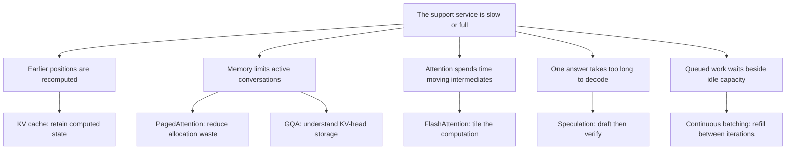
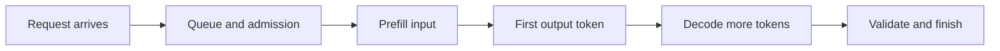

# Module 28 — Inference Serving

**Time:** 2–4 days · **Depends on:** [10 Cost](10-cost-optimization.md), [13 Production](13-production.md), [17 Small models](17-small-models.md) · **Next:** [Evaluating agents](22-agent-evaluation.md)

<span data-module-id="28" hidden></span>

---

<div class="aieng-story" markdown>

*Fictional teaching scenario.*

At 09:00, the support service passes its quality gate. One short ticket feels instant. At lunch, twenty users paste long histories: responses start late, streams pause, and a model that fitted yesterday runs out of memory. Someone proposes a smaller model. The engineer opens a trace first: is the service repeating work, storing too much state, moving too much data, or making customers wait for an idle slot?

You will follow those decisions through six short lessons. Each begins with a failure, asks you to predict a change, and ends by checking what improved and what remains unresolved. The numbers are teaching examples; the final lab is where you gather evidence from your own service.

</div>

**Case question:** Which measured bottleneck — repeated work, stored state, data movement, or a queue beside idle capacity — should change first, and which metric has to move before you keep that change?

## Learning objectives

- Separate prefill from decode, and read time-to-first-token, time-per-output-token, throughput, and goodput as different clocks
- Estimate KV-cache capacity and tell it apart from conversation memory and prefix reuse
- Match one serving failure to paging, FlashAttention, grouped-query attention, speculative decoding, or continuous batching
- Keep an optimization only when a controlled comparison still meets the quality and latency gates

## The six lessons

### Choose the failure you can see



These branches are hypotheses to test, not a diagnosis from one symptom. Several can apply to the same request. Start with the trace, then use the matching lesson below.

All explanations, worked examples, exercises, and answers are included in this course. External links are optional references and attribution; no external article is required to follow this route.

| Lesson | What you will be able to explain |
|---|---|
| [KV cache](inference/kv-cache.md) | Follow prefill/decode state and calculate its capacity cost |
| [PagedAttention](inference/paged-attention.md) | Trace logical-to-physical blocks, allocation waste, and sharing |
| [FlashAttention](inference/flash-attention.md) | Explain tiling, global softmax normalization, and attention IO |
| [Grouped-query attention](inference/grouped-query-attention.md) | Compare MHA/GQA/MQA and calculate KV-head savings |
| [Speculative decoding](inference/speculative-decoding.md) | Distinguish greedy verification from corrected sampling and assess overhead |
| [Continuous batching](inference/continuous-batching.md) | Draw an iteration schedule and evaluate latency versus useful throughput |

Start with KV cache, then read the technique suggested by your bottleneck. These are original course explanations, not archived copies of the linked articles.

## 1. Two phases, several clocks

In **prefill**, a causal language model processes the input tokens and prepares state for generation. In **decode**, it extends the sequence, normally one token per step. Prefill often benefits from parallel computation; low-batch decode often spends much of its time moving weights and cached state. These are workload-dependent tendencies, not universal hardware laws. The [Hugging Face cache explanation](https://huggingface.co/docs/transformers/main/en/cache_explanation) connects token generation to reusable attention state.



Use one client monotonic clock for arrival and streamed output timestamps. Server spans explain the causes; do not subtract timestamps from unsynchronized machines.

| Measure | Definition | What a regression suggests investigating |
|---|---|---|
| Time to first token (TTFT) | First content token received − request sent | Queue, retrieval, network, cold start, prefill |
| Inter-token latency (ITL) | Gaps between successive output tokens | Decode, scheduling interruptions, transport buffering |
| Time per output token (TPOT) | `(last_token_time − first_token_time) / (output_tokens − 1)` | Average decode experience; undefined for fewer than two tokens |
| End-to-end latency | Validated completion − request sent | The full user experience, including postprocessing |
| Output throughput | Total output tokens / measurement duration | Aggregate capacity; not one user's responsiveness |
| Goodput | Requests passing quality and latency targets / duration | Useful capacity, including failures in the accounting |

The [local lab](inference/hands-on.md#5-read-the-report-before-celebrating) reports a **local TTFT**: in-process time from request start to first available logits. It isolates prefill from decode on a CPU, but it excludes queueing, network, and tokenization, so it cannot stand in for a served TTFT measured at the client. Speculative runs omit it: drafting makes the first logits call an unreliable proxy for the first committed token.

An SSE event can contain several tokens. Without token timestamps, report **chunk gaps**, not purported token-level ITL. A fast first token also does not mean a schema-valid triage result is available: the application may need the complete JSON object.

**Worked trace:** request at 0 ms, first token at 600 ms, last of 21 tokens at 1,000 ms, validated completion at 1,030 ms. TTFT = 600 ms; TPOT = 20 ms; end-to-end = 1,030 ms. Reducing prefill cannot eliminate the remaining decode and validation time.

## 2. KV cache: saved computation occupies memory

For causal attention, earlier tokens' keys and values can be reused when a new token arrives. The current query still attends over applicable past state; caching does **not** make that attention free or constant-cost as context grows. This is model execution state, separate from the conversation history in [Module 05](05-context-engineering.md). See [Hugging Face's explanation](https://huggingface.co/docs/transformers/main/en/cache_explanation).

For a conventional decoder with uniform full-attention layers:

```text
KV bytes ≈ 2 × layers × KV_heads × head_dimension × bytes_per_element
             × sum(active_sequence_lengths)
```

The factor 2 is keys plus values. Length includes processed prompt and generated tokens. This estimate excludes weights, workspace, allocator overhead, and shared-prefix savings. Sliding-window, hybrid, and latent-attention architectures require their own accounting, worked through in [two axes the base formula hides](inference/kv-cache.md#two-axes-the-base-formula-hides); distributed runtimes may shard or replicate state.

### Worked exercise — fits at one user, fails at eight

Predict the effect of doubling context before running this dependency-free calculation:

```python
layers, kv_heads, head_dim, element_bytes = 32, 8, 128, 2
bytes_per_token = 2 * layers * kv_heads * head_dim * element_bytes
for users, tokens in [(1, 8192), (8, 8192), (8, 16384)]:
    gib = bytes_per_token * users * tokens / 2**30
    print(users, tokens, gib)
# 1 8192 1.0
# 8 8192 8.0
# 8 16384 16.0
```

**Explain:** these are KV-only GiB, not total device requirements. A hypothetical 16 GiB device with 10 GiB already committed cannot fit the second workload's 8 GiB cache. Reducing weight precision does not automatically reduce cache precision. Reserve space for output growth and verify measured peak memory before admitting traffic.

## 3. Three caches with different contracts

| Cache | Reuses | Still performs generation? | Key concern |
|---|---|---|---|
| In-request KV | Previously computed attention state | Yes | Lifetime and memory growth |
| Prefix/prompt | Compatible KV state for an identical token prefix across requests | Yes | Actual prefix match and runtime compatibility |
| Application response | A previously validated answer | No, on a hit | Tenant, permissions, freshness, model/prompt/policy versions |

Prefix reuse saves repeated prefill work; it does not skip generation of a new answer. Put genuinely stable instructions and examples before changing ticket content, preserving instruction priority. Similar meaning is not an exact token prefix. Avoid changing a timestamp at the start of every otherwise identical prompt. Measure cold and warm runs separately. See [vLLM automatic prefix caching](https://docs.vllm.ai/en/latest/features/automatic_prefix_caching/).

Apply the [security and privacy boundary](02-security-privacy.md) to all retained state. A cache hit must never stand in for authorization. Follow the selected service's isolation and retention contract; keep response-cache keys scoped as taught in [Module 10](10-cost-optimization.md#4-caching-with-safe-keys).

## 4. Different optimizations fix different work

### PagedAttention — allocate growing state efficiently

PagedAttention maps logical KV blocks to physical memory blocks so a sequence need not reserve one large contiguous maximum-size region. It reduces allocation waste and supports sharing; it does not shrink the information stored for every unique token. A partially filled last block and runtime metadata still cost memory. Paging here is not permission to spill freely to disk. [PagedAttention paper](https://arxiv.org/abs/2309.06180).

### FlashAttention — reduce intermediate memory traffic

FlashAttention tiles attention computation and uses an online softmax to avoid materializing the entire attention-score matrix in GPU high-bandwidth memory. It computes exact dense attention mathematically, subject to floating-point differences. Dense attention's arithmetic remains quadratic in sequence length; lower intermediate memory use does not remove the persistent KV cache. Kernel availability depends on hardware, dtype, shapes, and runtime. [FlashAttention paper](https://arxiv.org/abs/2205.14135).

### Grouped-query attention — fewer KV heads

In multi-head attention (MHA), each query head has a corresponding KV head. Multi-query attention (MQA) shares one KV head across query heads. Grouped-query attention (GQA) shares KV heads within groups. With everything else fixed, 8 KV heads instead of 32 need one quarter of the KV storage. This is a model architecture choice; changing a configuration number does not validly convert arbitrary trained weights. The paper describes uptraining, with quality evaluated afterward. [GQA paper](https://arxiv.org/abs/2305.13245).

### Continuous batching — refill capacity between iterations

Iteration-level scheduling lets completed sequences leave and waiting work join without waiting for an entire batch's longest sequence. It improves utilization when suitable queued work and memory are available. It is different from collecting requests for an offline batch job. Scheduler limits and admission control remain necessary. [Orca paper and presentation](https://www.usenix.org/conference/osdi22/presentation/yu).

**Paper exercise:** two slots; A needs 2 decode steps, B needs 6, and queued C needs 2. Ignore prefill and assume each step takes one time unit. Fixed batches finish C at time 8; refilling A's slot finishes C at time 4 while B finishes at 6. Explain why this illustrates scheduling rather than a measured GPU speedup: real iteration costs vary, and C must first be prefilled.

Long prefills can interrupt ongoing streams. **Chunked prefill** divides that work so it can be scheduled alongside decode. Tune for both first-token and inter-token targets; a setting that favors one can hurt the other. Memory pressure can also trigger preemption and recomputation. Consult the installed runtime version's [vLLM tuning guide](https://docs.vllm.ai/en/latest/configuration/optimization/), rather than copying a universal batch size.

### Speculative decoding — draft, then verify tokens

A cheaper proposer drafts tokens; the target model verifies multiple positions together. Correct speculative sampling preserves the target distribution using acceptance and correction rules. Greedy token matching is a special case, not a replacement for those rules under sampling. Distribution preservation does not promise an identical sampled string for the same seed. Gains depend on acceptance, draft overhead, memory, and load; published speedups are workload results. [Speculative decoding paper](https://arxiv.org/abs/2211.17192).

This differs from [Module 24's routing](24-local-first-agents.md): routing lets a smaller model answer some requests, whereas speculative decoding keeps target-model verification in generation. It does not validate factual claims or authorize tools.

## 5. Select one experiment

| Observed symptom | First evidence to collect | Candidate experiment |
|---|---|---|
| Long wait before any content | Retrieval, queue, prefill spans; cold/warm status | Reduce irrelevant context; test prefix reuse |
| Fast first token, slow finish | Output lengths, decode timing, interruptions | Bound output; evaluate supported speculative decoding |
| Memory failure only under concurrency | Active tokens, KV dtype, peak memory | Lower admission/context caps; inspect cache allocation |
| Throughput rises, user latency worsens | Arrival rate, queue depth, p95 TTFT and gaps | Reduce concurrency; test scheduler token budget |
| Prefill dominates on a self-hosted GPU | Attention backend and profiler evidence | Compare supported kernels with fixed inputs |

These are hypotheses. If retrieval takes four seconds and inference takes half a second, changing an attention kernel cannot solve the dominant delay.

**Hosted API path:** own context, output limits, concurrency, cache-friendly request construction, quality checks, and client timing. Kernel and scheduler configuration usually belong to the provider. **Self-hosted path:** additionally own the runtime, attention backend, memory layout, and load policy. Check supported combinations before enabling features.

## 6. Lab — earn the optimization

**Executable companion:** [Hands-on inference experiments](inference/hands-on.md) provides setup, real generation code, before/after JSON reports, and optional GPU serving commands. Start with the offline smoke run, then select the experiment below.

Use your existing service or an approved local runtime; no GPU or paid API is required for the worked exercises above. A mock service can test instrumentation but cannot establish an inference speedup.

1. Freeze model revision, tokenizer, prompt, sampling settings, runtime, hardware, and a representative quality set. Record actual input/output token counts.
2. Build short/long-input and short/long-output groups from the ticket workload. Separate unique-prefix and repeated-prefix requests. Pick a safe request count and load ceiling before starting.
3. Capture a cold run separately; warm the service, then repeat baseline and candidate measurements in alternating order. Change one setting only.
4. Test serial traffic and a bounded concurrency sweep. Also test a fixed arrival rate if assessing queueing: clients that wait for each response can hide overload.
5. Record sample count, p50/p95 TTFT, TPOT, completion latency, throughput, errors/timeouts, quality pass rate, and cost per successful request. Self-hosted runs also record peak memory and preemptions. Keep failed requests in the results; report latency statistics' population.
6. Retain the change only if predeclared quality and latency targets pass. Report variability and the traffic region where it helps. Do not multiply independent papers' speedup ratios.

**Artifact:** one comparison table plus a short decision: “For this workload, change X improved Y, left quality within threshold Z, and failed beyond load L.” With no serving hardware, submit the two worked exercises and an experiment specification, explicitly labeled unmeasured.

<details markdown>
<summary>Checkpoint: can you explain the failure?</summary>

- A model fits at startup but fails with longer chats: weights fitted; growing per-request state was not budgeted.
- Prefix reuse improves TTFT but not a long completion: it removed repeated prefill, not new-token generation.
- PagedAttention and FlashAttention can coexist: allocation and attention IO address different work.
- A draft model agrees often but slows the service: verification savings did not cover draft/scheduling overhead under this load.
- Faster GPU tokens do not ensure better triage: schema validation, grounding, authorization, and quality gates still apply.

</details>

## Source trail and scope

This module was prompted by [Amit Shekhar's May 12, 2026 article](https://x.com/amitiitbhu/status/2054100147546837154). Its six linked explainers were reviewed on September 21, 2026; the teaching above is grounded in the primary papers and runtime documentation linked beside each topic. The external links preserve attribution. The lessons in this module stay usable if those articles disappear.

| Article-linked explainer | Course lesson |
|---|---|
| [KV cache](https://outcomeschool.com/blog/kv-cache-in-llms) | [KV cache](inference/kv-cache.md); capacity preview in Modules 05 and 17 |
| [Paged attention](https://outcomeschool.com/blog/paged-attention-in-llms) | [PagedAttention](inference/paged-attention.md) |
| [FlashAttention](https://outcomeschool.com/blog/decoding-flash-attention) | [FlashAttention](inference/flash-attention.md); encoder background for the hybrid track |
| [GQA](https://outcomeschool.com/blog/grouped-query-attention) | [Grouped-query attention](inference/grouped-query-attention.md); head counts also used in Module 17 |
| [Speculative decoding](https://outcomeschool.com/blog/speculative-decoding) | [Speculative decoding](inference/speculative-decoding.md); distinct from routing in Module 24 |
| [Continuous batching](https://outcomeschool.com/blog/continuous-batching-in-llms) | [Continuous batching](inference/continuous-batching.md) |

The follow-on topics of prefill/decode, prefix caching, and chunked prefill are included because they connect those techniques to observable behavior. CUDA kernel implementation, FlashAttention generation-by-generation tuning, GQA uptraining, and a full compression survey remain optional specialist work. The hybrid track's encoder regression model does not generate tokens autoregressively, so decoder KV caches and speculative decoding are not requirements for that track.

<div class="aieng-complete" data-module-id="28" data-xp="120" markdown>
<p>Mark Module 28 complete when you can name the bottleneck you measured and the metric that had to move before you kept the change.</p>
<button type="button">Complete module · +120 XP</button>
</div>

**Next:** [Evaluating agents](22-agent-evaluation.md)
