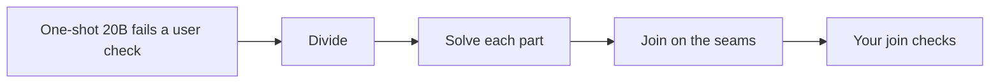

# Divide, solve, and join — gates

The [build spec](capstone-decompose.md) is the argument, including the agentic nuances and the hints. This page is how you close the holes in [`capstone-decompose/`](https://github.com/sanketn26/AIEngineering/tree/main/capstone-decompose). Ticks live in [`PROGRESS.md`](https://github.com/sanketn26/AIEngineering/blob/main/capstone-decompose/PROGRESS.md).

---

## Gate 1 — The one-shot prompt stays a baseline

Modules: [11](11-single-agents.md), [12](12-multi-agents.md), [27](27-harness-engineering.md).

| | |
|---|---|
| **Entry** | `pytest tests/` is green. `python divide.py check fixtures/refund_task.yaml` prints `SPEC_READY`. `python divide.py run` prints `one_shot` and `done`. |
| **Build** | `run` on a multi-part task returns `ONE_SHOT_FAILED` for the baseline and does not treat it as the solution. A plan is rejected for a cycle, a dropped `must`, an unknown check id, or an import of a seam nobody exports. Files outside the allowlist already fail; keep that. |
| **Evaluation** | Keep the one-shot diff. Name the user check it fails and the subsystem it actually edited. |
| **Failure injection** | Feed a plan that drops R3 and cites `V-looks-right`. No solve call runs. |
| **Exit** | You can show the prompt that fails and the plan error that stopped a bad split. |
| **Artifact** | `run_task` distinguishes `one_shot` from `divided`. Plan errors use the codes in the build spec. |

??? tip "If the one-shot unexpectedly passes"
    The task is not complex enough for this capstone. Add a real interaction: two modules and a public entry point whose check fails when the seam name is wrong. Do not make the prompt vaguer. Vagueness makes every model fail, including the frontier ruler.

---

## Gate 2 — Your checks, cited by id

Modules: [04](04-testing-evals.md), [22](22-agent-evaluation.md).

| | |
|---|---|
| **Entry** | Gate 1 exit. The mock plan still drops a requirement and invents a check, and `accept_plan` returns `PLAN_READY`. |
| **Build** | Every `must` has one owner. Every cited check id exists and its `maps_to` hits a requirement that owner owns. `scope: join` checks are not assigned to a part as a substitute for implementing the requirement. Vague checks are rejected or marked `human_review`. |
| **Evaluation** | A fixture plan missing R3 is `MISSING_OWNER`. A plan citing `V-looks-right` is `UNKNOWN_CHECK`. |
| **Failure injection** | Delete V4 from the spec and ask the divider to proceed. The runtime stops: the interaction is unspecified. |
| **Exit** | You can point from each requirement to a part and to a check you wrote. |
| **Artifact** | The coverage errors, and a spec whose checks were frozen before the divide call. |

??? tip "If every part passes and you still do not trust it"
    You have part checks and no join check. Add a test that imports the public entry point and fails when `apply_once` is not the function being called. That test's scope is `join`.

---

## Gate 3 — Solve one part at a time

Modules: [05](05-context-engineering.md), [17](17-small-models.md), [20](20-agent-reliability.md).

| | |
|---|---|
| **Entry** | Gate 2 exit. The starter never solves a part. `route_part` always returns `20b` and ignores width. |
| **Build** | Topological order. Each solve call gets that part's goal, files, imported seams, and the checks it must export against. Two repairs, then `PART_FAILED` or, when the part is still two subsystems, `PART_TOO_WIDE` and a 32B retry of that part only. Use [`prompts/solve-part.txt`](https://github.com/sanketn26/AIEngineering/blob/main/capstone-decompose/prompts/solve-part.txt). |
| **Evaluation** | A trace lists the prompt sections. The original mega-prompt is absent. A part that failed twice as too wide shows `32b` on that part and `20b` on the others. |
| **Failure injection** | Paste the full task into a part prompt on purpose, then remove it. The part check should get easier to satisfy for the wrong reason when the paste is present. Record that. |
| **Exit** | You can explain, for one part, what the model was allowed to see and which user check ran before the next part started. |
| **Artifact** | A per-part record: model id, seam exported, check ids, pass or fail. |

??? tip "Hint — telling PART_TOO_WIDE apart from PART_FAILED"
    They need different responses, so guessing between them wastes the 32B budget. `PART_FAILED` is a part with one job that the model got wrong — the check fails on the behavior it owns, and the diff is roughly the right shape. `PART_TOO_WIDE` is a part that turned out to be two: the diff touches two subsystems, or the model exports one seam and quietly reaches into another part's files.

    Use the diff, not the model's explanation. Two owners' files in one part's patch is the signal. Escalating a genuinely failed part to 32B usually reproduces the same wrong answer more expensively.

---

## Gate 4 — Join the parts into one solution

Modules: [12](12-multi-agents.md), [19](19-orchestration-patterns.md), [21](21-secure-tool-use.md).

| | |
|---|---|
| **Entry** | Gate 3 exit. `join_parts` returns `done` with `join_checks_ran` empty, including when a part failed and when an import names a missing seam. |
| **Build** | Assemble from the accepted part commits onto a fresh tree. Reject a signature mismatch (`SEAM_MISMATCH`). Reject a join that edits an owned file unless that part's checks re-run (`STALE_PART`). Run every `scope: join` check. Two join repairs. The status is the check result. Store the model's "done" and do not branch on it. Prompt: [`prompts/join.txt`](https://github.com/sanketn26/AIEngineering/blob/main/capstone-decompose/prompts/join.txt). |
| **Evaluation** | A fixture where P3 calls `record_refund` while P1 exported `apply_once` fails V4, and V1 still passes. A join that rewrites `ledger.py` without re-running V1 is `STALE_PART`. |
| **Failure injection** | Mark every part check passed, skip V4, and show the task still reporting `done`. Then close the hole and show `JOIN_UNVERIFIED`. |
| **Exit** | You can show two green parts and a red join, and you can show the joined tree passing V4 without a part check having been weakened. |
| **Artifact** | The join diff, the seam table, and the join-check output. |

??? tip "If the joiner wants to edit a part"
    Let it, once, on a fresh tree, and re-run that part's checks plus V4. If V1 fails, revert the part and fix the call site in the glue. Matching the part to a bad call site is how the seam disappears.

---

## Gate 5 — A comparison you can re-run

Modules: [04](04-testing-evals.md), [10](10-cost-optimization.md), [13](13-production.md), [28](28-inference-serving.md).

| | |
|---|---|
| **Entry** | Gate 4 exit. Nothing in the starter records a frontier ruler or a spec hash. |
| **Build** | Hash the spec and the check list. Log one-shot, per-part, and join outcomes under that hash, with model ids and durations. Run the frontier model once on the same hash. Compare with the Module 04 rule. A later edit to a check is a new hash. |
| **Evaluation** | The note names one-shot failures, join failures, and whether the divided path matched the frontier ruler, beat it, or came back `inconclusive`. |
| **Failure injection** | Change V4's target after approval. The old "passed" mark does not apply. |
| **Exit** | A reader can see that the 20B one-shot failed a check the joined solution passed, and what the frontier run did on that same check. |
| **Artifact** | A trace (JSON Lines or SQLite) and a one-page result tied to the spec hash. |

??? tip "Hint — what the frontier run is and is not for"
    It is a ruler, not a target. Running it once on the same hash answers whether the task was genuinely hard or just badly prompted: if the frontier model also fails your checks, the checks or the spec are the problem, and no amount of dividing will fix that.

    Resist tuning the divide path until it beats the ruler. The claim this capstone supports is narrower and more useful — a 20B model that fails in one prompt can pass the same user checks when the work is split and joined under verification. `inconclusive` against the frontier run is a perfectly good result to report.

---

## How the gates line up

| Agentic question | Gate |
|---|---|
| Did the single prompt fail, and did a bad plan get stopped? | 1 |
| Are the checks yours, and does every must have an owner? | 2 |
| Did each part see only its own problem, on a model that fits that part? | 3 |
| Did the join preserve the seams and pass the checks that span parts? | 4 |
| Can you show the one-shot, the join, and the frontier ruler on the same hash? | 5 |
