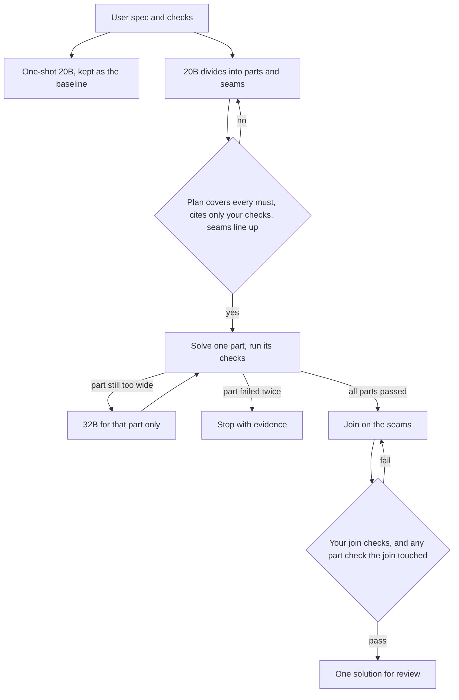

# Capstone — Divide, solve, and join

You give a 20B model one prompt: make refund approval idempotent, keep viewers out, and leave `approve_refund(proposal_id, actor)` unchanged. It rewrites `api.py`, invents a helper the ledger does not export, and answers that the task is done. The same prompt, with the same checks, is a task a frontier model can finish. The 20B model can finish it too, on a different path. It divides the work, solves one part at a time, and a join step assembles those parts into one solution. Your verification logic, written before the solve, is what decides that the join is good.

That path is the agentic problem in miniature. The nuances are the assignment.

The [triage capstone](capstone.md) is one request path. The [command runtime](capstone-command.md) is a 4B model proposing a bounded patch. This capstone starts where a single 20B prompt fails and a frontier model would not have to.

**Start from [`capstone-decompose/`](https://github.com/sanketn26/AIEngineering/tree/main/capstone-decompose).** The model is a mock. `run` still sends the whole task as one prompt and trusts the word "done". Close that with the [gates](capstone-decompose-gates.md).

```bash
cd capstone-decompose
pip install -r requirements.txt
python divide.py check fixtures/refund_task.yaml    # SPEC_READY
python divide.py run fixtures/refund_task.yaml      # one_shot / done — Gate 1 closes this
pytest tests/ -v
```

## What you are proving

| Mode | Model | What it is asked to do | Who says it passed |
|---|---|---|---|
| One shot | 20B | The whole task, one prompt | The baseline. Expect this to fail your checks. |
| Divided | 20B, and 32B only for a part that is still too wide | Divide, solve each part, join the parts | The verification you wrote |
| Reference | A frontier model | The whole task, one prompt, same checks | The same verification, used as a ruler |

Keep the one-shot run. If you delete it, you can no longer show that the prompt was the failure. The frontier run is a ruler on the same checks. It is not the implementation, and it is not the thing you ship.

??? tip "Hint — read a one-shot failure before you design the split"
    Run the 20B prompt once and keep the diff. The usual shape is that the first subsystem is real and the rest is gesture: a function the other file does not export, a test that stubs the hard part, a sentence that says the rest is handled. Your split should put a user check on each of those gestures. If you cannot point at the gesture, the task is still one blob and the 20B model will blob it again.

## The agentic nuances

These are the judgments this capstone grades. Modules [11](11-single-agents.md), [12](12-multi-agents.md), [19](19-orchestration-patterns.md), [20](20-agent-reliability.md), [21](21-secure-tool-use.md), and [27](27-harness-engineering.md) name the pieces. Here they have to work as one loop.

1. **The agent proposes. It does not define done.** A plan, a part diff, and a join diff are proposals. The checks you wrote are the decision. A final message that says "done" is text.
2. **One prompt fails because the model spends its attention on the first hard part.** Dividing is how you stop that. Handing every part the entire task recreates the one-shot failure inside each call.
3. **A handoff carries a seam, not the scratch work.** The next part needs a name, a signature, and a fixture. It does not need the previous part's reasoning. Scratch reasoning in the next prompt is how contradictions travel.
4. **Local green does not compose.** Each part can pass the check it owns while the names, the order of calls, or the error types disagree. The join is where that shows up, and it needs its own checks.
5. **The join is a step, with a budget and a policy.** It wires exported seams. It does not quietly rewrite a finished part. If the join must edit a part's files, that part's checks run again on the result.
6. **Shared files are where agents corrupt each other.** Prefer one owner per file. A file with two owners needs an explicit seam and a join check, or the second solver will overwrite the first.
7. **Dropped requirements, invented checks, and cycles are plan defects.** The model will produce all three. The runtime rejects the plan before any solve call.
8. **Caps live outside the model.** Two repairs per part, two for the join, then stop with the evidence. An agent that "tries a different approach" forever is the loop from Module 20.
9. **32B is for one part that stayed too wide.** Use it when a part still contains two subsystems after a split, or when two repairs fail for that reason. Do not promote the whole task to 32B, and do not promote it to the frontier model, because the prompt felt large.
10. **The one-shot 20B run and the frontier run stay in the log.** Same spec, same checks. Module 04's paired rule is how you claim the divided path beat the one-shot path, or matched the frontier ruler.

??? tip "Hint — context per part"
    The solve call for a part receives that part's goal, the requirement ids it owns, the user checks it must satisfy, the files it may edit, and the seams it imports and must export. It does not receive the other parts' diffs or the original mega-prompt. If you are tempted to paste those in "for context," you are rebuilding the prompt that failed.

??? tip "Hint — 20B or 32B"
    Start every part on the 20B model. Move that part to 32B only after the split is as small as the seams allow and the part has still failed twice for being too wide. Write the model id on the part. A trace where every part says 32B means the split was not used.

## Write the checks before anyone divides

You write these before the first plan call. The divider may cite their ids. It may not add, weaken, or replace one.

Each check is `part` or `join`:

| Scope | When it runs | What it is allowed to mean |
|---|---|---|
| `part` | After that part is solved, before the next part starts | The behavior this part owns, through the seam it exports |
| `join` | After the parts are assembled, on the integrated tree | Behavior that exists only when the seams are wired |

A `must` requirement has an owner part and at least one check. A requirement whose only check is `join` still needs a part that implements it. The join check re-tests the interaction. It does not implement the requirement.

??? tip "Hint — checks a join can use"
    Part checks call the exported function or fixture directly. They should pass without the other parts existing. Join checks run the path a user actually takes, through the public entry point, and they fail when a seam name, a signature, or an error type was wired wrong. If your only checks import one module at a time, you have not specified the join, and a bad assembly will look green.

Vague checks ("make sure it all works") are rejected or labeled `human_review`. The divider cannot satisfy them by saying it looked.

```yaml
schema_version: "1.0"
task_id: idempotent-refund
goal: "A repeated approval writes one ledger entry, a viewer cannot approve, and approve_refund(proposal_id, actor) stays."
requirements:
  - {id: R1, statement: "Approving the same refund twice yields one ledger entry.", priority: must}
  - {id: R2, statement: "A viewer cannot approve a refund.", priority: must}
  - {id: R3, statement: "approve_refund keeps the signature (proposal_id, actor).", priority: must}
verification:
  - {id: V1, scope: part, maps_to: [R1], runner: pytest, target: "tests/test_ledger.py::test_duplicate_approval_one_entry"}
  - {id: V2, scope: part, maps_to: [R2], runner: pytest, target: "tests/test_auth.py::test_viewer_cannot_approve"}
  - {id: V3, scope: part, maps_to: [R3], runner: pytest, target: "tests/test_api.py::test_signature_unchanged"}
  - {id: V4, scope: join, maps_to: [R1, R2, R3], runner: pytest, target: "tests/test_refund_flow.py"}
scope:
  allowed_files: [api.py, ledger.py, auth.py, tests/test_ledger.py, tests/test_auth.py, tests/test_api.py, tests/test_refund_flow.py]
  max_files_changed: 7
  max_added_lines: 400
unknowns: []
```

The starter loads a smaller cousin of this file. Gate 1 is where a one-shot "done" stops being the result.

## Divide

A legal part is a record, not a paragraph:

| Field | Meaning |
|---|---|
| `owns` | Requirement ids this part implements. Every `must` id appears once. |
| `checks` | User check ids. Every id exists on the spec. A part does not invent `V-looks-right`. |
| `files` | Subset of the task allowlist. One owner per file unless the join names the file as shared. |
| `depends_on` | Other part ids. The graph is acyclic. |
| `exports` | Seams the join and later parts may call: name, kind (`function`, `type`, or `fixture`), signature. |
| `imports` | Seam names this part expects from parts it depends on. Someone must export each one. |

```yaml
parts:
  - id: P1
    owns: [R1]
    checks: [V1]
    files: [ledger.py, tests/test_ledger.py]
    depends_on: []
    exports: [{name: apply_once, kind: function, signature: "(proposal_id: str) -> LedgerEntry"}]
    imports: []
  - id: P2
    owns: [R2]
    checks: [V2]
    files: [auth.py, tests/test_auth.py]
    depends_on: []
    exports: [{name: require_scope, kind: function, signature: "(actor, scope: str) -> None"}]
    imports: []
  - id: P3
    owns: [R3]
    checks: [V3]
    files: [api.py, tests/test_api.py]
    depends_on: [P1, P2]
    exports: [{name: approve_refund, kind: function, signature: "(proposal_id: str, actor) -> Receipt"}]
    imports: [apply_once, require_scope]
```

`V4` is not owned by a part. It is a join check. The plan is invalid if R1, R2, or R3 has no part, if `P3` imports a seam nobody exports, or if `P1` and `P3` both list `ledger.py` without declaring that file shared.

??? tip "Hint — a bad plan you should expect"
    The model will merge authorization into "cleanup," drop R3 because the signature "probably stays," and add a check called `smoke`. Reject that plan with `MISSING_OWNER`, `UNEXPORTED_SEAM`, or `UNKNOWN_CHECK`. Do not send it to a solver in the hope the join will notice. The solver never sees the dropped requirement.

The divider prompt is [`prompts/divide.txt`](https://github.com/sanketn26/AIEngineering/blob/main/capstone-decompose/prompts/divide.txt). One call divides. It does not also solve.

## Solve

Topological order. For each part, one solve call, then that part's user checks, on a tree that contains only the parts it depends on plus itself. Two repairs, then stop that part with the failure evidence. A policy violation (forbidden path, edited check, invented helper that is not the exported seam) does not become repair feedback. It stops.

A part that is still two subsystems after this split is not "tried harder" on the 20B model. Split it again, or route that part to 32B and write down why. The prompts are [`prompts/solve-part.txt`](https://github.com/sanketn26/AIEngineering/blob/main/capstone-decompose/prompts/solve-part.txt).

## Join

This is the step students skip, and it is the one that makes the solution one system.

The joiner receives the solved parts, their exported seams, and the join-scoped checks. It wires the public entry point to those seams. It may add the glue file the plan named for the join. It may not:

- rename an exported seam to make a call compile;
- copy a function body out of a part into the glue so the seam "isn't needed";
- delete or weaken a part check;
- edit a file a part owns, unless that part's checks are run again on the joined tree;
- report done.

After the join diff is applied to a fresh tree built from the accepted part commits:

1. Confirm every `imports` name is exported with a compatible signature.
2. Confirm file owners were respected.
3. Re-run any part check whose files the join touched.
4. Run every user check with `scope: join`.
5. The task status is that result.

A signature mismatch is `SEAM_MISMATCH`. A join that edits `ledger.py` and does not re-run `V1` is `STALE_PART`. A skipped `V4` is `JOIN_UNVERIFIED`. The model saying the integration looks coherent changes none of these.

??? tip "Hint — how a join goes wrong while every part is green"
    `P1` exports `apply_once(proposal_id) -> LedgerEntry`. `P3` calls `record_refund(proposal_id, actor)` because that is what the one-shot prompt would have written. `V1` still passes: it calls `apply_once` directly. `V4` fails, or it never runs. If your runner only executes part checks, you will ship the broken wiring. Read `V4`'s failure before you let the joiner rewrite `ledger.py`. Rewriting the part to match the bad call erases the seam and usually breaks `V1`.

The join prompt is [`prompts/join.txt`](https://github.com/sanketn26/AIEngineering/blob/main/capstone-decompose/prompts/join.txt).



## Measure it

On the same frozen spec and the same checks, report:

| Run | What you record |
|---|---|
| One-shot 20B | Which of your checks failed, and which subsystem the diff actually edited |
| Divided 20B / 32B | Per part: model id, seam, check ids, pass or fail. For the join: seam mismatches, whether part checks were re-run, join-check results |
| Frontier, one prompt | The same check ids, as the ruler |

Use the Module 04 paired rule before you write "the divided path is better" or "it matches the frontier model." Twenty tasks is enough to start. Mix bugs that cross modules, small features with one public entry point, and refactors that must preserve a signature. Each task needs at least one `join` check that fails if the seams are wired to the wrong names.

Choose any numeric threshold on a calibration slice, before you see the full table.

Failure codes worth keeping separate, because they tell you whether to fix the split, the solve, or the join: `ONE_SHOT_FAILED`, `MISSING_OWNER`, `UNKNOWN_CHECK`, `CYCLE`, `UNEXPORTED_SEAM`, `SEAM_MISMATCH`, `PART_FAILED`, `PART_TOO_WIDE`, `STALE_PART`, `JOIN_UNVERIFIED`, `CHECK_WEAKENED`.

## Definition of done

- [ ] The one-shot 20B prompt is still runnable, and on your tasks it fails a user check you can name
- [ ] A plan with a dropped `must`, an invented check id, a cycle, or an imported seam nobody exports is rejected before any solve
- [ ] Each part is solved with its own context, its own checks, and at most two repairs
- [ ] 32B appears only on a part you marked too wide, with a reason
- [ ] The join wires seams, refuses to rewrite an owned file without re-running that part's checks, and runs every `scope: join` check
- [ ] The task status comes from those checks. The model's "done" is stored and ignored
- [ ] A frontier run on the same checks is in the notes as a ruler, and the comparison uses the Module 04 rule
- [ ] The README diagram matches the code, including the join

Gates: [capstone-decompose-gates.md](capstone-decompose-gates.md).

## What done is not

1. A longer prompt that still asks the 20B model to do the whole task.
2. A divide step whose checks the model invented so the parts would pass.
3. Part diffs concatenated in a folder and called an integration.
4. A joiner that copies function bodies into `api.py` until the import errors go away.
5. Skipping the join check because every part check passed.
6. Sending the task to a frontier model because the join was annoying. That run belongs in the ruler column.
