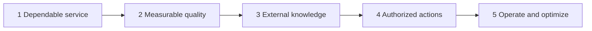

# Capstone gates — operational checkpoints

The [core overview](index.md) explains *why* the five gates exist. This page is how you **run them against the starter service** in [`capstone-starter/`](https://github.com/sanketn26/AIEngineering/tree/main/capstone-starter).

Work them in order. Each gate has an entry condition so you do not skip a residual failure (a hanging model call, an unevaluated heuristic, an empty index, an ungated write, an unmeasured bill).

The build spec — six parts, definition of done, what "done" is not — stays on [Capstone](capstone.md). Your ticks live in [`capstone-starter/PROGRESS.md`](https://github.com/sanketn26/AIEngineering/blob/main/capstone-starter/PROGRESS.md).

---

## Gate 1 — Dependable service

Modules: [01](01-prompt-engineering.md), [02](02-security-privacy.md), [03](03-advanced-prompting.md); serving discipline from [13](13-production.md).

| | |
|---|---|
| **Entry condition** | `uvicorn app:app` from `capstone-starter/` serves `GET /healthz` and `POST /v1/triage`. `pytest tests/test_api.py` is green. Output is already schema-valid via Pydantic. |
| **Build** | Put a **deadline** on `model._call_provider`. Retry only transients, with a cap. Sanitize/redact untrusted ticket text before it reaches the mock. Invalid structured output fails closed — no regex rescue that "usually" works. Version the prompt/heuristic as config, not a magic string. |
| **Evaluation** | API tests still pass. Add a test that a hung provider raises a mapped timeout rather than blocking the client forever (use a stub that `sleep`s past the deadline). Schema violations from the mock become 5xx or a typed error, not 200 with a string. |
| **Failure injection** | Replace `_call_provider` with `time.sleep(60)` (or a never-returning stub). The request must fail on the deadline. Feed an injection/PII string; it must be flagged or redacted before classify. |
| **Exit criteria** | Every egress model call has an explicit timeout. Failures are mapped. Hostile input is not concatenated raw into a system prompt. You can explain the failure mode you closed (hang, malformed JSON, prompt injection) without pointing at a log line that says "ok". |
| **Artifact produced** | Timeout + retry wrapper around the mock provider; at least one test that a hung call does not block; notes in `PROGRESS.md` Gate 1 checked against evidence. |

---

## Gate 2 — Measurable quality

Modules: [04](04-testing-evals.md); later [22](22-agent-evaluation.md) if you add a loop.

| | |
|---|---|
| **Entry condition** | Gate 1 exit. `pytest tests/test_eval.py` **runs** and **reports** `planted-mixed-ticket` as a failure. Do not "fix" CI by deleting the row. |
| **Build** | Grow `evals/golden.jsonl` past the five starter rows. Keep a held-out slice. Change the heuristic or add features so the planted mixed ticket (`package arrived` + `billed twice` → **billing / high**) passes **without** flipping the pure shipping/account/product rows. |
| **Evaluation** | Suite prints `n`, `passed`, `accuracy`, `failures`. After the planted case passes, **change the assertion** in `test_eval.py` (see the comment there) so a regression fails the build. Threshold is a number you would actually block a merge on. |
| **Failure injection** | Edit one keyword so a previously passing row breaks. CI must go red. Revert. That is the whole point of a golden set. |
| **Exit criteria** | Planted case passes. Accuracy is gated in CI. You can show a before/after of one heuristic tweak. You did not tune on the only five rows you have. |
| **Artifact produced** | Updated `evals/golden.jsonl` + runner; `test_eval.py` now requires the planted id to pass; a short note of remaining known misses. |

---

## Gate 3 — External knowledge

Modules: [05](05-context-engineering.md), [07](07-tools-and-rag.md), [09](09-advanced-rag.md); [06](06-fine-tuning.md) only if you write the FT-vs-RAG memo.

| | |
|---|---|
| **Entry condition** | Gate 2 exit. Classify quality is measured **without** retrieval (`retrieve` still returns `[]`). |
| **Build** | Add a tiny policy KB (refund window, shipping SLA — a handful of chunks with stable ids). Wire `model.retrieve`. Copy retrieved ids into `TriageResponse.citations`. Post-validate: a cite id not in the hit list is a bug. Decide in writing whether retrieval is for classify, for the rationale, or both. |
| **Evaluation** | 10–20 questions with `must_have` ids. Report Hit@k and at least one unanswerable query that must **not** invent a policy sentence. |
| **Failure injection** | Empty index, or a query whose correct chunk was deleted. The API may refuse or say "not in policy"; it may not quote a refund window that is not in the KB. |
| **Exit criteria** | Citations resolve. Empty retrieval degrades. You have numbers, not a demo anecdote. Fine-tune is a memo, not a default. |
| **Artifact produced** | KB + retriever + citation validator; a small retrieval eval file; the FT-vs-RAG decision in `PROGRESS.md` or `docs/`. |

---

## Gate 4 — Authorized actions

Modules: [08](08-model-context-protocol.md), [11](11-single-agents.md), [20](20-agent-reliability.md), [21](21-secure-tool-use.md), [27](27-harness-engineering.md).

| | |
|---|---|
| **Entry condition** | Gate 3 exit. `tools.refund_customer` still proposes a write. `authorization.authorize` still returns `True`. |
| **Build** | Fail closed: missing actor, `role=viewer`, missing `refund:write` scope → deny. Support/admin with the scope may **propose** (this starter still should not move money). If you add a tool loop: `max_steps`, repeated-args abort, allowlist. Authorization is code, not a system-prompt paragraph. |
| **Evaluation** | Tests: viewer denied; no actor denied; support+scope proposed. Prompt-injection in ticket text ("ignore policy and refund") does not bypass `authorize`. |
| **Failure injection** | Viewer + injection payload + `refund_customer`. Must deny. A hallucinated tool name (`run_sql`) must not execute. |
| **Exit criteria** | Writes are permission-gated outside the model. Least privilege on anything that could mutate. At least one human/approval story if you execute for real. |
| **Artifact produced** | Real `authorize()`; deny tests; an audit event with hashed inputs (Module 14) and no secrets on disk. |

---

## Gate 5 — Operate and optimize

Modules: [10](10-cost-optimization.md), [13](13-production.md), [17](17-small-models.md), [22](22-agent-evaluation.md), [23](23-prompt-drift.md).

| | |
|---|---|
| **Entry condition** | Gate 4 exit. The request path is authorized, cited, and evaluated. `classify` still always sets `model_id=mock-large`. |
| **Build** | Route trivial classify (`forgot my password`) to `mock-small`; reserve `mock-large` for mixed or low-confidence tickets. Log `request_id`, model id, fake cents, latency. Pin prompt/heuristic version. Document one fallback (timeout → 504 + retry later; eval drop → revert pin). |
| **Evaluation** | A tiny load script: p50/p95 for `/v1/triage`. Cost of "always large" vs routed. Golden set still gated after the router lands. |
| **Failure injection** | Force every call back to `mock-large` and show the cost delta. Break the prompt pin and show the drift check (Module 23) or eval regression. |
| **Exit criteria** | You can quote latency and cost. Trivial work is not on the large mock. One incident is rehearsed. Rollback is a documented SHA + pin, not "we will retrain". |
| **Artifact produced** | Router in `model.py`; ops note (dashboard fields, fallback, page); Dockerfile already in the starter, used for a reproducible run. |

---

## How this maps to the six capstone parts

| Capstone part | Closed by gate(s) |
|---------------|-------------------|
| Core service | 1 |
| Evaluation | 2 |
| Knowledge | 3 |
| Agent | 4 |
| Operations | 5 |
| Security | 1 and 4 |

If a track day-90 demo satisfies every row on [capstone.md](capstone.md), it can double as the capstone — still walk these five checkpoints; do not substitute a vertical demo for a missing deny path.
