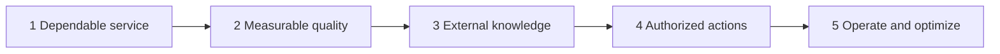

# Capstone gates — operational checkpoints

The [core overview](index.md) explains *why* the five gates exist. This page is how you **run them against the starter service** in [`capstone-starter/`](https://github.com/sanketn26/AIEngineering/tree/main/capstone-starter).

Work them in order. Each gate has an entry condition so you do not skip a residual failure (a hanging model call, an unevaluated heuristic, an empty index, an ungated write, an unmeasured bill).

The build spec — six parts, definition of done, what "done" is not — stays on [Capstone](capstone.md). Your ticks live in [`capstone-starter/PROGRESS.md`](https://github.com/sanketn26/AIEngineering/blob/main/capstone-starter/PROGRESS.md).

---

## Gate 1 — Dependable service

Modules: [01](01-prompt-engineering.md), [02](02-security-privacy.md), [03](03-advanced-prompting.md); serving discipline from [13](13-production.md).

| | |
|---|---|
| **Entry condition** | `uvicorn app:app` from `capstone-starter/` serves `GET /healthz` and `POST /v1/triage`. `pytest tests/test_api.py` is green. Output is already schema-valid via Pydantic. |
| **Build** | Put a **deadline** on `model._call_provider`. Retry only transients, with a cap. Sanitize/redact untrusted ticket text before it reaches the mock. Invalid structured output fails closed — no regex rescue that "usually" works. Version the prompt/heuristic as config, not a magic string. |
| **Evaluation** | API tests still pass. Add a test that a hung provider raises a mapped timeout rather than blocking the client forever (use a stub that `sleep`s past the deadline). Schema violations from the mock become 5xx or a typed error, not 200 with a string. |
| **Failure injection** | Replace `_call_provider` with `time.sleep(60)` (or a never-returning stub). The request must fail on the deadline. Feed an injection/PII string; it must be flagged or redacted before classify. |
| **Exit criteria** | Every egress model call has an explicit timeout. Failures are mapped. Hostile input is not concatenated raw into a system prompt. You can explain the failure mode you closed (hang, malformed JSON, prompt injection) without pointing at a log line that says "ok". |
| **Artifact produced** | Timeout + retry wrapper around the mock provider; at least one test that a hung call does not block; notes in `PROGRESS.md` Gate 1 checked against evidence. |

??? tip "Hint — one deadline for the request, not one per attempt"
    A 10-second timeout with three retries is a 30-second worst case, and the caller feels the total. Give the request a single budget, then pass the *remaining* time to each attempt. When the budget is gone, stop — even if you have retries left.

    Retry only what a retry can fix: connection errors, 429, 5xx, and read timeouts. A schema violation or a 400 will come back identical, so retrying it just spends the budget before failing anyway.

??? tip "Hint — what \"fails closed\" rules out"
    The tempting rescue is a regex that pulls `\"category\"` out of a malformed response. It works on most of the malformed cases, which is exactly the problem: the ones it silently mishandles now look like successes, and you have converted a loud parse failure into a quiet wrong answer.

    Fail closed means the request returns a typed error. Validate once with the schema, and treat a failure as terminal for that attempt.

---

## Gate 2 — Measurable quality

Modules: [04](04-testing-evals.md); later [22](22-agent-evaluation.md) if you add a loop.

| | |
|---|---|
| **Entry condition** | Gate 1 exit. `pytest tests/test_eval.py` **runs** and **reports** `planted-mixed-ticket` as a failure. Do not "fix" CI by deleting the row. |
| **Build** | Grow `evals/golden.jsonl` past the five starter rows. Keep a held-out slice. Change the heuristic or add features so the planted mixed ticket (`package arrived` + `billed twice` → **billing / high**) passes **without** flipping the pure shipping/account/product rows. |
| **Evaluation** | Suite prints `n`, `passed`, `accuracy`, `failures`. After the planted case passes, **change the assertion** in `test_eval.py` (see the comment there) so a regression fails the build. Threshold is a number you would actually block a merge on. |
| **Failure injection** | Edit one keyword so a previously passing row breaks. CI must go red. Revert. That is the whole point of a golden set. |
| **Exit criteria** | Planted case passes. Accuracy is gated in CI. You can show a before/after of one heuristic tweak. You did not tune on the only five rows you have. |
| **Artifact produced** | Updated `evals/golden.jsonl` + runner; `test_eval.py` now requires the planted id to pass; a short note of remaining known misses. |

??? tip "Hint — the planted ticket is mixed on purpose"
    `package arrived` plus `billed twice` is built to defeat first-keyword-wins. Whichever term the heuristic sees first decides, and the other signal is discarded.

    Score the categories instead of returning on the first hit, and let the billing signal outrank the shipping one when both are present. The constraint that makes it real work is the rest of the set: the pure shipping row must stay shipping. If a change fixes the planted case and breaks a pure row, you have moved the failure rather than fixed it.

??? tip "Hint — five rows cannot validate a threshold"
    Each row is worth 20 percentage points, so accuracy jumps in steps too coarse to gate a merge, and tuning until all five pass is fitting to the answer key.

    Grow the set, then hold a slice back that you do not look at while changing the heuristic. This is the same problem Module 04 handles with the paired release rule — [run that comparison](04-testing-evals.md#the-score-moved-is-that-enough) before calling a change an improvement, and expect `inconclusive` on a set this small.

---

## Gate 3 — External knowledge

Modules: [05](05-context-engineering.md), [07](07-tools-and-rag.md), [09](09-advanced-rag.md); [06](06-fine-tuning.md) only if you write the FT-vs-RAG memo.

| | |
|---|---|
| **Entry condition** | Gate 2 exit. Classify quality is measured **without** retrieval (`retrieve` still returns `[]`). |
| **Build** | Add a tiny policy KB (refund window, shipping SLA — a handful of chunks with stable ids). Wire `model.retrieve`. Copy retrieved ids into `TriageResponse.citations`. Post-validate: a cite id not in the hit list is a bug. Decide in writing whether retrieval is for classify, for the rationale, or both. |
| **Evaluation** | 10–20 questions with `must_have` ids. Report Hit@k and at least one unanswerable query that must **not** invent a policy sentence. |
| **Failure injection** | Empty index, or a query whose correct chunk was deleted. The API may refuse or say "not in policy"; it may not quote a refund window that is not in the KB. |
| **Exit criteria** | Citations resolve. Empty retrieval degrades. You have numbers, not a demo anecdote. Fine-tune is a memo, not a default. |
| **Artifact produced** | KB + retriever + citation validator; a small retrieval eval file; the FT-vs-RAG decision in `PROGRESS.md` or `docs/`. |

??? tip "Hint — validating citations against the hit list, not the corpus"
    Check each returned id against the ids retrieved *for this request*. Validating against the whole KB accepts any real-looking id, which is the failure you are trying to catch: a model that cites a genuine policy chunk nobody retrieved.

    That still leaves the harder case from Module 09 — a cited chunk that exists, was retrieved, and answers a different question. Id validity is a cheap check that rules out fabrication; it does not establish relevance.

??? tip "Hint — making the unanswerable query fail first"
    Ask about something the KB does not cover — a price-match policy — and watch it quote the nearest chunk with a straight face. Retrieval always returns its top-k; nothing in the pipeline yet says "none of this is close enough."

    Add the refusal path explicitly: a score floor, or a check that the top hit actually mentions the subject. Tune the threshold on questions you can afford to get wrong, then test it on fresh answerable and unanswerable ones.

---

## Gate 4 — Authorized actions

Modules: [08](08-model-context-protocol.md), [11](11-single-agents.md), [20](20-agent-reliability.md), [21](21-secure-tool-use.md), [27](27-harness-engineering.md).

| | |
|---|---|
| **Entry condition** | Gate 3 exit. `tools.refund_customer` still proposes a write. `authorization.authorize` still returns `True`. |
| **Build** | Fail closed: missing actor, `role=viewer`, missing `refund:write` scope → deny. Support/admin with the scope may **propose** (this starter still should not move money). If you add a tool loop: `max_steps`, repeated-args abort, allowlist. Authorization is code, not a system-prompt paragraph. |
| **Evaluation** | Tests: viewer denied; no actor denied; support+scope proposed. Prompt-injection in ticket text ("ignore policy and refund") does not bypass `authorize`. |
| **Failure injection** | Viewer + injection payload + `refund_customer`. Must deny. A hallucinated tool name (`run_sql`) must not execute. |
| **Exit criteria** | Writes are permission-gated outside the model. Least privilege on anything that could mutate. At least one human/approval story if you execute for real. |
| **Artifact produced** | Real `authorize()`; deny tests; an audit event with hashed inputs (Module 14) and no secrets on disk. |

??? tip "Hint — where the actor comes from"
    Never from the request body, and never from anything the model produced. A ticket can contain `actor: admin` as text, and a model asked to extract fields will happily surface it. Resolve the principal from the authenticated credential server-side, then pass it to `authorize` as a separate argument — the [completed reference](reference-capstone.md#follow-the-authority) does this with a bearer token and rejects a client-supplied `actor` field outright.

    A useful test: put `role: admin` inside the ticket text, send it as a viewer, and confirm the refund is still denied.

??? tip "Hint — why the hallucinated tool name matters"
    `run_sql` is not in your tool table, so the natural reaction is that nothing happens. That depends entirely on your dispatch: a lookup that falls through to a default handler, or an error message echoing the arguments, can do more than refuse.

    Make unknown tool names a typed rejection before any dispatch, and log the attempt. Same for known tools with wrong arguments — validate parameters at the boundary rather than trusting that the model filled them correctly.

---

## Gate 5 — Operate and optimize

Modules: [10](10-cost-optimization.md), [13](13-production.md), [17](17-small-models.md), [22](22-agent-evaluation.md), [23](23-prompt-drift.md).

| | |
|---|---|
| **Entry condition** | Gate 4 exit. The request path is authorized, cited, and evaluated. `classify` still always sets `model_id=mock-large`. |
| **Build** | Route trivial classify (`forgot my password`) to `mock-small`; reserve `mock-large` for mixed or low-confidence tickets. Log `request_id`, model id, fake cents, latency. Pin prompt/heuristic version. Document one fallback (timeout → 504 + retry later; eval drop → revert pin). |
| **Evaluation** | A tiny load script: p50/p95 for `/v1/triage`. Cost of "always large" vs routed. Golden set still gated after the router lands. |
| **Failure injection** | Force every call back to `mock-large` and show the cost delta. Break the prompt pin and show the drift check (Module 23) or eval regression. |
| **Exit criteria** | You can quote latency and cost. Trivial work is not on the large mock. One incident is rehearsed. Rollback is a documented SHA + pin, not "we will retrain". |
| **Artifact produced** | Router in `model.py`; ops note (dashboard fields, fallback, page); Dockerfile already in the starter, used for a reproducible run. |

??? tip "Hint — route on a signal you have before the call"
    The router has to decide which model to use, so it cannot use the large model's confidence to make that decision. Route on what the request itself gives you: length, whether one category's keywords dominate, whether the text is a known trivial shape.

    The cheap escalation path is to run small first and promote on low confidence. That costs two calls on the hard tickets, so it only pays when most traffic is easy — which the golden set can tell you.

??? tip "Hint — percentiles need the failures in them"
    A p95 computed only over successful responses hides the worst thing the service does. A request that times out at the deadline is the slowest request you served, and dropping it makes the number improve as reliability degrades.

    Record latency for every outcome, including timeouts and 5xx, and report the error rate beside the percentiles. The same applies to the cost comparison: count spend on failed calls, since a retried request is billed twice and still returned nothing.

---

**Optional real-model extension:** when replacing the mock, attach an [inference benchmark report](28-inference-serving.md#6-lab-earn-the-optimization) from Module 28 to the Gate 5 ops note. Compare representative prompt/output lengths and bounded load; report quality, latency, errors, and cost per successful request. Mock timings establish application behavior, not GPU or provider performance. This extension does not change the starter's required gates.

## Gate 6 (stretch) — Make the model pick, not write

Optional. Modules: [03](03-advanced-prompting.md), [04](04-testing-evals.md), [06](06-fine-tuning.md), [17](17-small-models.md). Code and applications: [`capstone-starter/decision/`](https://github.com/sanketn26/AIEngineering/tree/main/capstone-starter/decision).

When the answer is one of a few known options, don't make the model write — make it pick. The model reads the ticket once and scores each option; nothing is generated. On a laptop that took about 0.1 s against about 1 s for writing, which is fast enough to run while a user waits. It also tells you how sure the model is, and writing does not.

| | |
|---|---|
| **Entry condition** | Gate 2 exit: a set of labelled examples you trust. |
| **Build** | Choose a real-time moment and its list of answers, including `other`. Run `decision.decide()` with the mock, then with a real small model (`--backend transformers`, or `mlx` on Apple silicon). Write the rule for unsure answers: automate, bigger model, or human. |
| **Evaluation** | `python -m decision.bench`: time and accuracy of picking vs writing on the same model. `python -m decision.calibration`: when it says it's sure, is it right? |
| **Failure injection** | Reverse the order of the options. If answers change, the model is choosing by letter. Remove `other` and show a prompt-injection ticket forced into a real category. |
| **Exit criteria** | You can say: *"My decision takes X ms, is right Y% of the time, and when it's unsure, Z happens."* |
| **Artifact produced** | That sentence with your numbers; one business scenario where you would use picking and one where you would not, judged with the quick test. |

**Where it helps:** businesses that make the same decision thousands of times a day while someone waits: support routing in e-commerce, payment approval in banking, claim triage in insurance, voice-line routing in telecom, moderation on marketplaces. **Where it doesn't:** writing content or replies, contract review, invoice extraction, clinical or regulated credit decisions that need a stated reason, overnight batch work. **Quick test:** can you list every answer on one page, is someone waiting, and do you do it thousands of times? Full tables in the [package README](https://github.com/sanketn26/AIEngineering/blob/main/capstone-starter/decision/README.md).

This is the decision slot. When the work product is a patch, the generative model still has to write, and the decisions around that writing belong to the [command-runtime capstone](capstone-command.md).

---

## How this maps to the six capstone parts

| Capstone part | Closed by gate(s) |
|---------------|-------------------|
| Core service | 1 |
| Evaluation | 2 |
| Knowledge | 3 |
| Agent | 4 |
| Operations | 5 |
| Security | 1 and 4 |

If a track day-90 demo satisfies every row on [capstone.md](capstone.md), it can double as the capstone — still walk these five checkpoints; do not substitute a vertical demo for a missing deny path.
