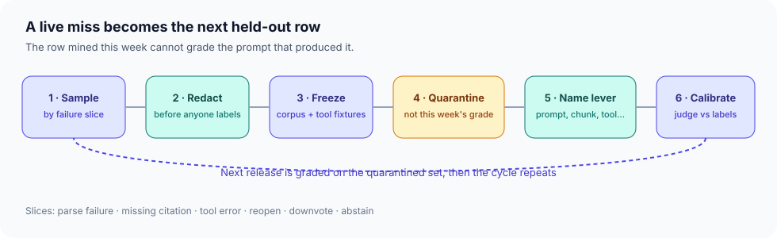

# Eval flywheel

**Time:** about half a day · **Depends on:** [04 Testing & evals](04-testing-evals.md), [13 Production](13-production.md), [22 Agent evals](22-agent-evaluation.md), [23 Prompt & config drift](23-prompt-drift.md) · **Next:** [Local-first agents](24-local-first-agents.md)

**Part of Gate 5.** This page is not a new module and it awards no module-complete mark. Full Core stays the 28 modules.

---

<span id="why-this-matters-cs-engineer-view"></span>

<div class="aieng-story" markdown>

*Fictional teaching scenario.*

Billing accuracy on the triage bot was 92% in March and 71% in April. The dashboard stayed green because it measured parse rate, and the JSON still parsed. Module 04 already told you to keep a golden set. Module 13 already stamps a `request_id` on the hung call. Module 22 can score a trajectory you paste in. Module 23 can tell you the prompt bytes changed. None of those pages take the April miss — a refund answered as 30 days for an enterprise SKU — and turn it into the row that blocks the next release.

</div>

**Case question:** Which six steps turn that live miss into a held-out case the current prompt is not allowed to grade itself on?

## Learning objectives

- Sample production traces by failure slice, not by recency alone
- Redact before a person or a judge sees the row
- Freeze the corpus hash and the tool fixtures that were live for that `request_id`
- Quarantine the new row so this week’s prompt cannot be scored on this week’s discoveries
- Name the lever the trace actually implicates
- Calibrate the judge against the human labels those rows produce

{ .course-figure }

<p class="course-caption">Sample, redact, freeze, quarantine, name the lever, calibrate. The dashed arrow is the rule: the release that produced the miss does not get to mark its own homework.</p>

<div class="aieng-intuition" markdown>
<p class="label">Intuition lock</p>

**Sticky picture:** The flywheel is a **evidence locker**. The trace goes in a bag, the bag is labeled with the corpus hash and the tool versions, and the bag stays out of today’s scoreboard until the next release.

<div class="kill" markdown>
**Kill this idea:** “We logged it, so we evaluated it.” → **Replace with:** A log is a candidate. A golden row is a redacted, frozen, quarantined case with an owner and a lever.
</div>
</div>

---

## The six steps

### 1. Sample by slice

Pull traces for a reason. A random 1% sample misses the rare enterprise refund. Start from slices you can name in the log:

| Slice | What the log shows |
|---|---|
| Parse failure | Schema check failed |
| Missing citation | Answer had no resolved source id |
| Tool error | Tool timeout, deny, or exception |
| Reopen | The same ticket id came back |
| Downvote | Explicit user rejection |
| Abstain | The [answer contract](07-answer-contract.md) refused to answer |

Cap the daily intake. Fifty new candidates is a queue. Five hundred is a landfill.

### 2. Redact before anyone labels

Module 14 already lists the golden set as personal data. Strip names, emails, account numbers, and ticket free text that is not required to reproduce the failure. The labeler should see the structure of the bug, not the customer.

### 3. Freeze the snapshot

A row that says “refund window” with no record of which policy hash and which billing fixture were live cannot be replayed next month. Store, with the `request_id`:

- prompt id, version, and digest (Module 23)
- model id the provider actually served (Module 13)
- corpus content hash (the [corpus lesson](09-corpus.md))
- tool name, schema version, and the fixture or recorded response

Module 23’s own question — hash unchanged, score dropped overnight — is often one of those four moving while the prompt bundle sat still.

### 4. Quarantine

A case mined from this week’s traffic cannot grade this week’s prompt. Relabeling it `held-out` during that same release does not let it in. An older row that is still `quarantine` stays out too. Promotion is a status change on a later release. Put the new row in `quarantine/` until that release. Then it joins the held-out set. Training rows, prompt cherry-picks, and the judge’s few-shot examples stay in other files. The QLoRA lab already separates reviewed production examples from the eval set. The same door applies here, even when you are not training.

### 5. Name the lever

Module 09 already separates retrieval metrics from generation quality. The flywheel is where that diagnosis becomes a backlog item. Read the frozen trace and pick one:

| What the trace shows | Lever |
|---|---|
| The gold chunk was not in the shortlist | Retrieval or chunking |
| The gold chunk was present and the answer ignored it | Prompt or packing |
| The policy chunk and the billing tool disagree | [Answer contract](07-answer-contract.md) |
| The tool was legal and the write doubled | Idempotency, Module 25 |
| The trajectory looped and the final line looked fine | Module 22 process score |
| The bytes were unchanged and the behavior moved | Provider, tool image, or corpus — pin those too |

One lever per row. A row that says “improve the bot” will be fixed in prose and will be back next week.

### 6. Calibrate the judge

Module 04 says an LLM judge is a noisy sensor and needs human labels. This is the pile those labels come from. Each week, score a thin slice twice: once by a person who owns the policy, once by the judge. When they disagree, fix the rubric before you trust the judge on the rest of the set. Exact field match stays the sensor wherever the task allows it.

---

## Course code

`src/flywheel.py`. Redaction walks nested fields and fixtures. A row grades only after it leaves quarantine, and never in the release that found it.

```python
PII_FIELDS = ("email", "name", "phone", "account_id")

def _redact(value):
    if isinstance(value, dict):
        return {k: _redact(v) for k, v in value.items() if k not in PII_FIELDS}
    if isinstance(value, list):
        return [_redact(item) for item in value]
    return value

def redact_trace(trace: dict) -> dict:
    return _redact(trace)

def freeze_row(trace, *, prompt_digest, corpus_hash, tool_fixtures,
               found_in_release, lever) -> dict:
    if not trace.get("request_id"):
        raise ValueError("request_id is required")
    if not prompt_digest or not corpus_hash or not tool_fixtures:
        raise ValueError("prompt digest, corpus hash, and tool fixtures are required")
    row = redact_trace(trace)
    row.update({
        "status": "quarantine",
        "prompt_digest": prompt_digest,
        "corpus_hash": corpus_hash,
        "tool_fixtures": redact_trace(tool_fixtures),
        "found_in_release": found_in_release,
        "lever": lever,
    })
    return row

def gradeable(rows: list[dict], current_release: str) -> list[dict]:
    return [
        row for row in rows
        if row.get("status") != "quarantine"
        and row.get("found_in_release") != current_release
    ]

def name_lever(trace: dict) -> str:
    policy, tool = trace.get("policy_window"), trace.get("tool_window")
    if policy is not None and tool is not None and policy != tool:
        return "answer-contract"
    if trace.get("gold_in_shortlist") is False:
        return "retrieval"
    if trace.get("gold_in_shortlist") and trace.get("answer_used_gold") is False:
        return "prompt"
    if trace.get("duplicate_write"):
        return "idempotency"
    if trace.get("looped") and trace.get("final_ok"):
        return "trajectory"
    if trace.get("bundle_unchanged") and trace.get("behavior_moved"):
        return "pin-upstream"
    raise ValueError("trace does not name a single lever")
```

```python
row = freeze_row(
    {
        "request_id": "req_8f3",
        "email": "a@ex.com",
        "customer": {"email": "a@ex.com", "sku": "enterprise"},
        "policy_window": 30,
        "tool_window": 14,
    },
    prompt_digest="sha256:prompt",
    corpus_hash="sha256:corpus",
    tool_fixtures={"get_subscription": {"window_days": 14, "email": "a@ex.com"}},
    found_in_release="2026-04",
    lever=name_lever({"policy_window": 30, "tool_window": 14}),
)
assert "email" not in row
assert row["customer"] == {"sku": "enterprise"}
assert row["tool_fixtures"]["get_subscription"] == {"window_days": 14}
assert row["status"] == "quarantine"
assert row["lever"] == "answer-contract"
assert [r["id"] for r in gradeable(
    [
        row | {"id": "new"},
        {"id": "relabeled", "status": "held-out", "found_in_release": "2026-04"},
        {"id": "still_quarantine", "status": "quarantine", "found_in_release": "2026-03"},
        {"id": "old", "status": "held-out", "found_in_release": "2026-03"},
    ],
    "2026-04",
)] == ["old"]
```

`pytest tests/test_flywheel.py -v` is the check. Flipping this release’s row to `held-out` does not make it gradeable. An older row still marked `quarantine` does not either.

<div class="aieng-case-checkpoint" markdown>
<p class="label">Case checkpoint</p>

**Opening failure:** April’s billing answers got worse and the green dashboard never moved.

**What this lesson demonstrates:** A path from one `request_id` to a redacted, frozen, quarantined row with a single named lever.

**What it does not prove:** A five-row locker is not a quality system. Seasonality, judge drift, and a corpus you forgot to hash will still ship a confident wrong refund.

</div>

---

## Lab

1. Write five fictional traces for the triage bot, one per slice you actually have logs for. Include the enterprise-versus-30-day miss.
2. Redact them. If a field is not required to reproduce the bug, it is gone.
3. Attach a prompt digest, a corpus hash, and one tool fixture to each row.
4. Mark every row `quarantine`. Show the one-line filter that keeps them out of today’s score.
5. Name one lever per row, using the table above. Two rows with the same symptom and different levers need a note explaining the trace that forced the split.

---

<div class="aieng-quiz" data-quiz-id="flywheel-q1" data-xp="25" data-success="The row stays in quarantine until the next candidate release." data-fail="A case found this week cannot grade the prompt that produced it." markdown>
<p class="label">Quiz · +25 XP</p>
<p class="quiz-prompt">You mined a failure from Tuesday’s traffic and the candidate prompt was also cut on Tuesday. When may that row affect the score?</p>
<div class="quiz-options">
<button type="button" class="quiz-opt" data-correct="false">Immediately — fresher cases are stricter</button>
<button type="button" class="quiz-opt" data-correct="true">On the next candidate release, after it has left quarantine</button>
<button type="button" class="quiz-opt" data-correct="false">Only if the judge agrees with the label</button>
<button type="button" class="quiz-opt" data-correct="false">Never — production traces cannot enter a golden set</button>
</div>
<p class="quiz-feedback"></p>
</div>

## Checkpoint

- [ ] Each new row names its slice, its `request_id`, and one lever
- [ ] The labeler saw a redacted case
- [ ] Corpus hash and tool fixtures are on the row
- [ ] Quarantine is a filter in the scorer, not a comment in the file
- [ ] A disagreement between judge and human changes the rubric before it changes the prompt

**Return to the case:** The 92% → 71% drop becomes a row the next release has to face. Logging the drop was the crime scene. The missing locker was the crime.
