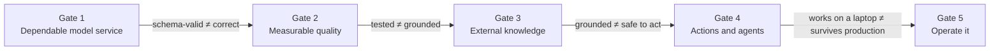

# Core Modules

Twenty-six modules, five **gates**. Each gate is a working-system exit criterion: you don't advance because you finished reading, you advance because the previous gate's residual failure mode forced the next capability. Complete [Setup](../getting-started/setup.md) first. Numbering is the catalog order, not a strict chain: a module's **Depends on** line is the real prerequisite — gates group modules by *which production failure they close*, not by topic family, so a module you'd expect to sit elsewhere (cost optimization, MCP) may be grouped by the failure it actually prevents rather than the technology it uses.

## The running app

One thread ties the five gates together: a support-ticket triage service. Each gate is what the *previous* gate's failure forced the team to add.

| Gate | The app gains | The failure that forced it |
|---|---|---|
| 1 — Dependable model service | A triage endpoint that returns schema-valid `{category, priority}` for any input, including hostile ones | Free-text output that "mostly" parsed broke the queue integration on the first malformed reply |
| 2 — Measurable quality | A 100+ item golden set gating every prompt change in CI | A "small" prompt tweak silently dropped priority accuracy 12 points and nobody noticed for a week |
| 3 — External knowledge | Retrieval over the policy KB so triage cites the actual refund window, not a guess | The model confidently invented a refund policy that never existed |
| 4 — Actions and agents | A bounded tool loop that looks up the customer's order and re-routes the ticket | An ungated agent looped on the same tool call until the cost alert fired |
| 5 — Operate it | A served, observable, versioned, drift-checked production system | A provider rate-limit spike caused hung workers, an autoscaler pileup, and a bill nobody could explain |

Each gate section below names this same failure again, then shows the modules that close it.

---

## Gate 1 — Dependable Model Service

**An LLM call is an unreliable, nondeterministic, variable-latency, variable-cost distributed dependency.** Before anything else is worth building, output has to be trustworthy: structured, schema-valid, and resistant to hostile input. This gate covers the *contract* — deadlines, versioning, and fail-closed serving are covered in full once you reach [Production](13-production.md) in Gate 5; here you build the discipline that makes that hardening possible.

**Exit criteria**

- [ ] Prompts are versioned, reviewable config — not ad hoc strings baked into code
- [ ] Hostile or untrusted input is sanitized/redacted before it reaches the model
- [ ] Model output is schema-validated (Pydantic/JSON schema), not parsed by string-matching
- [ ] Invalid or malformed responses fail closed instead of silently passing through

| Module | Time |
|---|---|
| [01 — Prompt engineering](01-prompt-engineering.md) | 2–3 days |
| [02 — Security & privacy](02-security-privacy.md) | 1–2 days |
| [03 — Advanced prompting](03-advanced-prompting.md) | 3–5 days |

---

## Gate 2 — Measurable Quality

Output is trustworthy in principle now — but "trustworthy" is unmeasured, which means every future change is a guess. **Deterministic software gets unit and integration tests; stochastic AI behavior gets an evaluation suite** — same engineering discipline, different tool. This is the course's load-bearing idea: skip it and every later gate is built on vibes.

**Exit criteria**

- [ ] A golden set (100+ cases) with a pass/fail threshold exists and runs in CI
- [ ] A prompt or config change can be shown to regress the eval score before it ships
- [ ] LLM-as-judge, if used, is checked against human-labeled agreement — not trusted blindly

| Module | Time |
|---|---|
| [04 — Testing & evals](04-testing-evals.md) | 2–3 days |

Revisited for multi-step agents in [22 — Evaluating agentic systems](22-agent-evaluation.md) (Gate 5) — trajectories need process *and* outcome scoring, not just a final-answer check.

---

## Gate 3 — External Knowledge

A well-tested model that only knows its training data is still wrong about anything specific to your business. The next failure is **ignorance** — confidently wrong, not visibly wrong. This gate is where you decide *whether* retrieval is even necessary, and prove it with numbers instead of assuming it.

**Exit criteria**

- [ ] Context budget is enforced — no silent truncation of what the model sees
- [ ] Retrieval necessity is measured: raw-query baseline evaluated *before* adding rewriting, hybrid search, or reranking
- [ ] Retrieval quality has numbers — recall/precision, groundedness, citation correctness — not "it looked right in the demo"
- [ ] A fine-tune-vs-RAG decision is written down, not assumed

| Module | Time |
|---|---|
| [05 — Context engineering](05-context-engineering.md) | 5–7 days |
| [06 — Fine-tuning](06-fine-tuning.md) | 7–10 days |
| [07 — Tools & basic RAG](07-tools-and-rag.md) | 5–7 days |
| [09 — Advanced RAG](09-advanced-rag.md) | 7–10 days |

---

## Gate 4 — Actions and Agents

Grounded answers are not the same as safe actions. Once the system can call tools and act across multiple steps, the failure mode changes again: **loss of control** — loops, hallucinated tool calls, partial execution, runaway cost. Authorization and budget enforcement have to live outside the model, because the model is exactly the thing that's unreliable.

**Exit criteria**

- [ ] Every tool/MCP server call is authorized outside the model (an allowlist, not a prompt instruction)
- [ ] Agents have a step cap and a cost cap enforced in code, not requested in the system prompt
- [ ] Named failure modes (loop, hallucinated tool, partial execution, silent quality drop) each have a detector and a test
- [ ] Any tool that writes or executes runs under least privilege / sandboxing

| Module | Time |
|---|---|
| [08 — Model Context Protocol](08-model-context-protocol.md) | 4–6 days |
| [10 — Cost optimization](10-cost-optimization.md) | 2–3 days |
| [11 — Single-agent workflows](11-single-agents.md) | 7–10 days |
| [12 — Multi-agent coordination](12-multi-agents.md) | 10–14 days |
| [16 — Integration patterns](16-integration-patterns.md) | 1–2 weeks |
| [18 — Agent design patterns](18-agent-design-patterns.md) | 5–8 days |
| [19 — Orchestration patterns](19-orchestration-patterns.md) | 6–9 days |
| [20 — Agent reliability & failure modes](20-agent-reliability.md) | 4–6 days |
| [21 — Secure tool use & sandboxing](21-secure-tool-use.md) | 5–7 days |

---

## Gate 5 — Operate It

Everything above works on a laptop with one user. Production means real traffic, providers that rate-limit and change silently, audits, and a bill someone has to explain. This gate is where telemetry replaces guessing: every incident should be debuggable from traces, not from "the bot was weird."

**Exit criteria**

- [ ] Every egress model call has a deadline; failures are logged with a shared `request_id`
- [ ] Prompt/model/config version is recorded per request and roll-backable
- [ ] Dashboards track latency (p50/p95/p99), cost/request, success rate, retry rate
- [ ] Prompt/config drift is detected by a system, not discovered by a user complaint

| Module | Time |
|---|---|
| [13 — Production-grade systems](13-production.md) | 2–3 weeks (alongside a real project) |
| [14 — Compliance](14-compliance.md) | 3–5 days |
| [15 — Domain-specific applications](15-domain-apps.md) | 1–2 weeks |
| [17 — Small & local models](17-small-models.md) | 5–7 days |
| [22 — Evaluating agentic systems](22-agent-evaluation.md) | 5–7 days |
| [23 — Prompt & config drift](23-prompt-drift.md) | 3–5 days |
| [24 — Local-first, cost-aware agents](24-local-first-agents.md) | 4–6 days |
| [25 — Durable orchestration](25-durable-orchestration.md) | 7–10 days |
| [26 — Orchestrators in production](26-orchestrator-comparison.md) | 5–7 days |

---

Ready to prove all five gates work together? See the [Capstone](capstone.md).

Full skill-by-skill breakdown: [Capability progression](../reference/progression.md). Prefer a guided route instead of the full list? See [Learning paths](../getting-started/paths.md).

[Start Module 01 →](01-prompt-engineering.md){ .course-button .course-button--primary }
