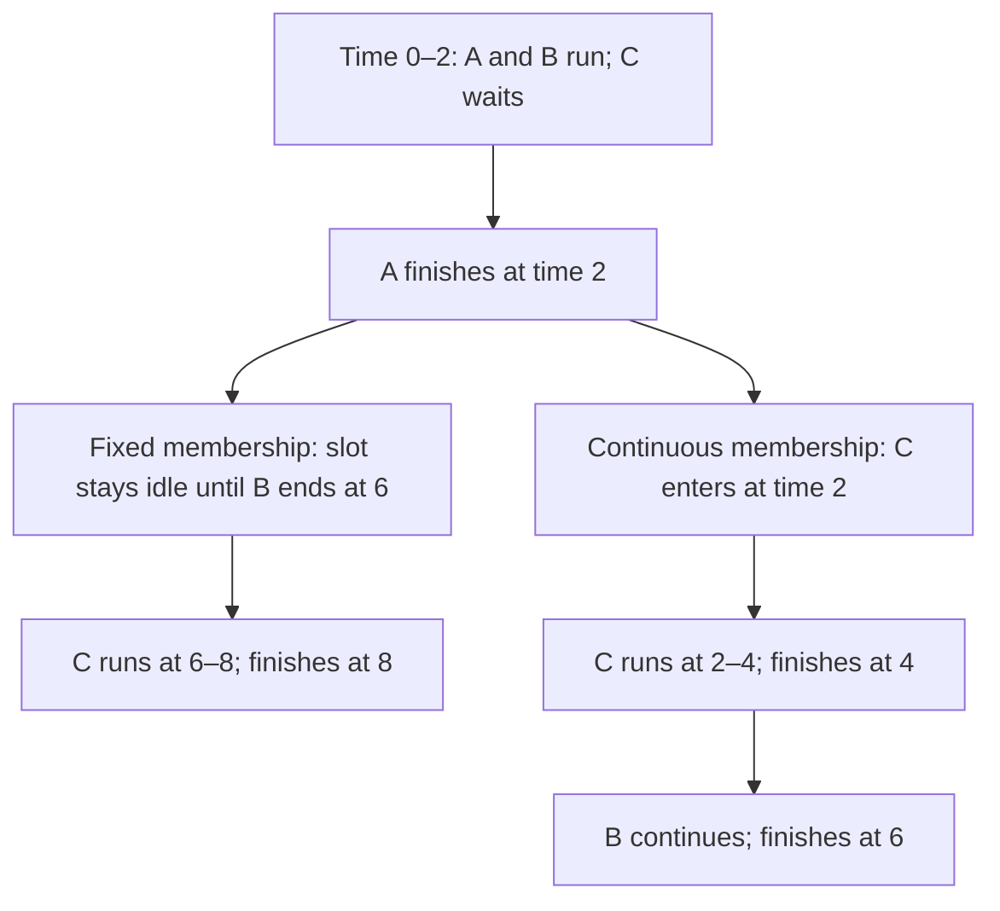

# Continuous batching — admit work between iterations

**Prerequisite:** [Prefill and decode](../inference-performance.md#1-two-phases-several-clocks). **Return to:** [Inference performance](../inference-performance.md).

<div class="aieng-story" markdown>

*Fictional teaching scenario.*

At lunch, the support server handles two requests together: A needs a short label, B a long explanation. A finishes. C waits in the queue, but the fixed batch keeps A's slot empty until B finishes too. The engineer points at the idle capacity: “Why is C waiting for work that doesn't belong to it?”

She revisits batch membership between iterations. C can enter when A leaves—provided its input has been processed and enough memory is available. Now raw throughput must be checked against each customer's wait.

</div>

<div class="aieng-intuition" markdown>
<p class="label">Intuition before mechanics</p>

**Picture to keep:** when a checkout lane becomes free, serve the next customer without waiting for every other lane to finish.

**Where the picture stops:** GPU requests share an iteration and finite memory. New arrivals need prefill, and changing batch membership can change iteration duration.

</div>

## Watch the decision

**Predict:** with two slots, A needing 2 steps, B needing 6, and queued C needing 2, when can C finish if A's slot is reused?



The branch isolates the scheduling decision. Inputs are already prefilled and each iteration takes one time unit here; real serving must measure both assumptions.

## Replace request-level waiting with iteration-level scheduling

A fixed batch has a fixed membership until completion. Continuous batching revisits membership between generation iterations: completed requests leave, and eligible queued requests can join. Implementations handle variable sequence lengths and available cache capacity while constructing the next work batch.

This does not mix users' text into one conversation. Requests retain separate state and output streams. Nor is it an offline batch API that accepts a file and returns results later.

## Draw the schedule

Assume two slots, one time unit per decode step, and all inputs already prefilled. A requires two steps, B six, and queued C two.

| Interval | Fixed batch | Continuous batch |
|---|---|---|
| 0–2 | A and B | A and B |
| 2–4 | B; one unused slot | C and B |
| 4–6 | B; one unused slot | B; one unused slot |
| 6–8 | C | Finished |

C completes at 8 with fixed membership and at 4 with continuous membership. Total completion time falls from 8 to 6 in this simplified model. Idle slots still appear when no queued work remains. The scheduler cannot invent demand or infinite memory.

## New requests also need prefill

The toy schedule deliberately skipped input processing. Real arrivals need prefill before decode. A large prompt can monopolize an iteration and delay existing streams. Chunked prefill splits that work into smaller scheduled portions so decode can keep progressing.

This creates a policy trade-off: favoring existing decodes can improve their token gaps while increasing newcomers' first-token wait. Token budgets, active-sequence caps, and fairness policies matter more than an abstract “batch size” alone.

If KV space is exhausted, the runtime may queue, preempt, recompute, or reject work. An application should impose deadlines and bounded admission instead of flooding the server with retries.

## Measure a useful service

Keep input/output lengths and arrival patterns comparable. At each load level, report:

- Completed requests and output tokens per second.
- p50/p95 first-token and complete-response latency.
- Stream gaps, labeled as token or chunk measurements as appropriate.
- Errors, timeouts, rejection counts, and quality pass rate.
- Self-hosted peak memory and preemptions where observable.

A concurrency-only client sends more slowly when responses slow down. That can conceal overload: a separate fixed-arrival-rate experiment exposes queue growth. Bound both experiments so a learning exercise does not become an unbounded load test.

## Measure it under load

Follow the [GPU serving lab](hands-on.md#7-continuous-batching-and-paged-memory-serve-under-load), which supplies complete server and client commands. Start with `--max-num-seqs 1`, then restart with `--max-num-seqs 4` and replay the same bounded workload.

```text
Keep fixed: model/tokenizer pin, input/output lengths, seed, request rate
Change:     maximum active sequences, 1 → 4
Collect:    TTFT, TPOT, throughput, failures, cache pressure, preemptions
```

The runnable client uses `vllm bench serve --save-result --save-detailed`. Both server configurations use the same scheduler; this tests serial admission versus concurrent serving. It does not pretend to turn continuous batching off. Use the saved results to decide whether improved capacity still meets the latency contract.

## Exercise and checkpoint

Two hypothetical configurations serve 100 requests in the same interval. X completes 90 inside the latency target with valid answers; Y completes all 100 but only 70 meet that target. Which has higher useful throughput under that contract?

<details markdown>
<summary>Reveal</summary>

X: 90 qualifying requests per interval versus 70. Y has higher raw completions but lower goodput. Include failures and slow requests in the report instead of comparing only successful fast samples.

</details>

Complete the [benchmark lab](../inference-performance.md#6-lab-earn-the-optimization) before choosing a scheduler configuration for production.

<div class="aieng-case-checkpoint" markdown>
<p class="label">Return to the incident</p>

C finishes earlier in the drawn schedule, but that alone does not prove the server meets its contract under load. The final exercise makes the production decision: 90 answers meeting quality and latency targets are more useful than 100 completions with only 70 qualifying.

**Return to the service:** use the [benchmark lab](../inference-performance.md#6-lab-earn-the-optimization) to measure the bottleneck you actually changed, including failures and the requests left waiting.

</div>

**Optional primary references:** [Orca](https://www.usenix.org/conference/osdi22/presentation/yu) and [vLLM tuning](https://docs.vllm.ai/en/latest/configuration/optimization/). See the [source trail](../inference-performance.md#source-trail-and-scope).
