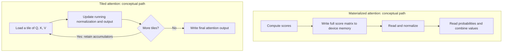

# FlashAttention — avoid writing the giant intermediate

**Prerequisite:** [KV cache and attention vectors](kv-cache.md). **Return to:** [Module 28](../28-inference-serving.md).

<div class="aieng-story" markdown>

*Fictional teaching scenario.*

At 11:00, long tickets fit in memory but still start slowly. The engineer profiles prefill. Attention repeatedly writes a huge table of scores to device memory, then reads it back for the next operation. The arithmetic units are capable; moving their intermediate results is costly.

She tries working on small tiles and carrying a running summary of the calculation. The challenge is correctness: each tile must contribute to one global normalization, not become an independent answer.

</div>

<div class="aieng-intuition" markdown>
<p class="label">Intuition before mechanics</p>

**Picture to keep:** work through a large ledger on a small desk, carrying totals forward instead of photocopying the entire ledger between operations.

**Where the picture stops:** a plain sum is insufficient. Softmax needs a running maximum, normalizer, and consistently rescaled weighted-value accumulator.

</div>

## Watch the decision

**Predict:** if each tile normalizes itself separately, will combining the tile results preserve the importance of scores across tiles?



Both paths compute attention. The lower path avoids storing the full score matrix; its running state preserves relationships across tiles. The two-score exercise below shows why independent normalization fails.

## The intermediate that gets expensive

For one attention head with N input positions, dense attention computes scores between queries and keys. Conceptually:

```text
scores = Q × transpose(K) / sqrt(head_dimension)
weights = softmax(masked_scores)
output = weights × V
```

The conceptual score matrix has N² entries. At N = 8,192, that is 67,108,864 entries: 128 MiB if stored in two bytes per entry, for just one matrix and head. Implementations need not allocate this exact representation; the calculation explains why materializing it is costly.

Accelerators have a memory hierarchy. Large device memory holds tensors; smaller on-chip storage supports fast local computation. Writing a large score matrix out and reading it again can be expensive even when arithmetic units are fast.

## Tiling and an incremental normalization

FlashAttention works through blocks of Q, K, and V, retaining small intermediate quantities on chip and accumulating the result. It avoids storing the whole score/probability matrix in large device memory.

The subtle part is softmax: its denominator depends on every permitted key for a query. Normalizing each block independently and averaging would be wrong. An online softmax instead maintains a running maximum and normalizer, rescaling earlier accumulated values when a later block changes the maximum. The weighted-value accumulator is rescaled consistently.

**Small normalization exercise:** a query has two unmasked scores, 0 and `ln(3)`. Their correct softmax weights are 1/4 and 3/4. Processing each score as an independent one-element softmax would produce 1 and 1, losing their relative importance. An incremental algorithm must preserve the global normalization even though it never stores the full vector of scores.

## Exact attention has limits

“Exact” means the same mathematical dense-attention operation, not bit-identical floating-point execution. Rearranged operations can produce small numerical differences. Dense attention still requires quadratic pairwise work; the improvement is in how that work uses memory and hardware.

Persistent KV state remains necessary during cached decoding. Saving attention intermediates is not the same as shrinking that cache. Later kernel generations refine parallelism and hardware use; there is no universal version choice independent of device, dtype, shapes, and runtime support.

## Apply it at the right layer

For a hosted API, the provider normally chooses kernels. For self-hosting, inspect the backend actually selected by the runtime; a requested option may be unsupported or fall back. Measure long-input prefill separately from short-input decode and total service latency.

The hybrid track's encoder can also benefit from supported efficient attention. That does not turn it into an autoregressive generator: check prediction parity and profile its real workload.

## Run a backend comparison

Use the [optional local environment](hands-on.md#1-install-the-optional-local-environment):

```bash
python -m src.inference_bench --experiment attention --backend sdpa \
  --prompt-repeats 16 --new-tokens 32 --repeats 5 \
  --output results/inference/attention.json
```

This changes eager attention to SDPA with the same weights and caching enabled. SDPA selects a supported implementation; a CPU result is **not** a FlashAttention GPU benchmark. The [CUDA variant](hands-on.md#3-attention-select-a-supported-implementation) uses `--backend flash_attention_2 --device cuda --dtype float16` after installing a compatible kernel. Inspect parity and actual backend, not just timing.

## Exercise and checkpoint

A request takes 800 ms: retrieval 600 ms, attention 100 ms, everything else 100 ms. A hypothetical kernel halves attention time. What is the new total?

<details markdown>
<summary>Reveal</summary>

750 ms, assuming the other stages remain unchanged: only 50 ms saved end to end. A 2× attention speedup is not a 2× application speedup. Profile before choosing the optimization.

</details>

<div class="aieng-case-checkpoint" markdown>
<p class="label">Return to the incident</p>

The engineer's kernel change targets intermediate IO. In the worked service example, halving 100 ms of attention saves only 50 ms out of 800 ms. The remaining 600 ms of retrieval still dominates. A kernel improvement and an application improvement are different measurements.

**Next decision:** persistent cache memory is still large. [Grouped-query attention](grouped-query-attention.md) explains how the model's head structure changes that storage.

</div>

**Optional primary reference:** [FlashAttention paper](https://arxiv.org/abs/2205.14135). The [source trail](../28-inference-serving.md#source-trail-and-scope) records the motivating article.
