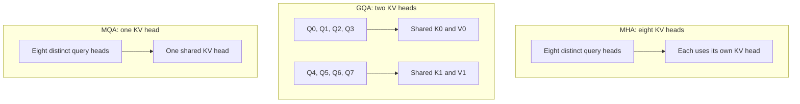

# Grouped-query attention — share keys and values

**Prerequisite:** [KV cache](kv-cache.md). **Return to:** [Module 28](../28-inference-serving.md).

<div class="aieng-story" markdown>

*Fictional teaching scenario.*

The engineer compares two candidate support models. Their configurations list the same number of layers and query heads, yet their cache estimates differ. She initially suspects a measurement error. Then she notices that one model has fewer key/value heads.

The missing idea is sharing: several query heads can ask different questions of the same keys and values. Your task is to follow that sharing without accidentally treating it as fewer queries, fewer historical tokens, or a free conversion of trained weights.

</div>

<div class="aieng-intuition" markdown>
<p class="label">Intuition before mechanics</p>

**Picture to keep:** eight readers can ask different questions using two shared sets of notes.

**Where the picture stops:** the notes are learned K/V projections. Sharing them changes the model architecture; it is not merely deduplicating identical files after training.

</div>

## Watch the decision

**Predict:** if eight query heads share two KV heads, which quantity becomes one quarter as large: query count, logical KV storage, or the whole model?



Each grouped box represents several **separate** query computations. With other dimensions fixed, only the logical KV storage ratio follows directly: 8 → 2 → 1 sets of state.

## Three ways to organize heads

Heads let attention use multiple learned projections. The number of query projections need not equal the number of key/value projections.

| Architecture | Example with eight query heads | KV heads |
|---|---|---:|
| Multi-head attention (MHA) | Each query head has its own K/V head | 8 |
| Grouped-query attention (GQA) | Four query heads use one K/V head; the other four use another | 2 |
| Multi-query attention (MQA) | All query heads use one K/V head | 1 |

Sharing K/V does not mean every head computes the same output. Query projections remain distinct, producing different attention scores against shared keys. Nor does GQA mean averaging the queries into one head.

## Follow one token through the groups

Imagine query heads Q0–Q7 and two KV heads:

```text
Q0 Q1 Q2 Q3  →  K0, V0
Q4 Q5 Q6 Q7  →  K1, V1
```

Each query attends separately. The cache stores two sets of past keys and values rather than eight. The savings concern the shared representation, not deletion of the historical tokens.

Using the same layers, sequence lengths, head dimension, and cache dtype, this GQA example uses one quarter of MHA's logical KV storage. MQA uses one eighth. These ratios describe KV tensors, not total model memory or end-to-end speed.

## A model choice, not a serving trick

K/V projections are trained parameters with architecture-dependent shapes. Editing a head-count field in an existing checkpoint is not a valid conversion. Converting a model requires an appropriate transformation and training procedure, followed by evaluation. A deployment engineer usually selects an already trained supported checkpoint.

Fewer KV heads can reduce cache capacity and bandwidth demands, but head sharing changes the model's parameterization. Do not assume equal quality because a memory estimate looks attractive. Compare models on the same ticket evaluation set, hardware, context distribution, and concurrency.

Also inspect what the runtime actually allocates: distribution across devices, replication, or a backend that expands intermediate representations can complicate simple per-device estimates.

## Inspect a trained model

Run the [local benchmark](hands-on.md#2-kv-cache-one-switch-the-same-weights), then inspect the fields used in its estimate:

```python
import json
from pathlib import Path
metadata = json.loads(Path("results/inference/cache.json").read_text())["metadata"]
for field in ("query_heads", "kv_heads", "logical_kv_bytes_per_token"):
    print(field, metadata[field])
```

These values come from the loaded checkpoint and tensor dtype. Explain the estimate before choosing a model with different sharing; retain a quality evaluation for each checkpoint. The lab does not convert MHA weights to GQA.

## Exercise and checkpoint

Use a hypothetical model with 24 layers, 16 query heads, head dimension 64, a 4,096-token history, and two-byte cache elements. Estimate cache size for 16, 4, and 1 KV heads.

<details markdown>
<summary>Reveal</summary>

Apply `2 × 24 × KV_heads × 64 × 4096 × 2` bytes. The results are 384 MiB, 96 MiB, and 24 MiB respectively. With four active equally long sequences, multiply each by four. None includes weights or allocation overhead.

</details>

Before selecting a local model, write down both head counts and explain why only one of them appears in this cache formula. Then check the [Module 17 capacity checkpoint](../17-small-models.md#estimate-kv-separately-from-weights).

<div class="aieng-case-checkpoint" markdown>
<p class="label">Return to the incident</p>

The engineer can now explain the cache difference using KV-head count. The exercise produces 384, 96, and 24 MiB for the same history under its stated configurations. Those are storage calculations, not evidence that three trained models have equal quality.

**Next decision:** if capacity is adequate but each answer still unfolds slowly, investigate [speculative decoding](speculative-decoding.md).

</div>

**Optional primary reference:** [GQA paper](https://arxiv.org/abs/2305.13245). See the [source trail](../28-inference-serving.md#source-trail-and-scope).
