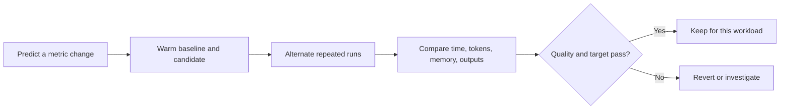

# Hands-on — make the improvement measurable

**Prerequisites:** [Inference performance](../inference-performance.md). Run commands from the repository root. **Time:** 1–2 hours for local experiments, plus optional GPU setup and load testing.

<div class="aieng-story" markdown>

*Fictional teaching scenario.*

The engineer has explained the six techniques. Her teammate asks for evidence: “Which setting do we change, what command do we run, and how will we know it helped?” This lab produces that evidence. Start with one switch, retain both outputs, and inspect the result before trying the next switch.

</div>



## Pick a runnable path

| Experiment | Implementation | Hardware | Evidence |
|---|---|---|---|
| KV cache off → on | `src/inference_bench.py --experiment cache` | CPU, MPS, or CUDA | Generation wall time, local TTFT/TPOT split, actual output tokens, token parity |
| Eager attention → SDPA or FlashAttention 2 | Same runner, `--experiment attention` | SDPA: supported device; FlashAttention 2: compatible CUDA | Same weights and inputs, backend selection, timing, parity |
| Target-only → draft-assisted | Same runner, `--experiment speculative` | CPU for correctness; enough accelerator memory for useful speed tests | Full round overhead and committed output tokens |
| Prefix reuse off → on | `examples/inference/vllm_prefix.py` | Supported vLLM GPU environment | Cold-prefix versus repeated-prefix timings and outputs |
| Serving concurrency 1 → 4 | vLLM server + its benchmark CLI | Supported GPU environment | TTFT, TPOT, throughput, failures under load |
| GQA capacity | Runner's model metadata | Any local path | Actual KV-head count and logical bytes per token |

Paged allocation is supplied by vLLM. The lab does not pretend that a client-side Python list implements PagedAttention. GQA is inspected in the trained architecture, not enabled by modifying a head-count field.

## 1. Install the optional local environment

Use Python 3.11–3.13. Keep the optional ML stack separate from the core course environment:

```bash
python3.11 -m venv .venv-inference
source .venv-inference/bin/activate
python -m pip install -r examples/inference/requirements.txt
```

The Transformers API is pinned to 4.57.1. PyTorch's supported wheel depends on the device; the report records the installed version. CUDA users must install a wheel matching their environment. FlashAttention 2 also requires a compatible `flash-attn` installation; ordinary CPU/MPS users should choose SDPA.

First run actual forward passes with a tiny, randomly initialized model. This downloads **no weights**:

```bash
python -m src.inference_bench --smoke --experiment cache \
  --new-tokens 8 --repeats 2 --output results/inference/smoke-cache.json
python -m src.inference_bench --smoke --experiment attention \
  --new-tokens 8 --repeats 2 --output results/inference/smoke-attention.json
python -m src.inference_bench --smoke --experiment speculative \
  --new-tokens 8 --repeats 2 --output results/inference/smoke-speculative.json
```

These runs test executable paths and greedy token parity. Random weights cannot establish response quality, realistic acceptance rates, or production speedups.

## 2. KV cache — one switch, the same weights

**Predict:** the advantage should become more visible with longer prompts and more generated tokens. The cached path also stores state.

```bash
python -m src.inference_bench --experiment cache \
  --model HuggingFaceTB/SmolLM2-135M \
  --prompt-repeats 16 --new-tokens 64 --repeats 5 \
  --output results/inference/cache.json
```

The first pretrained run downloads a small base model. It is a mechanics example, not a production support assistant. The default device is CPU. Use `--device mps` for a compatible Apple GPU, or `--device cuda --dtype float16` on a compatible CUDA GPU.

The consequential code in the runner is:

```python
# Same model and inputs in both variants.
output = model.generate(
    **inputs,
    do_sample=False,
    max_new_tokens=64,
    use_cache=candidate,  # baseline=False, candidate=True
)
```

The complete runnable version handles warmup, synchronization, output slicing, and reporting. Model loading and tokenization are outside the timing window. Generation includes both prompt processing and decode. Early EOS is allowed and actual token counts are reported; compare output lengths before interpreting a latency reduction.

Increase `--prompt-repeats` gradually, within the model's context and device capacity. Do not compare a cached run on a short prompt to an uncached run on a longer prompt.

## 3. Attention — select a supported implementation

**Predict:** a faster attention implementation may help long-prompt processing more than a tiny completion workload. SDPA dispatch does not prove a particular fused kernel ran.

```bash
python -m src.inference_bench --experiment attention --backend sdpa \
  --prompt-repeats 16 --new-tokens 32 --repeats 5 \
  --output results/inference/attention.json
```

Here the runner keeps caching enabled and changes only the target model's attention implementation:

```python
model.set_attn_implementation("eager")  # baseline
model.set_attn_implementation("sdpa")   # candidate
```

For compatible CUDA hardware with FlashAttention 2 installed:

```bash
python -m src.inference_bench --experiment attention \
  --backend flash_attention_2 --device cuda --dtype float16 \
  --prompt-repeats 16 --new-tokens 32 --repeats 5 \
  --output results/inference/flash-attention.json
```

Unsupported combinations fail rather than being labeled a successful optimization. The report records the selected implementation. Use a profiler to establish which SDPA kernel actually executed. Small floating-point differences may alter greedy choices, so a parity difference triggers investigation; it does not by itself prove either a quality regression or harmlessness.

## 4. Speculative decoding — count verified progress

Use a target and smaller draft with matching vocabulary and special-token IDs. The script checks these constraints; it does not silently reinterpret draft tokens.

```bash
python -m src.inference_bench --experiment speculative \
  --model HuggingFaceTB/SmolLM2-360M \
  --assistant HuggingFaceTB/SmolLM2-135M \
  --new-tokens 64 --repeats 5 \
  --output results/inference/speculative.json
```

The optimization is passed to generation, not implemented as “ask the smaller model for an answer”:

```python
output = target.generate(
    **inputs,
    do_sample=False,
    max_new_tokens=64,
    use_cache=True,
    assistant_model=draft,  # baseline uses None
)
```

The runner fixes the proposal count policy at three tokens and disables confidence-based early draft stopping for this controlled exercise. It resets that policy before candidate runs. Timing includes drafting and verification. A CPU run may be slower with speculation; that is a valid result.

Both models stay resident in **both timing variants** to avoid loading and unloading inside the experiment. Consequently, the baseline's reported CUDA peak includes the resident draft. It is not a measurement of target-only deployment memory. Run a separate cache-enabled target-only experiment if you need that capacity comparison. Draft acceptance rate is not instrumented by this runner, and speculative runs report no local TTFT or TPOT at all: the first logits call can precede any committed token.

## 5. Read the report before celebrating

```bash
python - <<'PY'
import json
from pathlib import Path
report = json.loads(Path('results/inference/cache.json').read_text())
print(report['metadata'])
for variant, metrics in report['summary'].items():
    print(variant, metrics)
before = report['summary']['baseline']['median_ms']
after = report['summary']['candidate']['median_ms']
print('Median latency ratio (above 1 means faster):', before / after)
print('Greedy output comparison:', report['parity'])
PY
```

| Field | Interpretation |
|---|---|
| `median_ms`, `p95_ms` | Generation-only wall time; a small sample gives a weak p95 estimate |
| `median_local_ttft_ms` | In-process prefill time: request start to first available logits. Not a served [TTFT](../inference-performance.md#1-two-phases-several-clocks): no queueing, network, or tokenization. `null` for speculative runs |
| `median_local_tpot_ms` | Remaining wall time divided by committed tokens minus one; `null` for a single-token response and for speculative runs |
| `tpot_sample_count` | How many rows could define a TPOT; compare it to `requests` before trusting the median |
| `output_tokens_per_second` | Sum of output tokens divided by sum of generation time; includes prefill |
| `cuda_peak_allocated_bytes` | Peak PyTorch allocated memory with models resident; excludes some driver/runtime memory |
| `null` memory | CPU/MPS peak memory was not measured; not zero usage |
| `identical_greedy_outputs` | Matched token sequences across paired inputs/repeats; not a correctness score |
| `resolved_revision` | Model commit resolved from the requested revision; reuse with `--revision` |
| `logical_kv_bytes_per_token` | Uniform full-attention estimate using the model's KV heads and dtype; not measured allocation |

Every raw row includes input length/hash and generated token IDs/text. Repeats alternate which variant runs first. Warmup runs every input through both variants and is excluded. There is no model-loading or network timing in these results, no served TTFT, and no semantic quality score.

**Prefill/decode exercise:** compare `median_local_ttft_ms`, `median_local_tpot_ms`, and `median_ms` as you vary the workload. Treat these as hypotheses to test, not results to expect:

- Raising `--prompt-repeats` should move first-token time most, because it adds prefill work. It can raise per-token decode cost too — attention still reads a longer history every step, and sharply so with `--experiment cache` on its uncached baseline.
- Raising `--new-tokens` mainly extends **total decode duration**. Average time per token may barely move, since each step does roughly the same work. A rising `median_ms` with a flat `median_local_tpot_ms` is the expected shape, not a null result.

Report total decode duration (`median_ms` minus TTFT) separately from the per-token average; one workload can change either without the other. That split is the whole point of [§1's metric table](../inference-performance.md#1-two-phases-several-clocks), and it is the one serving metric this CPU lab can honestly produce.

`--experiment speculative` reports **no** local TTFT or TPOT. Assisted generation calls logits processors while drafting and verifying, so the first call can precede any committed token; both metrics derive from that timestamp and would misstate user-visible timing. Compare its `median_ms` and committed `output_tokens` instead.

**GQA exercise:** inspect `query_heads` and `kv_heads` in metadata. Explain the cache estimate using KV heads. Do not alter the checkpoint to make the ratio prettier.

**Quality gate:** create a JSON list of representative prompts and pass `--prompts path/to/prompts.json`. Preserve the report's outputs for review against your held-out labels/rubric from Module 04. These default base-model continuations do not establish triage quality. Reject an optimization if it crosses your quality threshold even when timings improve. Report crashes/OOMs as failed configurations; this runner aborts on them rather than silently discarding failed samples.

## 6. Prefix reuse — fresh process, stable prefix

Run this optional section on a machine supported by vLLM with enough device memory. Use a separate environment; let vLLM select its compatible torch stack, then save the resolved dependency versions:

```bash
python3.11 -m venv .venv-vllm
source .venv-vllm/bin/activate
python -m pip install vllm
mkdir -p results/inference
python -m pip freeze > results/inference/vllm-environment.txt
```

Set a real model commit SHA, for example the `resolved_revision` from your local 135M-model report. Use the same pin for both fresh-process runs:

```bash
export INFERENCE_MODEL_REVISION=YOUR_MODEL_COMMIT_SHA
python examples/inference/vllm_prefix.py --cache off \
  --revision "$INFERENCE_MODEL_REVISION" --output results/inference/prefix-off.json
python examples/inference/vllm_prefix.py --cache on \
  --revision "$INFERENCE_MODEL_REVISION" --output results/inference/prefix-on.json
```

The script configures `LLM(enable_prefix_caching=...)`, warms the runtime with unrelated text, then sends six requests sharing a long policy prefix and different ticket suffixes. Its first policy request is prefix-cold; later requests can reuse it. The generation cap is short to make prefill differences easier to see.

Compare matching request indices and output IDs across the two files. Separate the first request from the remaining five. Repeat in the opposite process order. Consult engine cache-hit counters before attributing a timing change to prefix reuse. Model loading, compilation, and the unrelated warmup are excluded, but the first policy request may still have shape-specific cold costs. These are generation wall times, not streaming TTFT.

## 7. Continuous batching and paged memory — serve under load

Start a bounded server in terminal A. This is a local GPU lab; stop it with Ctrl-C when finished:

```bash
vllm serve HuggingFaceTB/SmolLM2-135M \
  --revision "$INFERENCE_MODEL_REVISION" \
  --tokenizer-revision "$INFERENCE_MODEL_REVISION" \
  --host 127.0.0.1 --port 8001 \
  --max-model-len 2048 --gpu-memory-utilization 0.7 \
  --max-num-seqs 1 --max-num-batched-tokens 512 \
  --enable-chunked-prefill --no-enable-prefix-caching
```

In terminal B, use vLLM's streaming benchmark. Supply `--tokenizer` with the local snapshot directory for the **same pinned model revision**, rather than allowing a moving tokenizer revision. The HF cache snapshot path ends with its commit SHA.

```bash
export INFERENCE_TOKENIZER_PATH=/absolute/path/to/pinned/model/snapshot
vllm bench serve --backend vllm --base-url http://127.0.0.1:8001 \
  --model HuggingFaceTB/SmolLM2-135M --tokenizer "$INFERENCE_TOKENIZER_PATH" \
  --dataset-name random --random-input-len 256 --random-output-len 64 \
  --num-prompts 32 --request-rate 2 --max-concurrency 4 --seed 7 \
  --save-result --save-detailed --result-dir results/inference \
  --result-filename serving-one.json
```

Stop and restart the server with **only** `--max-num-seqs 4` changed. Repeat the identical client command with `--result-filename serving-four.json`. Run a warmup benchmark separately before each recorded run; repeat in reverse order if comparing a noisy environment. Keep the environment, pin, workload seed, and offered rate fixed.

The baseline permits one active sequence; the candidate lets the engine schedule several. This compares **serial admission with concurrent serving**, not two implementations of static and continuous batching. Both use vLLM's scheduler and paged KV management. Compare TTFT, TPOT, throughput, successful/failed counts, and server preemptions. The client concurrency cap can reduce achieved arrival rate; report it with the offered rate.

Then investigate the next decision from the story: change only the server token budget (for example 512 → 1024), keeping chunked prefill enabled and everything else fixed. Does newcomers' TTFT improve at the expense of ongoing streams? Keep each configuration's logs. Paged allocation does not remove the need to admit only what fits; watch cache utilization and preemption, rather than increasing concurrency until the process crashes.

Synthetic token prompts measure performance, not answer quality. Use a real held-out evaluation separately. This lab does not claim an isolated PagedAttention speedup: that would require another otherwise comparable allocator/runtime implementation.

## Verification and limits

**Execution record (September 21, 2026):** CPU smoke tests passed for all three local generation paths. Pretrained SmolLM2-135M runs also passed cache and SDPA comparisons with matching greedy outputs on three prompts each. Raw reports and reproduction commands are in `examples/inference/verification/`. Those one-repeat, eight-output-token runs verify execution, not production speed or task quality. CUDA/FlashAttention 2 and vLLM were not executed on this machine.

```bash
python -m pip install pytest
python -m pytest tests/test_inference_bench.py -q
```

The tests check timing aggregation, pairing by request identity, and real cache/attention/assisted-generation execution using tiny random CPU models without downloads. In the core environment without torch/Transformers, model tests skip while metric tests still run. CUDA, FlashAttention 2, and vLLM require their respective hardware and are optional exercises, not implied by a passing CPU test.

API references used for these examples: [Transformers cache controls](https://huggingface.co/docs/transformers/v4.57.1/en/kv_cache), [attention selection](https://huggingface.co/docs/transformers/v4.57.1/en/attention_interface), [assisted generation](https://huggingface.co/docs/transformers/v4.57.1/en/generation_strategies), and [vLLM benchmark arguments](https://docs.vllm.ai/en/latest/cli/bench/serve/). All steps needed for the lab are included above; references are for version-specific troubleshooting.
