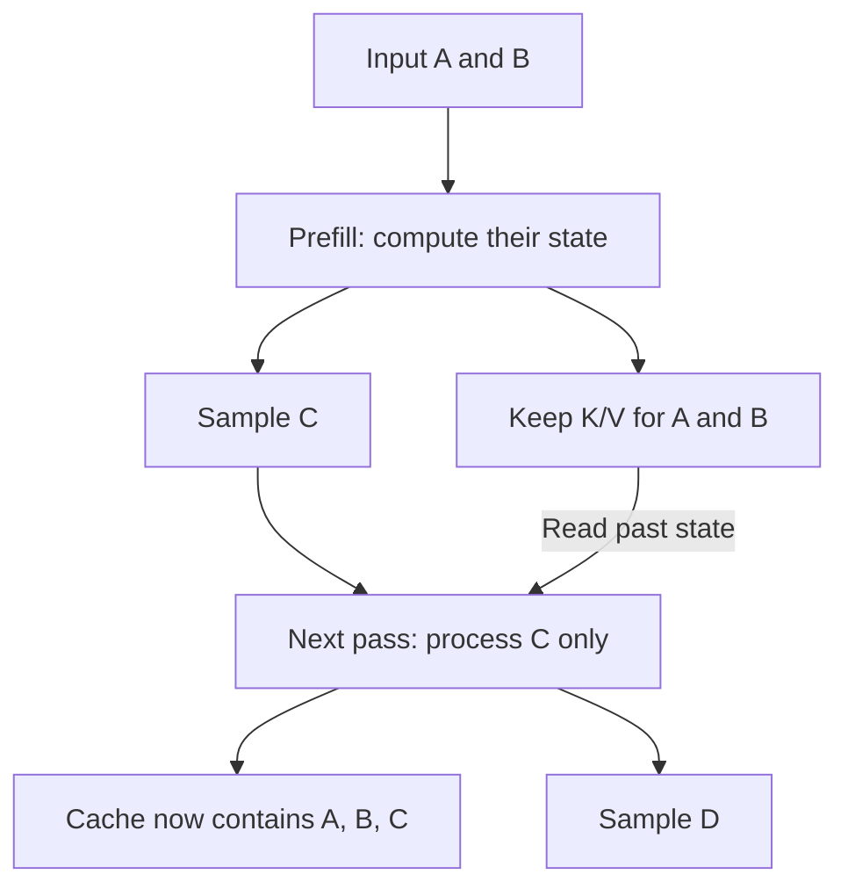

# KV cache — reuse the past, budget its memory

**Prerequisites:** [Context engineering](../../core/05-context-engineering.md). **Return to:** [Inference performance](../inference-performance.md).

<div class="aieng-story" markdown>

*Fictional teaching scenario.*

At 09:00, the support assistant opens a 4,000-token ticket history. It writes one token of its reply, then processes the whole history again to write the next. The engineer watching the trace asks: “The customer hasn't changed those earlier messages. Why are we doing their work again?”

She keeps the earlier attention state and processes only the new position. Generation improves—but at lunch, eight long conversations exhaust memory. The saved work has become stored state. Your job is to account for both.

</div>

<div class="aieng-intuition" markdown>
<p class="label">Intuition before mechanics</p>

**Picture to keep:** keep the prepared notes on the desk; each new question still has to consult them.

**Where the picture stops:** the cache contains per-layer numeric tensors, not a readable summary. Keeping notes avoids preparing them again; it does not eliminate reading them.

</div>

## Watch the decision

**Predict before tracing:** after the model samples token C, is C already in the KV cache, or must it be processed on the next pass?



Read the two arrows into the next pass together: **new-token computation + old-state reads**. C enters the cache when processed, not when sampled.

## What attention needs

At each attention layer, learned projections produce a query (Q), key (K), and value (V) for each token representation. A query is compared with available keys; normalized scores weight the values. Q, K, and V are numeric vectors, not text searches or database records.

For causal attention, a token cannot attend to future tokens. Appending a new token therefore does not change the earlier positions' representations. Their layer-specific keys and values can be retained and reused. The new position supplies a new query, key, and value. Its attention reads the applicable cached keys and values; the new K/V entries extend the cache.

**Why not cache old queries for generation?** They answered earlier positions' questions. The next position needs its own query against existing keys. Keeping old queries does not avoid that operation.

## Trace a tiny generation

Treat A, B, C, D as token IDs, not words:

| Forward pass | Tokens processed | Cache afterward | Output sampled |
|---|---|---|---|
| Prefill | A, B | K/V for A, B at each layer | C |
| Decode | C, using past state | K/V for A, B, C | D |
| Decode | D, using past state | K/V for A, B, C, D | Next token |

Notice that a token is sampled **before** its own K/V is added on the following forward pass. Prefill processes known input positions together under a causal mask; generation still depends on previously selected output tokens.

Caching removes repeated prefix computation. The current attention operation still reads historical state, so longer context can increase decode cost. “One new token processed” does not mean “constant total work regardless of context.”

## Turn memory into an admission decision

For uniform full-attention decoder layers, with no prefix sharing:

```text
bytes_per_token = 2 × layers × KV_heads × head_dimension × element_bytes
KV_bytes = bytes_per_token × sum(processed_tokens_in_each_active_sequence)
```

For 32 layers, 8 KV heads, head dimension 128, and two-byte elements, each processed token needs 131,072 bytes of KV state. A sequence of 8,192 processed tokens needs 1 GiB. Eight such sequences need 8 GiB, before weights and runtime allocations.

Reserve future output growth when admitting work. A request can fit now and fail later as decoding extends it. Physical allocation can also exceed logical tensor size.

### Two axes the base formula hides

**Cache dtype is its own decision.** `element_bytes` is set by the KV representation, not by the weight file. A four-bit weight checkpoint served with a 16-bit cache still spends two bytes per element. Taking the example above from two-byte to one-byte cache elements halves 1 GiB to 512 MiB per 8,192-token sequence — but KV quantization needs explicit runtime support and its own quality evaluation, exactly like weight quantization. Record both precisions separately in the [Module 17 capacity checkpoint](../../core/17-small-models.md#estimate-kv-separately-from-weights).

**Sliding-window layers stop growing.** A full-attention layer caches every processed token, so its state grows with the conversation. A layer attending to a fixed window of `W` positions caches at most `W`, so replace the sequence length with `min(processed_tokens, W)` for those layers. Hybrid models interleave the two and must be summed per layer type:

```text
KV_bytes ≈ per_layer_token_bytes × (
    full_layers   × processed_tokens
  + window_layers × min(processed_tokens, W)
)
```

With 32 layers at 8 KV heads, head dimension 128, two-byte elements, and 8,192 processed tokens, `per_layer_token_bytes` is 4,096. All-full-attention gives 1 GiB, as above. If half those layers instead use a 4,096-token window, the window layers cap at 4,096 positions: `4096 × (16 × 8192 + 16 × 4096)` = 768 MiB, a quarter less.

What stops growing is the windowed layers' own storage, not the saving. The gap against full attention keeps widening: 256 MiB saved at 8,192 tokens, 768 MiB at 16,384. That is why windowed and hybrid models change the shape of a capacity plan, not just its starting point. Latent-attention architectures compress K/V differently again; read the model's own documentation rather than reusing this formula.

Check which case you are in before budgeting: a config naming a `sliding_window` value, or interleaving layer types, does not obey the uniform formula.

## Cache lifetime is not conversation memory

Application history is text or structured records that can be packed into a future request. KV state is tied to the exact model execution and prefix. Restarting a process or switching model weights does not magically preserve it. Cross-request reuse requires explicit [prefix caching](../inference-performance.md#3-three-caches-with-different-contracts), compatibility checks, and appropriate isolation.

Evicting old KV positions is also different from summarizing conversation text. Arbitrarily removing full-attention history can change the answer; use only supported strategies and reevaluate quality.

## Run the switch

After [installing the lab environment](hands-on.md#1-install-the-optional-local-environment), run the same model with caching off and on:

```bash
python -m src.inference_bench --experiment cache \
  --prompt-repeats 16 --new-tokens 64 --repeats 5 \
  --output results/inference/cache.json
```

The runner changes `model.generate(use_cache=False)` to `use_cache=True`, warms both paths, and alternates measured runs. Predict the outcome, then compare actual output length, generation time, the reported prefill/decode split, and greedy token parity. [Read the report](hands-on.md#5-read-the-report-before-celebrating); CPU memory is unmeasured, not zero.

## Exercise and checkpoint

Run the [memory calculation](../inference-performance.md#2-kv-cache-saved-computation-occupies-memory). Then answer: if a 16 GiB device already needs 10 GiB for everything except KV, can it host eight of these 8,192-token sequences?

<details markdown>
<summary>Reveal</summary>

No: the logical KV estimate alone adds 8 GiB, exceeding the device. Even six sequences leave no allowance for additional overhead or growth. Reduce active context/concurrency, select a different supported model/cache representation, or add capacity, then measure peak usage.

</details>

**Second exercise — make that device fit.** Two changes are proposed for the same eight sequences: serve the same model with a one-byte KV cache, or switch to a comparable model whose alternating layers use a 4,096-token sliding window. Which fits the 6 GiB of free space, and what must you check before believing either?

<details markdown>
<summary>Reveal</summary>

Both fit on paper. One-byte cache elements halve 8 GiB to 4 GiB. The hybrid-window model gives `4096 × (16 × 8192 + 16 × 4096)` = 768 MiB per sequence, so 6 GiB for eight — inside 6 GiB with nothing to spare, which is not a margin worth admitting traffic against.

Neither is free. KV quantization requires runtime support and a quality evaluation at your context lengths. The windowed model is a different trained architecture, so its answers must be re-evaluated on your ticket set rather than assumed equivalent. And both remain estimates: measure peak memory before raising concurrency.

</details>

You understand the technique when you can explain both the computation saved and the state that continues growing.

<div class="aieng-case-checkpoint" markdown>
<p class="label">Return to the incident</p>

The engineer stopped recomputing the prefix, but did not make eight histories free. The memory exercise explains the lunchtime failure: eight 1 GiB caches cannot fit beside 10 GiB of other allocations on a 16 GiB device. This arithmetic is a capacity estimate, not a measured speedup.

**Next decision:** how much memory is real state, and how much is reserved but unused? Follow [PagedAttention](paged-attention.md).

</div>

**Optional primary reference:** [Hugging Face cache documentation](https://huggingface.co/docs/transformers/main/en/cache_explanation). This lesson is self-contained; the [source trail](../inference-performance.md#source-trail-and-scope) records its motivation.
