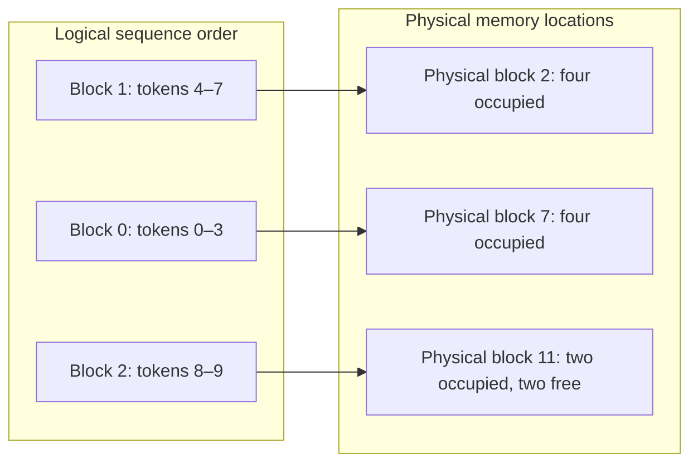

# PagedAttention — grow the allocation with the sequence

**Prerequisite:** [KV cache](kv-cache.md). **Return to:** [Module 28](../28-inference-serving.md).

<div class="aieng-story" markdown>

*Fictional teaching scenario.*

At 10:00, the support server refuses another ticket even though many replies are short. The engineer draws its allocations: every conversation reserves space for its maximum possible length. Much of that space is empty, but unavailable to anyone else.

She changes the question from “Where can the whole conversation fit?” to “Where can its next block fit?” A small table keeps the sequence in order while its blocks occupy scattered free locations. Now she must check what was saved—and what is still wasted.

</div>

<div class="aieng-intuition" markdown>
<p class="label">Intuition before mechanics</p>

**Picture to keep:** a growing notebook whose numbered pages can live in different drawers. The index tells you where to find each page.

**Where the picture stops:** drawers represent device-memory blocks, not cheap disk storage. The notebook's actual content still occupies space.

</div>

## Watch the decision

**Predict:** ten token positions fit in three four-position blocks. Does the eleventh position require another block?



Follow the arrows, not the vertical ordering of physical blocks. The eleventh and twelfth positions use the final block's free capacity; the thirteenth needs a new block.

## Separate logical order from physical location

A sequence has an ordered history: token 0, token 1, and so on. Its stored K/V blocks do not have to occupy one contiguous physical region. A block table maps each logical block number to its current physical location. The attention implementation follows that mapping to read the correct state.

Suppose a block holds four token positions and a request has ten processed tokens:

```text
Logical block     Positions        Physical block
0                 0–3              7
1                 4–7              2
2                 8–9              11  (two unused positions)
```

When positions 10 and 11 arrive, the request fills its final block. Position 12 requires another block. On completion, blocks that are no longer referenced become reusable.

**Sticky picture:** the sequence's table supplies the order; adjacent tokens do not require adjacent physical allocations.

## Work the capacity arithmetic

Consider three requests with current lengths 5, 9, and 14, each allowed up to 16 positions. Ignore weights and use four-position blocks.

| Allocation policy | Positions reserved |
|---|---:|
| Reserve each maximum | `3 × 16 = 48` |
| Allocate current block needs | `ceil(5/4)×4 + ceil(9/4)×4 + ceil(14/4)×4 = 36` |
| Actual occupied positions | `5 + 9 + 14 = 28` |

Block allocation saves 12 reserved positions here, but still leaves eight unused positions in final blocks. Smaller blocks reduce this tail waste while increasing bookkeeping and potentially changing kernel efficiency. This arithmetic is an allocation example, not a claim that a real GPU will run 48/36 times faster.

## Sharing needs ownership rules

Compatible requests or branches can reference shared prefix blocks. If a shared block must be modified, the runtime needs a safe ownership mechanism such as copy-on-write: create a private copy before changing it. Otherwise one sequence's continuation could corrupt another's state.

Sharing is a runtime facility, not something an application should implement by reusing a pointer to arbitrary cached data. Compatibility and tenant isolation still apply.

## What this does not solve

- Unique processed tokens still need their K/V representation; paging is not quantization or compression.
- Finite device memory still limits active work. Excess admission can cause waiting, preemption, recomputation, or failure depending on the runtime.
- Paging does not itself choose the next requests to run; that is [scheduling](continuous-batching.md).
- The virtual-memory analogy does not make disk-backed generation cheap.

Paged allocation and [FlashAttention](flash-attention.md) solve different problems and can be combined by a compatible runtime. One manages persistent state placement; the other reduces traffic for attention intermediates.

## Use a runtime that owns the blocks

The [GPU serving lab](hands-on.md#7-continuous-batching-and-paged-memory-serve-under-load) starts vLLM with explicit context, sequence, and memory limits. Its engine owns the block tables and allocation; the client does not reconstruct them in Python.

The companion [prefix-reuse experiment](hands-on.md#6-prefix-reuse-fresh-process-stable-prefix) makes compatible sharing observable:

```bash
python examples/inference/vllm_prefix.py --cache off \
  --revision "$INFERENCE_MODEL_REVISION" --output results/inference/prefix-off.json
python examples/inference/vllm_prefix.py --cache on \
  --revision "$INFERENCE_MODEL_REVISION" --output results/inference/prefix-on.json
```

Complete the linked setup and set the model revision first. Compare matching requests; inspect cache-hit and preemption metrics. This isolates prefix reuse within a paged runtime, not paged allocation versus a contiguous allocator.

## Exercise and checkpoint

The 9-position request grows to 13. How many extra four-position blocks are needed? What happens when the 5-position request finishes?

<details markdown>
<summary>Reveal</summary>

The growing request moves from three blocks to four, so it needs one additional block. The completed request releases two blocks if no other request references them. Actual occupied data and allocated capacity are distinct quantities.

</details>

For a serving experiment, record active token counts, cache utilization, preemption, and p95 latency. Lower allocation waste matters only if the service still meets its quality and latency targets.

<div class="aieng-case-checkpoint" markdown>
<p class="label">Return to the incident</p>

The allocation sketch falls from 48 reserved positions to 36 while holding the same 28 occupied positions. The engineer has reclaimed reservation waste, not compressed the conversation. Eight positions remain unused inside final blocks.

**Next decision:** fitting the state does not tell you how efficiently attention reads and writes its intermediates. Continue to [FlashAttention](flash-attention.md).

</div>

**Optional primary reference:** [PagedAttention paper](https://arxiv.org/abs/2309.06180). See the [source trail](../28-inference-serving.md#source-trail-and-scope) for attribution.
