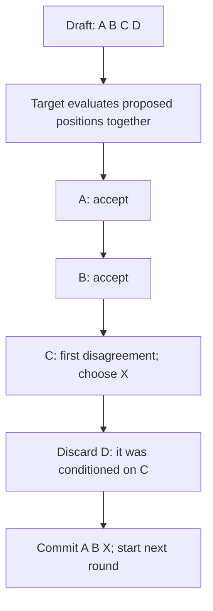

# Speculative decoding — make proposals cheap

**Prerequisite:** [KV cache and decode](kv-cache.md). **Return to:** [Inference performance](../inference-performance.md).

<div class="aieng-story" markdown>

*Fictional teaching scenario.*

A support reply begins quickly, then crawls across the screen. The engineer has already shortened the prompt; that changed the first-token wait, not the long tail. Each ordinary decode step still waits for the previous token.

She introduces a cheap proposer to draft several tokens while the target checks their positions together. A draft disagreement creates the crucial decision: where must the system stop accepting proposals, and what happens to tokens that depended on the rejected one?

</div>

<div class="aieng-intuition" markdown>
<p class="label">Intuition before mechanics</p>

**Picture to keep:** a fast assistant pencils in a continuation; the target checks it before anything is committed.

**Where the picture stops:** this is verification of token-generation choices, not fact-checking. Sampled generation needs probability correction, not a human editor's subjective approval.

</div>

## Watch the decision

**Predict:** the draft is A B C D, but the target first disagrees at C. Can D survive because it “looks right”?



This is the **greedy** case. The acceptance chain is read in order even though target evaluation covers multiple positions together. The next section's sampling correction supplies the stronger distribution guarantee.

## Draft a block, verify its prefix

A cheap proposer suggests several next tokens. The target model evaluates their positions together using causal attention. Verification accepts a valid prefix and handles the first rejection; later proposals conditioned on that rejected token cannot simply be kept.

For a **greedy** illustration:

```text
Draft tokens:                 A B C D
Target greedy decisions:      A B X ...
Committed continuation:       A B X
```

The target agrees at the first two positions and chooses X at the third. D depended on C, so it is discarded. The next round starts after A B X. When a full proposal is accepted, implementations can also produce an additional target token from the verification pass.

Verification across positions is parallelizable because the proposed input tokens are already available. It is not free: drafting, verification, cache management, and scheduling all contribute to time and memory.

## Sampling requires correction, not just agreement

For sampled generation, matching a draft token to a separately sampled target token is not the exact speculative-sampling algorithm. If the proposer distribution is `q` and target distribution is `p` at a position, a proposed token x is accepted with probability `min(1, p(x)/q(x))`. On rejection, sampling uses a normalized positive residual `max(0, p − q)`, with subsequent proposals discarded. This correction recovers the target distribution under the algorithm's assumptions.

**Two-token example:** let `p(A)=0.6, p(B)=0.4` and `q(A)=0.8, q(B)=0.2`. Proposed A is accepted with probability 0.75, contributing probability 0.6. Proposed B is always accepted, contributing 0.2. The remaining 0.2 rejection probability is corrected to B, yielding the target probabilities 0.6 and 0.4.

Use the runtime's supported implementation, including its sampling transformations and compatibility requirements. Distribution preservation does not mean identical random draws or identical strings for a fixed seed across implementations.

## Compare time per committed token

Use measured round time, not acceptance rate alone:

```text
effective time per token = total drafting/verification time
                          / total committed output tokens
```

If ordinary decoding takes 20 ms/token and a hypothetical speculative round takes 45 ms while committing three tokens, that round averages 15 ms/token. If it commits only one, it averages 45 ms/token and loses. Aggregate across the actual workload rather than averaging ratios without weighting.

High acceptance can still lose if the proposer is expensive or both models compete for scarce memory. Short outputs may not amortize setup. Evaluate serial and loaded service behavior separately.

## Keep the guarantees separate

[Model routing](../../core/24-local-first-agents.md) chooses a model to answer a request. Speculation keeps target verification inside token generation. Neither establishes factual correctness, validates JSON, or authorizes a tool call. Preserve the course's external quality and safety checks.

## Run draft-assisted generation

In the [optional local environment](hands-on.md#1-install-the-optional-local-environment):

```bash
python -m src.inference_bench --experiment speculative \
  --model HuggingFaceTB/SmolLM2-360M \
  --assistant HuggingFaceTB/SmolLM2-135M \
  --new-tokens 64 --repeats 5 \
  --output results/inference/speculative.json
```

The runner supplies `assistant_model=draft` to the target's `generate` call and compares against `assistant_model=None`. The draft's work counts toward elapsed time. Both models remain resident in both timing variants, and output parity is reported separately from speed. [Interpret the trade-off](hands-on.md#4-speculative-decoding-count-verified-progress), including why CPU can lose.

## Exercise and checkpoint

For two hypothetical rounds costing 40 ms each, the first commits four tokens and the second commits one. What is aggregate time per committed token?

<details markdown>
<summary>Reveal</summary>

80/5 = 16 ms/token. The arithmetic mean of the two per-round ratios, `(10 + 40)/2 = 25`, gives equal weight to rounds with unequal output and answers a different question.

</details>

<div class="aieng-case-checkpoint" markdown>
<p class="label">Return to the incident</p>

The engineer measures committed tokens per unit time, including the draft's overhead. A 45 ms round that commits three tokens helps against a 20 ms/token baseline; the same round committing one token hurts. More proposals are useful only when their verified progress pays for their cost.

**Next decision:** multiple customers now compete for the same server. [Continuous batching](continuous-batching.md) explains who gets to run next.

</div>

**Optional primary reference:** [Speculative decoding paper](https://arxiv.org/abs/2211.17192). See the [source trail](../inference-performance.md#source-trail-and-scope).
