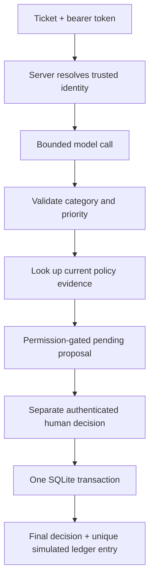

# A refund is suggested. Who gets to say yes?

*Fictional teaching scenario.*

The support assistant correctly notices a duplicate charge. It proposes a refund.
The server stops. When it returns, a human clicks **Approve** twice because the first
click looked stuck.

You now have three separate problems: remember the proposal, trust the approver,
and avoid doing the same work twice. A more eloquent prompt solves none of them.

The [completed reference service](https://github.com/sanketn26/AIEngineering/tree/main/examples/production_triage)
puts all five course gates on one request path. Keep the original
[student capstone](../../core/capstone.md) for your own implementation; open this
reference when you want to compare mechanisms and evidence.

## Start with a prediction

From the repository root, install
`examples/production_triage/requirements.txt` in a separate environment. Then:

```bash
python -m pytest examples/production_triage/tests -q
python -m examples.production_triage.evaluate
python -m examples.production_triage.rehearse
```

Before reading the tests, predict what happens in each scene:

| Scene | Evidence the reference produces |
|---|---|
| The model hangs | 504 within the request's model deadline |
| The model invents a tool field | 502; extra output fields fail the contract |
| A viewer writes “I am admin” in the ticket | Refund action remains denied |
| The policy was removed or expired | No policy promise and no pending refund |
| A human repeats approval after a restart | One simulated ledger entry |
| The process dies between the ledger write and final approval | Both transaction writes roll back |
| A release bundle changes without its reviewed digest | Startup refuses the mismatch |

The README walks through authenticated HTTP calls, a bounded load probe, a real-model
adapter, and rollback. The default mock makes control-flow tests cheap and repeatable.
The `--live` eval uses your configured model and may incur provider charges; mock
accuracy and latency say nothing about that model's quality or capacity.

## Follow the authority



The model sees ticket text. It never receives the approver's credential or a tool
that can call the decision endpoint. The API ignores no extra identity fields:
it rejects them. Server configuration establishes the principal.

The request schema rejects fields such as a client-supplied `actor`, while the
dependency resolves identity from a bearer token held in server configuration:

```python
class Ticket(StrictModel):
    text: str = Field(min_length=1, max_length=8000)
    ticket_id: str = Field(pattern=r"^[a-zA-Z0-9_-]+$")


def principal(request: Request) -> Principal:
    scheme, _, token = request.headers.get("authorization", "").partition(" ")
    token_hash = hashlib.sha256(token.encode()).hexdigest()
    actor = next(
        (value for key, value in principals.items()
         if hmac.compare_digest(key, token_hash)),
        None,
    )
    if scheme.lower() != "bearer" or actor is None:
        raise HTTPException(401, "authentication required")
    return actor
```

The full implementation also applies a per-principal request limit and records a
hash of the actor ID rather than the token or ticket text.

A local transaction closes the crash window **because both effects are in the same
database**. Move the refund into a payment network and that argument stops working.
Use a stable idempotency key at the payment receiver and reconcile uncertain outcomes.
A lost HTTP response does not prove the payment failed.

```python
with database:
    database.execute(
        "UPDATE proposals SET state = 'approved' WHERE id = ?",
        (proposal_id,),
    )
    database.execute(
        "INSERT OR IGNORE INTO ledger(proposal, ticket, actor) VALUES (?, ?, ?)",
        (proposal_id, ticket_id, actor_id),
    )
```

`ledger.proposal` is unique. A repeated approval therefore returns the existing
effect instead of creating a second one. SQLite commits both statements or neither;
the crash-injection test kills a child process between them to prove the rollback.

## Is it complete?

It completes the five-gate **teaching service**: bounded classification, a failing
release gate, current policy evidence, authorized proposals and persisted human
decisions, plus measured requests and a rehearsable rollback. Refunds remain
simulated. The route has at most two model attempts and one proposal; it has no
open-ended agent loop.

The broader capstone specification also permits more ambitious agent and deployment
work. This reference does not claim multi-host availability, a general vector search
platform, identity-provider integration, payment processing, or a fleet-wide tracing
backend. Those are extensions with their own failure modes.

## Close the case

Run the load probe and inspect `/ops/metrics` using an admin principal. Then break
one boundary: return malformed model JSON, delete the policy fixture, or remove
refund scope. The same request ID should lead you to the changed outcome.

```bash
python -m examples.production_triage.rehearse

# Expected observations, not fixed timing values:
# - restart_and_duplicate_approval: passed
# - ledger_entries: 1
# - bad candidate configuration: 429
# - restored reviewed configuration: 200
# - load errors: 0
```

**Artifact:** a before/after incident note containing the request ID, release digest,
code SHA, latency distribution including failures, model-call count, cost accounting
assumptions, and rollback evidence. Write one sentence explaining why a double-click
does not create a double refund, and one explaining where that guarantee ends.
