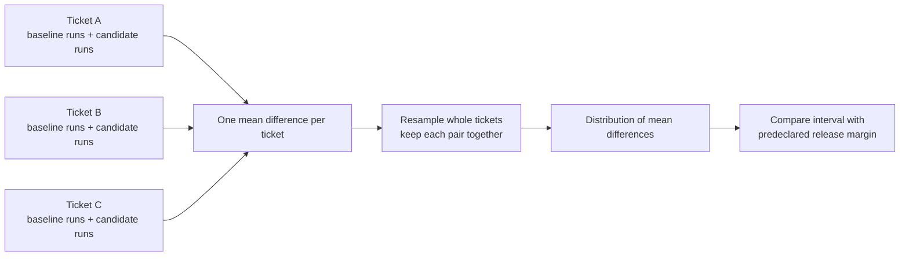

# The score went up. Did the system improve?

*Fictional teaching scenario.*

Mira changes three words in a support prompt. Yesterday's version gets 16 of 20
tickets right. Today's gets 17. She reaches for the release button. Her teammate
asks for one more run. This time the new prompt gets 15.

Which run should they believe?

Both runs happened. The missing piece is how much the score moves when the model
runs again, and how much it moves when the tickets change. Those are different
questions. This lab makes you keep them separate.

**Use after:** [Module 04](../core/04-testing-evals.md). Allow 45–60 minutes.

## Predict before running

Three experiments are waiting in `examples/evaluation/compare.py`:

| Experiment | Tempting conclusion | Your prediction |
|---|---|---|
| One extra win on 20 tickets | “Five points better. Ship it.” | Will the interval clear the release rule? |
| Two tickets, 100 runs each | “We evaluated 200 examples.” | How many independent cases do we actually have? |
| A large drop across 40 tickets | “Perhaps just randomness.” | Can uncertainty explain this one away? |

Write your predictions, then run from the repository root:

```bash
python -m examples.evaluation.compare
```

These are **constructed fixtures**, not recorded model results. You should see
`inconclusive`, `inconclusive`, and `regression`. Now explain each verdict without
using the phrase “the test says so.”

## Two kinds of movement

Picture a tray of twenty envelopes. Each envelope contains one ticket and four
runs from each prompt. You can shake an envelope to study run-to-run variation.
You can also draw a different tray of envelopes to study which tickets showed up.

Our **paired case bootstrap** draws envelopes with replacement. Whenever a ticket
is drawn, all its repeated runs travel with it. The baseline and candidate for
that ticket stay paired. A hard ticket stays hard for both versions.



1. Average each version's repeated scores for each case.
2. Subtract baseline from candidate within each case.
3. Draw the same number of cases, with replacement, 4,000 times.
4. Compute the mean difference for each draw.
5. Read the 2.5th and 97.5th percentiles as an approximate 95% interval.

A positive difference favors the candidate. This interval estimates uncertainty
from the observed cases. It cannot discover a language, customer type, or attack
that never appeared in the tray. More repeats reduce model noise; more independent
cases improve coverage and case-sampling precision. You often need both.

Tickets from the same conversation are not independent envelopes. Group related
examples by customer, document, or session before sampling, and report the weighting
choice. This helper assumes independent outer rows; it does not infer those groups.

## Set the rule before you look

Suppose the product accepts at most a **two-percentage-point** quality loss in return
for an independently verified latency improvement. Set `margin=0.02` before running.
This is an absolute score difference, not “two percent of the old score.”

| Interval relative to −0.02 | Verdict | Meaning |
|---|---|---|
| Entire interval at or above it | `pass` | Clears this approximate non-inferiority rule |
| Entire interval below it | `regression` | Evidence of a loss larger than the allowance |
| Crosses it | `inconclusive` | This sample does not resolve the release decision |

**Passing does not mean “better.”** An interval spanning zero can pass a
non-inferiority rule. To claim improvement, require its lower bound to exceed zero.
To claim a useful improvement, require it to exceed your practical improvement
threshold as well. Latency, spend, and critical safety cases still have separate gates.

The helper conservatively returns `inconclusive` for fewer than 20 cases, fewer than
two runs per case, or identical observed differences everywhere. Those are teaching
safeguards, **not a sample-size calculation**. A bootstrap cannot estimate unseen
variation when every observed difference is identical. Plan sample size from the
smallest difference you care about and representative pilot data.

## Connect real runs

```python
from src.evals import paired_release_gate

# One outer row per independently sampled held-out case; inner scores are runs.
# Fill these from stored, versioned model outputs, not from these tiny examples.
baseline = [[1, 1, 0], [0, 1, 0]]
candidate = [[1, 1, 1], [1, 0, 0]]
report = paired_release_gate(baseline, candidate, margin=0.02, seed=7)
assert report["verdict"] == "inconclusive"  # two cases do not become six cases
```

Retain case IDs, prompt/model/config digests, raw redacted outputs, run numbers,
metric versions, latency, and usage. Align A and B by case ID before building the
arrays. Do not drop failed calls: score them as failures under a declared policy
and report their latency and cost too. A list position is not an identity system.

The seeded bootstrap makes **resampling** reproducible. It does not make an LLM
reproducible. Keep the repeats; report their spread. For a wider uncertainty model,
add within-case resampling or a hierarchical model and justify its assumptions.

## The envelope you must not open yet

Use a development set to change prompts, a regression set to catch known failures,
and a sealed release set to make the release decision. Split by the entity that
could leak information: customer, document, company, or time, not merely row number.

Repeatedly peeking at the release set turns it into another development set. After
a decision, rotate it or add new sealed cases. Re-running until the interval passes
is also a form of tuning. Predeclare the run count and decision rule; if the result
is inconclusive, gather fresh evidence under a new declared plan.

A 95% interval is a procedure with approximate repeated-sampling coverage under its
assumptions. It is not “a 95% probability this release is safe.”

## Close the case

Mira does not choose the prettier run. She keeps paired results, collects diverse
independent tickets, and checks the rule she chose before seeing the score. If the
interval still crosses the release threshold, that uncertainty is the result.

**Artifact:** commit the comparison report and a short release note naming the
margin, slices, independent case count, repeats, failed calls, cost/latency gates,
and decision. Prove that a deliberately worse candidate blocks the release.

**Check:** `pytest tests/test_evals.py -q`.

For the underlying resampling options, compare the [SciPy bootstrap reference](https://docs.scipy.org/doc/scipy/reference/generated/scipy.stats.bootstrap.html), particularly paired resampling and degenerate distributions. Our small helper uses a percentile interval; SciPy also supports other interval methods.
