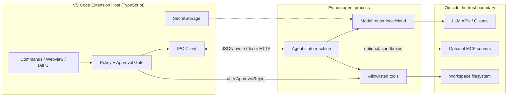
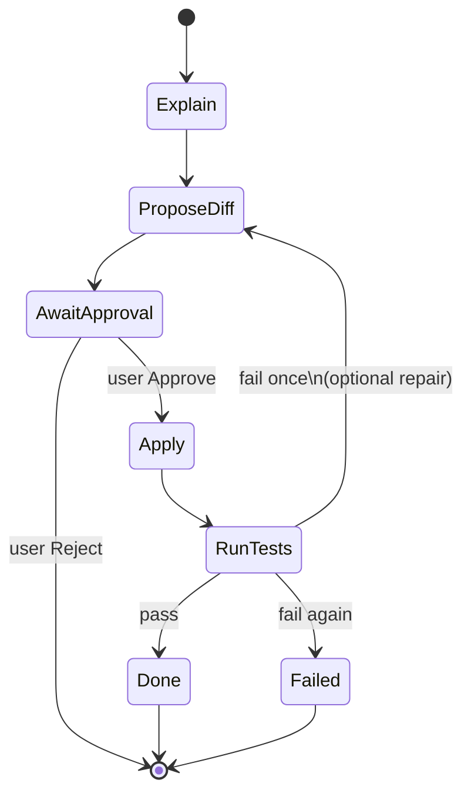

# Track: Agentic VS Code Plugin (90 days)

**Who this is for:** CS engineers who ship TypeScript and Python and want a real agentic coding assistant—not a chat wrapper glued to `fetch`.

**Goal:** Build a VS Code extension that is the **UI and policy surface**, plus a Python agent backend that is a **bounded state machine**. The model *proposes*; your runtime *disposes* (allow, deny, ask the human). By day 90: beta-ready extension, read tools, approval-gated writes, optional local SLM routing, tests, and hard security defaults.

**Platform:** macOS/Linux preferred; Windows via [WSL2](https://learn.microsoft.com/en-us/windows/wsl/install). Node 20+, Python 3.11+, VS Code, Git.

**Updated for 2026:** Tool-calling agents, optional **MCP**, LangGraph-style (or thin custom) workflow graphs, SLMs via Ollama with cloud escalate. Study open agent extensions for UX patterns—**read licenses before copying**.

**Core modules (read alongside):**

| When | Modules |
|------|---------|
| Days 1–28 | [01 Prompting](../core/01-prompt-engineering.md), [02 Security](../core/02-security-privacy.md), [03 Advanced prompts](../core/03-advanced-prompting.md), [04 Evals](../core/04-testing-evals.md), [05 Context](../core/05-context-engineering.md), [07 Tools](../core/07-tools-and-rag.md), [11 Single agents](../core/11-single-agents.md) |
| Days 29–56 | [08 MCP](../core/08-model-context-protocol.md), [12 Multi-agents](../core/12-multi-agents.md) (orchestration patterns) |
| Days 57–90 | [17 Small models](../core/17-small-models.md); revisit [02](../core/02-security-privacy.md), [04](../core/04-testing-evals.md) |

In-repo teaching mirror: `src.agents` (`Agent`, `AgentState`) and `tests/test_agents.py`.

---

## Incident: the agent that “fixed” the repo without you

11:40 p.m. Demo command: **“AI: Improve this module.”** The model renames three public APIs and—because `write_file` was treated like `read_file`—applies the patch immediately. Tests go red. Git is a crime scene.

Postmortem:

1. **No policy boundary.** The extension hosted the model’s ambition with no approval gate. “Agentic” was confused with “autonomous write access.”
2. **No hard stops.** No `max_steps`, no tool allowlist, no repeated-call abort.
3. **Fuzzy secrets and trust.** API key in `settings.json`; an MCP server ran at the same trust level as a linter.

This track exists so you never ship that product. **Never auto-apply diffs without the user.** MCP servers are **untrusted binaries**. Secrets live **only** in `SecretStorage`.

---

## Intuition lock (memorize this)

| Layer | Job | Must not |
|-------|-----|----------|
| **Extension (TS)** | UI, selection context, settings, **policy**, approval dialogs, SecretStorage | Silently execute writes the model invented |
| **Agent (Python)** | State machine: decide → tool/final → observe; enforce `max_steps` + allowlists | Treat free-form model text as an executable plan without schema |
| **Model** | Propose next JSON decision or natural-language explain | Own the filesystem |
| **Runtime / tools** | Dispose: run allowlisted tools, refuse the rest | Expand privileges because the prompt “said so” |

**Model proposes. Runtime disposes.** If you keep one sentence from day 1, keep that.

---

## Architecture: Extension Host ↔ Python agent ↔ LLM/tools



The extension decides *whether* a write may run; the agent may only *request* it. LLM providers see prompts you send—minimize secrets/PII ([02](../core/02-security-privacy.md)). MCP is late and optional ([08](../core/08-model-context-protocol.md)).

---

## Phase map

| Days | Theme | You can demo |
|------|-------|----------------|
| 1–14 | Foundations | “Hello Agent” reaches Python |
| 15–28 | Read-only agent | CLI lists/reads/searches with `max_steps` |
| 29–42 | In-editor LLM | Select → Explain (SecretStorage) |
| 43–56 | Workflow graph | explain → diff → **approve** → apply → test |
| 57–70 | Local SLM + escalate | Ollama default; cloud on hard cases |
| 71–80 | UX, tests, telemetry | Prompt picker, tests, **opt-in** telemetry |
| 81–90 | MCP optional + beta | Hardened README, beta tag |

Each phase: **Guide** · **Explainer** · **Code** · **Hints** · **Exit**.

---

## Days 1–14 — Foundations: extension hello + Python stub IPC

### Guide

Scaffold a VS Code extension ([API docs](https://code.visualstudio.com/api)): `package.json` contributes a command; `extension.ts` activates and registers it. Create `core_agent/` as a **stdio** JSON-line server (or tiny HTTP `POST /v1/agent`). Version the message schema (`v: 1`). Read [01](../core/01-prompt-engineering.md) and [02](../core/02-security-privacy.md).

### Explainer

IPC is the product boundary, not late plumbing. A small JSON envelope (`id`, `method`, `params`, `error`) keeps the extension thin and the agent CLI-testable.

### Code

**`package.json` contributes:**

```json
{
  "name": "aiengineering-agent",
  "displayName": "AIEngineering Agent",
  "engines": { "vscode": "^1.85.0" },
  "activationEvents": ["onCommand:aieng.helloAgent"],
  "main": "./out/extension.js",
  "contributes": {
    "commands": [
      { "command": "aieng.helloAgent", "title": "AIEngineering: Hello Agent" }
    ],
    "configuration": {
      "title": "AIEngineering Agent",
      "properties": {
        "aieng.agent.transport": {
          "type": "string", "enum": ["stdio", "http"], "default": "stdio"
        },
        "aieng.agent.httpUrl": {
          "type": "string", "default": "http://127.0.0.1:8765"
        }
      }
    }
  }
}
```

**`extension.ts`:**

```typescript
import * as vscode from "vscode";
import { AgentClient } from "./agentClient";

export function activate(context: vscode.ExtensionContext) {
  const client = new AgentClient(context);
  context.subscriptions.push(
    vscode.commands.registerCommand("aieng.helloAgent", async () => {
      const res = await client.request("ping", { msg: "hello" });
      vscode.window.showInformationMessage(`Agent: ${JSON.stringify(res)}`);
    })
  );
}
export function deactivate() {}
```

**IPC schema (one JSON object per stdio line):**

```json
{"v":1,"id":"c1","method":"ping","params":{"msg":"hello"}}
{"v":1,"id":"c1","result":{"ok":true,"echo":"hello"}}
{"v":1,"id":"c1","error":{"code":"bad_request","message":"..."}}
```

**Python stub:**

```python
# core_agent/server_stdio.py
import json, sys

def handle(msg: dict) -> dict:
    mid = msg.get("id")
    if msg.get("method") == "ping":
        return {"v": 1, "id": mid, "result": {"ok": True, "echo": msg.get("params", {}).get("msg")}}
    return {"v": 1, "id": mid, "error": {"code": "unknown_method", "message": str(msg.get("method"))}}

def main() -> None:
    for line in sys.stdin:
        line = line.strip()
        if not line:
            continue
        try:
            out = handle(json.loads(line))
        except Exception as e:
            out = {"v": 1, "id": None, "error": {"code": "crash", "message": str(e)}}
        sys.stdout.write(json.dumps(out) + "\n")
        sys.stdout.flush()

if __name__ == "__main__":
    main()
```

### Hints

Spawn Python via the venv absolute path; pipe `stderr` to an OutputChannel. Timeout every request. No secrets on the hello path.

### Exit (day 14)

**Hello Agent** shows a response only Python could produce. Killing the process surfaces a clear UI error. Repo has `extension/` + `core_agent/` + short IPC notes.

---

## Days 15–28 — Read-only agent tools + `max_steps`

### Guide

Implement an agent loop in the spirit of course package `src.agents.Agent` (repo root): LLM returns **JSON** (`tool` | `final` | `ask_user`); tools are an allowlist dict; hard stop on `max_steps`, bad JSON, and repeated identical calls ([11](../core/11-single-agents.md)). Ship read-only tools first: `list_files`, `read_file`, `search_text`—path-rooted to workspace, output capped. Log every call ([04](../core/04-testing-evals.md), [07](../core/07-tools-and-rag.md)). Truncate scratchpad ([05](../core/05-context-engineering.md)); enforce schema in prompts ([01](../core/01-prompt-engineering.md), [03](../core/03-advanced-prompting.md)).

### Explainer

Without a step budget an agent is `while True` with an API bill. Allowlists turn tool-calling into a product. Read-only first validates observe → reason → final without destroying state.

### Code

**Allowlisted tools:**

```python
# core_agent/tools_readonly.py
from pathlib import Path
import re

MAX_READ = 32_000

def _safe(root: Path, rel: str) -> Path:
    p = (root / rel).resolve()
    if root.resolve() not in p.parents and p != root.resolve():
        raise ValueError("path escapes workspace")
    return p

def make_tools(workspace: str) -> dict:
    root = Path(workspace).resolve()

    def list_files(path: str = ".", glob: str = "*") -> str:
        base = _safe(root, path)
        return "\n".join(sorted(x.name for x in base.glob(glob))[:500]) or "(empty)"

    def read_file(path: str) -> str:
        return _safe(root, path).read_text(encoding="utf-8", errors="replace")[:MAX_READ]

    def search_text(pattern: str, path: str = ".", max_hits: int = 20) -> str:
        base, rx, hits = _safe(root, path), re.compile(pattern), []
        for f in base.rglob("*"):
            if not f.is_file() or f.stat().st_size > 1_000_000:
                continue
            try:
                text = f.read_text(encoding="utf-8", errors="replace")
            except OSError:
                continue
            for i, line in enumerate(text.splitlines(), 1):
                if rx.search(line):
                    hits.append(f"{f.relative_to(root)}:{i}:{line[:200]}")
                    if len(hits) >= max_hits:
                        return "\n".join(hits)
        return "\n".join(hits) or "(no hits)"

    return {"list_files": list_files, "read_file": read_file, "search_text": search_text}
```

**Agent loop (mirrors `src.agents`):**

```python
# core_agent/agent.py
from __future__ import annotations
import json
from dataclasses import dataclass, field
from typing import Any, Callable

ToolFn = Callable[..., str]
LLMFn = Callable[[str], str]

@dataclass
class AgentState:
    goal: str
    steps: list[dict[str, Any]] = field(default_factory=list)
    scratchpad: str = ""
    done: bool = False
    result: str | None = None
    abort_reason: str | None = None

class Agent:
    def __init__(self, llm: LLMFn, tools: dict[str, ToolFn], max_steps: int = 8):
        if max_steps < 1:
            raise ValueError("max_steps must be >= 1")
        self.llm, self.tools, self.max_steps = llm, tools, max_steps
        self._seen: set[str] = set()

    def run(self, goal: str) -> AgentState:
        state = AgentState(goal=goal)
        self._seen.clear()
        for _ in range(self.max_steps):
            try:
                decision = self._decide(state)
            except (json.JSONDecodeError, KeyError, TypeError, ValueError) as e:
                state.done, state.abort_reason = True, f"bad_decision: {e}"
                state.result = state.scratchpad or str(e)
                break
            state.steps.append(decision)
            t = decision.get("type")
            if t == "final":
                state.done, state.result = True, str(decision.get("content", ""))
                break
            if t == "ask_user":
                state.done, state.result = True, str(decision.get("content", "Need user input"))
                break
            if t == "tool":
                name, args = str(decision.get("name", "")), decision.get("args") or {}
                if not isinstance(args, dict):
                    obs = "error: args must be an object"
                else:
                    sig = f"{name}:{json.dumps(args, sort_keys=True)}"
                    if sig in self._seen:
                        state.done, state.abort_reason = True, "repeated_tool_call"
                        state.result = "Aborted: repeated tool call"
                        break
                    self._seen.add(sig)
                    obs = self._run_tool(name, args)
                state.scratchpad += f"\nTool {name} -> {obs[:2000]}"
            else:
                state.done, state.abort_reason = True, f"unknown_type:{t}"
                break
        if not state.done:
            state.done, state.abort_reason = True, "max_steps"
            state.result = state.scratchpad or "Stopped: max steps"
        return state

    def _run_tool(self, name: str, args: dict[str, Any]) -> str:
        if name not in self.tools:
            return f"error: unknown tool {name}"
        try:
            return str(self.tools[name](**args))
        except Exception as e:
            return f"error: {e}"

    def _decide(self, state: AgentState) -> dict[str, Any]:
        tools = ", ".join(sorted(self.tools))
        prompt = (
            f"You are a read-only coding agent. Goal: {state.goal}\nTools: {tools}\n"
            f"Scratchpad: {state.scratchpad[-4000:]}\n"
            "Return ONLY JSON type final|tool|ask_user.\n"
            'tool: {"type":"tool","name":"...","args":{...}}\n'
            'final: {"type":"final","content":"..."}\n'
        )
        data = json.loads(self.llm(prompt))
        if not isinstance(data, dict) or "type" not in data:
            raise ValueError("decision must be object with type")
        return data
```

IPC `method: "run"` with `{goal, workspace, max_steps}`. CLI: `python -m core_agent "summarize src/"`.

### Hints

Fake LLM in unit tests (see `tests/test_agents.py`). Reject `..` escapes. Strip markdown fences around JSON once, then fail hard.

### Exit (day 28)

CLI agent summarizes a sample folder via allowlisted tools only. Steps ≤ `max_steps`. Unknown tools error safely. No write tools in the registry.

---

## Days 29–42 — In-editor LLM explain (SecretStorage, provider abstract)

### Guide

Command **Explain Selection** (CodeLens later optional). Provider abstraction: OpenAI-compatible, Anthropic, Ollama ([17](../core/17-small-models.md)). Keys via `context.secrets` only—never plain settings ([02](../core/02-security-privacy.md)). Pass language, relative path, capped selection ([05](../core/05-context-engineering.md)). Template explain vs summarize ([01](../core/01-prompt-engineering.md)).

### Explainer

Users experience “the AI” as the extension; you need swappable backends. SecretStorage is what makes a work install defensible.

### Code

```typescript
const SECRET_KEY = "aieng.apiKey";

async function ensureApiKey(context: vscode.ExtensionContext): Promise<string | undefined> {
  let key = await context.secrets.get(SECRET_KEY);
  if (!key) {
    key = await vscode.window.showInputBox({
      prompt: "API key (SecretStorage only)", password: true, ignoreFocusOut: true,
    });
    if (key) await context.secrets.store(SECRET_KEY, key);
  }
  return key;
}

// registerCommand("aieng.explainSelection"):
//  selection → ensureApiKey → client.request("explain", { code, language, path })
//  open markdown preview beside; never log the key
```

```python
# core_agent/providers.py
from typing import Protocol

class LLMProvider(Protocol):
    def complete(self, prompt: str) -> str: ...

class OpenAICompatible:
    def __init__(self, base_url: str, api_key: str, model: str):
        self.base_url, self.api_key, self.model = base_url, api_key, model
    def complete(self, prompt: str) -> str:
        ...  # POST {base_url}/chat/completions

class OllamaProvider:
    def __init__(self, base_url: str = "http://127.0.0.1:11434", model: str = "llama3.2"):
        self.base_url, self.model = base_url, model
    def complete(self, prompt: str) -> str:
        ...  # POST /api/chat
```

### Hints

Setting `aieng.provider` = `openai | anthropic | ollama`. Redact `Authorization` in logs. Cap selection size.

### Exit (day 42)

Select → Explain works in a side panel. Key survives reload without appearing in settings. Provider switch works without code edits. Ollama path works offline when configured.

---

## Days 43–56 — Workflow: explain → diff → approve → apply → test

### Guide

Workflow graph (LangGraph-style or enum). Write tools only behind an **extension-owned** approval gate ([11](../core/11-single-agents.md), [12](../core/12-multi-agents.md)). Show diff preview; **Apply** is a button. After apply, run configured tests; at most one repair loop unless the user re-invokes.



### Explainer

This phase prevents the incident. The model may invent a patch in `PROPOSE_DIFF`. The runtime may not invent disk writes. Approval is a user-mode transition: extension sends `workflow.apply` with `userApproved: true` only after a modal.

### Code

```typescript
async function proposeAndMaybeApply(client: AgentClient, goal: string) {
  const proposal = await client.request("workflow.propose", { goal });
  const doc = await vscode.workspace.openTextDocument({
    content: proposal.unifiedDiff, language: "diff",
  });
  await vscode.window.showTextDocument(doc, vscode.ViewColumn.Beside);
  const pick = await vscode.window.showWarningMessage(
    `Apply agent patch to ${proposal.files?.length ?? "?"} file(s)?`,
    { modal: true }, "Apply", "Reject"
  );
  if (pick !== "Apply") {
    await client.request("workflow.cancel", { patchId: proposal.patchId });
    return;
  }
  await client.request("workflow.apply", {
    patchId: proposal.patchId,
    userApproved: true, // backend MUST require this
  });
}
```

```python
WRITE_TOOLS = frozenset({"apply_patch", "write_file"})

def run_tool(name: str, args: dict, *, user_approved: bool) -> str:
    if name in WRITE_TOOLS and not user_approved:
        return "error: write tool requires user approval"
    ...

# Minimal graph
from enum import Enum
class Node(str, Enum):
    EXPLAIN = "explain"; PROPOSE = "propose_diff"; AWAIT = "await_approval"
    APPLY = "apply"; TEST = "run_tests"; DONE = "done"; FAILED = "failed"

def next_node(current: Node, event: str) -> Node:
    return {
        (Node.EXPLAIN, "ok"): Node.PROPOSE,
        (Node.PROPOSE, "ok"): Node.AWAIT,
        (Node.AWAIT, "approve"): Node.APPLY,
        (Node.AWAIT, "reject"): Node.DONE,
        (Node.APPLY, "ok"): Node.TEST,
        (Node.TEST, "pass"): Node.DONE,
        (Node.TEST, "fail"): Node.FAILED,
    }.get((current, event), Node.FAILED)
```

### Hints

Prefer extension `WorkspaceEdit` so undo works; Python authors the patch. Pending patches need TTL. Infinite auto-repair is a money-and-repo bug.

### Exit (day 56)

Toy project: explain → diff → reject leaves tree clean; approve → apply → tests run. **No** path where one LLM response invents and writes without a human click.

---

## Days 57–70 — Local SLM + escalate

### Guide

Default: **Ollama** for explain and light planning ([17](../core/17-small-models.md)). Router escalates when local is down, context is huge, or quality heuristic fails—and only if allowed. Cache repeated explains (hash path + content + model). Document RAM, models, offline behavior.

### Explainer

Local changes privacy and cost; escalate is a product feature if **visible** (status: “Using cloud”) and **consent-aware**.

### Code

```python
# core_agent/router.py
from dataclasses import dataclass

@dataclass
class RouteDecision:
    provider: str  # "ollama" | "cloud"
    model: str
    reason: str

class ModelRouter:
    def __init__(self, ollama, cloud=None, allow_escalate: bool = True):
        self.ollama, self.cloud, self.allow_escalate = ollama, cloud, allow_escalate

    def choose(self, *, prompt_chars: int, prefer_private: bool) -> RouteDecision:
        if prefer_private or not self.allow_escalate or self.cloud is None:
            return RouteDecision("ollama", getattr(self.ollama, "model", "local"), "privacy_or_policy")
        if prompt_chars > 24_000:
            return RouteDecision("cloud", getattr(self.cloud, "model", "cloud"), "long_context")
        if not self._healthy():
            return RouteDecision("cloud", getattr(self.cloud, "model", "cloud"), "local_down")
        return RouteDecision("ollama", getattr(self.ollama, "model", "local"), "default_local")

    def complete(self, prompt: str, **kw) -> tuple[str, RouteDecision]:
        d = self.choose(prompt_chars=len(prompt), prefer_private=kw.get("prefer_private", False))
        prov = self.ollama if d.provider == "ollama" else self.cloud
        return prov.complete(prompt), d

    def _healthy(self) -> bool:
        try:
            return True  # GET Ollama /api/tags, short timeout
        except Exception:
            return False
```

### Hints

Settings: local/cloud model ids, `aieng.escalate.auto` (choose enterprise-safe default). Prefer symbol-sized cloud context. Put p50 local latency in README.

### Exit (day 70)

Ollama up → offline explain. Ollama down + escalate + key → cloud with reason shown. Escalate off → clear failure, not a hang.

---

## Days 71–80 — UX, tests, opt-in telemetry

### Guide

QuickPick prompt templates under versioned `prompts/` ([01](../core/01-prompt-engineering.md), [03](../core/03-advanced-prompting.md)). Tests: sandbox, approval flag, max_steps; extension command registration ([04](../core/04-testing-evals.md)). Telemetry **opt-in only**, no code/secrets ([02](../core/02-security-privacy.md)). Polish settings: transport, models, max_steps, escalate, write workflows.

### Explainer

Fail-closed agents beat silent spinners. Default-on telemetry of source is a privacy incident.

### Code

```typescript
async function track(context: vscode.ExtensionContext, event: string, props: Record<string, string | number> = {}) {
  if (!vscode.workspace.getConfiguration("aieng").get<boolean>("telemetry.enabled")) return;
  console.log("[telemetry-opt-in]", event, props); // never code, never keys
}
```

```python
def test_write_blocked_without_approval():
    assert "approval" in run_tool("write_file", {"path": "a.py", "content": "x"}, user_approved=False)

def test_max_steps():
    def llm(_): return '{"type":"tool","name":"list_files","args":{"path":"."}}'
    st = Agent(llm, make_tools("."), max_steps=3).run("loop forever")
    assert st.abort_reason in {"max_steps", "repeated_tool_call"}
```

### Hints

Golden fake-LLM tool sequences. CI: `pytest` + `npm test`. Don’t rely on color alone for approve/reject.

### Exit (day 80)

Green agent tests; extension packages; prompt picker changes behavior; telemetry defaults **false** and never sends source.

---

## Days 81–90 — MCP optional, harden, beta publish

### Guide

Optional MCP client ([08](../core/08-model-context-protocol.md)): off by default. Treat servers as **untrusted binaries**—pin versions, confirm before enable, minimal env, no silent auto-start from random workspace config. Modular commands (refactor, docify, testgen) reuse the same graph + policy. Harden: rate limits, `workspace.isTrusted`, webview CSP. Ship `v0.x-beta` with architecture mermaid, security section, GIFs, issue templates.

### Explainer

MCP multiplies capability and blast radius. Default-deny + explicit enable is the product.

### Code

```typescript
async function enableMcpServer(id: string) {
  const ok = await vscode.window.showWarningMessage(
    `Enable MCP server "${id}"? Local process; treat as untrusted code.`,
    { modal: true }, "Enable", "Cancel"
  );
  if (ok !== "Enable") return;
  // start server; write tools still go through the same approval gate
}
```

**Beta README must state:** no auto-apply; SecretStorage only; MCP off by default / untrusted; telemetry opt-in; allowlisted tools; workspace path sandbox.

### Hints

Untrusted workspace → disable write workflows. Private VSIX before Marketplace. License-audit anything you copy.

### Exit (day 90)

Clean-machine install: explain + approved apply demo; offline local path documented; security section unmissable; feedback channel live. You can teach the architecture in five minutes from the intuition lock table.

---

## Milestones

| Day | Checkpoint |
|-----|------------|
| 14 | Hello extension + Python IPC |
| 28 | Read-only CLI agent + `max_steps` |
| 42 | Explain + SecretStorage + providers |
| 56 | Human approve before write |
| 70 | Ollama default + escalate docs |
| 80 | Tests + prompt UI + opt-in telemetry |
| 90 | Hardened beta; MCP optional/off |

---

## Non-negotiable security checklist

- [ ] **Never auto-apply diffs without the user**
- [ ] Write tools require `userApproved` (or extension-side apply only)
- [ ] Tools allowlisted; path sandbox; output caps
- [ ] `max_steps` + repeated tool-call abort
- [ ] API keys **only** in SecretStorage
- [ ] MCP servers = **untrusted binaries**; default off
- [ ] Telemetry **opt-in**; never source or secrets
- [ ] Logs redacted; workspace trust respected

---

## Study references (patterns, not endorsements)

- [VS Code Extension API](https://code.visualstudio.com/api)
- [Model Context Protocol](https://modelcontextprotocol.io/)
- LangGraph conceptual guides · open agentic editors (**licenses**)
- In-repo: `src/agents.py`, [11](../core/11-single-agents.md)–[12](../core/12-multi-agents.md), [08](../core/08-model-context-protocol.md), [17](../core/17-small-models.md)

---

## How to work the 90 days

Start each phase from its **Exit** and reverse-plan. Alternate TS and Python so IPC does not rot. When the model does something clever and dangerous, write a **regression test** that freezes the refusal. Re-read the incident story before enabling any write tool.

You are not shipping a magic intern. You are shipping a **policy-shaped interface** over a **bounded agent** over a **proposer model**. That is an honest beta.
