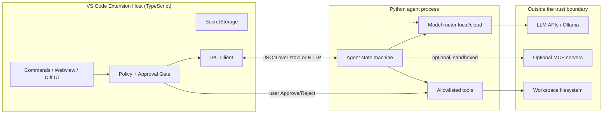
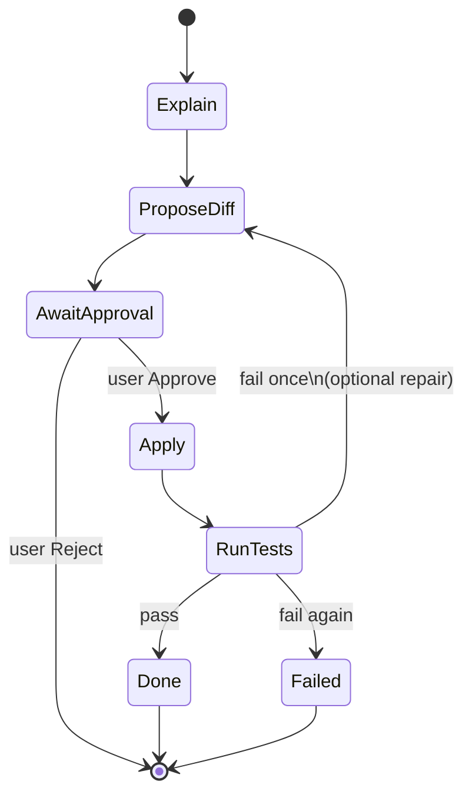

# Track: Agentic VS Code Plugin (90 days)

**Who this is for:** CS engineers who ship TypeScript and Python and want a real agentic coding assistant—not a chat wrapper glued to `fetch`.

**Goal:** Build a VS Code extension that is the **UI and policy surface**, plus a Python agent backend that is a **bounded state machine**. The model *proposes*; your runtime *disposes* (allow, deny, ask the human). By day 90: beta-ready extension, read tools, approval-gated writes, optional local SLM routing, tests, and hard security defaults.

**Platform:** macOS/Linux preferred; Windows via [WSL2](https://learn.microsoft.com/en-us/windows/wsl/install). Node 20+, Python 3.11+, VS Code, Git.

**Updated for 2026:** Tool-calling agents, optional **MCP**, LangGraph-style (or thin custom) workflow graphs, SLMs via Ollama with cloud escalate. Study open agent extensions for UX patterns—**read licenses before copying**.

**Core modules (read alongside):**

| When | Modules |
|------|---------|
| Days 1–28 | [01](../core/01-prompt-engineering.md)–[05](../core/05-context-engineering.md), [07](../core/07-tools-and-rag.md), [11](../core/11-single-agents.md), [20 Reliability](../core/20-agent-reliability.md) |
| Days 29–56 | [08](../core/08-model-context-protocol.md), [12](../core/12-multi-agents.md), [21 Secure tools](../core/21-secure-tool-use.md), [25 Durable](../core/25-durable-orchestration.md) (HITL + merge gate); skim [19](../core/19-orchestration-patterns.md) / [26](../core/26-orchestrator-comparison.md) if you add a planner |
| Days 57–90 | [17](../core/17-small-models.md) [§7](../core/17-small-models.md#7-working-effectively-on-limited-hardware), [22](../core/22-agent-evaluation.md), [23](../core/23-prompt-drift.md), [24](../core/24-local-first-agents.md); revisit [02](../core/02-security-privacy.md), [04](../core/04-testing-evals.md) |

In-repo teaching mirrors: `src.agents`, `src.sandbox`, `src.durable`, `src.agent_evals`, `src.local_agents`.

## Day 1 — starter tree

Do not scaffold a full VS Code extension on day 1. Open [`tracks/starters/agentic-plugin/`](https://github.com/sanketn26/AIEngineering/tree/main/tracks/starters/agentic-plugin): one editor command (`explain_selection`), a **mock model**, one allowlisted tool (`read_file`). `pytest tests/test_slice.py`. Writes stay off. Milestone TODOs are in its `PROGRESS.md`.

---

## Incident: the agent that “fixed” the repo without you

11:40 p.m. Demo command: **“AI: Improve this module.”** The model renames three public APIs and—because `write_file` was treated like `read_file`—applies the patch immediately. Tests go red. Git is a crime scene.

Postmortem:

1. **No policy boundary.** The extension hosted the model’s ambition with no approval gate. “Agentic” was confused with “autonomous write access.”
2. **No hard stops.** No `max_steps`, no tool allowlist, no repeated-call abort.
3. **Fuzzy secrets and trust.** API key in `settings.json`; an MCP server ran at the same trust level as a linter.

This track exists so you never ship that product. **Never auto-apply diffs without the user.** MCP servers are **untrusted binaries**. Secrets live **only** in `SecretStorage`.

---

## Intuition lock (memorize this)

| Layer | Job | Must not |
|-------|-----|----------|
| **Extension (TS)** | UI, selection context, settings, **policy**, approval dialogs, SecretStorage | Silently execute writes the model invented |
| **Agent (Python)** | State machine: decide → tool/final → observe; enforce `max_steps` + allowlists | Treat free-form model text as an executable plan without schema |
| **Model** | Propose next JSON decision or natural-language explain | Own the filesystem |
| **Runtime / tools** | Dispose: run allowlisted tools, refuse the rest | Expand privileges because the prompt “said so” |

**Model proposes. Runtime disposes.** If you keep one sentence from day 1, keep that.

---

## Architecture: Extension Host ↔ Python agent ↔ LLM/tools



The extension decides *whether* a write may run; the agent may only *request* it. LLM providers see prompts you send—minimize secrets/PII ([02](../core/02-security-privacy.md)). MCP is late and optional ([08](../core/08-model-context-protocol.md)).

---

## Phase map

| Days | Theme | You can demo |
|------|-------|----------------|
| 1–14 | Foundations | “Hello Agent” reaches Python |
| 15–28 | Read-only agent | CLI lists/reads/searches with `max_steps` |
| 29–42 | In-editor LLM | Select → Explain (SecretStorage) |
| 43–56 | Workflow graph | explain → worktree diff → **approve** → merge gate → apply → test |
| 57–70 | Local SLM + escalate | Ollama that **fits RAM**; cloud on hard cases |
| 71–80 | UX, tests, telemetry | Prompt digest, trajectory tests, **opt-in** telemetry |
| 81–90 | MCP optional + beta | Pinned MCP; engine pick; hardened README |

Each phase: **Guide** · **Explainer** · **Code** · **Hints** · **Exit**.

---

## Days 1–14 — Foundations: extension hello + Python stub IPC

### Guide

Scaffold a VS Code extension ([API docs](https://code.visualstudio.com/api)): `package.json` contributes a command; `extension.ts` activates and registers it. Create `core_agent/` as a **stdio** JSON-line server (or tiny HTTP `POST /v1/agent`). Version the message schema (`v: 1`). Read [01](../core/01-prompt-engineering.md) and [02](../core/02-security-privacy.md).

### Explainer

IPC is the product boundary, not late plumbing. A small JSON envelope (`id`, `method`, `params`, `error`) keeps the extension thin and the agent CLI-testable.

### Code

**`package.json` contributes:**

```json
{
  "name": "aiengineering-agent",
  "displayName": "AIEngineering Agent",
  "engines": { "vscode": "^1.85.0" },
  "activationEvents": ["onCommand:aieng.helloAgent"],
  "main": "./out/extension.js",
  "contributes": {
    "commands": [
      { "command": "aieng.helloAgent", "title": "AIEngineering: Hello Agent" }
    ],
    "configuration": {
      "title": "AIEngineering Agent",
      "properties": {
        "aieng.agent.transport": {
          "type": "string", "enum": ["stdio", "http"], "default": "stdio"
        },
        "aieng.agent.httpUrl": {
          "type": "string", "default": "http://127.0.0.1:8765"
        }
      }
    }
  }
}
```

**`extension.ts`:**

```typescript
import * as vscode from "vscode";
import { AgentClient } from "./agentClient";

export function activate(context: vscode.ExtensionContext) {
  const client = new AgentClient(context);
  context.subscriptions.push(
    vscode.commands.registerCommand("aieng.helloAgent", async () => {
      const res = await client.request("ping", { msg: "hello" });
      vscode.window.showInformationMessage(`Agent: ${JSON.stringify(res)}`);
    })
  );
}
export function deactivate() {}
```

**IPC schema (one JSON object per stdio line):**

```json
{"v":1,"id":"c1","method":"ping","params":{"msg":"hello"}}
{"v":1,"id":"c1","result":{"ok":true,"echo":"hello"}}
{"v":1,"id":"c1","error":{"code":"bad_request","message":"..."}}
```

**Python stub:**

```python
# core_agent/server_stdio.py
import json, sys

def handle(msg: dict) -> dict:
    mid = msg.get("id")
    if msg.get("method") == "ping":
        return {"v": 1, "id": mid, "result": {"ok": True, "echo": msg.get("params", {}).get("msg")}}
    return {"v": 1, "id": mid, "error": {"code": "unknown_method", "message": str(msg.get("method"))}}

def main() -> None:
    for line in sys.stdin:
        line = line.strip()
        if not line:
            continue
        try:
            out = handle(json.loads(line))
        except Exception as e:
            out = {"v": 1, "id": None, "error": {"code": "crash", "message": str(e)}}
        sys.stdout.write(json.dumps(out) + "\n")
        sys.stdout.flush()

if __name__ == "__main__":
    main()
```

### Without vs. with: a structured IPC envelope

**❌ Without the pattern**

```typescript
const proc = spawn(pythonPath, ["-m", "core_agent"]);
proc.stdout.on("data", (chunk) => {
  vscode.window.showInformationMessage(chunk.toString()); // hope it's one clean line
});
```

This works in the demo because you only ever send one request at a time and nothing ever crashes. The first time two commands overlap, or Python throws a traceback that lands on stdout, the extension shows garbage or silently hangs — and you have no `id` to know which request the noisy output belongs to.

**✅ With the pattern** (what you just built)

The `{v, id, method, params}` / `{v, id, result}` / `{v, id, error}` envelope above turns IPC into a real contract: every response is addressable, every error is typed, and stderr is a separate channel you can pipe to an OutputChannel instead of parsing.

| Tradeoff | Without | With |
|---|---|---|
| Implementation cost | Zero — `print()` and read | One schema, versioned (`v: 1`) |
| Concurrent requests | Breaks silently | Correlate by `id` |
| Crash visibility | Traceback mixed into "response" | stderr isolated, `error.code` typed |
| Testability | Only via the extension UI | CLI-testable JSON in/out |

**Guardrails & context compaction:** not yet relevant — no model context exists in this phase. The guardrail is protocol hygiene: reject any line that isn't valid JSON rather than trying to "recover" partial output, and version the envelope now so a future breaking change doesn't have to guess what old clients sent.

**Failure modes to watch in prod:** a Python process that dies mid-request leaves a `pending` promise on the extension side forever — pair the IPC client with a per-request timeout. A stdout buffer that splits a JSON object across two `data` events if you don't do line-buffered reads.

This is the same discipline the incident above is really about: **every later guardrail (approval gates, allowlists, telemetry opt-in) is enforced by extension code reading a typed message — none of it works if the transport itself is "read whatever came back."**

### Hints

Spawn Python via the venv absolute path; pipe `stderr` to an OutputChannel. Timeout every request. No secrets on the hello path.

### Exit (day 14)

**Hello Agent** shows a response only Python could produce. Killing the process surfaces a clear UI error. Repo has `extension/` + `core_agent/` + short IPC notes.

---

## Days 15–28 — Read-only agent tools + `max_steps`

### Guide

Implement an agent loop in the spirit of course package `src.agents.Agent` (repo root): LLM returns **JSON** (`tool` | `final` | `ask_user`); tools are an allowlist dict; hard stop on `max_steps`, bad JSON, and repeated identical calls ([11](../core/11-single-agents.md)). Scan the step log with `FailureDetector` ([20](../core/20-agent-reliability.md)) — runaway loop and tool hallucination are **named** modes, not “it got stuck.” Ship read-only tools first: `list_files`, `read_file`, `search_text`—path-rooted to workspace, output capped. Prefer `ToolManifest` + `Privilege.READ` ([21](../core/21-secure-tool-use.md)) over a bare dict. Log every call ([04](../core/04-testing-evals.md), [07](../core/07-tools-and-rag.md)). Truncate scratchpad ([05](../core/05-context-engineering.md)); enforce schema in prompts ([01](../core/01-prompt-engineering.md), [03](../core/03-advanced-prompting.md)).

### Explainer

Without a step budget an agent is `while True` with an API bill. Allowlists turn tool-calling into a product. Read-only first validates observe → reason → final without destroying state.

### Code

**Allowlisted tools:**

```python
# core_agent/tools_readonly.py
from pathlib import Path
import re

MAX_READ = 32_000

def _safe(root: Path, rel: str) -> Path:
    p = (root / rel).resolve()
    if root.resolve() not in p.parents and p != root.resolve():
        raise ValueError("path escapes workspace")
    return p

def make_tools(workspace: str) -> dict:
    root = Path(workspace).resolve()

    def list_files(path: str = ".", glob: str = "*") -> str:
        base = _safe(root, path)
        return "\n".join(sorted(x.name for x in base.glob(glob))[:500]) or "(empty)"

    def read_file(path: str) -> str:
        return _safe(root, path).read_text(encoding="utf-8", errors="replace")[:MAX_READ]

    def search_text(pattern: str, path: str = ".", max_hits: int = 20) -> str:
        base, rx, hits = _safe(root, path), re.compile(pattern), []
        for f in base.rglob("*"):
            if not f.is_file() or f.stat().st_size > 1_000_000:
                continue
            try:
                text = f.read_text(encoding="utf-8", errors="replace")
            except OSError:
                continue
            for i, line in enumerate(text.splitlines(), 1):
                if rx.search(line):
                    hits.append(f"{f.relative_to(root)}:{i}:{line[:200]}")
                    if len(hits) >= max_hits:
                        return "\n".join(hits)
        return "\n".join(hits) or "(no hits)"

    return {"list_files": list_files, "read_file": read_file, "search_text": search_text}
```

**Agent loop (mirrors `src.agents`):**

```python
# core_agent/agent.py
from __future__ import annotations
import json
from dataclasses import dataclass, field
from typing import Any, Callable

ToolFn = Callable[..., str]
LLMFn = Callable[[str], str]

@dataclass
class AgentState:
    goal: str
    steps: list[dict[str, Any]] = field(default_factory=list)
    scratchpad: str = ""
    done: bool = False
    result: str | None = None
    abort_reason: str | None = None

class Agent:
    def __init__(self, llm: LLMFn, tools: dict[str, ToolFn], max_steps: int = 8):
        if max_steps < 1:
            raise ValueError("max_steps must be >= 1")
        self.llm, self.tools, self.max_steps = llm, tools, max_steps
        self._seen: set[str] = set()

    def run(self, goal: str) -> AgentState:
        state = AgentState(goal=goal)
        self._seen.clear()
        for _ in range(self.max_steps):
            try:
                decision = self._decide(state)
            except (json.JSONDecodeError, KeyError, TypeError, ValueError) as e:
                state.done, state.abort_reason = True, f"bad_decision: {e}"
                state.result = state.scratchpad or str(e)
                break
            state.steps.append(decision)
            t = decision.get("type")
            if t == "final":
                state.done, state.result = True, str(decision.get("content", ""))
                break
            if t == "ask_user":
                state.done, state.result = True, str(decision.get("content", "Need user input"))
                break
            if t == "tool":
                name, args = str(decision.get("name", "")), decision.get("args") or {}
                if not isinstance(args, dict):
                    obs = "error: args must be an object"
                else:
                    sig = f"{name}:{json.dumps(args, sort_keys=True)}"
                    if sig in self._seen:
                        state.done, state.abort_reason = True, "repeated_tool_call"
                        state.result = "Aborted: repeated tool call"
                        break
                    self._seen.add(sig)
                    obs = self._run_tool(name, args)
                state.scratchpad += f"\nTool {name} -> {obs[:2000]}"
            else:
                state.done, state.abort_reason = True, f"unknown_type:{t}"
                break
        if not state.done:
            state.done, state.abort_reason = True, "max_steps"
            state.result = state.scratchpad or "Stopped: max steps"
        return state

    def _run_tool(self, name: str, args: dict[str, Any]) -> str:
        if name not in self.tools:
            return f"error: unknown tool {name}"
        try:
            return str(self.tools[name](**args))
        except Exception as e:
            return f"error: {e}"

    def _decide(self, state: AgentState) -> dict[str, Any]:
        tools = ", ".join(sorted(self.tools))
        prompt = (
            f"You are a read-only coding agent. Goal: {state.goal}\nTools: {tools}\n"
            f"Scratchpad: {state.scratchpad[-4000:]}\n"
            "Return ONLY JSON type final|tool|ask_user.\n"
            'tool: {"type":"tool","name":"...","args":{...}}\n'
            'final: {"type":"final","content":"..."}\n'
        )
        data = json.loads(self.llm(prompt))
        if not isinstance(data, dict) or "type" not in data:
            raise ValueError("decision must be object with type")
        return data
```

IPC `method: "run"` with `{goal, workspace, max_steps}`. CLI: `python -m core_agent "summarize src/"`.

### Without vs. with: a bounded agent loop

**❌ Without the pattern**

```python
def run_naive(goal, llm, tools):
    scratchpad = ""
    while True:  # no budget
        decision = llm(f"{goal}\n{scratchpad}")   # no schema enforced
        if "```" in decision:
            decision = decision.split("```")[1]    # hope it's JSON
        action = eval(decision)  # or: exec the "code" the model wrote
        scratchpad += str(action)
```

This is the `while True` with an API bill from the incident. No `max_steps` means a confused model loops until you cancel the process or your bill does it for you; no schema means a stray markdown fence or a model that "explains itself first" crashes the parser; `eval`/`exec` on model output is arbitrary code execution with extra steps.

**✅ With the pattern** (what you just built)

`Agent.run()` enforces `max_steps`, treats malformed JSON as a **terminal** state (not a retry loop), and aborts on a repeated identical tool call instead of trusting the model to notice it's stuck.

| Tradeoff | Without | With |
|---|---|---|
| Runaway cost | Unbounded | Hard-capped at `max_steps` |
| Malformed output | Crash or silent misparse | Caught, `abort_reason` set, loop ends |
| Stuck loops (same call twice) | Burns budget until cap | Aborted immediately, cheaper |
| Debuggability | "it did something" | `state.steps` is a full audit trail |

**Guardrails & context compaction:** the scratchpad concatenates every tool observation (`state.scratchpad += ...`) — over 8+ steps with 2000-char truncation per step that's still up to ~16K chars fed back into the next prompt. Cap it harder than the per-step truncation suggests: keep the last N steps verbatim and summarize (or drop) the rest, the same discipline as [Module 05 — context engineering](../core/05-context-engineering.md). Without compaction, long-running agents silently lose the budget for their own instructions to context bloat, not to `max_steps`.

**Failure modes to watch in prod:** a tool that legitimately needs to be called twice with the same args (e.g. re-`read_file` after a write) now false-positives on `repeated_tool_call` — decide deliberately whether identical calls are always suspicious or only within read-only phases. A model that produces valid JSON but hallucinates a tool name should error *as an observation*, not crash the loop — confirm `_run_tool` returns `"error: unknown tool ..."` rather than raising.

Back to the track's core sentence: **model proposes, runtime disposes.** `max_steps`, the allowlist, and the repeated-call abort are the runtime's first three "no."

### Hints

Fake LLM in unit tests (see `tests/test_agents.py`). Reject `..` escapes. Strip markdown fences around JSON once, then fail hard.

### Exit (day 28)

CLI agent summarizes a sample folder via allowlisted tools only. Steps ≤ `max_steps`. Unknown tools error safely. No write tools in the registry. A stubbed looping policy is aborted and shows up as `runaway_loop` (or `max_steps`) in a detector test.

---

## Days 29–42 — In-editor LLM explain (SecretStorage, provider abstract)

### Guide

Command **Explain Selection** (CodeLens later optional). Provider abstraction: OpenAI-compatible, Anthropic, Ollama ([17](../core/17-small-models.md)). Keys via `context.secrets` only—never plain settings ([02](../core/02-security-privacy.md)). Pass language, relative path, capped selection ([05](../core/05-context-engineering.md)). Template explain vs summarize ([01](../core/01-prompt-engineering.md)).

### Explainer

Users experience “the AI” as the extension; you need swappable backends. SecretStorage is what makes a work install defensible.

### Code

```typescript
const SECRET_KEY = "aieng.apiKey";

async function ensureApiKey(context: vscode.ExtensionContext): Promise<string | undefined> {
  let key = await context.secrets.get(SECRET_KEY);
  if (!key) {
    key = await vscode.window.showInputBox({
      prompt: "API key (SecretStorage only)", password: true, ignoreFocusOut: true,
    });
    if (key) await context.secrets.store(SECRET_KEY, key);
  }
  return key;
}

// registerCommand("aieng.explainSelection"):
//  selection → ensureApiKey → client.request("explain", { code, language, path })
//  open markdown preview beside; never log the key
```

```python
# core_agent/providers.py
from typing import Protocol

class LLMProvider(Protocol):
    def complete(self, prompt: str) -> str: ...

class OpenAICompatible:
    def __init__(self, base_url: str, api_key: str, model: str):
        self.base_url, self.api_key, self.model = base_url, api_key, model
    def complete(self, prompt: str) -> str:
        ...  # POST {base_url}/chat/completions

class OllamaProvider:
    def __init__(self, base_url: str = "http://127.0.0.1:11434", model: str = "llama3.2"):
        self.base_url, self.model = base_url, model
    def complete(self, prompt: str) -> str:
        ...  # POST /api/chat
```

### Without vs. with: secrets and provider abstraction

**❌ Without the pattern**

```typescript
// settings.json — plaintext, syncs, ends up in dotfiles repos and screenshots
"aieng.openaiApiKey": "sk-..."
```

```typescript
const res = await fetch("https://api.openai.com/v1/chat/completions", { /* ... */ });
// one provider hardcoded; switching means editing code
```

Settings are synced (Settings Sync), often git-tracked in dotfiles, and show up in screen-shares. A single hardcoded provider also locks every user to one vendor, and an offline-first user gets no path to Ollama without a fork.

**✅ With the pattern** (what you just built)

`context.secrets` is OS-keychain-backed and never round-trips through settings sync or `.vscode/settings.json`; the `LLMProvider` protocol makes the backend a config value (`aieng.provider`), not a code branch.

| Tradeoff | Without | With |
|---|---|---|
| Key exposure surface | Settings file, sync, screenshots | OS keychain only |
| Provider flexibility | Fork to add one | New class implementing `complete()` |
| Offline support | None | Ollama is just another provider |
| First-run friction | None (already there) | One `showInputBox` prompt |

**Guardrails & context compaction:** cap the selection you send — not just for cost, but because an unbounded selection can carry secrets living in the file (`.env` snippets, tokens in comments) straight into a third-party API call. Treat "what's in the prompt" as part of the secrets boundary, not just "what's in SecretStorage."

**Failure modes to watch in prod:** a key stored under the wrong `SECRET_KEY` namespace after a rename silently falls back to re-prompting every session — version your secret keys (`aieng.apiKey.v1`) the same way you versioned the IPC envelope. Logging the raw request for debugging is the single most common way a "SecretStorage-only" extension leaks a key anyway — redact `Authorization` at the HTTP client level, not at the call site, so no future call path can forget.

### Hints

Setting `aieng.provider` = `openai | anthropic | ollama`. Redact `Authorization` in logs. Cap selection size.

### Exit (day 42)

Select → Explain works in a side panel. Key survives reload without appearing in settings. Provider switch works without code edits. Ollama path works offline when configured.

---

## Days 43–56 — Workflow: explain → diff → approve → apply → test

### Guide

Workflow graph (thin enum first; LangGraph only if you can name HITL + checkpoints — [26](../core/26-orchestrator-comparison.md)). Write tools only behind an **extension-owned** approval gate ([11](../core/11-single-agents.md), [21](../core/21-secure-tool-use.md)). **Propose in a worktree**, not in the user’s tree: `WorktreeExecutor` → tests in the copy → `MergeGate` (tests + human + bounded diff) → then `WorkspaceEdit` ([21](../core/21-secure-tool-use.md), [25](../core/25-durable-orchestration.md)). Persist `await_approval` as a HITL event; **denial must not apply** (same bug the course `Coordinator` was reviewed for). Show diff preview; **Apply** is a button. After apply, run configured tests; at most one repair loop unless the user re-invokes — repairs need a **fresh** approve.



### Explainer

This phase prevents the incident. The model may invent a patch in `PROPOSE_DIFF`. The agent runtime may not write it. Approval is a user-mode transition: after a modal, the extension fetches the matching pending patch and applies it through `WorkspaceEdit`.

### Code

```typescript
async function proposeAndMaybeApply(client: AgentClient, goal: string) {
  const proposal = await client.request("workflow.propose", { goal });
  const doc = await vscode.workspace.openTextDocument({
    content: proposal.unifiedDiff, language: "diff",
  });
  await vscode.window.showTextDocument(doc, vscode.ViewColumn.Beside);
  const pick = await vscode.window.showWarningMessage(
    `Apply agent patch to ${proposal.files?.length ?? "?"} file(s)?`,
    { modal: true }, "Apply", "Reject"
  );
  if (pick !== "Apply") {
    await client.request("workflow.cancel", { patchId: proposal.patchId });
    return;
  }
  // Fetch the exact, still-pending patch by id after the human approves it.
  // The extension applies it with WorkspaceEdit so the change is undoable.
  const approved = await client.request("workflow.approvedPatch", {
    patchId: proposal.patchId,
    contentHash: proposal.contentHash,
  });
  await applyWithWorkspaceEdit(approved); // reject stale/hash-mismatched patches
}
```

```python
WRITE_TOOLS = frozenset({"apply_patch", "write_file"})

def run_tool(name: str, args: dict) -> str:
    # Model-driven tool execution is never allowed to write. The extension
    # applies a separately stored, human-reviewed patch through WorkspaceEdit.
    if name in WRITE_TOOLS:
        return "error: write tools are unavailable to the agent loop"
    ...

# Minimal graph
from enum import Enum
class Node(str, Enum):
    EXPLAIN = "explain"; PROPOSE = "propose_diff"; AWAIT = "await_approval"
    APPLY = "apply"; TEST = "run_tests"; DONE = "done"; FAILED = "failed"

def next_node(current: Node, event: str) -> Node:
    return {
        (Node.EXPLAIN, "ok"): Node.PROPOSE,
        (Node.PROPOSE, "ok"): Node.AWAIT,
        (Node.AWAIT, "approve"): Node.APPLY,
        (Node.AWAIT, "reject"): Node.DONE,
        (Node.APPLY, "ok"): Node.TEST,
        (Node.TEST, "pass"): Node.DONE,
        (Node.TEST, "fail"): Node.FAILED,
    }.get((current, event), Node.FAILED)
```

### Without vs. with: the approval gate

**❌ Without the pattern**

```python
def run_tool(name, args):
    if name == "write_file":
        Path(args["path"]).write_text(args["content"])  # no gate at all
        return "written"
```

This is the incident, verbatim: the model's `ProposeDiff` output flows straight into a filesystem write because `write_file` was registered like `read_file`. There is no code path where the user's intent enters the decision — "agentic" quietly became "autonomous."

**✅ With the pattern** (what you just built)

`run_tool` denies writes unconditionally, so neither the model nor a caller-supplied boolean can turn a proposal into a filesystem mutation. After the modal approval, the extension fetches the exact pending patch by `patchId` and `contentHash`, rejects stale or mismatched content, and applies it through `WorkspaceEdit`. In production, keep pending patches in runtime-owned state with a short TTL; do not accept patch content or an `approved: true` claim as proof of consent.

| Tradeoff | Without | With |
|---|---|---|
| Time to first "wow" demo | Instant | One extra click |
| Blast radius of a bad model response | Full write access | A diff nobody applied |
| Where trust is enforced | Nowhere explicit | Agent loop denies writes; extension owns apply |
| Undo story | `git checkout` and hope | `WorkspaceEdit` → native undo |

**Guardrails & context compaction:** the diff shown to the user must be the **same** diff the extension applies — never regenerate it between propose and apply, or you've reopened a TOCTOU gap where what was approved isn't what ran. Bind the stored patch to its id and content hash, and give it a TTL; an approval dialog left open for an hour while the workspace changed underneath it is stale consent.

**Failure modes to watch in prod:** the one-shot repair loop (`RunTests --> ProposeDiff: fail once`) must not re-request approval silently on the second attempt — a repair that mutates the diff needs a fresh approve, or you've built an auto-apply loop with extra steps. Watch for a race where the user clicks "Apply" right as a second `workflow.propose` overwrites `patchId` — key pending patches by id and reject stale ones explicitly rather than applying "whatever's current."

This phase *is* the fix for the 11:40 p.m. incident. Every other phase in this track exists to make that fix ship-able, not to relax it.

### Hints

Prefer extension `WorkspaceEdit` so undo works; Python authors the patch. Pending patches need TTL. Infinite auto-repair is a money-and-repo bug.

### Exit (day 56)

Toy project: explain → diff → reject leaves the **user** tree clean (worktree discarded). Approve → merge gate → apply → tests run. Deny does **not** run apply. **No** path where one LLM response invents and writes without a human click.

---

## Days 57–70 — Local SLM + escalate

### Guide

Default: **Ollama** for explain and light planning ([17](../core/17-small-models.md)). Size it with `recommend_local_setup` ([17 §7](../core/17-small-models.md#7-working-effectively-on-limited-hardware)) — an 8B that swaps is not “private-first.” Wrap the loop in `TokenBudget` ([24](../core/24-local-first-agents.md)) so local still terminates. Router escalates when local is down, context is huge, schema fails, or quality heuristic fails—and only if allowed. Cache repeated explains (hash path + content + model). Document RAM, models, offline behavior. One resident model while you work.

### Explainer

Local changes privacy and cost; escalate is a product feature if **visible** (status: “Using cloud”) and **consent-aware**.

### Code

```python
# core_agent/router.py
from dataclasses import dataclass

@dataclass
class RouteDecision:
    provider: str  # "ollama" | "cloud"
    model: str
    reason: str

class ModelRouter:
    def __init__(self, ollama, cloud=None, allow_escalate: bool = True):
        self.ollama, self.cloud, self.allow_escalate = ollama, cloud, allow_escalate

    def choose(self, *, prompt_chars: int, prefer_private: bool) -> RouteDecision:
        if prefer_private or not self.allow_escalate or self.cloud is None:
            return RouteDecision("ollama", getattr(self.ollama, "model", "local"), "privacy_or_policy")
        if prompt_chars > 24_000:
            return RouteDecision("cloud", getattr(self.cloud, "model", "cloud"), "long_context")
        if not self._healthy():
            return RouteDecision("cloud", getattr(self.cloud, "model", "cloud"), "local_down")
        return RouteDecision("ollama", getattr(self.ollama, "model", "local"), "default_local")

    def complete(self, prompt: str, **kw) -> tuple[str, RouteDecision]:
        d = self.choose(prompt_chars=len(prompt), prefer_private=kw.get("prefer_private", False))
        prov = self.ollama if d.provider == "ollama" else self.cloud
        return prov.complete(prompt), d

    def _healthy(self) -> bool:
        try:
            return True  # GET Ollama /api/tags, short timeout
        except Exception:
            return False
```

### Without vs. with: visible, policy-aware routing

**❌ Without the pattern**

```python
def complete(prompt):
    try:
        return ollama.complete(prompt)
    except Exception:
        return cloud.complete(prompt)  # silent, no reason, no consent check
```

This "works" — it's resilient to Ollama being down. But the user has no idea their code just left the laptop, `allow_escalate` (an org policy) is never consulted, and there's no signal in the UI distinguishing a private local answer from a cloud one. In a regulated or IP-sensitive codebase this is the same trust violation as the write-without-approval incident, just quieter.

**✅ With the pattern** (what you just built)

`ModelRouter.choose()` returns a `RouteDecision` with an explicit `reason` (`privacy_or_policy`, `long_context`, `local_down`, `default_local`) that the extension can render as status text — "Using cloud (local context too long)" — and `allow_escalate` is checked *before* any network call, not caught as a fallback after one fails.

| Tradeoff | Without | With |
|---|---|---|
| Resilience to local outage | Same | Same |
| User awareness of where data went | None | Status line shows provider + reason |
| Org policy enforcement | Bypassed by try/except | Checked first, hard stop if denied |
| Debuggability of "why cloud?" | Guess | `RouteDecision.reason` |

**Guardrails & context compaction:** `prompt_chars > 24_000` is a context-compaction decision wearing a routing hat — before escalating *because* the prompt is huge, ask whether the prompt should be that huge in the first place (Module 05 truncation/summarization) rather than shipping more tokens to a more expensive, less private provider. Compact first; escalate only if the compacted prompt still doesn't fit.

**Failure modes to watch in prod:** `_healthy()` with a stub that always returns `True` means "local down" routing never actually triggers until you wire the real Ollama health check — test the down-path explicitly, not just the happy path. A user who sets `allow_escalate: false` and hits a huge selection needs a clear failure ("too large for local model"), not a hang or a silent truncation that changes the answer without saying so.

### Hints

Settings: local/cloud model ids, `aieng.escalate.auto` (choose enterprise-safe default). Prefer symbol-sized cloud context. Put p50 local latency in README.

### Exit (day 70)

Ollama up → offline explain on a model that **fits RAM**. Ollama down + escalate + key → cloud with reason shown. Escalate off → clear failure, not a hang. A looping local stub aborts on token budget or `max_steps`.

---

## Days 71–80 — UX, tests, opt-in telemetry

### Guide

QuickPick prompt templates under versioned `prompts/` ([01](../core/01-prompt-engineering.md), [03](../core/03-advanced-prompting.md)); pin with `PromptConfig` digest ([23](../core/23-prompt-drift.md)). Tests: sandbox, approval flag, max_steps, **and** `evaluate_trajectory` on stubbed fixtures ([22](../core/22-agent-evaluation.md)) — process (loops, spend) not only “it said done.” Extension command registration ([04](../core/04-testing-evals.md)). Telemetry **opt-in only**, no code/secrets ([02](../core/02-security-privacy.md)). Polish settings: transport, models, max_steps, escalate, write workflows.

### Explainer

Fail-closed agents beat silent spinners. Default-on telemetry of source is a privacy incident.

### Code

```typescript
async function track(context: vscode.ExtensionContext, event: string, props: Record<string, string | number> = {}) {
  if (!vscode.workspace.getConfiguration("aieng").get<boolean>("telemetry.enabled")) return;
  console.log("[telemetry-opt-in]", event, props); // never code, never keys
}
```

```python
def test_write_blocked_without_approval():
    assert "approval" in run_tool("write_file", {"path": "a.py", "content": "x"}, user_approved=False)

def test_max_steps():
    def llm(_): return '{"type":"tool","name":"list_files","args":{"path":"."}}'
    st = Agent(llm, make_tools("."), max_steps=3).run("loop forever")
    assert st.abort_reason in {"max_steps", "repeated_tool_call"}
```

### Without vs. with: consent-first telemetry and a real test suite

**❌ Without the pattern**

```typescript
function track(event, props) {
  fetch("https://telemetry.example.com/collect", {
    method: "POST", body: JSON.stringify({ event, props, code: currentSelection }),
  }); // default-on, ships the code it "explained"
}
```

Default-on telemetry that ships whatever's in scope (selection, file path, sometimes the model's own output) is a privacy incident waiting for a security review, not a feature. With no regression tests, "the agent refused to write without approval" is a property you *remember* holding, not one you can prove holds after the next refactor.

**✅ With the pattern** (what you just built)

Telemetry defaults `false` and is gated on a setting the user opts into; the payload is an `event` name plus small numeric/string `props` — never code, never keys. `test_write_blocked_without_approval` and `test_max_steps` turn the two safety properties from Days 43–70 into CI assertions.

| Tradeoff | Without | With |
|---|---|---|
| Product insight | Rich, immediate | Requires opt-in, sparser |
| Privacy/legal risk | High (ships code) | Low (event names only) |
| Confidence a regression didn't reopen the incident | "I re-tested by hand" | CI fails the PR |
| Cost to add a new safety property | Manual re-check forever | One more `pytest` test |

**Guardrails & context compaction:** telemetry props are the one place a "just log everything for debugging" habit reintroduces the exact leak this phase exists to prevent — treat the props schema as a boundary: enumerate the allowed keys, reject anything else at the `track()` call site rather than trusting every call site to remember to redact.

**Failure modes to watch in prod:** a golden fake-LLM test that hardcodes a specific tool-call sequence will pass even after you silently loosen the allowlist check it was meant to catch — assert on the *properties* (`abort_reason in {...}`, write blocked), not "did it match this one transcript." Telemetry that's opt-in in code but defaulted `true` in a packaged VSIX build config is a shipping bug, not a code bug — check the built extension's default settings, not just the source.

### Hints

Golden fake-LLM tool sequences. CI: `pytest` + `npm test`. Don’t rely on color alone for approve/reject.

### Exit (day 80)

Green agent tests **including a trajectory suite**; extension packages; prompt picker changes behavior and the digest in the output panel; telemetry defaults **false** and never sends source.

---

## Days 81–90 — MCP optional, harden, beta publish

### Guide

Optional MCP client ([08](../core/08-model-context-protocol.md) §8): off by default. Treat servers as **untrusted binaries**—pin versions (`assert_version`), confirm before enable, wrap resources as untrusted, failover when the server dies, minimal env, no silent auto-start from random workspace config. Modular commands (refactor, docify, testgen) reuse the same graph + policy. Harden: rate limits, `workspace.isTrusted`, webview CSP. Ship `v0.x-beta` with architecture mermaid, security section, GIFs, issue templates. Write a three-line **engine pick** (custom `Agent` vs LangGraph) with [26](../core/26-orchestrator-comparison.md) ranks — do not add CrewAI for a two-node approve/apply graph.

### Explainer

MCP multiplies capability and blast radius. Default-deny + explicit enable is the product.

### Code

```typescript
async function enableMcpServer(id: string) {
  const ok = await vscode.window.showWarningMessage(
    `Enable MCP server "${id}"? Local process; treat as untrusted code.`,
    { modal: true }, "Enable", "Cancel"
  );
  if (ok !== "Enable") return;
  // start server; write tools still go through the same approval gate
}
```

**Beta README must state:** no auto-apply; SecretStorage only; MCP off by default / untrusted; telemetry opt-in; allowlisted tools; workspace path sandbox.

### Without vs. with: default-deny MCP

**❌ Without the pattern**

```typescript
// workspace .vscode/mcp.json discovered and started automatically
for (const server of discoverMcpServers(workspaceRoot)) {
  spawnMcpServer(server); // no prompt, no pinning, inherits full env
}
```

Auto-starting whatever MCP config a workspace happens to contain means opening someone else's repo can silently launch an arbitrary local process with your environment and credentials — the same class of trust violation as the original incident, just relocated from "the model writes files" to "the workspace tells your extension what to run."

**✅ With the pattern** (what you just built)

MCP is off by default; enabling a server is an explicit, per-server, modal-confirmed action, and its tools flow through the **same** write-approval gate as everything else — an MCP server doesn't get a shortcut around Day 43–56's policy just because it arrived later.

| Tradeoff | Without | With |
|---|---|---|
| "Just works" on repos with MCP configs | Yes | No — explicit enable required |
| Blast radius of a malicious workspace | Arbitrary process execution | Nothing runs unconfirmed |
| Version pinning | Whatever's in the config | You control and pin |
| Consistency with the write-approval story | Bypassed | Reused, not reinvented |

**Guardrails & context compaction:** an MCP server can inject arbitrary tool *descriptions* into the model's context, not just handle calls — a compromised or careless server can bloat the prompt with junk tool schemas or, worse, prompt-injection-style instructions in a tool's description field. Treat tool descriptions from MCP servers as untrusted input to compact and sanity-check, the same as any other external text entering the context window.

**Failure modes to watch in prod:** `workspace.isTrusted === false` must disable MCP *and* write workflows together — a partial disable that leaves MCP reachable in an untrusted workspace defeats the point. A server that's enabled once and then updates its binary out-of-band changes what code runs next launch without re-confirmation — pin by version/hash, not by name, if "confirmed once" is supposed to still mean something on relaunch.

**Bring it back to the track:** by day 90 every layer — IPC, the agent loop, secrets, the approval gate, routing, telemetry, and now MCP — enforces the same one-sentence architecture: **the model proposes; the runtime disposes.** Each "without" pattern above is a different place that sentence quietly stopped being true; each "with" pattern is where you put it back.

### Hints

Untrusted workspace → disable write workflows. Private VSIX before Marketplace. License-audit anything you copy.

### Exit (day 90)

Clean-machine install: explain + approved apply demo; offline local path documented; security section unmissable; feedback channel live. You can teach the architecture in five minutes from the intuition lock table.

---

## Milestones

| Day | Checkpoint |
|-----|------------|
| 14 | Hello extension + Python IPC |
| 28 | Read-only CLI agent + `max_steps` |
| 42 | Explain + SecretStorage + providers |
| 56 | Human approve; worktree + merge gate; deny leaves user tree clean |
| 70 | Ollama fits RAM + escalate docs + token budget |
| 80 | Trajectory tests + prompt digest + opt-in telemetry |
| 90 | Hardened beta; MCP optional/off/pinned |

---

## Production hardening (map Gate 4/5's agent-hardening modules onto the plugin)

These are **in the phases above**, not a day-90 shopping list:

| Phase | Pattern |
|-------|---------|
| 15–28 | [20](../core/20-agent-reliability.md) `FailureDetector`; [21](../core/21-secure-tool-use.md) read-only `ToolManifest` |
| 43–56 | Worktree + `MergeGate` + HITL that **does not apply on deny** ([21](../core/21-secure-tool-use.md), [25](../core/25-durable-orchestration.md)) |
| 57–70 | [17 §7](../core/17-small-models.md#7-working-effectively-on-limited-hardware) + [24](../core/24-local-first-agents.md) `TokenBudget` |
| 71–80 | [22](../core/22-agent-evaluation.md) trajectories; [23](../core/23-prompt-drift.md) prompt digest |
| 81–90 | [08](../core/08-model-context-protocol.md) §8 pin/wrap/failover; [26](../core/26-orchestrator-comparison.md) written engine pick |

```bash
poetry run pytest tests/test_agents.py tests/test_sandbox.py tests/test_agent_evals.py tests/test_durable.py -v
```

**Security review (day 80–90):** walk the non-negotiable checklist below with a second person; add one adversarial fixture (path escape, MCP auto-start, prompt-in-tool-description). Trajectory eval must stay green.

---

## Non-negotiable security checklist

- [ ] **Never auto-apply diffs without the user**
- [ ] Writes land in a **worktree** first; `MergeGate` + human; deny does not apply
- [ ] Write tools require `userApproved` (or extension-side apply only)
- [ ] Tools allowlisted (`ToolManifest`); path sandbox; output caps
- [ ] `max_steps` + repeated tool-call abort + `FailureDetector` on traces
- [ ] Trajectory eval in CI (process + outcome)
- [ ] Prompt/tool-list **digest** visible; drift fails a check
- [ ] Local model sized to RAM ([17 §7](../core/17-small-models.md#7-working-effectively-on-limited-hardware)); `TokenBudget` on the loop
- [ ] API keys **only** in SecretStorage
- [ ] MCP servers = **untrusted binaries**; default off; version pin + untrusted wrap
- [ ] Telemetry **opt-in**; never source or secrets
- [ ] Logs redacted; workspace trust respected

---

## Study references (patterns, not endorsements)

- [VS Code Extension API](https://code.visualstudio.com/api)
- [Model Context Protocol](https://modelcontextprotocol.io/)
- LangGraph conceptual guides · open agentic editors (**licenses**)
- In-repo: `src/agents.py`, `src/sandbox.py`, `src/durable.py`, [11](../core/11-single-agents.md)–[12](../core/12-multi-agents.md), [08](../core/08-model-context-protocol.md), [17](../core/17-small-models.md), [20](../core/20-agent-reliability.md)–[26](../core/26-orchestrator-comparison.md)

---

## How to work the 90 days

Start each phase from its **Exit** and reverse-plan. Alternate TS and Python so IPC does not rot. When the model does something clever and dangerous, write a **regression test** that freezes the refusal. Re-read the incident story before enabling any write tool.

You are not shipping a magic intern. You are shipping a **policy-shaped interface** over a **bounded agent** over a **proposer model**. That is an honest beta.
