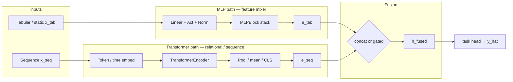
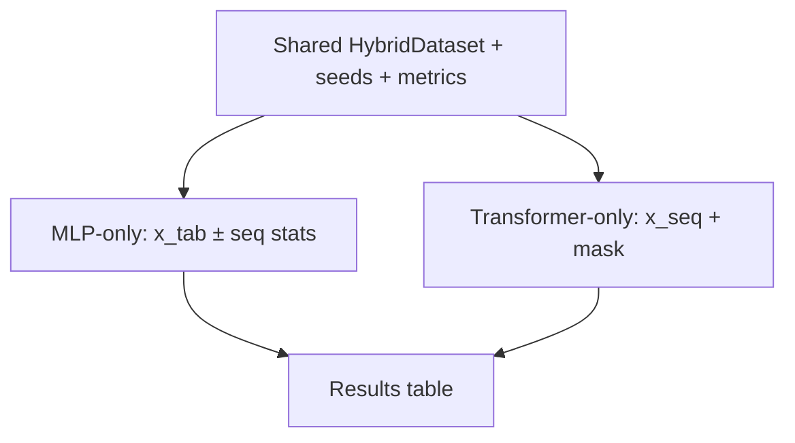
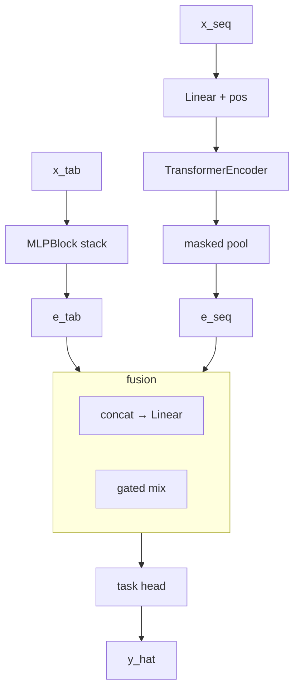
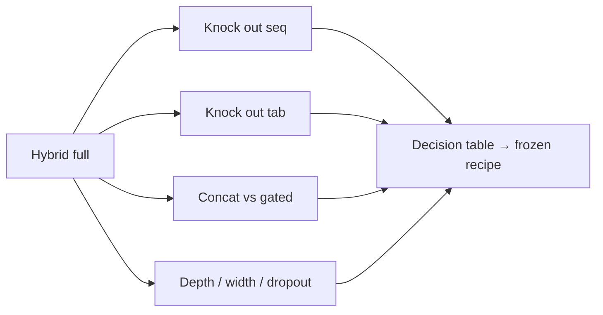
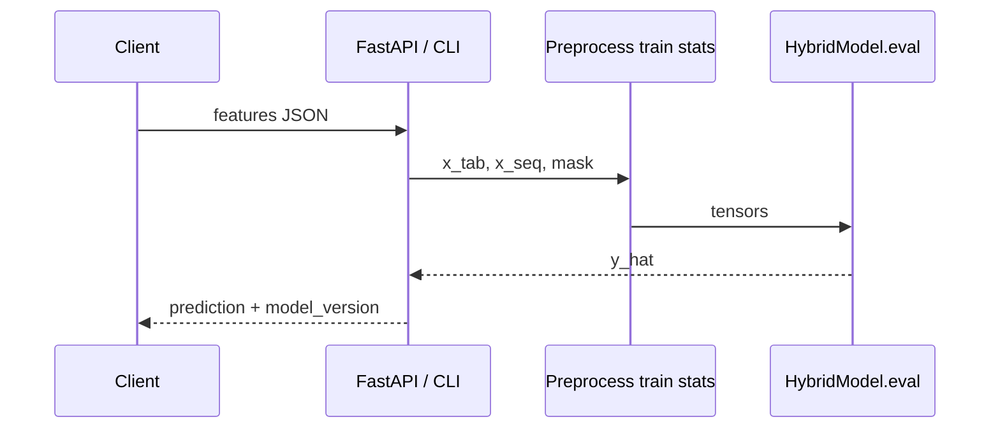

# Track: Hybrid Models from Scratch (90 days)

**Goal:** Design, train, evaluate, and ship a **custom hybrid**: **MLP path** (tabular/static) + **Transformer path** (sequence) + **fusion** + **task head**. Prove it against honest **MLP-only** and **Transformer-only** baselines—not vibes.

**Who:** CS engineers who want DL *engineering* judgment (tensors, leakage, ablations, shipping), not architecture tourism.

**Tools:** Python 3.11+, PyTorch, Jupyter/VS Code, Git. Optional: TensorBoard, Captum, FastAPI, ONNX.

**Core modules (transfer):** [05 Context](../core/05-context-engineering.md), [06 Fine-tuning](../core/06-fine-tuning.md). This track is primarily from-scratch modeling. **Borrow, don’t cargo-cult:** [23](../core/23-prompt-drift.md) analog (pin **train+eval YAML** hashes), [04](../core/04-testing-evals.md)/[22](../core/22-agent-evaluation.md) `eval_regression` on MAE — not agents, worktrees, or MCP. On a tight laptop, shrink `d_model` / `max_len` / batch the way [17 §7](../core/17-small-models.md#7-working-effectively-on-limited-hardware) shrinks GGUF: **fit memory**, don’t swap.

**Cadence:** ~1–2 focused hours most days; heavier near training and ablations.

---

## The incident (why hybrids exist)

It is 2:14 a.m. Your team shipped a “Transformer for everything” demand model. Sequences looked rich: 90 days of price, volume, weather. Val loss was gorgeous. Production MAE collapsed.

Postmortem: static fields that actually moved the needle—SKU category, warehouse region, promo flags—were stuffed into a flat token stream. Attention was supposed to “figure it out.” It did not. The old tabular baseline still beat you on half the SKUs.

The fix was not a bigger Transformer. It was a **two-path brain**:

1. **MLP path** — mixes static/tabular features (*what is* this entity?).
2. **Transformer path** — attends over the sequence (*what happened* over time?).
3. **Fusion** — joins embeddings when modalities differ in structure.
4. **Task head** — maps the fused vector to the label.

By day 90 you defend every block with an **ablation**, not a slide about “SOTA fusion.”

---

## Mental model (lock this in)



### Intuition lock

| Piece | Role | When it shines |
|-------|------|----------------|
| **MLP** | Feature mixer over a fixed vector | Dense numeric/categorical statics; interactions without order |
| **Transformer** | Relational / sequence attention | Order, long-range dependency, variable length |
| **Fusion** | Join modalities with different shapes | Tabular ≠ sequence; do not force one API on both |
| **Ablations** | Kill unearned complexity | Prefer simple + measured over novel + untested |

**Hard rules:** reproducible seeds (`torch` / `numpy` / `random` / workers); **no time-series leakage** (time splits, scalers fit on train only); baselines first, hybrid second, claims third.

---

## Phase map (curriculum spine)

| Days | Theme | You leave with |
|------|--------|----------------|
| 1–14 | Foundations + **data card** | Env, problem, loaders, leakage plan |
| 15–28 | **Dual prototypes** | MLP-only + Transformer-only that train |
| 29–42 | **Hybrid design** | Modular `HybridModel` + fusion configs |
| 43–56 | **Train & explain** | Fair comparison + error analysis |
| 57–70 | **Ablations & optimize** | Frozen recipe + measured tradeoffs |
| 71–84 | **Deploy** | CLI or FastAPI + shape tests |
| 85–90 | **Publish** | Public repo, diagram, honest write-up |

---

# Days 1–14 — Foundations + data card

## Guide

You are not taking a full PyTorch course here — but you do need the **minimum tensor vocabulary** before the dual-path model makes sense. If `nn.Module`, `forward`, and `tensor.shape` are new, spend days 1–3 on the official [PyTorch 60-minute blitz](https://pytorch.org/tutorials/beginner/blitz/tensor_tutorial.html) (tensors, autograd, a tiny `nn.Module`) and only then write the data card. This track assumes that floor, not architecture tourism.

The design job in these two weeks: a decision problem with two feature families that should not share one naive tensor layout.

Pick a use case where **static** and **sequence** both matter: SKU demand (category/region + daily series), churn (demographics + transactions), IoT (device metadata + sensor window). If the dataset is pure tabular, **synthesize a sequence** (rolling windows) and document that choice so the dual-path story stays honest.

## Explainer: the data card

A data card is the contract that prevents silent train/serve skew and leakage:

- What is one training example (entity, sequence, label, horizon)?
- Feature inventory: `x_tab` columns vs `x_seq` channels/length.
- Split policy: time-based? entity-holdout? both?
- Leakage risks: future stats, target encoding on full data, random shuffle on autocorrelated series.
- Metrics, licenses, PII / non-advice notes if finance- or health-adjacent.

## Setup

```bash
python -m venv .venv && source .venv/bin/activate
pip install torch  # match https://pytorch.org/get-started/locally/
pip install numpy pandas scikit-learn pyyaml tqdm matplotlib
# later: tensorboard captum fastapi uvicorn onnx onnxruntime
```

Pin versions in `requirements.txt` early so a clean clone works.

## Dataset / DataLoader skeleton

```python
# src/data.py — sketch; fill transforms for YOUR schema
from dataclasses import dataclass
from typing import Optional
import torch
from torch.utils.data import Dataset, DataLoader

@dataclass
class HybridBatch:
    x_tab: torch.Tensor   # [B, F_tab]
    x_seq: torch.Tensor   # [B, T, F_seq]
    y: torch.Tensor       # [B] or [B, C]
    mask: Optional[torch.Tensor] = None  # [B, T] True=valid

class HybridDataset(Dataset):
    def __init__(self, tab, seq, y, mask=None):
        assert len(tab) == len(seq) == len(y)
        self.tab = torch.as_tensor(tab, dtype=torch.float32)
        self.seq = torch.as_tensor(seq, dtype=torch.float32)
        self.y = torch.as_tensor(y)
        self.mask = None if mask is None else torch.as_tensor(mask, dtype=torch.bool)

    def __len__(self):
        return self.tab.shape[0]

    def __getitem__(self, i):
        item = {"x_tab": self.tab[i], "x_seq": self.seq[i], "y": self.y[i]}
        if self.mask is not None:
            item["mask"] = self.mask[i]
        return item

def collate_hybrid(batch):
    out = {
        "x_tab": torch.stack([b["x_tab"] for b in batch], 0),
        "x_seq": torch.stack([b["x_seq"] for b in batch], 0),
        "y": torch.stack([b["y"] for b in batch], 0),
    }
    if "mask" in batch[0]:
        out["mask"] = torch.stack([b["mask"] for b in batch], 0)
    return out

def make_loader(ds, batch_size=64, shuffle=False, num_workers=0):
    return DataLoader(ds, batch_size=batch_size, shuffle=shuffle,
                      num_workers=num_workers, collate_fn=collate_hybrid)
```

**Hint:** Build examples with a cutoff so features use data **≤ cutoff** and labels use the future **after**. Fit scalers on **train only**.

### Think-about-it

1. Overlapping time windows for the same entity across train/test—what leaked?
2. Why does mean-pooling after attention still need a padding mask?
3. Is a pure MLP on flattened `[T*F_seq + F_tab]` a valid baseline? What does it throw away?

## Exit criteria (day 14)

- [ ] Env + `requirements.txt`
- [ ] Written data card (`docs/data_card.md` is enough)
- [ ] Splits with explicit anti-leakage policy
- [ ] One batch prints shapes: `x_tab [B,F]`, `x_seq [B,T,C]`, `y`
- [ ] Null baseline metric recorded (train mean / majority class)
- [ ] Hardware note: batch / `max_len` / `d_model` chosen so training **fits** (no swap). If 8 GB RAM, start tiny and scale up — do not copy a 7B recipe onto a laptop.

---

# Days 15–28 — Dual prototypes

## Guide

Fusion cannot rescue a bad problem definition. Train **two pure models** on the same splits, metrics, and budget so later hybrid wins are real.



## Explainer

- **MLP-only:** Upper bound on static structure + crude sequence summary (mean/last/stats). If this is already strong, the hybrid may only need a *small* sequence branch.
- **Transformer-only:** Upper bound on pure dynamics. If this wins without tabular, static features may be weak, redundant, or mis-scaled.

**Fair-fight rule:** same epochs, patience, seeds, preprocessing. Changing three things at once is not science.

## MLPBlock + MLP-only

```python
# src/blocks.py
import torch
import torch.nn as nn

class MLPBlock(nn.Module):
    """Feature mixer: Linear → Norm → Act → Dropout (+ residual)."""

    def __init__(self, d_in: int, d_hidden: int, dropout: float = 0.1):
        super().__init__()
        self.net = nn.Sequential(
            nn.Linear(d_in, d_hidden), nn.LayerNorm(d_hidden), nn.GELU(), nn.Dropout(dropout),
            nn.Linear(d_hidden, d_hidden), nn.LayerNorm(d_hidden), nn.GELU(), nn.Dropout(dropout),
        )
        self.skip = nn.Linear(d_in, d_hidden) if d_in != d_hidden else nn.Identity()

    def forward(self, x):
        return self.net(x) + self.skip(x)


class MLPOnly(nn.Module):
    def __init__(self, f_tab, f_seq, d_model, n_out, use_seq_stats=True):
        super().__init__()
        self.use_seq_stats = use_seq_stats
        in_dim = f_tab + (2 * f_seq if use_seq_stats else 0)  # mean + std
        self.backbone = nn.Sequential(MLPBlock(in_dim, d_model), MLPBlock(d_model, d_model))
        self.head = nn.Linear(d_model, n_out)

    def forward(self, x_tab, x_seq, mask=None):
        feats = [x_tab]
        if self.use_seq_stats:
            # YOU should mask-mean in real code
            feats += [x_seq.mean(1), x_seq.std(1).clamp_min(1e-6)]
        return self.head(self.backbone(torch.cat(feats, -1)))
```

## Transformer-only (encoder usage)

```python
class TransformerOnly(nn.Module):
    def __init__(self, f_seq, d_model, n_heads, n_layers, n_out, max_len=512):
        super().__init__()
        self.in_proj = nn.Linear(f_seq, d_model)
        self.pos = nn.Parameter(torch.zeros(1, max_len, d_model))
        layer = nn.TransformerEncoderLayer(
            d_model=d_model, nhead=n_heads, dim_feedforward=4 * d_model,
            batch_first=True, activation="gelu", norm_first=True,
        )
        self.encoder = nn.TransformerEncoder(layer, num_layers=n_layers)
        self.head = nn.Linear(d_model, n_out)

    def forward(self, x_tab, x_seq, mask=None):
        # pure baseline: x_tab unused
        b, t, _ = x_seq.shape
        h = self.in_proj(x_seq) + self.pos[:, :t, :]
        kpm = ~mask if mask is not None else None  # True = IGNORE
        h = self.encoder(h, src_key_padding_mask=kpm)
        if mask is not None:
            w = mask.float().unsqueeze(-1)
            pooled = (h * w).sum(1) / w.sum(1).clamp_min(1.0)
        else:
            pooled = h.mean(1)
        return self.head(pooled)
```

## Shape assert tests (before long training)

```python
# tests/test_shapes.py
import torch
from src.blocks import MLPOnly, TransformerOnly

def test_mlp_shapes():
    m = MLPOnly(f_tab=8, f_seq=4, d_model=32, n_out=1)
    assert m(torch.randn(16, 8), torch.randn(16, 20, 4)).shape == (16, 1)

def test_tf_shapes():
    m = TransformerOnly(f_seq=4, d_model=32, n_heads=4, n_layers=2, n_out=3, max_len=64)
    y = m(None, torch.randn(8, 40, 4), mask=torch.ones(8, 40, dtype=torch.bool))
    assert y.shape == (8, 3)
```

**Hint:** `n_heads` must divide `d_model`—validate in config, fail fast.

### Think-about-it

1. Mean/std sequence stats: what fails for rare spikes?
2. Should Transformer-only get static features as a constant channel for fairness?
3. Under equal params, which baseline do you trust for *short* sequences (T ≤ 8)?

## Exit criteria (day 28)

- [ ] MLP-only and Transformer-only train; loss curves logged
- [ ] Padding mask correct on the seq path
- [ ] Shared metrics: null vs MLP vs Transformer
- [ ] Fixed seeds; one re-run command each
- [ ] Shape tests green

---

# Days 29–42 — Hybrid design

## Guide

Fuse paths, keep modules **swappable**: tomorrow you turn fusion modes off via config and measure the damage.



## Explainer: fusion is a hypothesis

| Fusion | Hypothesis | Risk |
|--------|------------|------|
| **Concat + MLP** | Embeddings are complementary | Dim doubles; needs data |
| **Gated sum** | One modality should sometimes dominate | Gate can collapse to “always tabular” |
| **Cross-attn** (stretch) | Seq queries static (or reverse) | Overfit + hard to debug |

Wide-and-deep intuition: **mix** static patterns on the MLP side; **structure over time** on attention; **late fuse** so each path keeps a clean inductive bias.

## HybridModel (concat or gated)

```python
# src/hybrid.py
import torch
import torch.nn as nn
from .blocks import MLPBlock

class HybridModel(nn.Module):
    def __init__(
        self, f_tab, f_seq, d_model=64, n_heads=4, n_layers=2, n_out=1,
        fusion="concat", dropout=0.1, max_len=512,
    ):
        super().__init__()
        assert fusion in {"concat", "gated"}
        self.fusion = fusion

        self.tab_mlp = nn.Sequential(
            MLPBlock(f_tab, d_model, dropout=dropout),
            MLPBlock(d_model, d_model, dropout=dropout),
        )
        self.seq_in = nn.Linear(f_seq, d_model)
        self.pos = nn.Parameter(torch.zeros(1, max_len, d_model))
        layer = nn.TransformerEncoderLayer(
            d_model=d_model, nhead=n_heads, dim_feedforward=4 * d_model,
            dropout=dropout, batch_first=True, activation="gelu", norm_first=True,
        )
        self.encoder = nn.TransformerEncoder(layer, num_layers=n_layers)

        if fusion == "concat":
            self.fuse = nn.Sequential(nn.Linear(2 * d_model, d_model), nn.GELU(), nn.Dropout(dropout))
        else:
            self.gate = nn.Linear(2 * d_model, d_model)
        self.head = nn.Linear(d_model, n_out)

    def encode_seq(self, x_seq, mask=None):
        b, t, _ = x_seq.shape
        h = self.seq_in(x_seq) + self.pos[:, :t, :]
        kpm = ~mask if mask is not None else None
        h = self.encoder(h, src_key_padding_mask=kpm)
        if mask is not None:
            w = mask.float().unsqueeze(-1)
            return (h * w).sum(1) / w.sum(1).clamp_min(1.0)
        return h.mean(1)

    def forward(self, x_tab, x_seq, mask=None):
        e_tab = self.tab_mlp(x_tab)
        e_seq = self.encode_seq(x_seq, mask)
        if self.fusion == "concat":
            h = self.fuse(torch.cat([e_tab, e_seq], -1))
        else:
            g = torch.sigmoid(self.gate(torch.cat([e_tab, e_seq], -1)))
            h = g * e_seq + (1.0 - g) * e_tab
        return self.head(h)
```

**Hint:** Add `tab_only` / `seq_only` config paths (zero or swap to baseline classes). Architecture search becomes a flag, not a repo fork.

### Think-about-it

1. Gate saturates near 0 everywhere—what did you learn about the sequence path?
2. Why is late fusion easier to ablate than early-concat of raw `x_tab` into every timestep?
3. Is a “win” still a win at 3× parameters?

## Exit criteria (day 42)

- [ ] `HybridModel` works for concat and gated
- [ ] Config/YAML selects fusion + widths
- [ ] Shape tests for both fusion modes + mask
- [ ] Tiny-batch overfit sanity check passes

---

# Days 43–56 — Train, compare, explain

## Guide

Fair fight: hybrid vs MLP-only vs Transformer-only under one protocol. Then explain failures like an engineer.

## Explainer

A good `train_step` is boring: device move, forward, loss, backward, clip, step, log. Magic belongs in datasets and modules.

## `train_step` sketch

```python
# src/train.py — sketch
import torch
from torch import nn

def train_step(model, batch, optimizer, criterion, device, max_grad_norm=1.0):
    model.train()
    x_tab = batch["x_tab"].to(device)
    x_seq = batch["x_seq"].to(device)
    y = batch["y"].to(device)
    mask = batch["mask"].to(device) if batch.get("mask") is not None else None

    optimizer.zero_grad(set_to_none=True)
    logits = model(x_tab, x_seq, mask=mask)
    loss = criterion(logits.squeeze(-1), y.float() if y.ndim == 1 else y)
    loss.backward()
    nn.utils.clip_grad_norm_(model.parameters(), max_grad_norm)
    optimizer.step()
    return float(loss.detach().cpu())

@torch.no_grad()
def eval_epoch(model, loader, criterion, device):
    model.eval()
    total, n = 0.0, 0
    for batch in loader:
        x_tab = batch["x_tab"].to(device)
        x_seq = batch["x_seq"].to(device)
        y = batch["y"].to(device)
        mask = batch["mask"].to(device) if batch.get("mask") is not None else None
        logits = model(x_tab, x_seq, mask=mask)
        loss = criterion(logits.squeeze(-1), y.float() if y.ndim == 1 else y)
        bs = y.shape[0]
        total += float(loss.cpu()) * bs
        n += bs
    return total / max(n, 1)
```

**Hygiene:** seed everything; log git SHA; early-stop on **val** only; freeze selection before test; checkpoint `best.pt` + config snapshot; start with AdamW + cosine/OneCycle before 12-way knobs.

**Explain without lying:** attention maps are not causal proof; Captum on `x_tab` is a hypothesis to validate; slice errors (rare categories) are ops stories, not paper titles.

### Think-about-it

1. Val up, test down: architecture, leakage, or shift?
2. Hybrid ties MLP within noise—what do you ship?
3. Attention always peaks on the last step—did you reinvent “use latest observation”?

## Exit criteria (day 56)

- [ ] Table: null / MLP / TF / hybrid (mean ± std over ≥3 seeds if feasible)
- [ ] Learning curves saved
- [ ] Error analysis with ≥5 concrete failures
- [ ] Test metrics after selection (or clearly exploratory)

---

# Days 57–70 — Ablations & optimize

## Guide

Architecture tourism collects blocks. **Ablations** justify complexity. Optimize only after you know which branch pays rent.



## Config-driven ablation idea

Do not fork `train_v7_FINAL.py`. One trainer + YAML grid.

```yaml
# configs/ablation_example.yaml
seed: 42
data: { batch_size: 64, max_len: 90 }
model:
  f_tab: 12
  f_seq: 5
  d_model: 64
  n_heads: 4
  n_layers: 2
  n_out: 1
  fusion: concat   # concat | gated | tab_only | seq_only
  dropout: 0.1
train: { lr: 0.001, weight_decay: 0.01, epochs: 50, patience: 8 }
```

```python
# src/config_run.py — idea sketch
import yaml
import torch
from src.hybrid import HybridModel

def load_cfg(path: str) -> dict:
    with open(path) as f:
        return yaml.safe_load(f)

def build_model(cfg: dict) -> torch.nn.Module:
    m = cfg["model"]
    fusion = m["fusion"]
    if fusion == "tab_only":
        ...  # return MLPOnly(...)
    if fusion == "seq_only":
        ...  # return TransformerOnly(...)
    return HybridModel(
        f_tab=m["f_tab"], f_seq=m["f_seq"], d_model=m["d_model"],
        n_heads=m["n_heads"], n_layers=m["n_layers"], n_out=m["n_out"],
        fusion="concat" if fusion == "concat" else "gated",
        dropout=m.get("dropout", 0.1),
        max_len=cfg["data"].get("max_len", 512),
    )
```

**Optimize in order:** (1) bugs/leakage, (2) dropout/weight decay, (3) capacity until val plateaus, (4) AMP / `torch.compile` if stable, (5) fancy fusion last.

### Think-about-it

1. Which ablation falsifies “we need a Transformer at all”?
2. Gated ≈ concat within error bars—what do you ship for maintainability?
3. Mixed precision moved metrics 2%—bug, nondeterminism, or real?

## Exit criteria (day 70)

- [ ] Ablation table (fusion + branch knockouts)
- [ ] Frozen architecture + hyperparams in one config
- [ ] **Config digest** recorded (`src.drift.canonical_hash` on the YAML bundle, or equivalent); day-90 tag must match
- [ ] `eval_regression` (or a one-page table with floors) vs the previous frozen metrics — MAE/accuracy, not vibes
- [ ] Recipe notes: hardware, time/epoch, seeds
- [ ] No unexplained hybrid complexity

---

# Days 71–84 — Deploy

## Guide

Ship a predict path with the same preprocessing, versioned weights, and tests that catch shape drift before users do.



## FastAPI / CLI predict sketch

```python
# src/serve.py — sketch
from fastapi import FastAPI
from pydantic import BaseModel, Field
from typing import List, Optional
import torch
from src.hybrid import HybridModel

app = FastAPI(title="Hybrid Model Demo")
DEVICE = torch.device("cpu")
MODEL: HybridModel | None = None
META = {"model_version": "0.1.0"}

class PredictRequest(BaseModel):
    x_tab: List[float]
    x_seq: List[List[float]]  # [T, F_seq]
    mask: Optional[List[bool]] = None

class PredictResponse(BaseModel):
    prediction: List[float]
    model_version: str = Field(...)

def load_model(ckpt_path: str, model_kwargs: dict) -> HybridModel:
    model = HybridModel(**model_kwargs)
    state = torch.load(ckpt_path, map_location=DEVICE)
    model.load_state_dict(state["model"] if "model" in state else state)
    return model.to(DEVICE).eval()

@app.post("/predict", response_model=PredictResponse)
@torch.no_grad()
def predict(req: PredictRequest):
    assert MODEL is not None
    x_tab = torch.tensor([req.x_tab], dtype=torch.float32, device=DEVICE)
    x_seq = torch.tensor([req.x_seq], dtype=torch.float32, device=DEVICE)
    mask = None if req.mask is None else torch.tensor([req.mask], dtype=torch.bool, device=DEVICE)
    assert x_tab.ndim == 2 and x_seq.ndim == 3
    y = MODEL(x_tab, x_seq, mask=mask)
    return PredictResponse(prediction=y.squeeze(0).cpu().tolist(), model_version=META["model_version"])
```

CLI variant: `python -m src.predict --ckpt artifacts/best.pt --input sample.json`.

**Tests that matter:** preprocess golden vectors; shape contracts on loaded ckpt; latency smoke; optional ONNX parity on a fixed batch. Document pad/reject policy when prod `T` ≠ train `T`. Scaler params must live with the artifact so train/serve cannot drift.

### Think-about-it

1. Train T=90, prod sends 30—pad, interpolate, or reject?
2. Where do scaler parameters live?
3. How do you rollback if hybrid v2 loses in shadow mode?

## Exit criteria (day 84)

- [ ] `artifacts/best.pt` + frozen config load on a clean machine
- [ ] CLI or FastAPI `/predict` on a sample payload
- [ ] Automated preprocess + shape tests
- [ ] README: limits, intended use, non-goals

---

# Days 85–90 — Publish

## Guide

A public repo that cannot be reproduced is a demo, not an engineering artifact.

## Deliverables

1. **README** — problem, data card, architecture mermaid, train/predict, results table  
2. **Diagram** — fusion figure with *your* feature names  
3. **Reproduction** — one command + expected wall-clock on stated hardware  
4. **Honest failures** — when MLP wins; when hybrid is not worth complexity  
5. **Tag** `v0.1.0` with locked config + metrics JSON  

**Report spine:** motivation → data/leakage → baselines vs hybrid → ablations (scientific core) → deploy → next 90 days.

### Think-about-it

1. If a reader runs *one* experiment, which ablation should it be?
2. Did you publish negative results?
3. Can someone retrain without chatting with you?

## Exit criteria (day 90)

- [ ] Portfolio-ready repo  
- [ ] Clean-clone repro verified  
- [ ] Report with comparison + ablations  
- [ ] Release tag + known issues  

---

## Milestone radar

| Day | Checkpoint | Evidence |
|-----|------------|----------|
| 14 | Foundations | Data card + shapes + null metric |
| 28 | Dual prototypes | Two training results |
| 42 | Hybrid module | `HybridModel` + fusion tests |
| 56 | Fair comparison | Multi-model table + errors |
| 70 | Ablations | Frozen recipe + ablation table |
| 84 | Deploy | Predict path + tests |
| 90 | Publish | Tag `v0.1.0` + report |

---

## Success criteria (portfolio bar)

- [ ] Hybrid **justified** vs MLP-only and Transformer-only with numbers  
- [ ] Reproducible training + seed control  
- [ ] Ablations documented; complexity earned; config digest matches the tag  
- [ ] Serve/export path works on a clean machine  
- [ ] Time-series leakage story explicit  
- [ ] Honest failure analysis included  

---

## Resource index

| Topic | Resource |
|-------|----------|
| DataLoaders | [PyTorch data tutorial](https://pytorch.org/tutorials/beginner/basics/data_tutorial.html) |
| Transformer API | [nn.Transformer](https://pytorch.org/docs/stable/generated/torch.nn.Transformer.html) |
| Attention depth | [UVA DL MHAttention](https://uvadlc-notebooks.readthedocs.io/en/latest/tutorial_notebooks/tutorial6/Transformers_and_MHAttention.html) |
| MLP-Mixer lineage | [arXiv:2105.01601](https://arxiv.org/abs/2105.01601) |
| Optim | [torch.optim](https://pytorch.org/docs/stable/optim.html) |
| Logging | [TensorBoard tutorial](https://pytorch.org/tutorials/intermediate/tensorboard_tutorial.html) |
| Attribution | [Captum](https://captum.ai/) |
| ONNX | [ORT export](https://onnxruntime.ai/docs/export/models.html) |
| API | [FastAPI](https://fastapi.tiangolo.com/tutorial/) |

Read domain hybrid papers for *your* modality; treat fusion claims as hypotheses on **your** splits.

---

## Production hardening (days 70–90)

Hybrids fail like agents when **config drifts** and **evals don’t gate merges**. They do **not** need MCP, CrewAI, or coding-agent worktrees.

| Already in a phase | Pattern |
|--------------------|---------|
| Day 14 | Memory-honest `d_model` / batch (same idea as [17 §7](../core/17-small-models.md#7-working-effectively-on-limited-hardware)) |
| Day 70 | YAML digest + `eval_regression` on `val_mae` ([23](../core/23-prompt-drift.md), [22](../core/22-agent-evaluation.md) helper) |
| Days 71–84 | `/predict` golden cases + timeouts ([13](../core/13-production.md)) |

Log **params, latency, time/epoch** the way Module 26 attributes steps — not tokens, unless you bolt on an LLM head. The teaching `eval_regression` in `src.drift` works on any named metric dict.

---

## Final intuition

**MLP** mixes features. **Transformer** relates positions in a sequence. **Fusion** exists because modalities are differently structured—not because two papers shared a slide. **Ablations** beat architecture tourism. **Seeds and leakage discipline** beat a clever gate that only works on a shuffled validation set.

When someone asks “why hybrid?”, answer with a table: branch knockouts, fusion modes, and a production constraint. That answer *is* the track.
