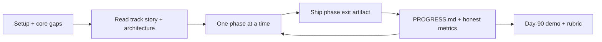

# Specialization Tracks

Ninety-day, **project-shaped tutorials** that reuse the [core modules](../index.md). These are not phase checklists alone — each track page has mental models, explainers, code sketches, traps, and exit gates.

Complete [Setup](../getting-started/setup.md) first. Close core gaps listed on the track before you start building.

| Track | Outcome | Core dependencies | Vibe |
|-------|---------|-------------------|------|
| [Stock recommender](stock-recommender.md) | Research assistant / recommender prototype: data → baseline ML → SLM → RAG → compression → ship | 01–07, 09–10, 13–14, 17 | Markets + retrieval + MLOps (**not** financial advice) |
| [Hybrid models](hybrid-models.md) | Custom Transformer + MLP fusion in PyTorch, ablations, deploy | 05–06 + DL fundamentals | From-scratch architecture engineering |
| [Agentic editor plugin](agentic-plugin.md) | VS Code extension + agent backend + local models | 01–05, 07–08, 11–12, 17 | IDE product + agent safety |

---

## How to run a track (intuition-first)

1. **Skim the whole track once** — know the day-90 shape before day 1.  
2. **Read the track’s Intuition lock** out loud; if you can’t restate it, you’re not ready to code.  
3. **Map each phase → core modules**; finish those modules’ labs first.  
4. **Ship phase exits** (repo artifacts), not only notes.  
5. **Score yourself** with [Assessment rubrics](../reference/assessment.md) at mid-track and day 90.  
6. Optional: keep [Progress XP](../getting-started/progress.md) for core modules; tracks are graded by demos.

---

## Shared engineering bar

| Bar | Why |
|-----|-----|
| Git from day 1 | Tracks die in “works on my laptop” folders |
| Tests for deterministic code | Splits, tools, parsers, shapes |
| Evals for model behavior | Golden Q&A, must-refuse, Hit@k — not vibes |
| README with limits + ethics | Especially finance and write-capable agents |
| No secrets in git | Keys in env / SecretStorage only |
| Time / data leakage honesty | Shuffle is cheating on markets and sequences |

---

## Choosing a track

| If you want… | Pick |
|--------------|------|
| End-to-end product with data + RAG + deploy | Stock recommender |
| Deep understanding of architectures and training | Hybrid models |
| Shipping developer tooling with agent safety | Agentic editor plugin |

You may run a track **in parallel** with later core modules if you already ship Python/TS services confidently.

---

## Day-90 definition of done (all tracks)

- [ ] Demo runs from a clean clone + documented setup  
- [ ] At least one automated test suite and one model/behavior eval  
- [ ] Architecture diagram in README matches the code  
- [ ] Known failure modes written down (not hidden)  
- [ ] Ethics / safety / non-advice notes where relevant  

**Next:** open a track page and start with its story + system diagram.
